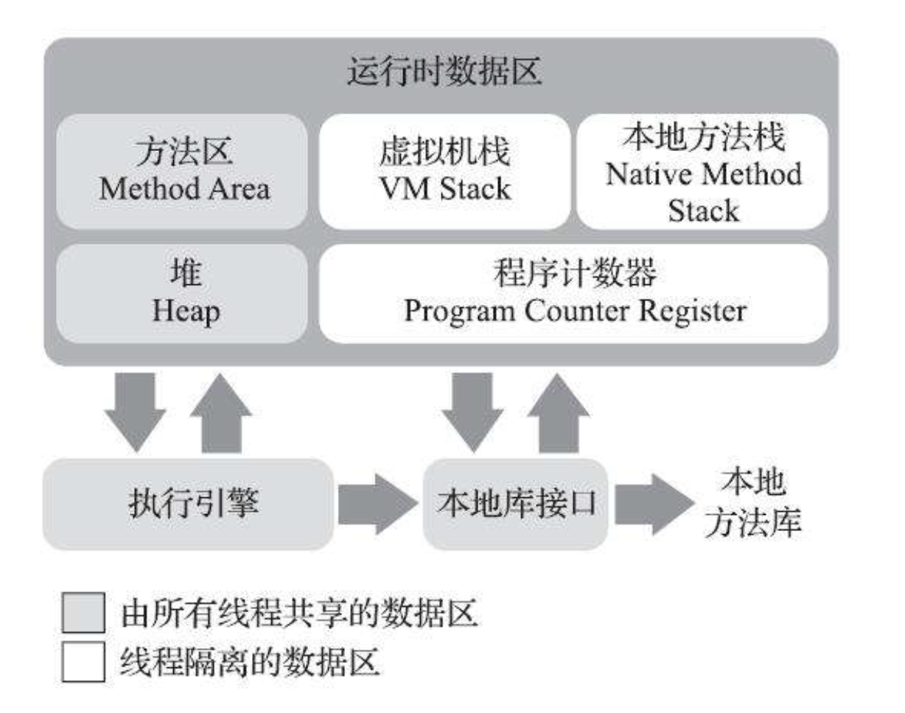

# 自动内存

## 运行时数据区域

1. 程序计数器
   > 程序计数器是一块较小的内存区，是当前线程所执行字节码的行号指示器，在java虚拟机的概念模型里，字节码解释器工作时就是通过改变这个计数器的值选取下一条需要执行的命令， 
   > 它是控制程序流的指示器，分支，循环，跳转，异常处理，线程恢复等基本功能都需要这个计数器来完成。
2. Java虚拟机栈
   > 于程序计数器一样，虚拟机栈也是线程私有的，它的生命周期与线程共享，虚拟机栈描述的是java方法执行的线程内存模型，每个方法执行的时候，Java虚拟机都会同步创建一个栈针（Stack Frame）用于存储局部变量表，操作数栈，动态连接，方法出口等信息，每个方法被调用直至执行完毕的过程，就对应着一个栈针在虚拟机栈中从入栈到出栈的过程。 局部变量表中存放了编译期可知的各种Java虚拟机基本数据类型（boolean，byte，char，short，int，float,long,double）,对象引用（Reference 类型，它并不等同于对象本身，可能是一个指向对象起始地址的引用指针，也可能是指向一个代表对象的句柄，或者其他于此对象相关的位置）和returnAdress类型（指向一条字节码指令地址）
3. 本地方法栈
   > 本地方法栈（Native Method Stacks）与虚拟机栈所发挥的作用非常相似，其区别只是虚拟机栈为虚拟机执行java方法（字节码）服务，而本地方法栈则为虚拟机使用到的本地（Native）方法服务
4. java堆
   > 对于java程序来说，Java堆（Java Heap）是虚拟机所管理的内存中最大的一块。Java堆是被所有线程共享的一块内存区域，在虚拟机启动时创建。此内存区域的唯一目的就是存放对象实例，Java世界里“几乎” 所有的对象实例都在这里分配内存。在《Java虚拟机规范》中对Java堆的描述是：“所有的对象实例以及数组都应当在堆上分配，而这里写的“几乎”是指从实现角度来看，随着Java语言的发展，现在已经能看到些许迹象表明日后可能出现值类型的支持，即使只考虑现在，由于即时编译技术的进步，尤其是逃逸分析技术的日渐强大，栈上分配、标量替换优化手段已经导致一些微妙的变化悄然发生，所以说Java对象实例都分配在堆上也渐渐变得不是那么绝对了。
5. 方法区
   > 方法区（Method Area）于java堆一样，是各个线程共享的内存区域，它用于存储已被虚拟机加载的类型信息，常量，静态变量，即时编译器编译后的代码缓存等数据。
6. 运行时常量池
   > 运行时常量池（Runtime Constant Pool）是方法区的一部分。Class文件中除了有类的版本、字段、方法、接口等描述信息外，还有一项信息是常量池表（Constant Pool Table），用于存放编译期生成的各种字面量与符号引用，这部分内容将在类加载后存放到方法区的运行时常量池中。
7. 直接内存
   > 直接内存（Direct Memory）并不是虚拟机运行时数据区的一部分，也不是《Java虚拟机规范》中定义的内存区域。但是这部分内存也被频繁地使用，而且也可能导致OutOfMemoryError异常出现。 
   > 在JDK 1.4中新加入了NIO（New Input/Output）类，引入了一种基于通道（Channel）与缓冲区（Buffer）的I/O方式，它可以使用Native函数库直接分配堆外内存，然后通过一个存储在Java堆里面的DirectByteBuffer对象作为这块内存的引用进行操作。这样能在一些场景中显著提高性能，因为避免了在Java堆和Native堆中来回复制数据。
8. 逃逸分析
   1. 什么是逃逸分析？
      > 逃逸分析（Escape Analysis）简单来讲就是，Java Hotspot 虚拟机可以分析新创建对象的使用范围，并决定是否在 Java 堆上分配内存的一项技术。
   2. 逃逸分析的 JVM 参数如下：
      1. 开启逃逸分析：-XX:+DoEscapeAnalysis
      2. 关闭逃逸分析：-XX:-DoEscapeAnalysis
      3. 显示分析结果：-XX:+PrintEscapeAnalysis
      > 逃逸分析技术在 Java SE 6u23+ 开始支持，并默认设置为启用状态，可以不用额外加这个参数。
   3. 逃逸分析算法
      > 该算法引入了连通图，用连通图来构建对象和对象引用之间的可达性关系，并在次基础上，提出一种组合数据流分析法。  由于算法是上下文相关和流敏感的，并且模拟了对象任意层次的嵌套关系，所以分析精度较高，只是运行时间和内存消耗相对较大。
   4. 对象逃逸状态
      1. 全局逃逸（GlobalEscape）
         > 即一个对象的作用范围逃出了当前方法或者当前线程，有以下几种场景：
         1. 对象是一个静态变量
         2. 对象是一个已经发生逃逸的对象
         3. 对象作为当前方法的返回值
      2. 参数逃逸（ArgEscape）
         > 即一个对象被作为方法参数传递或者被参数引用，但在调用过程中不会发生全局逃逸，这个状态是通过被调方法的字节码确定的。
      3. 没有逃逸
         > 即方法中的对象没有发生逃逸。
   5. 逃逸分析优化
      > 当一个对象没有逃逸时，可以得到以下几个虚拟机的优化。
      1. 锁消除
         > 我们知道线程同步锁是非常牺牲性能的，当编译器确定当前对象只有当前线程使用，那么就会移除该对象的同步锁。 
         > 例如，StringBuffer 和 Vector 都是用 synchronized 修饰线程安全的，但大部分情况下，它们都只是在当前线程中用到，这样编译器就会优化移除掉这些锁操作。 
         > 锁消除的 JVM 参数如下： 
         > 开启锁消除：-XX:+EliminateLocks 
         > 关闭锁消除：-XX:-EliminateLocks 
         > 锁消除在 JDK8 中都是默认开启的，并且锁消除都要建立在逃逸分析的基础上。
      2. 标量替换
         > 首先要明白标量和聚合量，基础类型和对象的引用可以理解为标量，它们不能被进一步分解。而能被进一步分解的量就是聚合量，比如：对象。 
         > 对象是聚合量，它又可以被进一步分解成标量，将其成员变量分解为分散的变量，这就叫做标量替换。 
         > 这样，如果一个对象没有发生逃逸，那压根就不用创建它，只会在栈或者寄存器上创建它用到的成员标量，节省了内存空间，也提升了应用程序性能。 
         > 标量替换的 JVM 参数如下：  
         > 开启标量替换：-XX:+EliminateAllocations  
         > 关闭标量替换：-XX:-EliminateAllocations  
         > 显示标量替换详情：-XX:+PrintEliminateAllocations  
         > 标量替换同样在 JDK8 中都是默认开启的，并且都要建立在逃逸分析的基础上。  
      3. 栈上分配
         > 当对象没有发生逃逸时，该对象就可以通过标量替换分解成成员标量分配在栈内存中，和方法的生命周期一致，随着栈帧出栈时销毁，减少了 GC 压力，提高了应用程序性能。
## Hotspot虚拟机对象

1. 对象的创建
   > 当Java虚拟机遇到一条字节码new指令时，首先将去检查这个指令的参数是否能在常量池中定位到一个类的符号引用，并且检查这个符号引用代表的类是否已被加载、解析和初始化过。如果没有，那必须先执行相应的类加载过程，在类加载检查通过后，接下来虚拟机将为新生对象分配内存。对象所需内存的大小在类加载完成后便可完全确定，为对象分配空间的任务实际上便等同于把一块确定大小的内存块从Java堆中划分出来。假设Java堆中内存是绝对规整的，所有被使用过的内存都被放在一边，空闲的内存被放在另一边，中间放着一个指针作为分界点的指示器，那所分配内存就仅仅是把那个指针向空闲空间方向挪动一段与对象大小相等的距离，这种分配方式称为“指针碰撞”（Bump The Pointer）。但如果Java堆中的内存并不是规整的，已被使用的内存和空闲的内存相互交错在一起，那就没有办法简单地进行指针碰撞了，虚拟机就必须维护一个列表，记录上哪些内存块是可用的，在分配的时候从列表中找到一块足够大的空间划分给对象实例，并更新列表上的记录，这种分配方式称为“空闲列表”（Free List）。**_选择哪种分配方式由Java堆是否规整决定，而Java堆是否规整又由所采用的垃圾收集器是否带有空间压缩整理（Compact）的能力决定。因此，当使用Serial、ParNew等带压缩整理过程的收集器时，系统采用的分配算法是指针碰撞，既简单又高效；而当使用CMS这种基于清除（Sweep）算法的收集器时，理论上就只能采用较为复杂的空闲列表来分配内存。_** 
   > 除如何划分可用空间之外，还有另外一个需要考虑的问题：对象创建在虚拟机中是非常频繁的行为，即使仅仅修改一个指针所指向的位置，在并发情况下也并不是线程安全的，可能出现正在给对象A分配内存，指针还没来得及修改，对象B又同时使用了原来的指针来分配内存的情况。解决这个问题有两种可选方案：一种是对分配内存空间的动作进行同步处理——实际上虚拟机是采用CAS配上失败重试的方式保证更新操作的原子性；另外一种是把内存分配的动作按照线程划分在不同的空间之中进行，即每个线程在Java堆中预先分配一小块内存，称为本地线程分配缓冲（Thread Local Allocation Buffer，TLAB），哪个线程要分配内存，就在哪个线程的本地缓冲区中分配，只有本地缓冲区用完了，分配新的缓存区时才需要同步锁定。虚拟机是否使用TLAB，可以通过-XX：+/-UseTLAB参数来设定。 
   > 内存分配完成之后，虚拟机必须将分配到的内存空间（但不包括对象头）都初始化为零值，如果使用了TLAB的话，这一项工作也可以提前至TLAB分配时顺便进行。这步操作保证了对象的实例字段在Java代码中可以不赋初始值就直接使用，使程序能访问到这些字段的数据类型所对应的零值  
   > 接下来，Java虚拟机还要对对象进行必要的设置，例如这个对象是哪个类的实例、如何才能找到类的元数据信息、对象的哈希码（实际上对象的哈希码会延后到真正调用Object::hashCode()方法时才计算）、对象的GC分代年龄等信息。这些信息存放在对象的对象头（Object Header）之中。根据虚拟机当前运行状态的不同，如是否启用偏向锁等，对象头会有不同的设置方式。关于对象头的具体内容. 
   > 在上面工作都完成之后，从虚拟机的视角来看，一个新的对象已经产生了。但是从Java程序的视角看来，对象创建才刚刚开始——构造函数，即Class文件中的<init>()方法还没有执行，所有的字段都为默认的零值，对象需要的其他资源和状态信息也还没有按照预定的意图构造好。一般来说（由字节码流中new指令后面是否跟随invokespecial指令所决定，Java编译器会在遇到new关键字的地方同时生成这两条字节码指令，但如果直接通过其他方式产生的则不一定如此），new指令之后会接着执行<init>()方法，按照程序员的意愿对对象进行初始化，这样一个真正可用的对象才算完全被构造出来。 
2. 对象的内存布局
   > 在hotspot虚拟机里，对象在堆内存中的存储布局可以划分三个部分：对象头（Header），实例数据（Instance Data）和对齐填充（Padding）
   1. 对象头
      > 对象头包含两类信息，
      1.
      第一类是用于存储对象自身的运行时数据，如哈希码（HashCode）、GC分代年龄、锁状态标志、线程持有的锁、偏向线程ID、偏向时间戳等，这部分数据的长度在32位和64位的虚拟机（未开启压缩指针）中分别为32个比特和64个比特，官方称它为“Mark
      Word”。
      2. 对象头的另外一部分是类型指针，即对象指向它的类型元数据的指针，Java虚拟机通过这个指针来确定该对象是哪个类的实例
   2. 实例数据部分是对象真正存储的有效信息，即我们在程序代码里面所定义的各种类型的字段内容，无论是从父类继承下来的，还是在子类中定义的字段都必须记录起来。
   3. 对齐填充，这并不是必然存在的，也没有特别的含义，它仅仅起着占位符的作用。
3. 对象的访问定位
   1. 句柄访问
      > Java堆中将可能会划分出一块内存来作为句柄池，reference中存储的就是对象的句柄地址，而句柄中包含了对象实例数据与类型数据各自具体的地址信息，
   2. 直接指针
      > Java堆中对象的内存布局就必须考虑如何放置访问类型数据的相关信息，reference中存储的直接就是对象地址，如果只是访问对象本身的话，就不需要多一次间接访问的开销
   > 使用句柄来访问的最大好处就是reference中存储的是稳定句柄地址，在对象被移动（垃圾收集时移动对象是非常普遍的行为）时只会改变句柄中的实例数据指针，而reference本身不需要被修改。 
   > 直接指针来访问最大的好处就是速度更快，它节省了一次指针定位的时间开销，由于对象访问在Java中非常频繁，因此这类开销积少成多也是一项极为可观的执行成本， 虚拟机HotSpot而言，它主要使用第二种方式进行对象访问（有例外情况，如果使用了Shenandoah收集器的话也会有一次额外的转发 ），但从整个软件开发的范围来看，在各种语言、框架中使用句柄来访问的情况也十分常见。
4. 元空间
   > 在JDK 8以后，永久代便完全退出了历史舞台，元空间作为其替代者登场。在默认设置下，前面列举的那些正常的动态创建新类型的测试用例已经很难再迫使虚拟机产生方法区的溢出异常了。不过为了让使用者有预防实际应用里出现类似于代码清单2-9那样的破坏性的操作，HotSpot还是提供了一些参数作为元空间的防御措施， 
   > 主要包括：
   1. ·-XX：MaxMetaspaceSize：设置元空间最大值，默认是-1，即不限制，或者说只受限于本地内存大小。
   2. ·-XX：MetaspaceSize：指定元空间的初始空间大小，以字节为单位，达到该值就会触发垃圾收集进行类型卸载，同时收集器会对该值进行调整：如果释放了大量的空间，就适当降低该值；如果释放了很少的空间，那么在不超过-XX：MaxMetaspaceSize（如果设置了的话）的情况下，适当提高该值。
   3. ·-XX：MinMetaspaceFreeRatio：作用是在垃圾收集之后控制最小的元空间剩余容量的百分比，可减少因为元空间不足导致的垃圾收集的频率。类似的还有-XX：Max-MetaspaceFreeRatio，用于控制最大的元空间剩余容量的百分比。
5. 直接内存
   > 直接内存（Direct Memory）的容量大小可通过-XX：MaxDirectMemorySize参数来指定，如果不去指定，则默认与Java堆最大值（由-Xmx指定）一致
## 垃圾回收于内存分配策略
1. 如何判断对象是否可回收
   1. 引用技术算法
      > 在对象中添加一个引用计数器，每当有一个地方引用它时，计数器值就加一；当引用失效时，计数器值就减一；任何时刻计数器为零的对象就是不可能再被使用的。 
      > 主流的Java虚拟机里面都没有选用引用计数算法来管理内存，主要原因是，这个看似简单的算法有很多例外情况要考虑，必须要配合大量额外处理才能保证正确地工作，譬如单纯的引用计数就很难解决对象之间相互循环引用的问题。
      1. 在JDK 1.2版之后，Java对引用的概念进行了扩充，将引用分为强引用（StronglyRe-ference）、软引用（Soft Reference）、弱引用（Weak Reference）和虚引用（Phantom Reference）4种，这4种引用强度依次逐渐减弱。
         1. ·强引用是最传统的“引用”的定义，是指在程序代码之中普遍存在的引用赋值，即类似“Object obj=new Object()”这种引用关系。无论任何情况下，只要强引用关系还存在，垃圾收集器就永远不会回收掉被引用的对象。
         2. ·软引用是用来描述一些还有用，但非必须的对象。只被软引用关联着的对象，在系统将要发生内存溢出异常前，会把这些对象列进回收范围之中进行第二次回收，如果这次回收还没有足够的内存，才会抛出内存溢出异常。在JDK 1.2版之后提供了SoftReference类来实现软引用。
         3. ·弱引用也是用来描述那些非必须对象，但是它的强度比软引用更弱一些，被弱引用关联的对象只能生存到下一次垃圾收集发生为止。当垃圾收集器开始工作，无论当前内存是否足够，都会回收掉只被弱引用关联的对象。在JDK 1.2版之后提供了WeakReference类来实现弱引用。
         4. ·虚引用也称为“幽灵引用”或者“幻影引用”，它是最弱的一种引用关系。一个对象是否有虚引用的存在，完全不会对其生存时间构成影响，也无法通过虚引用来取得一个对象实例。为一个对象设置虚引用关联的唯一目的只是为了能在这个对象被收集器回收时收到一个系统通知。在JDK 1.2版之后提供了PhantomReference类来实现虚引用。
   2. 可达性算法
      > 这个算法的基本思路就是通过一系列称为“GC Roots”的根对象作为起始节点集，从这些节点开始，根据引用关系向下搜索，搜索过程所走过的路径称为“引用链”（Reference Chain），如果某个对象到GC Roots间没有任何引用链相连，或者用图论的话来说就是从GC Roots到这个对象不可达时，则证明此对象是不可能再被使用的。
      1. 在Java技术体系里面，固定可作为GC Roots的对象包括以下几种：
         1. ·在虚拟机栈（栈帧中的本地变量表）中引用的对象，譬如各个线程被调用的方法堆栈中使用到的参数、局部变量、临时变量等。
         2. ·在方法区中类静态属性引用的对象，譬如Java类的引用类型静态变量。·在方法区中常量引用的对象，譬如字符串常量池（String Table）里的引用。
         3. ·在本地方法栈中JNI（即通常所说的Native方法）引用的对象。
         4. ·Java虚拟机内部的引用，如基本数据类型对应的Class对象，一些常驻的异常对象（比如NullPointExcepiton、OutOfMemoryError）等，还有系统类加载器。
         5. ·所有被同步锁（synchronized关键字）持有的对象。·反映Java虚拟机内部情况的JMXBean、JVMTI中注册的回调、本地代码缓存等。
   3. 消亡过程
      > 即使在可达性分析算法中判定为不可达的对象，也不是“非死不可”的，这时候它们暂时还处于“缓刑”阶段，要真正宣告一个对象死亡，至少要经历两次标记过程：如果对象在进行可达性分析后发现没有与GC Roots相连接的引用链，那它将会被第一次标记，随后进行一次筛选，筛选的条件是此对象是否有必要执行finalize()方法。假如对象没有覆盖finalize()方法，或者finalize()方法已经被虚拟机调用过，那么虚拟机将这两种情况都视为“没有必要执行”。 
      > 如果这个对象被判定为确有必要执行finalize()方法，那么该对象将会被放置在一个名为F-Queue的队列之中，并在稍后由一条由虚拟机自动建立的、低调度优先级的Finalizer线程去执行它们的finalize()方法。这里所说的“执行”是指虚拟机会触发这个方法开始运行，但并不承诺一定会等待它运行结束。这样做的原因是，如果某个对象的finalize()方法执行缓慢，或者更极端地发生了死循环，将很可能导致F-Queue队列中的其他对象永久处于等待，甚至导致整个内存回收子系统的崩溃。finalize()方法是对象逃脱死亡命运的最后一次机会，稍后收集器将对F-Queue中的对象进行第二次小规模的标记，如果对象要在finalize()中成功拯救自己——只要重新与引用链上的任何一个对象建立关联即可，譬如把自己（this关键字）赋值给某个类变量或者对象的成员变量，那在第二次标记时它将被移出“即将回收”的集合；如果对象这时候还没有逃脱，那基本上它就真的要被回收了。从代码清单3-2中我们可以看到一个对象的finalize()被执行，但是它仍然可以存活。
   4. 回收方法区
      > 方法区的垃圾收集主要回收两部分内容：废弃的常量和不再使用的类型。回收废弃常量与回收Java堆中的对象非常类似。举个常量池中字面量回收的例子，假如一个字符串“java”曾经进入常量池中，但是当前系统又没有任何一个字符串对象的值是“java”，换句话说，已经没有任何字符串对象引用常量池中的“java”常量，且虚拟机中也没有其他地方引用这个字面量。如果在这时发生内存回收，而且垃圾收集器判断确有必要的话，这个“java”常量就将会被系统清理出常量池。常量池中其他类（接口）、方法、字段的符号引用也与此类似。
      1. ·该类所有的实例都已经被回收，也就是Java堆中不存在该类及其任何派生子类的实例。
      2. ·加载该类的类加载器已经被回收，这个条件除非是经过精心设计的可替换类加载器的场景，如OSGi、JSP的重加载等，否则通常是很难达成的。
      3. ·该类对应的java.lang.Class对象没有在任何地方被引用，无法在任何地方通过反射访问该类的方法。
      > Java虚拟机被允许对满足上述三个条件的无用类进行回收，这里说的仅仅是“被允许”，而并不是和对象一样，没有引用了就必然会回收。关于是否要对类型进行回收，HotSpot虚拟机提供了-Xnoclassgc参数进行控制，还可以使用-verbose：class以及-XX：+TraceClass-Loading、-XX：+TraceClassUnLoading查看类加载和卸载信息，其中-verbose：class和-XX：+TraceClassLoading可以在Product版的虚拟机中使用，-XX：+TraceClassUnLoading参数需要FastDebug版的虚拟机支持。在大量使用反射、动态代理、CGLib等字节码框架，动态生成JSP以及OSGi这类频繁自定义类加载器的场景中，通常都需要Java虚拟机具备类型卸载的能力，以保证不会对方法区造成过大的内存压力。
2. 垃圾收集算法
   > 从如何判定对象消亡的角度出发，垃圾收集算法可以划分为“引用计数式垃圾收集”（Reference Counting GC）和“追踪式垃圾收集”（Tracing GC）两大类，这两类也常被称作“直接垃圾收集”和“间接垃圾收集”。
   1. 分代收集理论
      > 当前商业虚拟机的垃圾收集器，大多数都遵循了“分代收集”（GenerationalCollection）的理论进行设计，分代收集名为理论，实质是一套符合大多数程序运行实际情况的经验法则，它建立在两个分代假说之上：
      1. 弱分代假说（Weak Generational Hypothesis）：绝大多数对象都是朝生夕灭的。
      2. 强分代假说（Strong Generational Hypothesis）：熬过越多次垃圾收集过程的对象就越难以消亡。
      3. 跨代引用假说（Intergenerational Reference Hypothesis）：跨代引用相对于同代引用来说仅占极少数。
      4. 部分收集（Partial GC）：指目标不是完整收集整个Java堆的垃圾收集，其中又分为：
         1. 新生代收集（Minor GC/Young GC）：指目标只是新生代的垃圾收集。
         2. 老年代收集（Major GC/Old GC）：指目标只是老年代的垃圾收集。目前只有CMS收集器会有单独收集老年代的行为。另外请注意“Major GC”这个说法现在有点混淆，在不同资料上常有不同所指，读者需按上下文区分到底是指老年代的收集还是整堆收集。
         3. 混合收集（Mixed GC）：指目标是收集整个新生代以及部分老年代的垃圾收集。目前只有G1收集器会有这种行为。·整堆收集（Full GC）：收集整个Java堆和方法区的垃圾收集。
      5. 整堆收集（Full GC）：收集整个Java堆和方法区的垃圾收集。
   2. 标记-清除算法
      > 最基础的垃圾收集算法是“标记-清除”（Mark-Sweep）算法，在1960年由Lisp之父John McCarthy所提出。如它的名字一样，算法分为“标记”和“清除”两个阶段：首先标记出所有需要回收的对象，在标记完成后，统一回收掉所有被标记的对象，也可以反过来，标记存活的对象，统一回收所有未被标记的对象。 
      > 缺点：第一个是执行效率不稳定，如果Java堆中包含大量对象，而且其中大部分是需要被回收的，这时必须进行大量标记和清除的动作，导致标记和清除两个过程的执行效率都随对象数量增长而降低；第二个是内存空间的碎片化问题，标记、清除之后会产生大量不连续的内存碎片，空间碎片太多可能会导致当以后在程序运行过程中需要分配较大对象时无法找到足够的连续内存而不得不提前触发另一次垃圾收集动作。
   3. 标记-复制算法
      1. 标记-复制算法常被简称为复制算法。为了解决标记-清除算法面对大量可回收对象时执行效率低的问题
      2. 1969年Fenichel提出了一种称为“半区复制”（SemispaceCopying）的垃圾收集算法，它将可用内存按容量划分为大小相等的两块，每次只使用其中的一块。当这一块的内存用完了，就将还存活着的对象复制到另外一块上面，然后再把已使用过的内存空间一次清理掉。如果内存中多数对象都是存活的，这种算法将会产生大量的内存间复制的开销，但对于多数对象都是可回收的情况，算法需要复制的就是占少数的存活对象，而且每次都是针对整个半区进行内存回收，分配内存时也就不用考虑有空间碎片的复杂情况，只要移动堆顶指针，按顺序分配即可。这样实现简单，运行高效，不过其缺陷也显而易见，这种复制回收算法的代价是将可用内存缩小为了原来的一半，空间浪费未免太多了一点。
      3. 现在的商用Java虚拟机大多都优先采用了这种收集算法去回收新生代，IBM公司曾有一项专门研究对新生代“朝生夕灭”的特点做了更量化的诠释——新生代中的对象有98%熬不过第一轮收集。因此并不需要按照1∶1的比例来划分新生代的内存空间。
      4. 在1989年，Andrew Appel针对具备“朝生夕灭”特点的对象，提出了一种更优化的半区复制分代策略，现在称为“Appel式回收”。HotSpot虚拟机的Serial、ParNew等新生代收集器均采用了这种策略来设计新生代的内存布局
      5. Appel式回收的具体做法是把新生代分为一块较大的Eden空间和两块较小的Survivor空间，每次分配内存只使用Eden和其中一块Survivor。发生垃圾搜集时，将Eden和Survivor中仍然存活的对象一次性复制到另外一块Survivor空间上，然后直接清理掉Eden和已用过的那块Survivor空间。HotSpot虚拟机默认Eden和Survivor的大小比例是8∶1，也即每次新生代中可用内存空间为整个新生代容量的90%（Eden的80%加上一个Survivor的10%），只有一个Survivor空间，即10%的新生代是会被“浪费”的。
      6. 当然，98%的对象可被回收仅仅是“普通场景”下测得的数据，任何人都没有办法百分百保证每次回收都只有不多于10%的对象存活，因此Appel式回收还有一个充当罕见情况的“逃生门”的安全设计，当Survivor空间不足以容纳一次Minor GC之后存活的对象时，就需要依赖其他内存区域（实际上大多就是老年代）进行分配担保（Handle Promotion）。
   4. 标记-整理算法
      1. 针对老年代对象的存亡特征，1974年Edward Lueders提出了另外一种有针对性的“标记-整理”（Mark-Compact）算法，其中的标记过程仍然与“标记-清除”算法一样，但后续步骤不是直接对可回收对象进行清理，而是让所有存活的对象都向内存空间一端移动，然后直接清理掉边界以外的内存
      2. 如果移动存活对象，尤其是在老年代这种每次回收都有大量对象存活区域，移动存活对象并更新所有引用这些对象的地方将会是一种极为负重的操作，而且这种对象移动操作必须全程暂停用户应用程序才能进行，这就更加让使用者不得不小心翼翼地权衡其弊端了，像这样的停顿被最初的虚拟机设计者形象地描述为“Stop TheWorld”
      3. HotSpot虚拟机里面关注吞吐量的Parallel Scavenge收集器是基于标记-整理算法的，而关注延迟的CMS收集器则是基于标记-清除算法的，这也从侧面印证这点。
   5. 还有一种“和稀泥式”解决方案可以不在内存分配和访问上增加太大额外负担，做法是让虚拟机平时多数时间都采用标记-清除算法，暂时容忍内存碎片的存在，直到内存空间的碎片化程度已经大到影响对象分配时，再采用标记-整理算法收集一次，以获得规整的内存空间。前面提到的基于标记-清除算法的CMS收集器面临空间碎片过多时采用的就是这种处理办法。
3. HotSpot算法细节实现
   1. 根节点枚举
   2. 安全区域
      > 使用安全点的设计似乎已经完美解决如何停顿用户线程，让虚拟机进入垃圾回收状态的问题了，但实际情况却并不一定。安全点机制保证了程序执行时，在不太长的时间内就会遇到可进入垃圾收集过程的安全点。但是，程序“不执行”的时候呢？所谓的程序不执行就是没有分配处理器时间，典型的场景便是用户线程处于Sleep状态或者Blocked状态，这时候线程无法响应虚拟机的中断请求，不能再走到安全的地方去中断挂起自己，虚拟机也显然不可能持续等待线程重新被激活分配处理器时间。对于这种情况，就必须引入安全区域（Safe Region）来解决。安全区域是指能够确保在某一段代码片段之中，引用关系不会发生变化，因此，在这个区域中任意地方开始垃圾收集都是安全的。我们也可以把安全区域看作被扩展拉伸了的安全点。当用户线程执行到安全区域里面的代码时，首先会标识自己已经进入了安全区域，那样当这段时间里虚拟机要发起垃圾收集时就不必去管这些已声明自己在安全区域内的线程了。当线程要离开安全区域时，它要检查虚拟机是否已经完成了根节点枚举（或者垃圾收集过程中其他需要暂停用户线程的阶段），如果完成了，那线程就当作没事发生过，继续执行；否则它就必须一直等待，直到收到可以离开安全区域的信号为止。
   3. 记忆集与卡表
      > 代收集理论的时候，提到了为解决对象跨代引用所带来的问题，垃圾收集器在新生代中建立了名为记忆集（Remembered Set）的数据结构，用以避免把整个老年代加进GC Roots扫描范围。事实上并不只是新生代、老年代之间才有跨代引用的问题，所有涉及部分区域收集（Partial GC）行为的垃圾收集器，典型的如G1、ZGC和Shenandoah收集器，都会面临相同的问题 
      > 记忆集是一种用于记录从非收集区域指向收集区域的指针集合的抽象数据结构。如果我们不考虑效率和成本的话，最简单的实现可以用非收集区域中所有含跨代引用的对象数组来实现这个数据结构
4. 经典垃圾收集器
   
   > 七种作用于不同分代的收集器，如果两个收集器之间存在连线，就说明它们可以搭配使用，图中收集器所处的区域，则表示它是属于新生代收集器抑或是老年代收集器
   1. Serial 收集器 新生代
      > 这个收集器是一个单线程工作的收集器，但它的“单线程”的意义并不仅仅是说明它只会使用一个处理器或一条收集线程去完成垃圾收集工作，更重要的是强调在它进行垃圾收集时，必须暂停其他所有工作线程，直到它收集结束。“Stop The World”这个词语也许听起来很酷，但这项工作是由虚拟机在后台自动发起和自动完成的，在用户不可知、不可控的情况下把用户的正常工作的线程全部停掉，这对很多应用来说都是不能接受的。
   2. ParNew 收集器 新生代
      > ParNew收集器实质上是Serial收集器的多线程并行版本，除了同时使用多条线程进行垃圾收集之外，其余的行为包括Serial收集器可用的所有控制参数（例如：-XX：SurvivorRatio、-XX：PretenureSizeThreshold、-XX：HandlePromotionFailure等）、收集算法、Stop The World、对象分配规则、回收策略等都与Serial收集器完全一致，在实现上这两种收集器也共用了相当多的代码。 
      > ParNew收集器是激活CMS后（使用-XX：+UseConcMarkSweepGC选项）的默认新生代收集器，也可以使用-XX：+/-UseParNewGC选项来强制指定或者禁用它。 
      > 自JDK 9开始，ParNew加CMS收集器的组合就不再是官方推荐的服务端模式下的收集器解决方案了。官方希望它能完全被G1所取代，甚至还取消了ParNew加SerialOld以及Serial加CMS这两组收集器组合的支持（其实原本也很少人这样使用），并直接取消了-XX：+UseParNewGC参数，这意味着ParNew和CMS从此只能互相搭配使用，再也没有其他收集器能够和它们配合了。读者也可以理解为从此以后，ParNew合并入CMS，成为它专门处理新生代的组成部分。ParNew可以说是HotSpot虚拟机中第一款退出历史舞台的垃圾收集器。
   3. Parallel Scavenge收集器 新生代
      1. Parallel Scavenge收集器也是一款新生代收集器，它同样是基于标记-复制算法实现的收集器
      2. Parallel Scavenge收集器的特点是它的关注点与其他收集器不同，CMS等收集器的关注点是尽可能地缩短垃圾收集时用户线程的停顿时间，而Parallel
         Scavenge收集器的目标则是达到一个可控制的吞吐量（Throughput）。所谓吞吐量就是处理器用于运行用户代码的时间与处理器总消耗时间的比值
      3. Parallel Scavenge收集器提供了两个参数用于精确控制吞吐量，分别是控制最大垃圾收集停顿时间的-XX：MaxGCPauseMillis参数以及直接设置吞吐量大小的-XX：GCTimeRatio参数。
      4.
      -XX：MaxGCPauseMillis参数允许的值是一个大于0的毫秒数，收集器将尽力保证内存回收花费的时间不超过用户设定值。不过大家不要异想天开地认为如果把这个参数的值设置得更小一点就能使得系统的垃圾收集速度变得更快，垃圾收集停顿时间缩短是以牺牲吞吐量和新生代空间为代价换取的：系统把新生代调得小一些，收集300MB新生代肯定比收集500MB快，但这也直接导致垃圾收集发生得更频繁，原来10秒收集一次、每次停顿100毫秒，现在变成5秒收集一次、每次停顿70毫秒。停顿时间的确在下降，但吞吐量也降下来了。
      5. -XX：GCTimeRatio参数的值则应当是一个大于0小于100的整数，也就是垃圾收集时间占总时间的比率，相当于吞吐量的倒数。譬如把此参数设置为19，那允许的最大垃圾收集时间就占总时间的5%（即1/(1+19)
         ），默认值为99，即允许最大1%（即1/(1+99)）的垃圾收集时间。
      6.
      -XX：+UseAdaptiveSizePolicy值得我们关注。这是一个开关参数，当这个参数被激活之后，就不需要人工指定新生代的大小（-Xmn）、Eden与Survivor区的比例（-XX：SurvivorRatio）、晋升老年代对象大小（-XX：PretenureSizeThreshold）等细节参数了，虚拟机会根据当前系统的运行情况收集性能监控信息，动态调整这些参数以提供最合适的停顿时间或者最大的吞吐量。这种调节方式称为垃圾收集的自适应的调节策略（GC
      Ergonomics）
      7. 使用Parallel
         Scavenge收集器配合自适应调节策略，把内存管理的调优任务交给虚拟机去完成也许是一个很不错的选择。只需要把基本的内存数据设置好（如-Xmx设置最大堆），然后使用-XX：MaxGCPauseMillis参数（更关注最大停顿时间）或-XX：GCTimeRatio（更关注吞吐量）参数给虚拟机设立一个优化目标，那具体细节参数的调节工作就由虚拟机完成了。自适应调节策略也是Parallel
         Scavenge收集器区别于ParNew收集器的一个重要特性。
   4. Serial Old收集器 老年代
      1. Serial Old是Serial收集器的老年代版本，它同样是一个单线程收集器，使用标记-整理算法
      2. 这个收集器的主要意义也是供客户端模式下的HotSpot虚拟机使用。如果在服务端模式下，它也可能有两种用途：一种是在JDK 5以及之前的版本中与Parallel Scavenge收集器搭配使用，另外一种就是作为CMS收集器发生失败时的后备预案，在并发收集发生Concurrent Mode Failure时使用。
   5. Parallel Old收集器 老年代
      1. Parallel Old是Parallel Scavenge收集器的老年代版本，支持多线程并发收集，基于标记-整理算法实现。
      2. 在注重吞吐量或者处理器资源较为稀缺的场合，都可以优先考虑ParallelScavenge加Parallel Old收集器这个组合。
   6. CMS 收集器
      1. CMS（Concurrent Mark Sweep）收集器是一种以获取最短回收停顿时间为目标的收集器
      2. CMS收集器是基于标记-清除算法实现的，它的运作过程相对于前面几种收集器来说要更复杂一些，整个过程分为四个步骤，包括：
         1. 1）初始标记（CMS initial mark）
         2. 2）并发标记（CMS concurrent mark）
         3. 3）重新标记（CMS remark）
         4. 4）并发清除（CMS concurrent sweep）
      3. 初始标记、重新标记这两个步骤仍然需要“Stop The World”。初始标记仅仅只是标记一下GC Roots能直接关联到的对象，速度很快；并发标记阶段就是从GCRoots的直接关联对象开始遍历整个对象图的过程，这个过程耗时较长但是不需要停顿用户线程，可以与垃圾收集线程一起并发运行；而重新标记阶段则是为了修正并发标记期间，因用户程序继续运作而导致标记产生变动的那一部分对象的标记记录 ，这个阶段的停顿时间通常会比初始标记阶段稍长一些，但也远比并发标记阶段的时间短；最后是并发清除阶段，清理删除掉标记阶段判断的已经死亡的对象，由于不需要移动存活对象，所以这个阶段也是可以与用户线程同时并发的。
      4. 缺点：
         1. CMS收集器对处理器资源非常敏感，CMS默认启动的回收线程数是（处理器核心数量+3）/4
         2. CMS收集器无法处理“浮动垃圾”（Floating Garbage），有可能出现“Con-current Mode Failure”失败进而导致另一次完全“Stop The World”的FullGC的产生
            > 在CMS的并发标记和并发清理阶段，用户线程是还在继续运行的，程序在运行自然就还会伴随有新的垃圾对象不断产生，但这一部分垃圾对象是出现在标记过程结束以后，CMS无法在当次收集中处理掉它们，只好留待下一次垃圾收集时再清理掉。这一部分垃圾就称为“浮动垃圾”。同样也是由于在垃圾收集阶段用户线程还需要持续运行，那就还需要预留足够内存空间提供给用户线程使用，因此CMS收集器不能像其他收集器那样等待到老年代几乎完全被填满了再进行收集，必须预留一部分空间供并发收集时的程序运作使用。在JDK 5的默认设置下，CMS收集器当老年代使用了68%的空间后就会被激活，这是一个偏保守的设置，如果在实际应用中老年代增长并不是太快，可以适当调高参数-XX：CMSInitiatingOccu-pancyFraction的值来提高CMS的触发百分比，降低内存回收频率，获取更好的性能。到了JDK 6时，CMS收集器的启动阈值就已经默认提升至92%。但这又会更容易面临另一种风险：要是CMS运行期间预留的内存无法满足程序分配新对象的需要，就会出现一次“并发失败”（Concurrent Mode Failure）这时候虚拟机将不得不启动后备预案：冻结用户线程的执行，临时启用Serial Old收集器来重新进行老年代的垃圾收集，但这样停顿时间就很长了。所以参数-XX：CMSInitiatingOccupancyFraction设置得太高将会很容易导致大量的并发失败产生，性能反而降低，用户应在生产环境中根据实际应用情况来权衡设置。
         3. CMS是一款基于“标记-清除”算法实现的收集器,这意味着收集结束时会有大量空间碎片产生。空间碎片过多时，将会给大对象分配带来很大麻烦，往往会出现老年代还有很多剩余空间，但就是无法找到足够大的连续空间来分配当前对象，而不得不提前触发一次Full GC的情况
            > 为了解决这个问题，CMS收集器提供了一个-XX：+UseCMS-CompactAtFullCollection开关参数（默认是开启的，此参数从JDK 9开始废弃），用于在CMS收集器不得不进行Full GC时开启内存碎片的合并整理过程，由于这个内存整理必须移动存活对象，（在Shenandoah和ZGC出现前）是无法并发的。这样空间碎片问题是解决了，但停顿时间又会变长，因此虚拟机设计者们还提供了另外一个参数-XX：CMSFullGCsBefore-Compaction（此参数从JDK 9开始废弃），这个参数的作用是要求CMS收集器在执行过若干次（数量由参数值决定）不整理空间的Full GC之后，下一次进入FullGC前会先进行碎片整理（默认值为0，表示每次进入Full GC时都进行碎片整理）。
   7. Garbage First收集器
      1. Garbage First（简称G1）收集器是垃圾收集器技术发展历史上的里程碑式的成果，它开创了收集器面向局部收集的设计思路和基于Region的内存布局形式
      2. G1收集器出现之前的所有其他收集器，包括CMS在内，垃圾收集的目标范围要么是整个新生代（Minor GC），要么就是整个老年代（Major GC），再要么就是整个Java堆（Full GC）。而G1跳出了这个樊笼，它可以面向堆内存任何部分来组成回收集（Collection Set，一般简称CSet）进行回收，衡量标准不再是它属于哪个分代，而是哪块内存中存放的垃圾数量最多，回收收益最大，这就是G1收集器的MixedGC模式。
      3. G1不再坚持固定大小以及固定数量的分代区域划分，而是把连续的Java堆划分为多个大小相等的独立区域（Region），每一个Region都可以根据需要，扮演新生代的Eden空间、Survivor空间，或者老年代空间。
      4. Region中还有一类特殊的Humongous区域，专门用来存储大对象。G1认为只要大小超过了一个Region容量一半的对象即可判定为大对象。每个Region的大小可以通过参数-XX：G1HeapRegionSize设定，取值范围为1MB～32MB，且应为2的N次幂。而对于那些超过了整个Region容量的超级大对象，将会被存放在N个连续的Humongous Region之中，G1的大多数行为都把Humongous Region作为老年代的一部分来进行看待
      5. 虽然G1仍然保留新生代和老年代的概念，但新生代和老年代不再是固定的了，它们都是一系列区域（不需要连续）的动态集合。G1收集器之所以能建立可预测的停顿时间模型，是因为它将Region作为单次回收的最小单元，即每次收集到的内存空间都是Region大小的整数倍，这样可以有计划地避免在整个Java堆中进行全区域的垃圾收集。更具体的处理思路是让G1收集器去跟踪各个Region里面的垃圾堆积的“价值”大小，价值即回收所获得的空间大小以及回收所需时间的经验值，然后在后台维护一个优先级列表，每次根据用户设定允许的收集停顿时间（使用参数-XX：MaxGCPauseMillis指定，默认值是200毫秒），优先处理回收价值收益最大的那些Region，这也就是“Garbage First”名字的由来。这种使用Region划分内存空间，以及具有优先级的区域回收方式，保证了G1收集器在有限的时间内获取尽可能高的收集效率。
      6. G1收集器的运作过程大致可划分为以下四个步骤
         1. ·初始标记（Initial Marking）：仅仅只是标记一下GC Roots能直接关联到的对象，并且修改TAMS指针的值，让下一阶段用户线程并发运行时，能正确地在可用的Region中分配新对象。这个阶段需要停顿线程，但耗时很短，而且是借用进行Minor GC的时候同步完成的，所以G1收集器在这个阶段实际并没有额外的停顿。
         2. ·并发标记（Concurrent Marking）：从GC Root开始对堆中对象进行可达性分析，递归扫描整个堆里的对象图，找出要回收的对象，这阶段耗时较长，但可与用户程序并发执行。当对象图扫描完成以后，还要重新处理SATB记录下的在并发时有引用变动的对象。
         3. ·最终标记（Final Marking）：对用户线程做另一个短暂的暂停，用于处理并发阶段结束后仍遗留下来的最后那少量的SATB记录。
         4. ·筛选回收（Live Data Counting and Evacuation）：负责更新Region的统计数据，对各个Region的回收价值和成本进行排序，根据用户所期望的停顿时间来制定回收计划，可以自由选择任意多个Region构成回收集，然后把决定回收的那一部分Region的存活对象复制到空的Region中，再清理掉整个旧Region的全部空间。这里的操作涉及存活对象的移动，是必须暂停用户线程，由多条收集器线程并行完成的。
      7. 相比CMS，G1的优点有很多，暂且不论可以指定最大停顿时间、分Region的内存布局、按收益动态确定回收集这些创新性设计带来的红利，单从最传统的算法理论上看，G1也更有发展潜力。与CMS的“标记-清除”算法不同，G1从整体来看是基于“标记-整理”算法实现的收集器，但从局部（两个Region之间）上看又是基于“标记-复制”算法实现，无论如何，这两种算法都意味着G1运作期间不会产生内存空间碎片，垃圾收集完成之后能提供规整的可用内存。这种特性有利于程序长时间运行，在程序为大对象分配内存时不容易因无法找到连续内存空间而提前触发下一次收集。
      8. G1的弱项:
         1. 用户程序运行过程中，G1无论是为了垃圾收集产生的内存占用（Footprint）还是程序运行时的额外执行负载（Overload）都要比CMS要高。
         2. 虽然G1和CMS都使用卡表来处理跨代指针，但G1的卡表实现更为复杂，而且堆中每个Region，无论扮演的是新生代还是老年代角色，都必须有一份卡表，这导致G1的记忆集（和其他内存消耗）可能会占整个堆容量的20%乃至更多的内存空间；相比起来CMS的卡表就相当简单，只有唯一一份，而且只需要处理老年代到新生代的引用，反过来则不需要，由于新生代的对象具有朝生夕灭的不稳定性，引用变化频繁，能省下这个区域的维护开销是很划算的
      9. 目前在小内存应用上CMS的表现大概率仍然要会优于G1，而在大内存应用上G1则大多能发挥其优势，这个优劣势的Java堆容量平衡点通常在6GB至8GB之间
5. 低延迟垃圾收集器
   > 衡量垃圾收集器的三项最重要的指标是：内存占用（Footprint）、吞吐量（Throughput）和延迟（Latency），三者共同构成了一个“不可能三角”。三者总体的表现会随技术进步而越来越好，但是要在这三个方面同时具有卓越表现的“完美”收集器是极其困难甚至是不可能的，一款优秀的收集器通常最多可以同时达成其中的两项。 
   > 
   > 浅色阶段表示必须挂起用户线程，深色表示收集器线程与用户线程是并发工作的。由图3-14可见，在CMS和G1之前的全部收集器，其工作的所有步骤都会产生“Stop The World”式的停顿；CMS和G1分别使用增量更新和原始快照技术，实现了标记阶段的并发，不会因管理的堆内存变大，要标记的对象变多而导致停顿时间随之增长。但是对于标记阶段之后的处理，仍未得到妥善解决。CMS使用标记-清除算法，虽然避免了整理阶段收集器带来的停顿，但是清除算法不论如何优化改进，在设计原理上避免不了空间碎片的产生，随着空间碎片不断淤积最终依然逃不过“Stop The World”的命运。G1虽然可以按更小的粒度进行回收，从而抑制整理阶段出现时间过长的停顿，但毕竟也还是要暂停的。 
   > 最后的两款收集器，Shenandoah和ZGC，几乎整个工作过程全部都是并发的，只有初始标记、最终标记这些阶段有短暂的停顿，这部分停顿的时间基本上是固定的，与堆的容量、堆中对象的数量没有正比例关系。实际上，它们都可以在任意可管理的（譬如现在ZGC只能管理4TB以内的堆）堆容量下，实现垃圾收集的停顿都不超过十毫秒这种以前听起来是天方夜谭、匪夷所思的目标。这两款目前仍处于实验状态的收集器，被官方命名为“低延迟垃圾收集器”（Low-Latency Garbage Collector或者Low-Pause-Time GarbageCollector）。 
   1. Shenandoah收集器
      1. Shenandoah是一款只有OpenJDK才会包含，而OracleJDK里反而不存在的收集器
      2. 项目的目标是实现一种能在任何堆内存大小下都可以把垃圾收集的停顿时间限制在十毫秒以内的垃圾收集器，该目标意味着相比CMS和G1，Shenandoah不仅要进行并发的垃圾标记，还要并发地进行对象清理后的整理动作。
      3. 虽然Shenandoah也是使用基于Region的堆内存布局，同样有着用于存放大对象的Humongous Region，默认的回收策略也同样是优先处理回收价值最大的Region……但在管理堆内存方面，它与G1至少有三个明显的不同之处，最重要的当然是支持并发的整理算法，G1的回收阶段是可以多线程并行的，但却不能与用户线程并发，其次，Shenandoah（目前）是默认不使用分代收集的，换言之，不会有专门的新生代Region或者老年代Region的存在，没有实现分代，并不是说分代对Shenandoah没有价值，这更多是出于性价比的权衡，基于工作量上的考虑而将其放到优先级较低的位置上。最后，Shenandoah摒弃了在G1中耗费大量内存和计算资源去维护的记忆集，改用名为“连接矩阵”（Connection Matrix）的全局数据结构来记录跨Region的引用关系，降低了处理跨代指针时的记忆集维护消耗，也降低了伪共享问题的发生概率。连接矩阵可以简单理解为一张二维表格，如果Region N有对象指向Region M就在表格的N行M列中打上一个标记，如图3-15所示，如果Region 5中的对象Baz引用了Region 3的Foo，Foo又引用了Region 1的Bar，那连接矩阵中的5行3列、3行1列就应该被打上标记。在回收时通过这张表格就可以得出哪些Region之间产生了跨代引用。
      4. Shenandoah收集器的工作过程大致可以划分为以下九个阶段
         1. ·初始标记（Initial Marking）：与G1一样，首先标记与GC Roots直接关联的对象，这个阶段仍是“Stop The World”的，但停顿时间与堆大小无关，只与GCRoots的数量相关。
         2. ·并发标记（Concurrent Marking）：与G1一样，遍历对象图，标记出全部可达的对象，这个阶段是与用户线程一起并发的，时间长短取决于堆中存活对象的数量以及对象图的结构复杂程度。
         3. ·最终标记（Final Marking）：与G1一样，处理剩余的SATB扫描，并在这个阶段统计出回收价值最高的Region，将这些Region构成一组回收集（CollectionSet）。最终标记阶段也会有一小段短暂的停顿。
         4. ·并发清理（Concurrent Cleanup）：这个阶段用于清理那些整个区域内连一个存活对象都没有找到的Region（这类Region被称为Immediate Garbage Region）。
         5. ·并发回收（Concurrent Evacuation）：并发回收阶段是Shenandoah与之前HotSpot中其他收集器的核心差异。在这个阶段，Shenandoah要把回收集里面的存活对象先复制一份到其他未被使用的Region之中。复制对象这件事情如果将用户线程冻结起来再做那是相当简单的，但如果两者必须要同时并发进行的话，就变得复杂起来了。其困难点是在移动对象的同时，用户线程仍然可能不停对被移动的对象进行读写访问，移动对象是一次性的行为，但移动之后整个内存中所有指向该对象的引用都还是旧对象的地址，这是很难一瞬间全部改变过来的。对于并发回收阶段遇到的这些困难，Shenandoah将会通过读屏障和被称为“Brooks Pointers”的转发指针来解决。并发回收阶段运行的时间长短取决于回收集的大小。
         6. ·初始引用更新（Initial Update Reference）：并发回收阶段复制对象结束后，还需要把堆中所有指向旧对象的引用修正到复制后的新地址，这个操作称为引用更新。引用更新的初始化阶段实际上并未做什么具体的处理，设立这个阶段只是为了建立一个线程集合点，确保所有并发回收阶段中进行的收集器线程都已完成分配给它们的对象移动任务而已。初始引用更新时间很短，会产生一个非常短暂的停顿。
         7. ·并发引用更新（Concurrent Update Reference）：真正开始进行引用更新操作，这个阶段是与用户线程一起并发的，时间长短取决于内存中涉及的引用数量的多少。并发引用更新与并发标记不同，它不再需要沿着对象图来搜索，只需要按照内存物理地址的顺序，线性地搜索出引用类型，把旧值改为新值即可。
         8. ·最终引用更新（Final Update Reference）：解决了堆中的引用更新后，还要修正存在于GC Roots中的引用。这个阶段是Shenandoah的最后一次停顿，停顿时间只与GC Roots的数量相关。
         9. ·并发清理（Concurrent Cleanup）：经过并发回收和引用更新之后，整个回收集中所有的Region已再无存活对象，这些Region都变成Immediate GarbageRegions了，最后再调用一次并发清理过程来回收这些Region的内存空间，供以后新对象分配使用。
      5. Shenandoah收集器的工作过程，Shenandoah用以支持并行整理的核心概念——Brooks Pointer。“Brooks”是一个人的名字。1984年，Rodney A．Brooks在论文《Trading Data Space for Reduced Time and CodeSpace in Real-Time Garbage Collection on Stock Hardware》中提出了使用转发指针（Forwarding Pointer，也常被称为Indirection Pointer）来实现对象移动与用户程序并发的一种解决方案。此前，要做类似的并发操作，通常是在被移动对象原有的内存上设置保护陷阱（Memory Protection Trap），一旦用户程序访问到归属于旧对象的内存空间就会产生自陷中段，进入预设好的异常处理器中，再由其中的代码逻辑把访问转发到复制后的新对象上。虽然确实能够实现对象移动与用户线程并发，但是如果没有操作系统层面的直接支持，这种方案将导致用户态频繁切换到核心态，代价是非常大的，不能频繁使用。
      6. Brooks提出的新方案不需要用到内存保护陷阱，而是在原有对象布局结构的最前面统一增加一个新的引用字段，在正常不处于并发移动的情况下，该引用指向对象自己
   2. ZGC收集器
      1. ZGC收集器是一款基于Region内存布局的，（暂时）不设分代的，使用了读屏障、染色指针和内存多重映射等技术来实现可并发的标记-整理算法的，以低延迟为首要目标的一款垃圾收集器。
      2. ZGC收集器有一个标志性的设计是它采用的染色指针技术
   3. 如何选择
      1. 如果你有充足的预算但没有太多调优经验，那么一套带商业技术支持的专有硬件或者软件解决方案是不错的选择，Azul公司以前主推的Vega系统和现在主推的Zing VM是这方面的代表，这样你就可以使用传说中的C4收集器了。
      2. 如果你虽然没有足够预算去使用商业解决方案，但能够掌控软硬件型号，使用较新的版本，同时又特别注重延迟，那ZGC很值得尝试。·如果你对还处于实验状态的收集器的稳定性有所顾虑，或者应用必须运行在Windows操作系统下，那ZGC就无缘了，试试Shenandoah吧。
      3. 如果你接手的是遗留系统，软硬件基础设施和JDK版本都比较落后，那就根据内存规模衡量一下，对于大概4GB到6GB以下的堆内存，CMS一般能处理得比较好，而对于更大的堆内存，可重点考察一下G1。
   4. 日志
      1. JDK 9的G1收集器
         1. 1）查看GC基本信息，在JDK 9之前使用-XX：+PrintGC，JDK 9后使用-Xlog：gc：
         2. 2）查看GC详细信息，在JDK 9之前使用-XX：+PrintGCDetails，在JDK 9之后使用-X-log：gc*，用通配符*将GC标签下所有细分过程都打印出来，如果把日志级别调整到Debug或者Trace ，还将获得更多细节信息：
         3. 3）查看GC前后的堆、方法区可用容量变化，在JDK 9之前使用-XX：+PrintHeapAtGC，JDK 9之后使用-Xlog：gc+heap=debug：
         4. 4）查看GC过程中用户线程并发时间以及停顿的时间，在JDK 9之前使用-XX：+Print-GCApplicationConcurrentTime以及-XX：+PrintGCApplicationStoppedTime，JDK 9之后使用-Xlog：safepoint：
         5. 5）查看收集器Ergonomics机制（自动设置堆空间各分代区域大小、收集目标等内容，从Parallel收集器开始支持）自动调节的相关信息。在JDK 9之前使用-XX：+PrintAdaptive-SizePolicy，JDK 9之后使用-Xlog：gc+ergo*=trace：
         6. 6）查看熬过收集后剩余对象的年龄分布信息，在JDK 9前使用-XX：+PrintTenuring-Distribution，JDK 9之后使用-Xlog：gc+age=trace：
            
   5. 垃圾收集器参数
      
      1. -XX:+UseSerialGC 在新生代和老年代使用串行收集器
      2. -XX:+UseParNewGC 在新生代使用并行收集器
      3. -XX:+UseParallelGC 新生代使用并行回收收集器，更加关注吞吐量
      4. -XX:+UseParallelOldGC 老年代使用并行回收收集器
      5. -XX:ParallelGCThreads 设置用于垃圾回收的线程数
      6. -XX:+UseConcMarkSweepGC 新生代使用并行收集器，老年代使用 CMS+串行收集器
      7. -XX:ParallelCMSThreads 设定 CMS 的线程数量
      8. G1 相关参数
         1. -XX:+UseG1GC 启用 G1 垃圾回收器
         2. -XX:InitiatingHeapOccupancyPercent=<45> 当整个 Java 堆的占用达到参数的值时，开始并发标记阶段
         3. -XX:MaxGCPauseMillis=200 G1 暂停时间目标 ( >0 的毫秒数)
         4. -XX:NewRatio=n 新生代与老生代 (new/old generation) 的大小比例 (Ratio). 默认值为 2
         5. -XX:SurvivorRatio=n Eden/Survivor 空间大小的比例 (Ratio). 默认值为 8
         6. -XX:MaxTenuringThreshold=n 提升年老代的最大临界值 (tenuring threshold). 默认值为 15
         7. -XX:ParallelGCThreads=n 设置垃圾收集器在并行阶段使用的线程数，默认值随 JVM 运行的平台不同而不同
         8. -XX:ConcGCThreads=n 并发垃圾收集器使用的线程数量。 默认值随 JVM 运行的平台不同而不同
         9. -XX:G1ReservePercent=n 作为空闲空间的预留内存百分比，以降低目标空间溢出的风险。默认值是 10%
         10. -XX:G1HeapRegionSize=n 指定每个 Region 的大小。默认值将根据 heap size 算出最优解。最小值为 1Mb, 最大值为 32Mb
         11. -XX:+PrintTenuringDistribution参数作用：JVM 在每次新生代GC时，打印出幸存区中对象的年龄分布。
         12. hotSpot虚拟机并不是永远要求对象的年龄必须达到-XX：MaxTenuringThreshold才能晋升老年代，如果在Survivor空间中相同年龄所有对象大小的总和大于Survivor空间的一半，年龄大于或等于该年龄的对象就可以直接进入老年代，无须等到-XX：MaxTenuringThreshold中要求的年龄。JDK 6Update 24之后的规则变为只要老年代的连续空间大于新生代对象总大小或者历次晋升的平均大小，就会进行Minor GC，否则将进行Full GC。

## 虚拟机性能监控，故障处理工具

### 性能监控命令

1. jps：虚拟机进程状况工具

   1. jps命令格式：jps [options] [hostid]
   2. 工具的主要选项

      | 选项 | 作用                                                 |
      | ------ | ------------------------------------------------------ |
      | -q   | 只输出LVMID,省略主类名称                             |
      | -m   | 输出虚拟机进程启动时传递给主类mian方法的参数         |
      | -l   | 输出主类的全名，如果进程执行的是jar包，则输出jar路径 |
      | -v   | 输出虚拟机进程启动时的jvm参数                        |
2. jstat 虚拟机统计信息监控工具
   1. jstat 命令格式：jstat [option vmid [interval[s|ms] [count]]]
      > 对于命令格式中的VMID与LVMID需要特别说明一下：如果是本地虚拟机进程，VMID与LVMID是一致的；如果是远程虚拟机进程，那VMID的格式应当是： 
      > [protocol:][//]lvmid[@hostname[:port]/servername]
   2. 参数interval和count代表查询间隔和次数，如果省略这2个参数，说明只查询一次。假设需要每250毫秒查询一次进程2764垃圾收集状况，一共查询20次，那命令应当是：
      > jstat -gc 2764 250 20  
      >> 新生代Eden区（E，表示Eden）使用了6.2%的空间，2个Survivor区（S0、S1，表示Survivor0、Survivor1）里面都是空的，老年代（O，表示Old）和永久代（P，表示Permanent）则分别使用了41.42%和47.20%的空间。程序运行以来共发生Minor GC（YGC，表示Young GC）16次，总耗时0.105秒；发生Full GC（FGC，表示Full GC）3次，总耗时（FGCT，表示Full GCTime）为0.472秒；所有GC总耗时（GCT，表示GC Time）为0.577秒。
   3. 工具主要选项

      | 选项              | 作用                                                                                                |
      | ------------------- | ----------------------------------------------------------------------------------------------------- |
      | -class            | 监控类加载，卸载数量，总空间以及类装载所耗时间                                                      |
      | -gc               | 监视Java堆状况，包括Eden区，2个Survivor区，老年代，永久代等容量，已用空间，垃圾回收集时间合计等信息 |
      | -gccapacity       | 监视内容于-gc基本相同，但输出主要关注java堆各个区域使用到最大，最小空间                             |
      | -gcutil           | 监视内容基本于-gc相同，但输出主要关注已使用空间占总空间的百分比                                     |
      | -gccause          | 与-gcutil功能一样，但是会额外输出导致上一次垃圾收集产生的原因                                       |
      | -gcnew            | 监视新生代垃圾收集状况                                                                              |
      | -gcnewcapacity    | 与-gcnew监控基本相同，但是输出主要关注使用到最大最小空间                                            |
      | -gcold            | 监视老生代垃圾收集状况                                                                              |
      | -gcoldcapacity    | 与-gcold监控基本相同，但是输出主要关注使用到最大最小空间                                            |
      | -gcpermcapacity   | 输出永久代使用到的最大最小空间                                                                      |
      | -compiler         | 输出即时编译器编译过的方法，耗时等信息                                                              |
      | -printcompilation | 输出已经被即时编译的方法                                                                            |
3. jinfo：Java配置信息工具
   > jinfo（Configuration Info for Java）的作用是实时查看和调整虚拟机各项参数。
4. jmap：Java内存映像工具
   1. jmap（Memory Map for Java）命令用于生成堆转储快照（一般称为heapdump或dump文件）。jmap的作用并不仅仅是为了获取堆转储快照，它还可以查询finalize执行队列、Java堆和方法区的详细信息，如空间使用率、当前用的是哪种收集器等。
   2. 命令格式：jamp [option] vmid
   3. 主要选项

      | 选项           | 作用                                                                                                      |
      | ---------------- | ----------------------------------------------------------------------------------------------------------- |
      | -dump          | 生成java堆转储快照，格式为：-dump:[live,]format=b,file=<fileName>，其中live子参数说明是否只dunp出存活对象 |
      | -finalizerinfo | 显示F-Queue中等待Finalizer线程执行finalize方法的对象，只在linux/Solaris平台下有效                         |
      | -heap          | 显示java堆详细信息，如使用那种回收器，参数配置，分代状况等， 只在linux/Solaris平台下有效                  |
      | -histo         | 显示堆中对象统计信息，包括类，实例数量，合计数量                                                          |
      | -permstat      | 以classLoader为统计口径显示永久代内存状况，只在linux/Solaris平台下有效                                    |
      | -F             | 当虚拟机进程对-dump选项没有响应时，可以使用n这个选项强制生成dump快照，只在linux/Solaris平台下有效         |
5. jhat：虚拟机堆转储快照分析工具
   > JDK提供jhat（JVM Heap Analysis Tool）命令与jmap搭配使用，来分析jmap生成的堆转储快照。
6. jstack：Java堆栈跟踪工具
   > jstack（Stack Trace for Java）命令用于生成虚拟机当前时刻的线程快照（一般称为threaddump或者javacore文件）。
   1. 命令格式：jstack [option] vmid
   2. 工具主要选项

      | 选项 | 作用                                           |
      | ------ | ------------------------------------------------ |
      | -F   | 当正常输出的请求不被响应时，强制输出线程的堆栈 |
      | -l   | 除堆栈外，显示出关于锁的附加信息               |
      | -m   | 如果调用的本地方法的话，显示出C/C++的堆栈      |

### 性能监控可视化界面
1. JHSDB：基于服务性代理的调试工具 JDK 9中才正式提供
   1. JCMD、JHSDB和基础工具的对比
      
      ###虚拟机插件
2. HSDIS是一个被官方推荐的HotSpot虚拟机即时编译代码的反汇编插件
   > HotSpot的-XX:+PrintAssembly指令调用它来把即时编译器动态生成的本地代码还原为汇编代码输出，同时还会自动产生大量非常有价值的注释.使用的是SlowDebug或者FastDebug版的HotSpot，那可以直接通过-XX：+PrintAssembly指令使用的插件；如果读者使用的是Product版的HotSpot，则还要额外加入一个-XX：+UnlockDiagnosticVMOptions参数才可以工作。
## 调优
1. ·直接内存:可通过-XX:MaxDirectMemorySize调整大小，内存不足时抛出OutOf-MemoryError或 者OutOfMemoryError:Direct buffer memory。
2. ·线程堆栈:可通过-Xss调整大小，内存不足时抛出StackOverflowError(如果线程请求的栈深度大 于虚拟机所允许的深度)或者OutOfMemoryError(如果Java虚拟机栈容量可以动态扩展，当栈扩展时 无法申请到足够的内存)。
3. ·Socket缓存区:每个Socket连接都Receive和Send两个缓存区，分别占大约37KB和25KB内存，连接 多的话这块内存占用也比较可观。如果无法分配，可能会抛出IOException:Too many open files异常。
4. ·JNI代码:如果代码中使用了JNI调用本地库，那本地库使用的内存也不在堆中，而是占用Java虚 拟机的本地方法栈和本地内存的。
5. ·虚拟机和垃圾收集器:虚拟机、垃圾收集器的工作也是要消耗一定数量的内存的。
6. HashMap<Long, Long> 空间效率有多低呢？
   > 在 HashMap<Long，Long> 结构中： 1 Key和Value所存放的两个长整型数据是有效数据，共16字节（2×8字节）。 2 这两个长整型数据包装成 java.lang.Long 对象之后，就分别具有8字节的Mark Word、8字节的Klass指针，再加8字节存储数据的long值。 3 然后这2个Long对象组成 Map.Entry 之后，又多了16字节的对象头，然后一个8字节的next字段和4字节的int型的hash字段，为了对齐，还必须添加4字节的空白填充 4 最后还有HashMap中对这个Entry的8字节的引用，这样增加两个长整型数字，实际耗费的内存为(Long(24byte)×2)+Entry(32byte)+HashMapRef(8byte)=88byte 空间效率为有效数据除以全部内存空间，即16字节/88字节=18%
# 虚拟机子系统
##类文件结构
1. class文件结构
   1.
   Class文件是一组以8个字节为基础单位的二进制流，各个数据项目严格按照顺序紧凑地排列在文件之中，中间没有添加任何分隔符，这使得整个Class文件中存储的内容几乎全部是程序运行的必要数据，没有空隙存在。当遇到需要占用8个字节以上空间的数据项时，则会按照高位在前的方式分割
   成若干个8个字节进行存储。
   2. 根据《Java虚拟机规范》的规定，Class文件格式采用一种类似于C语言结构体的伪结构来存储数 据，这种伪结构中只有两种数据类型:“无符号数”和“表”。后面的解析都要以这两种数据类型为基 础，所以这里必须先解释清楚这两个概念。
      1. ·无符号数属于基本的数据类型，以u1、u2、u4、u8来分别代表1个字节、2个字节、4个字节和8个 字节的无符号数，无符号数可以用来描述数字、索引引用、数量值或者按照UTF-8编码构成字符串 值。
      2. ·表是由多个无符号数或者其他表作为数据项构成的复合数据类型，为了便于区分，所有表的命名 都习惯性地以“_info”结尾。表用于描述有层次关系的复合结构的数据，整个Class文件本质上也可以视
         作是一张表，这张表由表6-1所示的数据项按严格顺序排列构成。
2. 魔数与class文件的版本
   1. 每个Class文件的头4个字节被称为魔数(Magic Number)，它的唯一作用是确定这个文件是否为 一个能被虚拟机接受的Class文件。
   2. Class文件的魔数取得很有“浪漫气息”， 值 为 0 xC A F E B A B E ( 咖 啡 宝 贝 ? ) 。
   3. 魔数的4个字节存储的是Class文件的版本号:第5和第6个字节是次版本号(Minor Version)，第7和第8个字节是主版本号(Major Version)。Java的版本号是从45开始的，JDK 1.1之后 的每个JDK大版本发布主版本号向上加1(JDK 1.0~1.1使用了45.0~45.3的版本号)，高版本的JDK能 向下兼容以前版本的Class文件，但不能运行以后版本的Class文件，因为《Java虚拟机规范》在Class文 件校验部分明确要求了即使文件格式并未发生任何变化，虚拟机也必须拒绝执行超过其版本号的Class文件。
   4. 紧接着主、次版本号之后的是常量池入口，常量池可以比喻为Class文件里的资源仓库，它是Class 文件结构中与其他项目关联最多的数据，通常也是占用Class文件空间最大的数据项目之一，另外，它 还是在Class文件中第一个出现的表类型数据项目。
      1. 由于常量池中常量的数量是不固定的，所以在常量池的入口需要放置一项u2类型的数据，代表常 量池容量计数值(constant_pool_count)。与Java中语言习惯不同，这个容量计数是从1而不是0开始的
      2. 在Class文件格式规范制定之时，设计者将第0项常量 空出来是有特殊考虑的，这样做的目的在于，如果后面某些指向常量池的索引值的数据在特定情况下 需要表达“不引用任何一个常量池项目”的含义，可以把索引值设置为0来表示。Class文件结构中只有 常量池的容量计数是从1开始，对于其他集合类型，包括接口索引集合、字段表集合、方法表集合等的 容量计数都与一般习惯相同，是从0开始。
      3. 常量池中主要存放两大类常量:字面量(Literal)和符号引用(Symbolic References)。字面量比 较接近于Java语言层面的常量概念，如文本字符串、被声明为final的常量值等。而符号引用则属于编译 原理方面的概念，主要包括下面几类常量:
         1. ·被模块导出或者开放的包(Package)
         2. ·类和接口的全限定名(Fully Qualified Name)
         3. ·字段的名称和描述符(Descriptor)
         4. ·方法的名称和描述符
         5. ·方法句柄和方法类型(Method Handle、Method Type、Invoke Dynamic) ·动态调用点和动态常量(Dynamically-Computed Call Site、Dynamically-Computed Constant)
3. 访问标志
   1. 在常量池结束之后，紧接着的2个字节代表访问标志(access_flags)，这个标志用于识别一些类或 者接口层次的访问信息，包括:这个Class是类还是接口;是否定义为public类型;是否定义为abstract 类型;如果是类的话，是否被声明为final;等等。
4. 类索引，父类索引与接口索引集合
   > 类索引(this_class)和父类索引(super_class)都是一个u2类型的数据，而接口索引集合  (int erfaces)是一组u2类型的数据的集合，Class文件中由这三项数据来确定该类型的继承关系。类索 引用于确定这个类的全限定名，父类索引用于确定这个类的父类的全限定名。由于Java语言不允许多 重继承，所以父类索引只有一个，除了java.lang.Object之外，所有的Java类都有父类，因此除了 java.lang.Object外，所有Java类的父类索引都不为0。接口索引集合就用来描述这个类实现了哪些接 口，这些被实现的接口将按imp lements关键字(如果这个Class文件表示的是一个接口，则应当是extends关键字)后的接口顺序从左到右排列在接口索引集合中 。
5. 字段表集合
   > 字段表(field_info)用于描述接口或者类中声明的变量。Java语言中的“字段”(Field)包括类级变 量以及实例级变量，但不包括在方法内部声明的局部变量。读者可以回忆一下在Java语言中描述一个 字段可以包含哪些信息。字段可以包括的修饰符有字段的作用域(p ublic、p rivat e、p rot ect ed修饰 符)、是实例变量还是类变量(st at ic修饰符)、可变性(final)、并发可见性(volat ile修饰符，是否 强制从主内存读写)、可否被序列化(transient修饰符)、字段数据类型(基本类型、对象、数组)、 字段名称。上述这些信息中，各个修饰符都是布尔值，要么有某个修饰符，要么没有，很适合使用标 志位来表示。而字段叫做什么名字、字段被定义为什么数据类型，这些都是无法固定的，只能引用常 量池中的常量来描述。
6. 方法表集合
   > 如果理解了上一节关于字段表的内容，那本节关于方法表的内容将会变得很简单。Class文件存储 格式中对方法的描述与对字段的描述采用了几乎完全一致的方式，方法表的结构如同字段表一样，依 次包括访问标志(access_flags)、名称索引(name_index)、描述符索引(descrip tor_index)、属性表 集合(attributes)几项，如表6-11所示。这些数据项目的含义也与字段表中的非常类似，仅在访问标 志和属性表集合的可选项中有所区别。
7. 属性表集合
8. Deprecated及Synthetic属性
   1. Deprecated属性用于表示某个类、字段或者方法，已经被程序作者定为不再推荐使用，它可以通过代码中使用“ @deprecated”注解进行设置。
   2. Synthetic属性代表此字段或者方法并不是由Java源码直接产生的，而是由编译器自行添加的，在 JDK 5之后，标识一个类、字段或者方法是编译器自动产生的，也可以设置它们访问标志中的
      ACC_SYNTHETIC标志位。最典型的例子就是枚举类中自动生成的枚举元素数组和嵌套类的桥接方法
9. StackMapTable属性
   > StackMapTable属性在JDK 6增加到Class文件规范之中，它是一个相当复杂的变长属性，位于Code 属性的属性表中。这个属性会在虚拟机类加载的字节码验证阶段被新类型检查验证器(Ty p e Checker)使用(详见第7章字节码验证部分)，目的在于代替以前比较消耗性能的基于数据流分析的 类型推导验证器。

## 字节码指令

> Java虚拟机的指令由一个字节长度的、代表着某种特定操作含义的数字(称为操作码，Opcode) 以及跟随其后的零至多个代表此操作所需的参数(称为操作数，Op erand)构成。由于Java虚拟机采用 面向操作数栈而不是面向寄存器的架构，所以大多数指令都不包含操作数，只有一个操作码，指令参数都存放在操作数栈中。 
> 字节码指令集可算是一种具有鲜明特点、优势和劣势均很突出的指令集架构，由于限制了Java虚 拟机操作码的长度为一个字节(即0~255)，这意味着指令集的操作码总数不能够超过256条;又由于 Class文件格式放弃了编译后代码的操作数长度对齐，这就意味着虚拟机在处理那些超过一个字节的数 据时，不得不在运行时从字节中重建出具体数据的结构，譬如要将一个16位长度的无符号整数使用两 个无符号字节存储起来(假设将它们命名为byte1和byte2)

1. 同步指令
   1. Java虚拟机可以支持方法级的同步和方法内部一段指令序列的同步，这两种同步结构都是使用管程(Monitor，更常见的是直接将它称为“锁”)来实现的。
   2. 方法级的同步是隐式的，无须通过字节码指令来控制，它实现在方法调用和返回操作之中。虚拟 机可以从方法常量池中的方法表结构中的ACC_SYNCHRONIZED访问标志得知一个方法是否被声明为
      同步方法。当方法调用时，调用指令将会检查方法的ACC_SYNCHRONIZED访问标志是否被设置，如 果设置了，执行线程就要求先成功持有管程，然后才能执行方法，最后当方法完成(无论是正常完成 还是非正常完成)
      时释放管程。在方法执行期间，执行线程持有了管程，其他任何线程都无法再获取 到同一个管程。如果一个同步方法执行期间抛出了异常，并且在方法内部无法处理此异常，那这个同 步方法所持有的管程将在异常抛到同步方法边界之外时自动释放。

## 虚拟机加载机制

1. 类的加载时机
   1. 一个类型从被加载到虚拟机内存中开始，到卸载出内存为止，它的整个生命周期将会经历加载(Loading)、验证(Verification)、准备(Preparation)、解析(Resolution)、初始化(
      Initialization)、使用(Using)和卸载(Unloading)七个阶段，其中验证、准备、解析三个部分统称为连接(Linking)。
      
   > 加载、验证、准备、初始化和卸载这五个阶段的顺序是确定的，类型的加载过程必须按 照这种顺序按部就班地开始，而解析阶段则不一定:它在某些情况下可以在初始化阶段之后再开始， 这是为了支持Java语言的运行时绑定特性(也称为动态绑定或晚期绑定)。请注意，这里写的是按部就班地“开始”，而不是按部就班地“进行”或按部就班地“完成”，强调这点是因为这些阶段通常都 是互相交叉地混合进行的，会在一个阶段执行的过程中调用、激活另一个阶段。
   2. 关于在什么情况下需要开始类加载过程的第一个阶段“加载”，《Java虚拟机规范》中并没有进行 强制约束，这点可以交给虚拟机的具体实现来自由把握。但是对于初始化阶段，《Java虚拟机规范》
      则是严格规定了有且只有六种情况必须立即对类进行“初始化”(而加载、验证、准备自然需要在此之 前开始):
      1. 遇到new、getstatic、putstatic或invokestatic这四条字节码指令时，如果类型没有进行过初始 化，则需要先触发其初始化阶段。能够生成这四条指令的典型Java代码场景有:
         1. 使用new关键字实例化对象的时候。
         2. 读取或设置一个类型的静态字段(被final修饰、已在编译期把结果放入常量池的静态字段除外) 的时候。
         3. 调用一个类型的静态方法的时候。
      2. 使用java.lang.reflect包的方法对类型进行反射调用的时候，如果类型没有进行过初始化，则需 要先触发其初始化。
      3. 当初始化类的时候，如果发现其父类还没有进行过初始化，则需要先触发其父类的初始化。
      4. 当虚拟机启动时，用户需要指定一个要执行的主类(包含main()方法的那个类)，虚拟机会先初始化这个主类。
      5. 当使用JDK 7新加入的动态语言支持时，如果一个java.lang.invoke.MethodHandle实例最后的解 析结果为REF_getStatic、REF_p
         utStatic、REF_invokeStatic、REF_newInvokeSp ecial四种类型的方法句 柄，并且这个方法句柄对应的类没有进行过初始化，则需要先触发其初始化。
      6. 当一个接口中定义了JDK 8新加入的默认方法(被default关键字修饰的接口方法)时，如果有 这个接口的实现类发生了初始化，那该接口要在其之前被初始化。
2. 类加载过程
   > Java虚拟机中类加载的全过程，即加载、验证、准备、解析和初始化这五 个阶段所执行的具体动作。
   1. 加载 “加载”(Loading)阶段是整个“类加载”(Class Loading)过程中的一个阶段，在加载阶段，Java虚拟机需要完成以下三件事情:

      1. 通过一个类的全限定名来获取定义此类的二进制字节流。
      2. 将这个字节流所代表的静态存储结构转化为方法区的运行时数据结构。
      3. 在内存中生成一个代表这个类的java.lang.Class对象，作为方法区这个类的各种数据的访问入口。
   2. 验证是连接阶段的第一步，这一阶段的目的是确保Class文件的字节流中包含的信息符合《Java虚拟机规范》的全部约束要求，保证这些信息被当作代码运行后不会危害虚拟机自身的安全。
      > 验证阶段大致上会完成下面四个阶段的检验动作:文件格式验证、元数据验证、字节 码验证和符号引用验证。
      1. 文件格式校验
         > 第一阶段要验证字节流是否符合Class文件格式的规范，并且能被当前版本的虚拟机处理。这一阶段可能包括下面这些验证点:
         1. ·是否以魔数0xCAFEBABE开头。
         2. ·主、次版本号是否在当前Java虚拟机接受范围之内。
         3. ·常量池的常量中是否有不被支持的常量类型(检查常量t ag标志)。
         4. ·指向常量的各种索引值中是否有指向不存在的常量或不符合类型的常量。
         5. ·CONSTANT_Utf8_info型的常量中是否有不符合UTF-8编码的数据。
         6. ·Class文件中各个部分及文件本身是否有被删除的或附加的其他信息。
      2. 元数据验证
         > 第二阶段是对字节码描述的信息进行语义分析，以保证其描述的信息符合《Java语言规范》的要求，这个阶段可能包括的验证点如下:
         1. ·这个类是否有父类(除了java.lang.Object之外，所有的类都应当有父类)。
         2. ·这个类的父类是否继承了不允许被继承的类(被final修饰的类)。
         3. ·如果这个类不是抽象类，是否实现了其父类或接口之中要求实现的所有方法。
         4. ·类中的字段、方法是否与父类产生矛盾(例如覆盖了父类的final字段，或者出现不符合规则的方 法重载，例如方法参数都一致，但返回值类型却不同等)。
      3. 字节码验证
         > 第三阶段是整个验证过程中最复杂的一个阶段，主要目的是通过数据流分析和控制流分析，确定 程序语义是合法的、符合逻辑的。在第二阶段对元数据信息中的数据类型校验完毕以后，这阶段就要 对类的方法体(Class文件中的Code属性)进行校验分析，保证被校验类的方法在运行时不会做出危害 虚拟机安全的行为，例如:
         1. ·保证任意时刻操作数栈的数据类型与指令代码序列都能配合工作，例如不会出现类似于“在操作 栈放置了一个int类型的数据，使用时却按long类型来加载入本地变量表中”这样的情况。
         2. ·保证任何跳转指令都不会跳转到方法体以外的字节码指令上。
         3. ·保证方法体中的类型转换总是有效的，例如可以把一个子类对象赋值给父类数据类型，这是安全 的，但是把父类对象赋值给子类数据类型，甚至把对象赋值给与它毫无继承关系、完全不相干的一个 数据类型，则是危险和不合法的。
         4. 由于数据流分析和控制流分析的高度复杂性，Java虚拟机的设计团队为了避免过多的执行时间消 耗在字节码验证阶段中，在JDK 6之后的Javac编译器和Java虚拟机里进行了一项联合优化，把尽可能 多的校验辅助措施挪到Javac编译器里进行。具体做法是给方法体Code属性的属性表中新增加了一项名 为“StackMapTable”的新属性，这项属性描述了方法体所有的基本块(Basic Block，指按照控制流拆分 的代码块)开始时本地变量表和操作栈应有的状态，在字节码验证期间，Java虚拟机就不需要根据程 序推导这些状态的合法性，只需要检查StackMapTable属性中的记录是否合法即可。这样就将字节码验 证的类型推导转变为类型检查，从而节省了大量校验时间。理论上StackMapTable属性也存在错误或被 篡改的可能，所以是否有可能在恶意篡改了Code属性的同时，也生成相应的StackMapTable属性来骗过 虚拟机的类型校验，则是虚拟机设计者们需要仔细思考的问题。 JDK 6的HotSpot虚拟机中提供了-XX:-UseSplitVerifier选项来关闭掉这项优化，或者使用参数- XX:+FailOverToOldVerifier要求在类型校验失败的时候退回到旧的类型推导方式进行校验。而到了 JDK 7之后，尽管虚拟机中仍然保留着类型推导验证器的代码，但是对于主版本号大于50(对应JDK 6)的Class文件，使用类型检查来完成数据流分析校验则是唯一的选择，不允许再退回到原来的类型 推导的校验方式。
      4. 符号引用验证
         > 最后一个阶段的校验行为发生在虚拟机将符号引用转化为直接引用的时候，这个转化动作将在 连接的第三阶段——解析阶段中发生。符号引用验证可以看作是对类自身以外(常量池中的各种符号 引用)的各类信息进行匹配性校验，通俗来说就是，该类是否缺少或者被禁止访问它依赖的某些外部类、方法、字段等资源。本阶段通常需要校验下列内容:
         1. ·符号引用中通过字符串描述的全限定名是否能找到对应的类。
         2. ·在指定类中是否存在符合方法的字段描述符及简单名称所描述的方法和字段。
         3. ·符号引用中的类、字段、方法的可访问性(private、protected、public、<package>)是否可被当 前类访问。
   3. 准备
      > 准备阶段是正式为类中定义的变量(即静态变量，被static修饰的变量)分配内存并设置类变量初 始值的阶段，从概念上讲，这些变量所使用的内存都应当在方法区中进行分配，但必须注意到方法区 本身是一个逻辑上的区域，在JDK 7及之前，HotSpot使用永久代来实现方法区时，实现是完全符合这 种逻辑概念的;而在JDK 8及之后，类变量则会随着Class对象一起存放在Java堆中，这时候“类变量在 方法区”就完全是一种对逻辑概念的表述了
   4. 解析
      > 解析阶段是Java虚拟机将常量池内的符号引用替换为直接引用的过程，符号引用，在Class文件中它以CONSTANT_Class_info、 CONSTANT_Fieldref_info、CONSTANT_Methodref_info等类型的常量出现，那解析阶段中所说的直接 引用与符号引用又有什么关联呢?
      1. 符号引用
         > 符号引用以一组符号来描述所引用的目标，符号可以是任何 形式的字面量，只要使用时能无歧义地定位到目标即可。符号引用与虚拟机实现的内存布局无关，引 用的目标并不一定是已经加载到虚拟机内存当中的内容。各种虚拟机实现的内存布局可以各不相同， 但是它们能接受的符号引用必须都是一致的，因为符号引用的字面量形式明确定义在《Java虚拟机规 范》的Class文件格式中。
      2. 直接引用
         > 直接引用是可以直接指向目标的指针、相对偏移量或者是一个能 间接定位到目标的句柄。直接引用是和虚拟机实现的内存布局直接相关的，同一个符号引用在不同虚 拟机实例上翻译出来的直接引用一般不会相同。如果有了直接引用，那引用的目标必定已经在虚拟机 的内存中存在。
   5. 初始化
      > 类的初始化阶段是类加载过程的最后一个步骤，之前介绍的几个类加载的动作里，除了在加载阶 段用户应用程序可以通过自定义类加载器的方式局部参与外，其余动作都完全由Java虚拟机来主导控 制。直到初始化阶段，Java虚拟机才真正开始执行类中编写的Java程序代码，将主导权移交给应用程 序。
3. 类加载器
   > Java虚拟机设计团队有意把类加载阶段中的“通过一个类的全限定名来获取描述该类的二进制字节 流”这个动作放到Java虚拟机外部去实现，以便让应用程序自己决定如何去获取所需的类。实现这个动 作的代码被称为“类加载器”(Class Loader)
   1. 类与类加载器
      > 类加载器虽然只用于实现类的加载动作，但它在Java程序中起到的作用却远超类加载阶段。对于 任意一个类，都必须由加载它的类加载器和这个类本身一起共同确立其在Java虚拟机中的唯一性，每 一个类加载器，都拥有一个独立的类名称空间。这句话可以表达得更通俗一些:比较两个类是否“相 等”，只有在这两个类是由同一个类加载器加载的前提下才有意义，否则，即使这两个类来源于同一个 Class文件，被同一个Java虚拟机加载，只要加载它们的类加载器不同，那这两个类就必定不相等。 
      > 这里所指的“相等”，包括代表类的Class对象的equals()方法、isAssignableFrom()方法、isInstance()方法的返回结果，也包括了使用instanceof关键字做对象所属关系判定等各种情况。如果没有注意到类加载器的影响，在某些情况下可能会产生具有迷惑性的结果。
   2. 双亲委派模型
      > 站在Java虚拟机的角度来看，只存在两种不同的类加载器:一种是启动类加载器(BootstrapClassLoader)，这个类加载器使用C++语言实现，是虚拟机自身的一部分;另外一种就是其他所有 的类加载器，这些类加载器都由Java语言实现，独立存在于虚拟机外部，并且全都继承自抽象类 java.lang.ClassLoader。
      1. 启动类加载器(Bootstrap Class Loader)
         > 这个类加载器负责加载存放在 <JAVA_HOME>\lib目录，或者被-Xbootclasspath参数所指定的路径中存放的，而且是Java虚拟机能够 识别的(按照文件名识别，如rt .jar、t ools.jar，名字不符合的类库即使放在lib目录中也不会被加载)类 库加载到虚拟机的内存中。启动类加载器无法被Java程序直接引用，用户在编写自定义类加载器时， 如果需要把加载请求委派给引导类加载器去处理，那直接使用null代替即可，
      2. 扩展类加载器(Extension Class Loader)
         > 这个类加载器是在类sun.misc.Launcher$ExtClassLoader 中以Java代码的形式实现的。它负责加载<JAVA_HOM E>\lib\ext目录中，或者被java.ext.dirs系统变量所 指定的路径中所有的类库。根据“扩展类加载器”这个名称，就可以推断出这是一种Java系统类库的扩 展机制，JDK的开发团队允许用户将具有通用性的类库放置在ext目录里以扩展Java SE的功能，在JDK 9之后，这种扩展机制被模块化带来的天然的扩展能力所取代。由于扩展类加载器是由Java代码实现 的，开发者可以直接在程序中使用扩展类加载器来加载Class文件。
      3. 应用程序类加载器(Application Class Loader)
         > 这个类加载器由sun.misc.Launcher$AppClassLoader来实现。由于应用程序类加载器是ClassLoader类中的getSystem-ClassLoader()方法的返回值，所以有些场合中也称它为“系统类加载器”。它负责加载用户类路径 (ClassPath)上所有的类库，开发者同样可以直接在代码中使用这个类加载器。如果应用程序中没有 自定义过自己的类加载器，一般情况下这个就是程序中默认的类加载器。
      > 双亲委派模型的工作过程是:如果一个类加载器收到了类加载的请求，它首先不会自己去尝试加载这个类，而是把这个请求委派给父类加载器去完成，每一个层次的类加载器都是如此，因此所有的加载请求最终都应该传送到最顶层的启动类加载器中，只有当父加载器反馈自己无法完成这个加载请求(它的搜索范围中没有找到所需的类)时，子加载器才会尝试自己去完成加载。
      4. 破坏双亲委派
         > 双亲委派模型的第二次“被破坏”是由这个模型自身的缺陷导致的，双亲委派很好地解决了各个类 加载器协作时基础类型的一致性问题(越基础的类由越上层的加载器进行加载)，基础类型之所以被 称为“基础”，是因为它们总是作为被用户代码继承、调用的API存在，但程序设计往往没有绝对不变 的完美规则，如果有基础类型又要调用回用户的代码，那该怎么办呢? 
         > 这并非是不可能出现的事情，一个典型的例子便是JNDI服务，JNDI现在已经是Java的标准服务， 它的代码由启动类加载器来完成加载(在JDK 1.3时加入到rt.jar的)，肯定属于Java中很基础的类型 了。但JNDI存在的目的就是对资源进行查找和集中管理，它需要调用由其他厂商实现并部署在应用程 序的ClassPath下的JNDI服务提供者接口(Service Provider Interface，SPI)的代码，现在问题来了，启 动类加载器是绝不可能认识、加载这些代码的，那该怎么办 
         > 为了解决这个困境，Java的设计团队只好引入了一个不太优雅的设计:线程上下文类加载器 (Thread Context ClassLoader)。这个类加载器可以通过java.lang.Thread类的setContext-ClassLoader()方 法进行设置，如果创建线程时还未设置，它将会从父线程中继承一个，如果在应用程序的全局范围内 都没有设置过的话，那这个类加载器默认就是应用程序类加载器。
         1. OSGI 热部署
            > OSGi实现模块化热部署的关键是它自定义的类加载器机制的实现，每一个程序模块(OSGi中称为 Bundle)都有一个自己的类加载器，当需要更换一个Bundle时，就把Bundle连同类加载器一起换掉以实 现代码的热替换。在OSGi环境下，类加载器不再双亲委派模型推荐的树状结构，而是进一步发展为更 加复杂的网状结构，当收到类加载请求时，OSGi将按照下面的顺序进行类搜索:
            1. 1)将以java.*开头的类，委派给父类加载器加载。
            2. 2)否则，将委派列表名单内的类，委派给父类加载器加载。
            3. 3)否则，将Import列表中的类，委派给Export这个类的Bundle的类加载器加载。
            4. 4)否则，查找当前Bundle的ClassPath，使用自己的类加载器加载。
            5. 5)否则，查找类是否在自己的Fragment Bundle中，如果在，则委派给Fragment Bundle的类加载器 加载。
            6. 6)否则，查找Dynamic Import列表的Bundle，委派给对应Bundle的类加载器加载。
            7. 7)否则，类查找失败。
4. JAVA模块化系统
   1. > 在JDK 9中引入的Java模块化系统(Java Platform Module System，JPMS)是对Java技术的一次重 要升级，为了能够实现模块化的关键目标——可配置的封装隔离机制，Java虚拟机对类加载架构也做 出了相应的变动调整，才使模块化系统得以顺利地运作。JDK 9的模块不仅仅像之前的JAR包那样只是 简单地充当代码的容器，除了代码外，Java的模块定义还包含以下内容:
      1. 依赖其他模块的列表
      2. 导出的包列表，即其他模块可以使用的列表
      3. 开放的包列表，即其他模块可反射访问模块的列表
      4. 使用的服务列表
      5. 提供服务的实现列表
   2. 模块的兼容性
      1. 为了使可配置的封装隔离机制能够兼容传统的类路径查找机制，JDK 9提出了与“类路 径”(ClassPath)相对应的“模块路径”(ModulePath)的概念。简单来说，就是某个类库到底是模块还
         是传统的JAR包，只取决于它存放在哪种路径上。只要是放在类路径上的JAR文件，无论其中是否包 含模块化信息(是否包含了module-info.class文件)
         ，它都会被当作传统的JAR包来对待;相应地，只要放在模块路径上的JAR文件，即使没有使用JM OD后缀，甚至说其中并不包含module-info.class文件，它也仍然会被当作一个模块来对待。
      2. 模块化系统将按照以下规则来保证使用传统类路径依赖的Java程序可以不经修改地直接运行在 JDK 9及以后的Java版本上，即使这些版本的JDK已经使用模块来封装了Java SE的标准类库，模块化系
         统的这套规则也仍然保证了传统程序可以访问到所有标准类库模块中导出的包。
         1. ·JAR文件在类路径的访问规则:所有类路径下的JAR文件及其他资源文件，都被视为自动打包在 一个匿名模块(Unnamed Module)里，这个匿名模块几乎是没有任何隔离的，它可以看到和使用类路
            径上所有的包、JDK系统模块中所有的导出包，以及模块路径上所有模块中导出的包。
         2. ·模块在模块路径的访问规则:模块路径下的具名模块(Named Module)只能访问到它依赖定义 中列明依赖的模块和包，匿名模块里所有的内容对具名模块来说都是不可见的，即具名模块看不见传 统JAR包的内容。
         3. ·JAR文件在模块路径的访问规则:如果把一个传统的、不包含模块定义的JAR文件放置到模块路 径中，它就会变成一个自动模块(Automatic Module)。尽管不包含module-info.class，但自动模块将
            默认依赖于整个模块路径中的所有模块，因此可以访问到所有模块导出的包，自动模块也默认导出自 己所有的包。
5. 模块下的类加载器
   > 为了保证兼容性，JDK 9并没有从根本上动摇从JDK 1.2以来运行了二十年之久的三层类加载器架 构以及双亲委派模型。但是为了模块化系统的顺利施行，模块化下的类加载器仍然发生了一些应该被 注意到变动，主要包括以下几个方面。
   1. 是扩展类加载器(Extension Class Loader)被平台类加载器(Platform Class Loader)取代。
      > 整个JDK都基于模块化进行构建(原来的rt.jar和tools.jar被拆分 成数十个JM OD文件)，其中的Java类库就已天然地满足了可扩展的需求，那自然无须再保留 <JAVA_HOM E>\lib\ext目录，此前使用这个目录或者java.ext.dirs系统变量来扩展JDK功能的机制已经没 有继续存在的价值了，用来加载这部分类库的扩展类加载器也完成了它的历史使命。类似地，在新版 的JDK中也取消了<JAVA_HOM E>\jre目录，因为随时可以组合构建出程序运行所需的JRE来
   2. 平台类加载器和应用程序类加载器都不再派生自java.net .U RLClas s Loader，如果有程序直接 依赖了这种继承关系，或者依赖了URLClassLoader类的特定方法，那代码很可能会在JDK 9及更高版
      本的JDK中崩溃。现在启动类加载器、平台类加载器、应用程序类加载器全都继承于jdk.int ernal.loader.Built inClassLoader，在Built
      inClassLoader中实现了新的模块化架构下类如何从模块中 加载的逻辑，以及模块中资源可访问性的处理。
      
      > JDK 9中虽然仍然维持着三层类加载器和双亲委派的架构，但类加载的委派关系也发生了 变动。当平台及应用程序类加载器收到类加载请求，在委派给父加载器加载前，要先判断该类是否能 够归属到某一个系统模块中，如果可以找到这样的归属关系，就要优先委派给负责那个模块的加载器 完成加载，也许这可以算是对双亲委派的第四次破坏。
   3. Java模块化系统明确规定了三个类加载器负责各自加载的模块，即前面所说的归属关系，如下所示。
      1. ·启动类加载器负责加载的模块:
         java.base java.datatransfer
         java.desktop
         java.instrument
         java.logging
         java.management
         java.management.rmi
         java.naming java.prefs
         java.rmi
         java.security.sasl
         java.xml
         jdk.httpserver
         jdk.internal.vm.ci
         jdk.management
         jdk.management.agent
         jdk.naming.rmi jdk.net
         jdk.sctp jdk.unsupported
      2. ·平台类加载器负责加载的模块:
         java.activation*
         java.compiler*
         java.corba*
         java.scripting
         java.se
         java.se.ee
         java.security.jgss
         java.smartcardio
         java.sql
         java.sql.rowset
         java.transaction*
         java.xml.bind*
         java.xml.crypto
         java.xml.ws*
         java.xml.ws.annotation*
         jdk.accessibility
         jdk.charsets
         jdk.crypto.cryptoki
         jdk.crypto.ec
         jdk.dynalink
         jdk.incubator.httpclient
         jdk.internal.vm.compiler*
         jdk.jsobject
         jdk.localedata
         jdk.naming.dns
         jdk.scripting.nashorn
         jdk.security.auth
         jdk.security.jgss
         jdk.xml.dom
         jdk.zipfs
      3. ·应用程序类加载器负责加载的模块:
         jdk.aot
         jdk.attach
         jdk.compiler
         jdk.editpad
         jdk.hotspot.agent
         jdk.internal.ed
         jdk.internal.jvmstat
         jdk.internal.le
         jdk.internal.opt
         jdk.jartool
         jdk.javadoc
         jdk.jcmd jdk.jconsole
         jdk.jdeps
         jdk.jdi
         jdk.jdwp.agent
         jdk.jlink
         jdk.jshell
         jdk.jstatd
         jdk.pack
         jdk.policytool
         jdk.rmic
         jdk.scripting.nashorn.shell
         jdk.xml.bind*
         jdk.xml.ws*

## 虚拟机字节码执行引擎

1. 运行时栈帧结构
   > Java虚拟机以方法作为最基本的执行单元，“栈帧”(Stack Frame)则是用于支持虚拟机进行方法调用和方法执行背后的数据结构，它也是虚拟机运行时数据区中的虚拟机栈(Virtual MachineStack)的栈元素。栈帧存储了方法的局部变量表、操作数栈、动态连接和方法返回地址等信息.
   1. 每一个栈帧都包括了局部变量表、操作数栈、动态连接、方法返回地址和一些额外的附加信息。
   2. 局部变量表
      1. 局部变量表(Local Variables Table)是一组变量值的存储空间，用于存放方法参数和方法内部定义 的局部变量。在Java程序被编译为Class文件时，就在方法的Code属性的max_locals数据项中确定了该方 法所需分配的局部变量表的最大容量。
      2. 局部变量表的容量以变量槽(Variable Slot)为最小单位，《Java虚拟机规范》中并没有明确指出 一个变量槽应占用的内存空间大小，只是很有导向性地说到每个变量槽都应该能存放一个boolean、 byte、char、short、int、float、reference或returnAddress类型的数据，这8种数据类型，都可以使用32位 或更小的物理内存来存储，但这种描述与明确指出“每个变量槽应占用32位长度的内存空间”是有本质 差别的，它允许变量槽的长度可以随着处理器、操作系统或虚拟机实现的不同而发生变化，保证了即 使在64位虚拟机中使用了64位的物理内存空间去实现一个变量槽，虚拟机仍要使用对齐和补白的手段 让变量槽在外观上看起来与32位虚拟机中的一致。
   3. 操作数栈
      1. 操作数栈(OperandStack)也常被称为操作栈，它是一个后入先出(LastInFirstOut，LIFO)栈。同局部变量表一样，操作数栈的最大深度也在编译的时候被写入到Code属性的max_stacks数据项之中。操作数栈的每一个元素都可以是包括long和double在内的任意Java数据类型。32位数据类型所占的栈容量为1，64位数据类型所占的栈容量为2。Javac编译器的数据流分析工作保证了在方法执行的任何时候，操作数栈的深度都不会超过在max_stacks数据项中设定的最大值。
      2. 当一个方法刚刚开始执行的时候，这个方法的操作数栈是空的，在方法的执行过程中，会有各种 字节码指令往操作数栈中写入和提取内容，也就是出栈和入栈操作。譬如在做算术运算的时候是通过 将运算涉及的操作数栈压入栈顶后调用运算指令来进行的，又譬如在调用其他方法的时候是通过操作 数栈来进行方法参数的传递。举个例子，例如整数加法的字节码指令iadd，这条指令在运行的时候要 求操作数栈中最接近栈顶的两个元素已经存入了两个int型的数值，当执行这个指令时，会把这两个int 值出栈并相加，然后将相加的结果重新入栈。
   4. 动态链接
      1. 每个栈帧都包含一个指向运行时常量池中该栈帧所属方法的引用，持有这个引用是为了支持方 法调用过程中的动态连接(Dynamic Linking)。Class文件的常量池中存有大量的符号引用，字节码中的方法调用指令就以常量池里指向方法的符号引用作为参数。这些符号 引用一部分会在类加载阶段或者第一次使用的时候就被转化为直接引用，这种转化被称为静态解析。 另外一部分将在每一次运行期间都转化为直接引用，这部分就称为动态连接。
   5. 方法返回地址
      1. 当一个方法开始执行后，只有两种方式退出这个方法。第一种方式是执行引擎遇到任意一个方法 返回的字节码指令，这时候可能会有返回值传递给上层的方法调用者(调用当前方法的方法称为调用 者或者主调方法)，方法是否有返回值以及返回值的类型将根据遇到何种方法返回指令来决定，这种 退出方法的方式称为“正常调用完成”(Normal Method Invocation Completion)。
      2. 另外一种退出方式是在方法执行的过程中遇到了异常，并且这个异常没有在方法体内得到妥善处 理。无论是Java虚拟机内部产生的异常，还是代码中使用athrow字节码指令产生的异常，只要在本方 法的异常表中没有搜索到匹配的异常处理器，就会导致方法退出，这种退出方法的方式称为“异常调用 完成(Abrupt Method Invocation Completion)”。一个方法使用异常完成出口的方式退出，是不会给它 的上层调用者提供任何返回值的。
      3. 无论采用何种退出方式，在方法退出之后，都必须返回到最初方法被调用时的位置，程序才能继 续执行，方法返回时可能需要在栈帧中保存一些信息，用来帮助恢复它的上层主调方法的执行状态。 一般来说，方法正常退出时，主调方法的PC计数器的值就可以作为返回地址，栈帧中很可能会保存这 个计数器值。而方法异常退出时，返回地址是要通过异常处理器表来确定的，栈帧中就一般不会保存 这部分信息。
      4. 方法退出的过程实际上等同于把当前栈帧出栈，因此退出时可能执行的操作有:恢复上层方法的 局部变量表和操作数栈，把返回值(如果有的话)压入调用者栈帧的操作数栈中，调整PC计数器的值 以指向方法调用指令后面的一条指令等。这里写的“可能”是由于这是基于概念模型的讨论，只有 具体到某一款Java虚拟机实现，会执行哪些操作才能确定下来。
   6. 附加信息
      1. 《Java虚拟机规范》允许虚拟机实现增加一些规范里没有描述的信息到栈帧之中，例如与调试、 性能收集相关的信息，这部分信息完全取决于具体的虚拟机实现，这里不再详述。在讨论概念时，一般会把动态连接、方法返回地址与其他附加信息全部归为一类，称为栈帧信息。
2. 方法调用

   1. 方法调用并不等同于方法中的代码被执行，方法调用阶段唯一的任务就是确定被调用方法的版本 (即调用哪一个方法)，暂时还未涉及方法内部的具体运行过程。在程序运行时，进行方法调用是最 普遍、最频繁的操作之一，但第7章中已经讲过，Class文件的编译过程中不包含传统程序语言编译的 连接步骤，一切方法调用在Class文件里面存储的都只是符号引用，而不是方法在实际运行时内存布局 中的入口地址(也就是之前说的直接引用)。这个特性给Java带来了更强大的动态扩展能力，但也使 得Java方法调用过程变得相对复杂，某些调用需要在类加载期间，甚至到运行期间才能确定目标方法 的直接引用。
   2. 解析
      1. 承接前面关于方法调用的话题，所有方法调用的目标方法在Class文件里面都是一个常量池中的符 号引用，在类加载的解析阶段，会将其中的一部分符号引用转化为直接引用，这种解析能够成立的前 提是:方法在程序真正运行之前就有一个可确定的调用版本，并且这个方法的调用版本在运行期是不 可改变的。换句话说，调用目标在程序代码写好、编译器进行编译那一刻就已经确定下来。这类方法 的调用被称为解析(Resolution)。
      2. 在Java语言中符合“编译期可知，运行期不可变”这个要求的方法，主要有静态方法和私有方法两 大类，前者与类型直接关联，后者在外部不可被访问，这两种方法各自的特点决定了它们都不可能通 过继承或别的方式重写出其他版本，因此它们都适合在类加载阶段进行解析。
      3. 调用不同类型的方法，字节码指令集里设计了不同的指令。在Java虚拟机支持以下5条方法调用字 节码指令，分别是:
         1. ·invokestatic。用于调用静态方法。
         2. ·invokesp ecial。用于调用实例构造器<init>()方法、私有方法和父类中的方法。 ·invokevirt ual。用于调用所有的虚方法。
         3. ·invokeint erface。用于调用接口方法，会在运行时再确定一个实现该接口的对象。
         4. ·invokedy namic。先在运行时动态解析出调用点限定符所引用的方法，然后再执行该方法。前面4 条调用指令，分派逻辑都固化在Java虚拟机内部，而invokedy namic指令的分派逻辑是由用户设定的引 导方法来决定的。
      4. 只要能被invokestatic和invokesp ecial指令调用的方法，都可以在解析阶段中确定唯一的调用版本， Java语言里符合这个条件的方法共有静态方法、私有方法、实例构造器、父类方法4种，再加上被final 修饰的方法(尽管它使用invokevirt ual指令调用)，这5种方法调用会在类加载的时候就可以把符号引 用解析为该方法的直接引用。这些方法统称为“非虚方法”(Non-Virtual M ethod)，与之相反，其他方 法就被称为“虚方法”(Virtual M ethod)。
   3. 分派
      1. Java语言是一门静态多分派、动态单分派的语言

## 类加载及执行子系统

1. Tomcat：正统的类加载器

   1. 在Tomcat目录结构中，可以设置3组目录(/common/*、/server/*和/shared/*，但默认不一定是开放的，可能只有/lib/*目录存在)用于存放Java类库，另外还应该加上Web应用程序自身的“/WEB-INF/*”目录，一共4组。把Java类库放置在这4组目录中，每一组都有独立的含义，分别是:
      1. ·放置在/common目录中。类库可被Tomcat和所有的Web应用程序共同使用。
      2. ·放置在/server目录中。类库可被Tomcat使用，对所有的Web应用程序都不可见。
      3. ·放置在/shared目录中。类库可被所有的Web应用程序共同使用，但对Tomcat自己不可见。
      4. ·放置在/WebAp p /WEB-INF目录中。类库仅仅可以被该Web应用程序使用，对Tomcat和其他Web应用程序都不可见。
   2. 为了支持这套目录结构，并对目录里面的类库进行加载和隔离，Tomcat自定义了多个类加载器， 这些类加载器按照经典的双亲委派模型来实现，
      
      > 灰色背景的3个类加载器是JDK(以JDK9之前经典的三层类加载器为例)默认提供的类加载器，这3个加载器的作用在第7章中已经介绍过了。而Common类加载器、Catalina类加载器(也称为Server类加载器)、Shared类加载器和Webapp类加载器则是Tomcat自己定义的类加载器，它们分别加载/common/*、/server/*、/shared/*和/WebApp/WEB-INF/*中的Java类库。其中WebApp类加载器和JSP类加载器通常还会存在多个实例，每一个Web应用程序对应一个WebApp类加载器，每一个JSP文件对应一个JasperLoader类加载器。
   3. 类加载结构在Tomcat 6以前是它默认的类加载器结构，在Tomcat 6及之后的版本简化了默 认的目录结构，只有指定了tomcat/conf/catalina.p rop erties配置文件的server.loader和share.loader项后才会 真正建立Cat alina类加载器和Shared类加载器的实例，否则会用到这两个类加载器的地方都会用 Common类加载器的实例代替，而默认的配置文件中并没有设置这两个loader项，所以Tomcat 6之后也 顺理成章地把/common、/server和/shared这3个目录默认合并到一起变成1个/lib目录，这个目录里的类库 相当于以前/common目录中类库的作用，是Tomcat的开发团队为了简化大多数的部署场景所做的一项 易用性改进。如果默认设置不能满足需要，用户可以通过修改配置文件指定server.loader和share.loader 的方式重新启用原来完整的加载器架构。
2. OSGI:灵活的类加载架构
   > OSGi(Open Service Gateway Initiative)是OSGi联盟(OSGi Alliance)制订的一个基于Java语言 的动态模块化规范(在JDK 9引入的JPMS是静态的模块系统)
   1. 类加载时可能进 行的查找规则如下:
      1. ·以java.*开头的类，委派给父类加载器加载。
      2. ·否则，委派列表名单内的类，委派给父类加载器加载。
      3. ·否则，Import列表中的类，委派给Export这个类的Bundle的类加载器加载。
      4. ·否则，查找当前Bundle的Classpath，使用自己的类加载器加载。
      5. ·否则，查找是否在自己的Fragment Bundle中，如果是则委派给Fragment Bundle的类加载器加载。
      6. ·否则，查找Dynamic Import列表的Bundle，委派给对应Bundle的类加载器加载。
      7. ·否则，类查找失败。
3. 字节码生成技术与动态代理的实现
4. BackPort工具：java的时光机器
   1. 把高版本JDK中编写的代码放到低版本JDK 环境中去部署使用。为了解决这个问题，一种名为“Java逆向移植”的工具(Java Backporting Tools)应运而生，Retrotranslator和Retrolambda是这类工具中的杰出代表。

# 前端编译优化

> 在Java技术下谈“编译期”而没有具体上下文语境的话，其实是一句很含糊的表述，因为它可能是 指一个前端编译器(叫“编译器的前端”更准确一些)把*.java文件转变成*.class文件的过程;也可能是 指Java虚拟机的即时编译器(常称JIT编译器，Just In Time Compiler)运行期把字节码转变成本地机器 码的过程;还可能是指使用静态的提前编译器(常称AOT编译器，Ahead Of Time Compiler)直接把程 序编译成与目标机器指令集相关的二进制代码的过程。下面列举了这3类编译过程里一些比较有代 表性的编译器产品: 
> ·前端编译器:JDK的Javac、Eclipse JDT中的增量式编译器(ECJ) 
> ·即时编译器:HotSpot虚拟机的C1、C2编译器，Graal编译器。 
> ·提前编译器:JDK的Jaotc、GNU Compiler for the Java(GCJ)、Excelsior JET 

1. Javac编译器
2. Java语法糖
   1. 泛型
      > 泛型的本质是参数化类型(Parameterized Type)或者参数化多态(Parametric Polymorphism)的 应用，即可以将操作的数据类型指定为方法签名中的一种特殊参数，这种参数类型能够用在类、接口 和方法的创建中，分别构成泛型类、泛型接口和泛型方法。
      1. Java选择的泛型实现方式叫作“类型擦除式泛型”(Type Erasure Generics)，而C#选择的泛型实现 方式是“具现化式泛型”(Reified Generics)。

# 后端编译器
3. 即时编译器
   1. 解释器与编译器
      > 解释器与编译器两者各有优势: 当程序需要迅速启动和执行的时候，解释器可以首先发挥作用，省去编译的时间，立即运行。当程序 启动后，随着时间的推移，编译器逐渐发挥作用，把越来越多的代码编译成本地代码，这样可以减少 解释器的中间损耗，获得更高的执行效率。当程序运行环境中内存资源限制较大，可以使用解释执行 节约内存(如部分嵌入式系统中和大部分的JavaCard应用中就只有解释器的存在)，反之可以使用编 译执行来提升效率。同时，解释器还可以作为编译器激进优化时后备的“逃生门”(如果情况允许， HotSpot虚拟机中也会采用不进行激进优化的客户端编译器充当“逃生门”的角色)，让编译器根据概率 选择一些不能保证所有情况都正确，但大多数时候都能提升运行速度的优化手段，当激进优化的假设 不成立，如加载了新类以后，类型继承结构出现变化、出现“罕见陷阱”(Uncommon Trap)时可以通 过逆优化(Deoptimization)退回到解释状态继续执行，因此在整个Java虚拟机执行架构里，解释器与 编译器经常是相辅相成地配合工作，
      1. HotSpot虚拟机中内置了两个(或三个)即时编译器，其中有两个编译器存在已久，分别被称 为“客户端编译器”(Client Compiler)和“服务端编译器”(Server Compiler)，或者简称为C1编译器和 C2编译器(部分资料和JDK源码中C2也叫Opto编译器)，第三个是在JDK 10时才出现的、长期目标 是代替C2的Graal编译器。Graal编译器目前还处于实验状态，
      2. 由于即时编译器编译本地代码需要占用程序运行时间，通常要编译出优化程度越高的代码，所花费的时间便会越长;而且想要编译出优化程度更高的代码，解释器可能还要替编译器收集性能监控信息，这对解释执行阶段的速度也有所影响。为了在程序启动响应速度与运行效率之间达到最佳平衡，HotSpot虚拟机在编译子系统中加入了分层编译的功能，分层编译的概念其实很早就已经提出，但 直到JDK 6时期才被初步实现，后来一直处于改进阶段，最终在JDK 7的服务端模式虚拟机中作为默认 编译策略被开启。分层编译根据编译器编译、优化的规模与耗时，划分出不同的编译层次，其中包 括:
         1. ·第0层。程序纯解释执行，并且解释器不开启性能监控功能(Profiling)。 ·第1层。使用客户端编译器将字节码编译为本地代码来运行，进行简单可靠的稳定优化，不开启性能监控功能。
         2. ·第2层。仍然使用客户端编译器执行，仅开启方法及回边次数统计等有限的性能监控功能。
         3. ·第3层。仍然使用客户端编译器执行，开启全部性能监控，除了第2层的统计信息外，还会收集如 分支跳转、虚方法调用版本等全部的统计信息。
         4. ·第4层。使用服务端编译器将字节码编译为本地代码，相比起客户端编译器，服务端编译器会启 用更多编译耗时更长的优化，还会根据性能监控信息进行一些不可靠的激进优化。
   2. 编译对象与触发条件
      1. 运行过程中会被即时编译器编译的目标是“热点代码”，这里所指的热点代码主要有两类，包括:
         1. ·被多次调用的方法。
         2. ·被多次执行的循环体。
         > 编译的目标对象都是整个方法体，而不会是单独的循环体。第一种情况，由于 是依靠方法调用触发的编译，那编译器理所当然地会以整个方法作为编译对象，这种编译也是虚拟机 中标准的即时编译方式。而对于后一种情况，尽管编译动作是由循环体所触发的，热点只是方法的一 部分，但编译器依然必须以整个方法作为编译对象，只是执行入口(从方法第几条字节码指令开始执 行)会稍有不同，编译时会传入执行入口点字节码序号(Byte Code Index，BCI)。这种编译方式因为 编译发生在方法执行的过程中，因此被很形象地称为“栈上替换”(On Stack Replacement，OSR)，即 方法的栈帧还在栈上，方法就被替换了。
      2. 要知道某段代码是不是热点代码，是不是需要触发即时编译，这个行为称为“热点探测”(Hot Spot Code Detection)，其实进行热点探测并不一定要知道方法具体被调用了多少次，目前主流的热点探测判定方式有两种:
         1. ·基于采样的热点探测(Sample Based Hot Spot Code Detection)。采用这种方法的虚拟机会周期性 地检查各个线程的调用栈顶，如果发现某个(或某些)方法经常出现在栈顶，那这个方法就是“热点方 法”。基于采样的热点探测的好处是实现简单高效，还可以很容易地获取方法调用关系(将调用堆栈展 开即可)，缺点是很难精确地确认一个方法的热度，容易因为受到线程阻塞或别的外界因素的影响而 扰乱热点探测。
         2. ·基于计数器的热点探测(Counter Based Hot Spot Code Detection)。采用这种方法的虚拟机会为 每个方法(甚至是代码块)建立计数器，统计方法的执行次数，如果执行次数超过一定的阈值就认为 它是“热点方法”。这种统计方法实现起来要麻烦一些，需要为每个方法建立并维护计数器，而且不能 直接获取到方法的调用关系。但是它的统计结果相对来说更加精确严谨。
         3. 虚拟机中使用的是第二种基于计数器的热点探测方法，为了实现热点计数，HotSpot为每个方法准备了 两类计数器:方法调用计数器(Invocation Counter)和回边计数器(Back Edge Counter，“回边”的意思 就是指在循环边界往回跳转)。当虚拟机运行参数确定的前提下，这两个计数器都有一个明确的阈 值，计数器阈值一旦溢出，就会触发即时编译。
         4. 热点计数器
            1. 计数器就是用于统计方法被调用的次数，它的 默认阈值在客户端模式下是1500次，在服务端模式下是10000次，这个阈值可以通过虚拟机参数-XX: CompileThreshold来人为设定.
            2. 在默认设置下，方法调用计数器统计的并不是方法被调用的绝对次数，而是一个相对的执行频 率，即一段时间之内方法被调用的次数。当超过一定的时间限度，如果方法的调用次数仍然不足以让 它提交给即时编译器编译，那该方法的调用计数器就会被减少一半，这个过程被称为方法调用计数器 热度的衰减(Counter Decay)，而这段时间就称为此方法统计的半衰周期(Counter Half Life Time)， 进行热度衰减的动作是在虚拟机进行垃圾收集时顺便进行的，可以使用虚拟机参数-XX:- UseCounterDecay来关闭热度衰减，让方法计数器统计方法调用的绝对次数，这样只要系统运行时间足 够长，程序中绝大部分方法都会被编译成本地代码。另外还可以使用-XX:Count erHalfLifeTime参数设 置半衰周期的时间，单位是秒。
         5. 回边计数器
            1. 它的作用是统计一个方法中循环体代码执行的次数，在字节码中遇到控制流向后跳转的指令就称为“回边(Back Edge)”，很显然建立回边计数器统计的目的是为了触发栈上的替换编译。
            2. 回边计数器的阈值，虽然HotSpot虚拟机也提供了一个类似于方法调用计数器阈值-XX: CompileThreshold的参数-XX:BackEdgeThreshold供用户设置，但是当前的HotSpot虚拟机实际上并未 使用此参数，我们必须设置另外一个参数-XX:OnStackRep lacePercentage来间接调整回边计数器的阈 值，其计算公式有如下两种。
               1. ·虚拟机运行在客户端模式下，回边计数器阈值计算公式为:方法调用计数器阈值(-XX:CompileThreshold)乘以OSR比率(-XX:OnStackReplacePercentage)除以100。其中-XX:OnStackReplacePercentage默认值为933，如果都取默认值，那客户端模式虚拟机的回边计数器的阈值为13995。
               2. ·虚拟机运行在服务端模式下，回边计数器阈值的计算公式为:方法调用计数器阈值(-XX:CompileThreshold)乘以(OSR比率(-XX:OnStackReplacePercentage)减去解释器监控比率(-XX:InterpreterProfilePercentage)的差值)除以100。其中-XX:OnStackReplacePercentage默认值为140，-XX:InterpreterProfilePercentage默认值为33，如果都取默认值，那服务端模式虚拟机回边计数器的阈值为10700。
   3. 编译过程
      1. 在默认条件下，无论是方法调用产生的标准编译请求，还是栈上替换编译请求，虚拟机在编译器还未完成编译之前，都仍然将按照解释方式继续执行代码，而编译动作则在后台的编译线程中进行。用户可以通过参数-XX:-BackgroundCompilation来禁止后台编译，后台编译被禁止后，当达到触发即时编译的条件时，执行线程向虚拟机提交编译请求以后将会一直阻塞等待，直到编译过程完成再开始执行编译器输出的本地代码。
      2. 服务端编译器和客户端编译器的编译过程是有所差别的。对于客户端编译器来说，它是一个相对简单快速的三段式编译器，主要的关注点在于局部性的优化，而放弃了许多耗时较长的全局优化手段。
         1. 在第一个阶段，一个平台独立的前端将字节码构造成一种高级中间代码表示(High-Level Intermediate Representation，HIR，即与目标机器指令集无关的中间表示)。HIR使用静态单分配 (Static Single Assignment，SSA)的形式来代表代码值，这可以使得一些在HIR的构造过程之中和之后 进行的优化动作更容易实现。在此之前编译器已经会在字节码上完成一部分基础优化，如方法内联、 常量传播等优化将会在字节码被构造成HIR之前完成。
         2. 在第二个阶段，一个平台相关的后端从HIR中产生低级中间代码表示(Low-Level Intermediate Representation，LIR，即与目标机器指令集相关的中间表示)，而在此之前会在HIR上完成另外一些优 化，如空值检查消除、范围检查消除等，以便让HIR达到更高效的代码表示形式。
         3. 最后的阶段是在平台相关的后端使用线性扫描算法(Linear Scan Register Allocation)在LIR上分配 寄存器，并在LIR上做窥孔(Peep hole)优化，然后产生机器代码。客户端编译器大致的执行过程如图 11-5所示。
      3. 服务端编译器则是专门面向服务端的典型应用场景，并为服务端的性能配置针对性调整过的编 译器，也是一个能容忍很高优化复杂度的高级编译器，几乎能达到GNU C++编译器使用-O2参数时的 优化强度。它会执行大部分经典的优化动作，如:无用代码消除(Dead Code Elimination)、循环展开 (Loop Unrolling)、循环表达式外提(Loop Expression Hoisting)、消除公共子表达式(Common Subexpression Elimination)、常量传播(Constant Propagation)、基本块重排序(Basic Block Reordering)等，还会实施一些与Java语言特性密切相关的优化技术，如范围检查消除(Range Check Elimination)、空值检查消除(Null Check Elimination，不过并非所有的空值检查消除都是依赖编译器 优化的，有一些是代码运行过程中自动优化了)等。另外，还可能根据解释器或客户端编译器提供的 性能监控信息，进行一些不稳定的预测性激进优化，如守护内联(Guarded Inlining)、分支频率预测 (Branch Frequency Prediction)等
         #java内存模型与线程

## 内存模型

1. 主内存与工作内存
   1. Java内存模型的主要目的是定义程序中各种变量的访问规则，即关注在虚拟机中把变量值存储到 内存和从内存中取出变量值这样的底层细节。此处的变量(Variables)与Java编程中所说的变量有所区 别，它包括了实例字段、静态字段和构成数组对象的元素，但是不包括局部变量与方法参数，因为后者是线程私有的，不会被共享，自然就不会存在竞争问题。为了获得更好的执行效能，Java内存模 型并没有限制执行引擎使用处理器的特定寄存器或缓存来和主内存进行交互，也没有限制即时编译器 是否要进行调整代码执行顺序这类优化措施。
   2. 主内存、工作内存与Java内存区域中的Java堆、栈、方法区等并不是同一个层次的对内存的划分，这两者基本上是没有任何关系的。如果两者一定要勉强对应起来，那么从变量、主内存、工作内存的定义来看，主内存主要对应于Java堆中的对象实例数据部分，而工作内存 则对应于虚拟机栈中的部分区域。从更基础的层次上说，主内存直接对应于物理硬件的内存，而为了 获取更好的运行速度，虚拟机(或者是硬件、操作系统本身的优化措施)可能会让工作内存优先存储 于寄存器和高速缓存中，因为程序运行时主要访问的是工作内存。
2. 内存间的交互操作
   1. 内存与工作内存之间具体的交互协议，即一个变量如何从主内存拷贝到工作内存、如何从 工作内存同步回主内存这一类的实现细节，Java内存模型中定义了以下8种操作来完成。Java虚拟机实 现时必须保证下面提及的每一种操作都是原子的、不可再分的(对于double和long类型的变量来说，load、store、read和write操作在某些平台上允许有例外。
      1. ·lock(锁定):作用于主内存的变量，它把一个变量标识为一条线程独占的状态。
      2. ·unlock(解锁):作用于主内存的变量，它把一个处于锁定状态的变量释放出来，释放后的变量 才可以被其他线程锁定。
      3. ·read(读取):作用于主内存的变量，它把一个变量的值从主内存传输到线程的工作内存中，以便随后的load动作使用。
      4. ·load(载入):作用于工作内存的变量，它把read操作从主内存中得到的变量值放入工作内存的 变量副本中。
      5. ·use(使用):作用于工作内存的变量，它把工作内存中一个变量的值传递给执行引擎，每当虚拟机遇到一个需要使用变量的值的字节码指令时将会执行这个操作。
      6. ·assign(赋值):作用于工作内存的变量，它把一个从执行引擎接收的值赋给工作内存的变量， 每当虚拟机遇到一个给变量赋值的字节码指令时执行这个操作。
      7. ·store(存储):作用于工作内存的变量，它把工作内存中一个变量的值传送到主内存中，以便随后的write操作使用。
      8. ·write(写入):作用于主内存的变量，它把store操作从工作内存中得到的变量的值放入主内存的变量中。
   2. 如果要把一个变量从主内存拷贝到工作内存，那就要按顺序执行read和load操作，如果要把变量从工作内存同步回主内存，就要按顺序执行store和write操作。注意，Java内存模型只要求上述两个操作 必须按顺序执行，但不要求是连续执行。也就是说read与load之间、store与write之间是可插入其他指令 的，如对主内存中的变量a、b进行访问时，一种可能出现的顺序是read a、read b、load b、load a。除此 之外，Java内存模型还规定了在执行上述8种基本操作时必须满足如下规则:
      1. ·不允许read和load、store和write操作之一单独出现，即不允许一个变量从主内存读取了但工作内存不接受，或者工作内存发起回写了但主内存不接受的情况出现。
      2. ·不允许一个线程丢弃它最近的assign操作，即变量在工作内存中改变了之后必须把该变化同步回主内存。
      3. ·不允许一个线程无原因地(没有发生过任何assign操作)把数据从线程的工作内存同步回主内存中。
      4. ·一个新的变量只能在主内存中“诞生”，不允许在工作内存中直接使用一个未被初始化(load或assign)的变量，换句话说就是对一个变量实施use、store操作之前，必须先执行assign和load操作。
      5. ·一个变量在同一个时刻只允许一条线程对其进行lock操作，但lock操作可以被同一条线程重复执 行多次，多次执行lock后，只有执行相同次数的unlock操作，变量才会被解锁。
      6. ·如果对一个变量执行lock操作，那将会清空工作内存中此变量的值，在执行引擎使用这个变量前，需要重新执行load或assign操作以初始化变量的值。
      7. ·如果一个变量事先没有被lock操作锁定，那就不允许对它执行unlock操作，也不允许去unlock一个 被其他线程锁定的变量。
      8. ·对一个变量执行unlock操作之前，必须先把此变量同步回主内存中(执行store、write操作)。
3. 对于volatile型变量的特殊规则
   1. 当一个变量被定义成volatile之后，它将具备两项特性:
      1. 第一项是保证此变量对所有线程的可见性，这里的“可见性”是指当一条线程修改了这个变量的值，新值对于其他线程来说是可以立即得知的。
         1. 但是Java里面的运算操作符并非原子操作， 这导致volatile变量的运算在并发下一样是不安全的
         2. 由于volatile变量只能保证可见性，在不符合以下两条规则的运算场景中，我们仍然要通过加锁 (使用synchronized、java.util.concurrent中的锁或原子类)来保证原子性:
            1. ·运算结果并不依赖变量的当前值，或者能够确保只有单一的线程修改变量的值。
            2. ·变量不需要与其他的状态变量共同参与不变约束。
      2. 使用volatile变量的第二个语义是禁止指令重排序优化，普通的变量仅会保证在该方法的执行过程 中所有依赖赋值结果的地方都能获取到正确的结果，而不能保证变量赋值操作的顺序与程序代码中的 执行顺序一致。因为在同一个线程的方法执行过程中无法感知到这点，这就是Java内存模型中描述的 所谓“线程内表现为串行的语义”(Within-Thread As-If-Serial Semantics)。
4. 针对long和double型变量的特殊规则
   1. Java内存模型要求lock、unlock、read、load、assign、use、store、write这八种操作都具有原子性，但是对于64位的数据类型(long和double)，在模型中特别定义了一条宽松的规定:允许虚拟机将没有被volatile修饰的64位数据的读写操作划分为两次32位的操作来进行，即允许虚拟机实现自行选择是否要保证64位数据类型的load、store、read和write这四个操作的原子性，这就是所谓的“long和double的非原子性协定”(Non-AtomicTreatmentofdoubleandlongVariables)。
5. 原子性、可见性与有序性
   1. 原子性
      > 由Java内存模型来直接保证的原子性变量操作包括read、load、assign、use、store和write这六个，我们大致可以认为，基本数据类型的访问、读写都是具备原子性的(例外就是long和double的非原子性协定.
   2. 可见性
      > 可见性就是指当一个线程修改了共享变量的值时，其他线程能够立即得知这个修改。 
      > 除了volat ile之外，Java还有两个关键字能实现可见性，它们是synchronized和final。同步块的可见 性是由“对一个变量执行unlock操作之前，必须先把此变量同步回主内存中(执行store、write操 作)”这条规则获得的。而final关键字的可见性是指:被final修饰的字段在构造器中一旦被初始化完 成，并且构造器没有把“this”的引用传递出去(this引用逃逸是一件很危险的事情，其他线程有可能通 过这个引用访问到“初始化了一半”的对象)，那么在其他线程中就能看见final字段的值.
   3. 有序性
      1. Java内存模型的有序性在前面讲解volatile时也比较详细地讨论过了，Java程序中天然的有序性可以总结为一句话:
         如果在本线程内观察，所有的操作都是有序的;如果在一个线程中观察另一个线程，所有的操作都是无序的。前半句是指“线程内似表现为串行的语义”(Within-ThreadAs-If-Serial Semantics)
         ，后半句是指“指令重排序”现象和“工作内存与主内存同步延迟”现象。
      2. Java语言提供了volatile和synchroniz ed两个关键字来保证线程之间操作的有序性，volatile关键字本
         身就包含了禁止指令重排序的语义，而synchronized则是由“一个变量在同一个时刻只允许一条线程对 其进行lock操作”这条规则获得的，这个规则决定了持有同一个锁的两个同步块只能串行地进入。
6. 先行发生原则
   1. 如果Java内存模型中所有的有序性都仅靠volatile和synchronized来完成，那么有很多操作都将会变 得非常啰嗦，但是我们在编写Java并发代码的时候并没有察觉到这一点，这是因为Java语言中有一 个“先行发生”(Happens-Before)的原则。这个原则非常重要，它是判断数据是否存在竞争，线程是 否安全的非常有用的手段。
   2. Java内存模型下一些“天然的”先行发生关系
      1. ·程序次序规则(Program Order Rule):在一个线程内，按照控制流顺序，书写在前面的操作先行 发生于书写在后面的操作。注意，这里说的是控制流顺序而不是程序代码顺序，因为要考虑分支、循 环等结构。
      2. ·管程锁定规则(Monitor Lock Rule):一个unlock操作先行发生于后面对同一个锁的lock操作。这 里必须强调的是“同一个锁”，而“后面”是指时间上的先后
      3. ·volatile变量规则(Volatile Variable Rule):对一个volatile变量的写操作先行发生于后面对这个变量 的读操作，这里的“后面”同样是指时间上的先后。
      4. ·线程启动规则(Thread Start Rule):Thread对象的start()方法先行发生于此线程的每一个动作。
      5. ·线程终止规则(Thread Termination Rule):线程中的所有操作都先行发生于对此线程的终止检 测，我们可以通过T hread::join()方法是否结束、T hread::isAlive()的返回值等手段检测线程是否已经终止 执行
      6. ·线程中断规则(Thread Interruption Rule):对线程interrupt()方法的调用先行发生于被中断线程 的代码检测到中断事件的发生，可以通过T hread::int errup t ed()方法检测到是否有中断发生。
      7. ·对象终结规则(Finalizer Rule):一个对象的初始化完成(构造函数执行结束)先行发生于它的 finalize()方法的开始。
      8. ·传递性(Transitivity):如果操作A先行发生于操作B，操作B先行发生于操作C，那就可以得出操作A先行发生于操作C的结论。

## java与线程
> 实现线程主要有三种方式:使用内核线程实现(1:1实现)，使用用户线程实现(1:N实现)， 使用用户线程加轻量级进程混合实现(N:M 实现)。
1. 线程的实现
   1. 内核线程实现
      1. 使用内核线程实现的方式也被称为1:1实现。内核线程(Kernel-Level Thread，KLT)就是直接由 操作系统内核(Kernel，下称内核)支持的线程，这种线程由内核来完成线程切换，内核通过操纵调 度器(Scheduler)对线程进行调度，并负责将线程的任务映射到各个处理器上。每个内核线程可以视 为内核的一个分身，这样操作系统就有能力同时处理多件事情，支持多线程的内核就称为多线程内核 (Multi-Threads Kernel)。
      2. 程序一般不会直接使用内核线程，而是使用内核线程的一种高级接口——轻量级进程(Light Weight Process，LWP)，轻量级进程就是我们通常意义上所讲的线程，由于每个轻量级进程都由一个 内核线程支持，因此只有先支持内核线程，才能有轻量级进程。
      3. 内核线程的支持，每个轻量级进程都成为一个独立的调度单元，即使其中某一个轻量级进程 在系统调用中被阻塞了，也不会影响整个进程继续工作。轻量级进程也具有它的局限性:首先，由于 是基于内核线程实现的，所以各种线程操作，如创建、析构及同步，都需要进行系统调用。而系统调 用的代价相对较高，需要在用户态(User M ode)和内核态(Kernel M ode)中来回切换。其次，每个 轻量级进程都需要有一个内核线程的支持，因此轻量级进程要消耗一定的内核资源(如内核线程的栈 空间)，因此一个系统支持轻量级进程的数量是有限的。
   2. 用户线程实现
      1. 使用用户线程实现的方式被称为1:N实现。广义上来讲，一个线程只要不是内核线程，都可以认 为是用户线程(User Thread，UT)的一种，因此从这个定义上看，轻量级进程也属于用户线程，但轻 量级进程的实现始终是建立在内核之上的，许多操作都要进行系统调用，因此效率会受到限制，并不 具备通常意义上的用户线程的优点。
      2. 而狭义上的用户线程指的是完全建立在用户空间的线程库上，系统内核不能感知到用户线程的存 在及如何实现的。用户线程的建立、同步、销毁和调度完全在用户态中完成，不需要内核的帮助。如 果程序实现得当，这种线程不需要切换到内核态，因此操作可以是非常快速且低消耗的，也能够支持 规模更大的线程数量，部分高性能数据库中的多线程就是由用户线程实现的。这种进程与用户线程之 间1:N的关系称为一对多的线程模型，
      3. 用户线程的优势在于不需要系统内核支援，劣势也在于没有系统内核的支援，所有的线程操作都 需要由用户程序自己去处理。线程的创建、销毁、切换和调度都是用户必须考虑的问题，而且由于操 作系统只把处理器资源分配到进程，那诸如“阻塞如何处理”“多处理器系统中如何将线程映射到其他处 理器上”这类问题解决起来将会异常困难，甚至有些是不可能实现的。因为使用用户线程实现的程序通常都比较复杂，除了有明确的需求外(譬如以前在不支持多线程的操作系统中的多线程程序、需要 支持大规模线程数量的应用)，一般的应用程序都不倾向使用用户线程。Java、Ruby等语言都曾经使 用过用户线程，最终又都放弃了使用它。但是近年来许多新的、以高并发为卖点的编程语言又普遍支 持了用户线程，譬如Golang、Erlang等，使得用户线程的使用率有所回升。
   3. 混合实现
      1. 线程除了依赖内核线程实现和完全由用户程序自己实现之外，还有一种将内核线程与用户线程一起使用的实现方式，被称为N:M 实现。在这种混合实现下，既存在用户线程，也存在轻量级进程。 用户线程还是完全建立在用户空间中，因此用户线程的创建、切换、析构等操作依然廉价，并且可以 支持大规模的用户线程并发。而操作系统支持的轻量级进程则作为用户线程和内核线程之间的桥梁， 这样可以使用内核提供的线程调度功能及处理器映射，并且用户线程的系统调用要通过轻量级进程来 完成，这大大降低了整个进程被完全阻塞的风险。在这种混合模式中，用户线程与轻量级进程的数量 比是不定的，是N:M 的关系。
   4. Java线程的实现
      1. Java线程如何实现并不受Java虚拟机规范的约束，这是一个与具体虚拟机相关的话题。Java线程在 早期的Classic虚拟机上(JDK 1.2以前)，是基于一种被称为“绿色线程”(Green Threads)的用户线程 实现的，但从JDK 1.3起，“主流”平台上的“主流”商用Java虚拟机的线程模型普遍都被替换为基于操作 系统原生线程模型来实现，即采用1:1的线程模型。
2. Java线程调度
   1. 线程调度是指系统为线程分配处理器使用权的过程，调度主要方式有两种，分别是协同式(Cooperative Threads-Scheduling)线程调度和抢占式(Preemptive Threads-Scheduling)线程调度。
      1. 协调式调度多线程系统
         1. 线程的执行时间由线程本身来控制，线程把自己的工作执行完了之后，要主动通知系统切换到另外一个线程上去。协同式多线程的最大好处是实现简单，而且由于线程要把自己的事情干完后才会进行线程切换，切换操作对线程自己是可知的，所以一般没有什么 线程同步的问题。Lua语言中的“协同例程”就是这类实现。
         2. 坏处也很明显:线程执行时间不可控制，甚至如果一个线程的代码编写有问题，一直不告知系统进行线程切换，那么程序就会一直阻塞在那里。
      2. 抢占式调度的多线程系统
         1. 每个线程将由系统来分配执行时间，线程的切换不由线程本身来决定。譬如在Java中，有Thread::yield()方法可以主动让出执行时间，但是如果想要主动获取执行时间，线程本身是没有什么办法的。在这种实现线程调度的方式下，线程的执行时间是系统可控的，也不会有一个线程导致整个进程甚至整个系统阻塞的问题。Java使用的线程调度方式就是抢占式调度。
         2. 然说Java线程调度是系统自动完成的，但是我们仍然可以“建议”操作系统给某些线程多分配一 点执行时间，另外的一些线程则可以少分配一点——这项操作是通过设置线程优先级来完成的。Java 语言一共设置了10个级别的线程优先级(Thread.M IN_PRIORITY至M AX_PRIORITY)。在两 个线程同时处于Ready 状态时，优先级越高的线程越容易被系统选择执行。
3. 状态转换
   1. Java语言定义了6种线程状态，在任意一个时间点中，一个线程只能有且只有其中的一种状态，并且可以通过特定的方法在不同状态之间转换。这6种状态分别是:
      1. ·新建(New):创建后尚未启动的线程处于这种状态。
      2. ·运行(Runnable):包括操作系统线程状态中的Running和Ready ，也就是处于此状态的线程有可能正在执行，也有可能正在等待着操作系统为它分配执行时间。
      3. ·无限期等待(Wait ing):处于这种状态的线程不会被分配处理器执行时间，它们要等待被其他线 程显式唤醒。以下方法会让线程陷入无限期的等待状态:
         1. ■ 没有设置Timeout 参数的O bject ::wait ()方法;
         2. ■ 没有设置Timeout 参数的T hread::join()方法;
         3. ■ LockSupport::park()方法。
      4. ·限期等待(Timed Waiting):处于这种状态的线程也不会被分配处理器执行时间，不过无须等待 被其他线程显式唤醒，在一定时间之后它们会由系统自动唤醒。以下方法会让线程进入限期等待状态:
         1. ■Thread::sleep()方法;
         2. ■ 设置了Timeout 参数的O bject ::wait ()方法;
         3. ■ 设置了Timeout 参数的T hread::join()方法;
         4. ■LockSupport::parkNanos()方法;
         5. ■LockSupport::parkUntil()方法。
      5. ·阻塞(Blocked):线程被阻塞了，“阻塞状态”与“等待状态”的区别是“阻塞状态”在等待着获取到 一个排它锁，这个事件将在另外一个线程放弃这个锁的时候发生;而“等待状态”则是在等待一段时间，或者唤醒动作的发生。在程序等待进入同步区域的时候，线程将进入这种状态。
      6. ·结束(Terminat ed):已终止线程的线程状态，线程已经结束执行。
   2. 6种状态在遇到特定事件发生的时候将会互相转换，它们的转换关系如图
      

## Java与协程

1. 内核线程的局限
   1. 现代B/S系统中一次对外部业务请求的响 应，往往需要分布在不同机器上的大量服务共同协作来实现，这种服务细分的架构在减少单个服务复 杂度、增加复用性的同时，也不可避免地增加了服务的数量，缩短了留给每个服务的响应时间。这要 求每一个服务都必须在极短的时间内完成计算，这样组合多个服务的总耗时才不会太长;也要求每一 个服务提供者都要能同时处理数量更庞大的请求，这样才不会出现请求由于某个服务被阻塞而出现等 待。
   2. Java目前的并发编程机制就与上述架构趋势产生了一些矛盾，1:1的内核线程模型是如今Java虚拟 机线程实现的主流选择，但是这种映射到操作系统上的线程天然的缺陷是切换、调度成本高昂，系统 能容纳的线程数量也很有限。以前处理一个请求可以允许花费很长时间在单体应用中，具有这种线程 切换的成本也是无伤大雅的，但现在在每个请求本身的执行时间变得很短、数量变得很多的前提下， 用户线程切换的开销甚至可能会接近用于计算本身的开销，这就会造成严重的浪费。
   3. 传统的Java Web服务器的线程池的容量通常在几十个到两百之间，当程序员把数以百万计的请求 往线程池里面灌时，系统即使能处理得过来，但其中的切换损耗也是相当可观的。
2. 协程的复苏
   1. 内核线程的调度成本主要来自于用户态与核心态之间的状态转换，而这两种状态转换的开销主要来自于响应中断、保护和恢复执行现场的成本。
   2. 如果改为采用用户线程，这部分 开销就能够省略掉吗?答案是“不能”。但是，一旦把保护、恢复现场及调度的工作从操作系统交到程 序员手上，那我们就可以打开脑洞，通过玩出很多新的花样来缩减这些开销。
   3. 有一些古老的操作系统(譬如DOS)是单人单工作业形式的，天生就不支持多线程，自然也不会 有多个调用栈这样的基础设施。而早在那样的蛮荒时代，就已经出现了今天被称为栈纠缠(St ack Twine)的、由用户自己模拟多线程、自己保护恢复现场的工作模式。其大致的原理是通过在内存里划 出一片额外空间来模拟调用栈，只要其他“线程”中方法压栈、退栈时遵守规则，不破坏这片空间即 可，这样多段代码执行时就会像相互缠绕着一样，非常形象。
   4. 操作系统开始提供多线程的支持，靠应用自己模拟多线程的做法自然是变少了许多，但 也并没有完全消失，而是演化为用户线程继续存在。由于最初多数的用户线程是被设计成协同式调度 (Cooperative Scheduling)的，所以它有了一个别名——“协程”(Coroutine)。又由于这时候的协程会 完整地做调用栈的保护、恢复工作，所以今天也被称为“有栈协程”(Stackfull Coroutine)，起这样的 名字是为了便于跟后来的“无栈协程”(Stackless Coroutine)区分开。无栈协程不是本节的主角，不过 还是可以简单提一下它的典型应用，即各种语言中的await、async、yield这类关键字。无栈协程本质上 是一种有限状态机，状态保存在闭包里，自然比有栈协程恢复调用栈要轻量得多，但功能也相对更有限。
   5. 协程的主要优势是轻量，无论是有栈协程还是无栈协程，都要比传统内核线程要轻量得多。如果进行量化的话，那么如果不显式设置-Xss或-XX:ThreadStackSize，则在64位Linux上HotSpot的线程栈 容量默认是1M B，此外内核数据结构(Kernel Data Structures)还会额外消耗16KB内存。与之相对 的，一个协程的栈通常在几百个字节到几KB之间，所以Java虚拟机里线程池容量达到两百就已经不算小了，而很多支持协程的应用中，同时并存的协程数量可数以十万计。
3. Java的解决方案

# 线程安全与优化

> 当多个线程同时访问一个对象时，如果不用考虑这些线程在运行时环境下的调度和交替执行，也不需要进行额外的同步，或者在调用方进行任何其他的协调操作，调用这个对 象的行为都可以获得正确的结果，那就称这个对象是线程安全的。

1. java语言中的线程安全
   1. Java语言中各种操作共享的数 据分为以下五类:不可变、绝对线程安全、相对线程安全、线程兼容和线程对立。
      1. 不可变
         > 在Java语言里面(特指JDK 5以后，即Java内存模型被修正之后的Java语言)，不可变(Immut able)的对象一定是线程安全的，无论是对象的方法实现还是方法的调用者，都不需要再进行 任何线程安全保障措施。“ final关键字带来的可见性”时曾经提到过这一点:只要一个不可变的对象被正确地构建出来(即没有发生this引用逃逸的情况)，那其外部的可见状态永远都不会改变，永远都不会看到它在多个线程之中处于不一致的状态。“不可变”带来的安全性是最直接、最纯粹的。
      2. 绝对线程安全
         > 绝对的线程安全能够完全满足Brian Goetz给出的线程安全的定义，这个定义其实是很严格的，一 个类要达到“不管运行时环境如何，调用者都不需要任何额外的同步措施”可能需要付出非常高昂的， 甚至不切实际的代价。在Java API中标注自己是线程安全的类，大多数都不是绝对的线程安全
      3. 相对线程安全
         > 相对线程安全就是我们通常意义上所讲的线程安全，它需要保证对这个对象单次的操作是线程安 全的，我们在调用的时候不需要进行额外的保障措施，但是对于一些特定顺序的连续调用，就可能需 要在调用端使用额外的同步手段来保证调用的正确性。 
         > 在Java语言中，大部分声称线程安全的类都属于这种类型，例如Vector、HashTable、Collections的synchronizedCollection()方法包装的集合等。
      4. 线程兼容
         > 线程兼容是指对象本身并不是线程安全的，但是可以通过在调用端正确地使用同步手段来保证对象在并发环境中可以安全地使用。我们平常说一个类不是线程安全的，通常就是指这种情况。Java类库API中大部分的类都是线程兼容的，如与前面的Vector和HashTable相对应的集合类ArrayList和HashMap等。
      5. 线程对立
         > 线程对立是指不管调用端是否采取了同步措施，都无法在多线程环境中并发使用代码。由于Java 语言天生就支持多线程的特性，线程对立这种排斥多线程的代码是很少出现的，而且通常都是有害 的，应当尽量避免。 
         > 一个线程对立的例子是Thread类的suspend()和resume()方法。如果有两个线程同时持有一个线程对 象，一个尝试去中断线程，一个尝试去恢复线程，在并发进行的情况下，无论调用时是否进行了同 步，目标线程都存在死锁风险——假如susp end()中断的线程就是即将要执行resume()的那个线程，那就 肯定要产生死锁了。也正是这个原因，susp end()和resume()方法都已经被声明废弃了。常见的线程对立 的操作还有System.setIn()、Sytem.setOut()和System.runFinalizersOnExit()等。
2. 线程安全的实现方法
   1. 互斥同步
      > 互斥同步(Mutual Exclusion & Synchronization)是一种最常见也是最主要的并发正确性保障手 段。同步是指在多个线程并发访问共享数据时，保证共享数据在同一个时刻只被一条(或者是一些， 当使用信号量的时候)线程使用。而互斥是实现同步的一种手段，临界区(Critical Section)、互斥量 (Mutex)和信号量(Semaphore)都是常见的互斥实现方式。因此在“互斥同步”这四个字里面，互斥 是因，同步是果;互斥是方法，同步是目的。
      1. 在Java里面，最基本的互斥同步手段就是synchronized关键字，这是一种块结构(BlockStructured)的同步语法。synchronized关键字经过Javac编译之后，会在同步块的前后分别形成monitorenter和monitorexit这两个字节码指令。这两个字节码指令都需要一个reference类型的参数来指明要锁定和解锁的对象。如果Java源码中的synchronized明确指定了对象参数，那就以这个对象的引用作为reference;如果没有明确指定，那将根据synchronized修饰的方法类型(如实例方法或类方法)，来决定是取代码所在的对象实例还是取类型对应的Class对象来作为线程要持有的锁。
      2. 根据《Java虚拟机规范》的要求，在执行monitorenter指令时，首先要去尝试获取对象的锁。如果这个对象没被锁定，或者当前线程已经持有了那个对象的锁，就把锁的计数器的值增加一，而在执行monitorexit指令时会将锁计数器的值减一。一旦计数器的值为零，锁随即就被释放了。如果获取对象锁失败，那当前线程就应当被阻塞等待，直到请求锁定的对象被持有它的线程释放为止。
      3. 《Java虚拟机规范》对monitorenter和monitorexit的行为描述，我们可以得出两个关于synchronized的直接推论，这是使用它时需特别注意的:
         1. ·被synchronized修饰的同步块对同一条线程来说是可重入的。这意味着同一线程反复进入同步块 也不会出现自己把自己锁死的情况。
         2. ·被synchronized修饰的同步块在持有锁的线程执行完毕并释放锁之前，会无条件地阻塞后面其他线程的进入。这意味着无法像处理某些数据库中的锁那样，强制已获取锁的线程释放锁;也无法强制正在等待锁的线程中断等待或超时退出。
      4. ReentrantLock与synchronized相比增加了一些高级功能，主要有以下三项:等待可中断、可实现公 平锁及锁可以绑定多个条件。
         1. ·等待可中断:是指当持有锁的线程长期不释放锁的时候，正在等待的线程可以选择放弃等待，改 为处理其他事情。可中断特性对处理执行时间非常长的同步块很有帮助。
         2. ·公平锁:是指多个线程在等待同一个锁时，必须按照申请锁的时间顺序来依次获得锁;而非公平 锁则不保证这一点，在锁被释放时，任何一个等待锁的线程都有机会获得锁。synchronized中的锁是非 公平的，ReentrantLock在默认情况下也是非公平的，但可以通过带布尔值的构造函数要求使用公平锁。不过一旦使用了公平锁，将会导致ReentrantLock的性能急剧下降，会明显影响吞吐量。
         3. ·锁绑定多个条件:是指一个ReentrantLock对象可以同时绑定多个Condition对象。在synchronized中，锁对象的wait()跟它的notify()或者notifyAll()方法配合可以实现一个隐含的条件，如果要和多于一 个的条件关联的时候，就不得不额外添加一个锁;而ReentrantLock则无须这样做，多次调用newCondition()方法即可。
      5. 基于以下理由，仍然推荐在synchronized与ReentrantLock都可满足需要时优先使用synchronized:
         1. ·synchronized是在Java语法层面的同步，足够清晰，也足够简单。每个Java程序员都熟悉 synchronized，但J.U.C中的Lock接口则并非如此。因此在只需要基础的同步功能时，更推荐 synchronized。
         2. ·Lock应该确保在finally 块中释放锁，否则一旦受同步保护的代码块中抛出异常，则有可能永远不 会释放持有的锁。这一点必须由程序员自己来保证，而使用synchronized的话则可以由Java虚拟机来确 保即使出现异常，锁也能被自动释放。
   2. 非阻塞同步
      > 互斥同步面临的主要问题是进行线程阻塞和唤醒所带来的性能开销，因此这种同步也被称为阻塞 同步(Blocking Synchronization)。从解决问题的方式上看，互斥同步属于一种悲观的并发策略，其总 是认为只要不去做正确的同步措施(例如加锁)，那就肯定会出现问题，无论共享的数据是否真的会 出现竞争，它都会进行加锁(这里讨论的是概念模型，实际上虚拟机会优化掉很大一部分不必要的加 锁)，这将会导致用户态到核心态转换、维护锁计数器和检查是否有被阻塞的线程需要被唤醒等开 销。随着硬件指令集的发展，我们已经有了另外一个选择:基于冲突检测的乐观并发策略，通俗地说 就是不管风险，先进行操作，如果没有其他线程争用共享数据，那操作就直接成功了;如果共享的数 据的确被争用，产生了冲突，那再进行其他的补偿措施，最常用的补偿措施是不断地重试，直到出现 没有竞争的共享数据为止。这种乐观并发策略的实现不再需要把线程阻塞挂起，因此这种同步操作被 称为非阻塞同步(Non-Blocking Synchronization)，使用这种措施的代码也常被称为无锁(Lock-Free) 编程。
      1. 为什么说使用乐观并发策略需要“硬件指令集的发展”?因为我们必须要求操作和冲突检测这 两个步骤具备原子性。靠什么来保证原子性?如果这里再使用互斥同步来保证就完全失去意义了，所以我们只能靠硬件来实现这件事情，硬件保证某些从语义上看起来需要多次操作的行为可以只通过一条处理器指令就能完成，这类指令常用的有:
         1. ·测试并设置(Test-and-Set);
         2. ·获取并增加(Fetch-and-Increment);
         3. ·交换(Swap);
         4. ·比较并交换(Comp are-and-Swap，下文称CAS);
         5. ·加载链接/条件储存(Load-Linked/St ore-Condit ional，下文称LL/SC)。
         > 前面的三条是20世纪就已经存在于大多数指令集之中的处理器指令，后面的两条是现代处理器新增的，而且这两条指令的目的和功能也是类似的。在IA64、x86指令集中有用cmpxchg指令完成的CAS功能，在SPARC-TSO中也有用casa指令实现的，而在ARM和PowerPC架构下，则需要使用一对ldrex/strex指令来完成LL/SC的功能。因为Java里最终暴露出来的是CAS操作，
         1. CAS指令需要有三个操作数，分别是内存位置(在Java中可以简单地理解为变量的内存地址，用V 表示)、旧的预期值(用A表示)和准备设置的新值(用B表示)。CAS指令执行时，当且仅当V符合 A时，处理器才会用B更新V的值，否则它就不执行更新。但是，不管是否更新了V的值，都会返回V的 旧值，上述的处理过程是一个原子操作，执行期间不会被其他线程中断。
   3. 无同步方案

## 锁优化
> 高效并发是从JDK 5升级到JDK 6后一项重要的改进项，HotSpot虚拟机开发团队在这个版本上花 费了大量的资源去实现各种锁优化技术，如适应性自旋(Adaptive Spinning)、锁消除(Lock Elimination)、锁膨胀(Lock Coarsening)、轻量级锁(Lightweight Locking)、偏向锁(Biased Locking)等，这些技术都是为了在线程之间更高效地共享数据及解决竞争问题，从而提高程序的执行 效率。
1. 自旋锁与自适应锁
   1. 自旋锁
      > 如果物理机器有一个以上的处理器或者处理器核心，能让两个或以上的线程同时并行执行，我们 就可以让后面请求锁的那个线程“稍等一会”，但不放弃处理器的执行时间，看看持有锁的线程是否很 快就会释放锁。为了让线程等待，我们只须让线程执行一个忙循环(自旋) 
      > 自旋锁在JDK 1.4.2中就已经引入，只不过默认是关闭的，可以使用-XX:+UseSpinning参数来开 启，在JDK 6中就已经改为默认开启了。自旋等待不能代替阻塞，且先不说对处理器数量的要求，自 旋等待本身虽然避免了线程切换的开销，但它是要占用处理器时间的，所以如果锁被占用的时间很 短，自旋等待的效果就会非常好，反之如果锁被占用的时间很长，那么自旋的线程只会白白消耗处理 器资源，而不会做任何有价值的工作，这就会带来性能的浪费。因此自旋等待的时间必须有一定的限 度，如果自旋超过了限定的次数仍然没有成功获得锁，就应当使用传统的方式去挂起线程。自旋次数 的默认值是十次，用户也可以使用参数-XX:PreBlockSpin来自行更改。
   2. 自适应锁
      > 不过无论是默认值还是用户指定的自旋次数，对整个Java虚拟机中所有的锁来说都是相同的。在 JDK 6中对自旋锁的优化，引入了自适应的自旋。自适应意味着自旋的时间不再是固定的了，而是由 前一次在同一个锁上的自旋时间及锁的拥有者的状态来决定的。如果在同一个锁对象上，自旋等待刚 刚成功获得过锁，并且持有锁的线程正在运行中，那么虚拟机就会认为这次自旋也很有可能再次成 功，进而允许自旋等待持续相对更长的时间，比如持续100次忙循环。另一方面，如果对于某个锁，自 旋很少成功获得过锁，那在以后要获取这个锁时将有可能直接省略掉自旋过程，以避免浪费处理器资 源。有了自适应自旋，随着程序运行时间的增长及性能监控信息的不断完善，虚拟机对程序锁的状况 预测就会越来越精准，虚拟机就会变得越来越“聪明”了。
2. 锁消除
   1. 锁消除是指虚拟机即时编译器在运行时，对一些代码要求同步，但是对被检测到不可能存在共享 数据竞争的锁进行消除。锁消除的主要判定依据来源于逃逸分析的数据支持，如果判断到一段代码中，在堆上的所有数据都不会逃逸出去被其他线程访问到，那就可 以把它们当作栈上数据对待，认为它们是线程私有的，同步加锁自然就无须再进行。
3. 锁粗化
4. 轻量级锁
   1. 轻量级锁是JDK 6时加入的新型锁机制，它名字中的“轻量级”是相对于使用操作系统互斥量来实 现的传统锁而言的，因此传统的锁机制就被称为“重量级”锁。不过，需要强调一点，轻量级锁并不是 用来代替重量级锁的，它设计的初衷是在没有多线程竞争的前提下，减少传统的重量级锁使用操作系 统互斥量产生的性能消耗。
   2. 要理解轻量级锁，以及后面会讲到的偏向锁的原理和运作过程，必须要对HotSpot虚拟机对象的内 存布局(尤其是对象头部分)有所了解。HotSpot虚拟机的对象头(Object Header)分为两部分，第一 部分用于存储对象自身的运行时数据，如哈希码(HashCode)、GC分代年龄(Generational GC Age) 等。这部分数据的长度在32位和64位的Java虚拟机中分别会占用32个或64个比特，官方称它为“M ark Word”。这部分是实现轻量级锁和偏向锁的关键。另外一部分用于存储指向方法区对象类型数据的指针，如果是数组对象，还会有一个额外的部分用于存储数组长度。这些对象内存布局的详细内容，我 们已经在第2章中学习过，在此不再赘述，只针对锁的角度做进一步细化。
   3. 由于对象头信息是与对象自身定义的数据无关的额外存储成本，考虑到Java虚拟机的空间使用效 率，MarkWord被设计成一个非固定的动态数据结构，以便在极小的空间内存储尽量多的信息。它会 根据对象的状态复用自己的存储空间。例如在32位的HotSpot虚拟机中，对象未被锁定的状态下， Mark Word的32个比特空间里的25个比特将用于存储对象哈希码，4个比特用于存储对象分代年龄，2 个比特用于存储锁标志位，还有1个比特固定为0(这表示未进入偏向模式)。对象除了未被锁定的正 常状态外，还有轻量级锁定、重量级锁定、GC标记、可偏向等几种不同状态，
      
   4. 加锁过程
      1. 在代码即将进入 同步块的时候，如果此同步对象没有被锁定(锁标志位为“ 01”状态)，虚拟机首先将在当前线程的栈 帧中建立一个名为锁记录(Lock Record)的空间，用于存储锁对象目前的Mark Word的拷贝(官方为 这份拷贝加了一个Displaced前缀，即Displaced Mark Word)
      2. 虚拟机将使用CAS操作尝试把对象的Mark Word更新为指向Lock Record的指针。如果这个 更新动作成功了，即代表该线程拥有了这个对象的锁，并且对象Mark Word的锁标志位(Mark Word的 最后两个比特)将转变为“ 00”，表示此对象处于轻量级锁定状态。
      3. 如果这个更新操作失败了，那就意味着至少存在一条线程与当前线程竞争获取该对象的锁。虚拟 机首先会检查对象的Mark Word是否指向当前线程的栈帧，如果是，说明当前线程已经拥有了这个对 象的锁，那直接进入同步块继续执行就可以了，否则就说明这个锁对象已经被其他线程抢占了。如果 出现两条以上的线程争用同一个锁的情况，那轻量级锁就不再有效，必须要膨胀为重量级锁，锁标志 的状态值变为“10”，此时Mark Word中存储的就是指向重量级锁(互斥量)的指针，后面等待锁的线 程也必须进入阻塞状态。
   5. 解锁过程
      1. 如果对象的 Mark Word仍然指向线程的锁记录，那就用CAS操作把对象当前的Mark Word和线程中复制的Displaced Mark Word替换回来。假如能够成功替换，那整个同步过程就顺利完成了;如果替换失败，则说明有 其他线程尝试过获取该锁，就要在释放锁的同时，唤醒被挂起的线程。
      2. 轻量级锁能提升程序同步性能的依据是“对于绝大部分的锁，在整个同步周期内都是不存在竞争 的”这一经验法则。如果没有竞争，轻量级锁便通过CAS操作成功避免了使用互斥量的开销;但如果确 实存在锁竞争，除了互斥量的本身开销外，还额外发生了CAS操作的开销。因此在有竞争的情况下， 轻量级锁反而会比传统的重量级锁更慢。
5. 偏向锁
   > 偏向锁也是JDK 6中引入的一项锁优化措施，它的目的是消除数据在无竞争情况下的同步原语， 进一步提高程序的运行性能。如果说轻量级锁是在无竞争的情况下使用CAS操作去消除同步使用的互 斥量，那偏向锁就是在无竞争的情况下把整个同步都消除掉，连CAS操作都不去做了。
   1. 假设当前虚拟机启用了偏向锁(启用参数-XX:+UseBiased Locking，这是自JDK 6 起HotSpot虚拟机的默认值)，那么当锁对象第一次被线程获取的时候，虚拟机将会把对象头中的标志 位设置为“01”、把偏向模式设置为“1”，表示进入偏向模式。同时使用CAS操作把获取到这个锁的线程 的ID记录在对象的Mark Word之中。如果CAS操作成功，持有偏向锁的线程以后每次进入这个锁相关 的同步块时，虚拟机都可以不再进行任何同步操作(例如加锁、解锁及对Mark Word的更新操作 等)。
   2. 一旦出现另外一个线程去尝试获取这个锁的情况，偏向模式就马上宣告结束。根据锁对象目前是 否处于被锁定的状态决定是否撤销偏向(偏向模式设置为“ 0”)，撤销后标志位恢复到未锁定(标志位 为“ 01”)或轻量级锁定(标志位为“ 00”)的状态，后续的同步操作就按照上面介绍的轻量级锁那样去 执行。
      
   3. 在Java语言里面一个对象如果计算过哈希码，就应该一直保持该值不变(强烈推荐但不强制，因 为用户可以重载hashCode()方法按自己的意愿返回哈希码)，否则很多依赖对象哈希码的API都可能存 在出错风险。而作为绝大多数对象哈希码来源的O bject ::has hCode()方法，返回的是对象的一致性哈希 码(Identity Hash Code)，这个值是能强制保证不变的，它通过在对象头中存储计算结果来保证第一 次计算之后，再次调用该方法取到的哈希码值永远不会再发生改变。因此，当一个对象已经计算过一 致性哈希码后，它就再也无法进入偏向锁状态了;而当一个对象当前正处于偏向锁状态，又收到需要
      计算其一致性哈希码请求时，它的偏向状态会被立即撤销，并且锁会膨胀为重量级锁。在重量级锁 的实现中，对象头指向了重量级锁的位置，代表重量级锁的ObjectM onitor类里有字段可以记录非加锁 状态(标志位为“01”)下的Mark Word，其中自然可以存储原来的哈希码。
