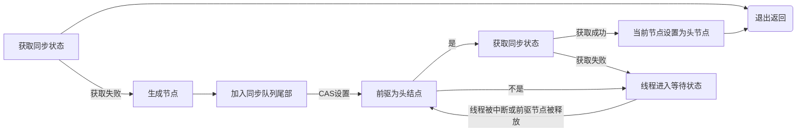
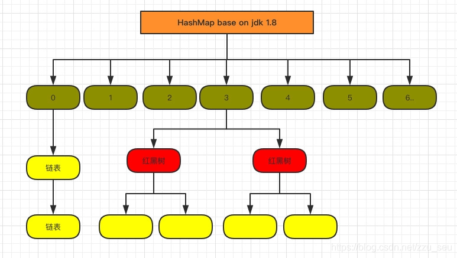
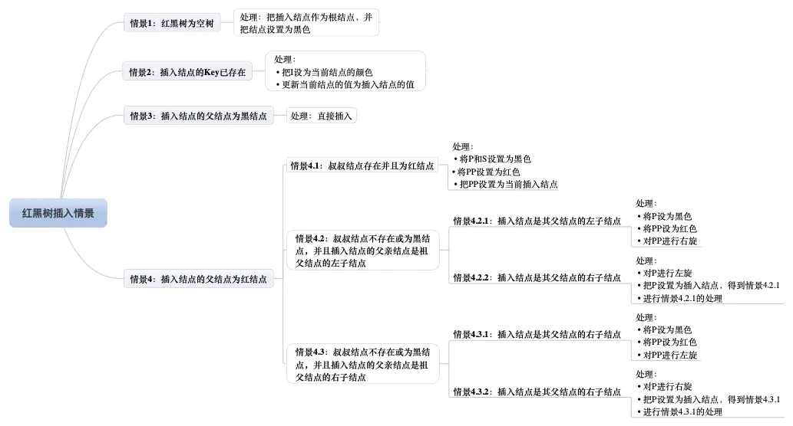
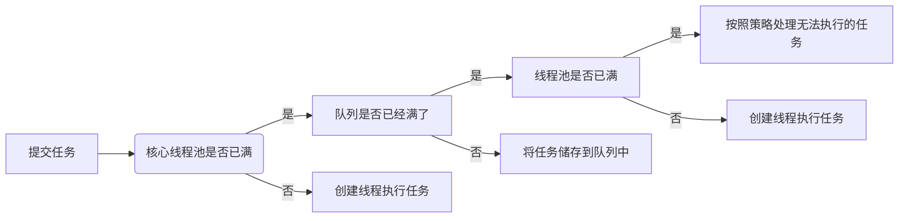

```

```

## 多线程 multi-thread

### learn-multi-thread：

#### 《Java并发编程的艺术》学习过程代码

##### 1.1 上下文切换 ConcurrencyTest DeadLockDemo

1. 单核cpu也是支持多线程操作的
2. 时间片一般是十几毫秒
3. cpu通过时间片分配算法循环执行任务，当前执行任务执行一个时间片后切换到下一个任务，在切换前会保存上一个任务的状态， 以便下次切换回来继续执行，这个切换动作叫做上下文切换
4. 上下文的切换会影响多线程的执行效率
5. 任务数量不够量级时，使用多线程反而是影响效率：频繁的切换上下文会影响效率
6. idea asyn profiler 查看火焰图，调用书，时间线，事件
7. 减少切换上下文的方法：cas算法，无锁多线程，使用最少的线程数,协程（单线程实现多任务调度）
8. cas算法：乐观锁 比较替换的方式，会有自旋性能问题， 注意aba问题 可以依赖AtomicStampedReference 在增加一个类似版本号参数
9. 避免死锁：
10. 避免一个线程持有多个锁
11. 避免一个线程内占用多个资源
12. 使用定时锁，lock。trylock（timeout）替代使用内部锁机制
13. 上锁和解锁要成对出现，避免异常情况下锁未释放

##### 1.2 java并发机制的底层实现原理

1. volatile
   1. volatile 轻量级的synchronized，在多处理器开发中保证了共享变量的可见性，他不会引起线程上下文的切换和调度
   2. volatile转换成汇编代码，会多出lock指令，lock指令会引发两件事，将当前处理器缓存行写入内存。这个写入内存的操作会是其他cpu缓存此地址的数据变为无效
2. synchronized
   1. synchronized 在1.6之后减少了锁和释放锁带来的性能损耗，引入了偏量锁和轻量级锁，以及锁的存储结果和升级过程
      1. Synchroized 三种形式：
         1. 普通方法，锁的是当前示例
         2. 静态同步方法，锁的是当前类的class对象
         3. 同步方法快，锁的是Synchroized括号里配置的对象
   2. synchronized 在jvm实现原理，jvm基于进入和退出Monitor对象实现方法同步和代码块同步
   3. 锁的级别：无锁状态 -> 偏向锁状态 -> 轻量锁 -> 重量级锁 锁会随着竞争状态的升级而升级，锁可以升级但是不可以降级
   4. 偏量锁依赖对象头 当一个线程访问同步块并获取锁时，会在对象头和栈帧中的锁记录里存储锁偏向的线程ID，以后该线程在进入和退出同步块时不需要进行CAS操作来加锁和解锁，只需简单地测试一下对象头的Mark Word里是否存储着
      指向当前线程的偏向锁。如果测试成功，表示线程已经获得了锁。如果测试失败，则需要再测试一下Mark Word中偏向锁的标识是否设置成1（表示当前是偏向锁）：如果没有设置，则使用CAS竞争锁；如果设置了，则尝试使用CAS将对象
      头的偏向锁指向当前线程。<br />
      偏向锁在1.6之后默认启动，会在应用程序启动几秒钟后才激活，-XX:BiasedLockingStartupDelay=0 关闭延迟 <br />
      关闭偏向锁：-XX:-UseBiasedLocking=false
   5. 轻量级锁 当前线程的栈桢中创建用于存储锁记录的空间，并将对象头中的Mark Word复制到锁记录中，线程尝试使用CAS将对象头中的Mark Word替换为指向锁记录的指针。如果成功，当前线程获得锁，如果失败，表示其他线程竞争锁，
      当前线程便尝试使用自旋来获取锁。 轻量级解锁时，会使用原子的CAS操作将Displaced MarkWord替换回到对象头，如果成功，则 表示没有竞争发生。如果失败，表示当前锁存在竞争，锁就会膨胀成重量级锁
   6. 锁的优缺点

| 锁       |                                  优点                                  |                                                 缺点 |                           适用场景 |
| ---------- | :----------------------------------------------------------------------: | -----------------------------------------------------: | -----------------------------------: |
| 偏量锁   | 加锁和解锁不需要额外的消耗，<br />和执行非同步方法相比存在纳秒级的差距 | 如果线程间存在锁竞争，<br />会带来额外的锁撤销的消耗 | 适用于是有一个线程访问同步块的场景 |
| 轻量级锁 |                  竞争的线程不会阻塞，提高程序的响应度                  |      如果始终得不到锁的线程，<br />使用自旋会消耗cpu | 追求响应时间，同步快执行速度非常快 |
| 重量级锁 |                    线程竞争不使用自旋，不会消耗cpu                    |                               线程阻塞，响应时间缓慢 |     追求吞吐量，同步快执行速度较长 |

3. 原子操作
   1. 术语定义：不可被中断的一个或一系列操作
   2. 处理器如何实现原子操作
      1. 使用总线锁保证：总线锁就是使用处理器提供的一个LOCK #信号，当一个处理器在总线上输出此信号时，其他处理器的请求将被阻塞住，那么该处理器可以独占共享内存。
      2. 使用缓存锁保证原子性：在同一时刻，我们只需保证对某个内存地址的操作是原子性即可，但总线锁定把CPU和内存之间的通信锁住了，这使得锁定期间，其他处理器不能操作其他内存地址的数据，
         所以总线锁定的开销比较大，目前处理器在某些场合下使用缓存锁定代替总线锁定来进行优化。
      3. 有两种情况下处理器不会使用缓存锁定。第一种情况是：当操作的数据不能被缓存在处理器内部，或操作的数据跨多个缓存行（cache line）时，则处理器会调用总线锁定。第二种情况是：有些处理器不支持缓存锁定。对于Intel
         486和Pentium处理器，就算锁定的内存区域在处理器的缓存行中也会调用总线锁定。针对以上两个机制，我们通过Intel处理器提供了很多Lock前缀的指令来实现。例如，位测试和修改指令：BTS、BTR、BTC；交换指令XADD、CMPXCHG，以及
         其他一些操作数和逻辑指令（如ADD、OR）等，被这些指令操作的内存区域就会加锁，导致其他处理器不能同时访问它。
   3. java如何实现原子操作
      1. 使用cas实现原子操作：利用了处理器提供的CMPXCHG指令实现的。自旋CAS实现的基本思路就是循环进行CAS操作直到成功为止。java.util.concurrent.atomic
      2. cas实现原子操作的三大问题：
         1. ABA问题，如果一个值原来是A，变成了B，又变成了A，那么使用CAS进行检查时会发现它的值没有发生变化，但是实际上却变化了。ABA问题的解决思路就是使用版本号。
            在变量前面追加上版本号，每次变量更新的时候把版本号加1，那么A→B→A就会变成1A→2B→3A atomic 包下的 AtomicStampedReference 类可以解决
         2. 循环时间长开销大。
         3. 只能保证一个共享变量的原子操作

##### 1.3 java内存模型

1. java内存模型基础
   1. 两个关键问题：线程之间如何通信及线程之间如何同步。通信是指线程之间以何种机制来交换信息。在命令式编程中，线程之间的通信机制有两种：共享内存和消息传递。
   2. Java的并发采用的是共享内存模型，Java线程之间的通信总是隐式进行
   3. 在执行程序时，为了提高性能，编译器和处理器常常会对指令做重排序。重排序分3种类型。
      1. 编译器优化的重排序。编译器在不改变单线程程序语义的前提下，可以重新安排语句的执行顺序
      2. 指令级并行的重排序
      3. 内存系统的重排序
   4. java指令重排：源代码 -> 编译器优化重排序 -> 指令级并行重排序 -> 内存系统重排 -> 最终执行的序列
   5. happens-before jdk5开始java采用jsr-133内存模型，jsr-133使用的是happens-before概念来阐述操作之间的内存可见性。两个操作之间具有happens-before关系，
      并不意味着前一个操作必须要在后一个操作之前执行！happens-before仅仅要求前一个操作（执行的结果）对后一个操作可见，且前一个操作按顺序排在第二个操作之前。
   6. 重排序：编译器和处理器可能会对操作做重排序。编译器和处理器在重排序时，会遵守数据依赖性，编译器和处理器不会改变存在数据依赖关系的两个操作的执行顺序。数据依赖性
      仅针对单个处理器中执行的指令序列和单个线程中执行的操作，不同处理器之间和不同线程之间的数据依赖性不被编译器和处理器考虑。
   7. as-if-serial语义的意思是：不管怎么重排序（编译器和处理器为了提高并行度），（单线程）程序的执行结果不能被改变。编译器、runtime和处理器都必须遵守as-if-serial语义。
   8. 总线的这些工作机制可以把所有处理器对内存的访问以串行化的方式来执行。在任意时间点，最多只能有一个处理器可以访问内存。这个特性确保了单个总线事务之中的内存读/写操作具有原
      子性。在一些32位的处理器上，如果要求对64位数据的写操作具有原子性，会有比较大的开销。为了照顾这种处理器，Java语言规范鼓励但不强求JVM对64位的long型变量和double型变量
      的写操作具有原子性。当JVM在这种处理器上运行时，可能会把一个64位long/double型变量的写操作拆分为两个32位的写操作来执行。这两个32位的写操作可能会被分配到不同的总线事务
      中执行，此时对这个64位变量的写操作将不具有原子性。
   9. 注意，在JSR -133之前的旧内存模型中，一个64位long/double型变量的读/写操作可以被拆分为两个32位的读/写操作来执行。从JSR -133内存模型开始（即从JDK5开始），仅仅只允许
      把一个64位long/double型变量的写操作拆分为两个32位的写操作来执行，任意的读操作在JSR-133中都必须具有原子性（即任意读操作必须要在单个读事务中执行）。
   10. volatile 变量对单个值的读写做了同步操作，相当于增加同步锁
   11. volatile特性：
   12. 可见性：对volatile变量的读，任意线程总能看到 volatile变量最后的写入
   13. 原子性：对任意单个volatile变量的读/写具有原子性，但类似于volatile++这种复合操作不具有原子性。
   14. 当写一个volatile变量时，JMM会把该线程对应的本地内存中的共享变量值刷新到主内存。
   15. 当第二个操作是volatile写时，不管第一个操作是什么，都不能重排序。这个规则确保volatile写之前的操作不会被编译器重排序到volatile写之后。
       当第一个操作是volatile读时，不管第二个操作是什么，都不能重排序。这个规则确保volatile读之后的操作不会被编译器重排序到volatile读之前。
       当第一个操作是volatile写，第二个操作是volatile读时，不能重排序。
   16. 处理器的重排序规则

| 屏障类型            |          指令示例          |                                                                                                                                                                                                    说明 |
| --------------------- | :--------------------------: | --------------------------------------------------------------------------------------------------------------------------------------------------------------------------------------------------------: |
| LoadLoad   Barriers |   Load1；LoadLoad；Load2   |                                                                                                                                                    确保Load1数据的装载先于load2及所有后续装载指令的装载 |
| StoreStore Barriers | Store1；storestore；store2 |                                                                                                                          确保store1数据对其他处理器可见（刷新到内存）先于store2及所有后续存储指令的存储 |
| LoadStore  Barriers |  Load1；loadstore；store2  |                                                                                                                                               确保Load1数据装载先于store2及所有后续的储存指令刷新到内存 |
| StoreLoad  Barriers |  store1；storeload；load2  | 确保store1数据对其他处理器变得可见（指刷新到内存）先于load2及所有后续装载指令的装载。<br /> StoreLoad Barriers 会使该屏障之前的所有内存访问指令（存储和装载指令）完成后，才执行该屏障之后的内存访问指令 |

2. 基于保守策略的JMM内存屏障插入策略。
   1. 在每个volatile写操作的前面插入一个StoreStore屏障。
   2. 在每个volatile写操作的后面插入一个StoreLoad屏障。
   3. 在每个volatile读操作的后面插入一个LoadLoad屏障。
   4. 在每个volatile读操作的后面插入一个LoadStore屏障。
3. 公平锁 依赖volatile，非公平锁依赖 cas算法
4. CAS同时具有volatile读和volatile写的内存
5. 对公平锁和非公平锁的内存语义
   1. 公平锁和非公平锁释放时，最后都要写一个volatile变量state。
   2. 公平锁获取时，首先会去读volatile变量。
   3. 非公平锁获取时，首先会用CAS更新volatile变量，这个操作同时具有volatile读和volatile写的内存语义。
6. 锁释放-获取的内存语义的实现至少有下面两种方式
   1. 利用volatile变量的写-读所具有的内存语义。
   2. 利用CAS所附带的volatile读和volatile写的内存语义。
7. concurrent包下源代码实现，通用化模式：
   1. 首先声明共享变量volatile
   2. 使用cas的原子条件更新来实现线程之间的同步
   3. 配合volatile的读/写和CAS所具有的volatile读和写的内存语义来实现线程之间的通讯
8. AbstractQueuedSynchronizer（AQS）,抽象的队列式的同步器 concurrent实现示意图：
   1. volatile变量的读/写 CAS || VV
   2. AQS 非阻塞数据结构 原子变量类 || vv
   3. LOCK 同步器 阻塞队列 Executor 并发容器
9. fianl域的重排序规则
   1. 在构造函数内对一个final域的写入，与随后把这个被构造对象的引用赋值给一个引用变量，这两个操作之间不能重排序。
   2. 初次读一个包含final域的对象的引用，与随后初次读这个final域，这两个操作之间不能重排序。
10. 对于引用类型，写final域的重排序规则对编译器和处理器增加了如下约束：在构造函数内对一个final引用的对象的成员域的写入，与随后在构造函数外把这个被构造对象的引用赋值给一个引用变量，这两个操作之间不能重排序。
11. JMM把happens-before要求禁止的重排序分为了下面两类。
   1. 会改变程序执行结果的重排序。
   2. 不会改变程序执行结果的重排序。
12. JMM对这两种不同性质的重排序，采取了不同的策略
   1. 对于会改变程序执行结果的重排序，JMM要求编译器和处理器必须禁止这种重排序。
   2. 对于不会改变程序执行结果的重排序，JMM对编译器和处理器不做要求（JMM允许这种重排序）。
13. happens-before关系的定义
   1. 如果一个操作happens-before另一个操作，那么第一个操作的执行结果将对第二个操作可见，而且第一个操作的执行顺序排在第二个操作之前。
   2.
   两个操作之间存在happens-before关系，并不意味着Java平台的具体实现必须要按照happens-before关系指定的顺序来执行。如果重排序之后的执行结果，与按happens-before关系来执行的结果一致，那么这种重排序并不非法（也就是说，JMM允许这种重排序）。
14. happens-before和as-if-serial
   1. as-if-serial语义保证单线程内程序的执行结果不被改变，happens-before关系保证正确同步的多线程程序的执行结果不被改变。
   2.
   as-if-serial语义给编写单线程程序的程序员创造了一个幻境：单线程程序是按程序的顺序来执行的。happens-before关系给编写正确同步的多线程程序的程序员创造了一个幻境：正确同步的多线程程序是按happens-before指定的顺序来执行的。
15. happens-before规则
   1. 程序顺序规则：一个线程中的每个操作，happens-before于该线程中的任意后续操作。
   2. 监视器锁规则：对一个锁的解锁，happens-before于随后对这个锁的加锁。
   3. volatile变量规则：对一个volatile域的写，happens-before于任意后续对这个volatile域的读。
   4. 传递性：如果A happens-before B，且B happens-beforeC，那么A happens-before C。
   5. start()规则：如果线程A执行操作ThreadB.start()（启动线程B），那么A线程的ThreadB.start()操作happens-before于线程B中的任意操作。
   6. join()规则：如果线程A执行操作ThreadB. join()并成功返回，那么线程B中的任意操作happens-before于线程A从ThreadB. join()操作成功返回。
16. 基于volatile的解决方案 双重锁

    ```
    public class SafeDoubleCheckedLocking {

        private volatile static InstanceSafeDouble instance;

        public static InstanceSafeDouble getInstance() {
            if (instance == null) {
                /**
                 * 这里防止内存指令重排，实际在new会做三件事
                 * 1.分配对象的内存
                 * 2.初始化对象
                 * 3.设置instance指向内存空间
                 * 若 无锁 synchronized 这三个指令可能会导致重排，向 3，2，1 会出现访问返回null
                 */
                synchronized (SafeDoubleCheckedLocking.class) {
                    if (instance == null) {
                        instance = new InstanceSafeDouble();
                    }
                }
            }
            return instance;
        }

        public static class InstanceSafeDouble {

        }
    }


    ```
17. 双重锁 另一种实现：JVM在类的初始化阶段（即在Class被加载后，且被线程使用之前），会执行类的初始化。在执行类的初始化期间，JVM会去获取一个锁。这个锁可以同步多个线程对同一个类的初始化。

    ```
    public class InstanceFactory {
        private static class InstanceHolder{
            public static Instance instance = new Instance();
        }
         //允许 重排序，但不允许非构造线程（这里指线程B）“看到”这个重排序。
        public static Instance getInstance(){
             //这里将导致instanceHolder类被初始化
            return InstanceHolder.instance;
        }

        public static class Instance{

        }
    }

    ```
18. 在大多数时候，正常的初始化要优于延迟初始化。如果确实需要对实例字段使用线程安全的延迟初始化，请使用上面介绍的基于volatile的延迟初始化的方案；如果确实需要对静态字段使用线程安全的延迟初始化，请使用上面介绍的基于类初始化的方案。
19. Java程序的内存可见性保证可以分为下列3类

   1. 单线程程序。单线程程序不会出现内存可见性问题。编译器、runtime和处理器会共同确保单线程程序的执行结果与该程序在顺序一致性模型中的执行结果相同。
   2. 正确同步的多线程程序。正确同步的多线程程序的执行将具有顺序一致性（程序的执行结果与该程序在顺序一致性内存模型中的执行结果相同）。这是JMM关注的重点，JMM通过限制编译器和处理器的重排序来为程序员提供内存可见性保证。
   3. 未同步/未正确同步的多线程程序。JMM为它们提供了最小安全性保障：线程执行时读取到的值，要么是之前某个线程写入的值，要么是默认值（0、null、false）。
20. JSR-133对JDK 5之前的旧内存模型的修补主要有两个

   1. 增强volatile的内存语义。旧内存模型允许volatile变量与普通变量重排序。JSR-133严格限制volatile变量与普通变量的重排序，使volatile的写-读和锁的释放-获取具有相同的内存语义。
   2. 增强final的内存语义。在旧内存模型中，多次读取同一个final变量的值可能会不相同。为此，JSR-133为final增加了两个重排序规则。在保证final引用不会从构造函数内逸出的情况下，final具有了初始化安全性。

##### 1.4 java并发编程基础1. 为什么要使用多线程

1. 使用更多处理器核心
2. 更快的响应时间
3. 更好的编程模型：java提供良好的一致性编程模型，使开发人员更好的专注问题的解决，一旦建立好模型，稍微修改就能很方便的映射出多线程编程模型上
4. java线程中使用整型成员变量priority来控制优先级，默认优先级为：5 。设置线程优先级时，针对频繁阻塞（休眠或者I/O操作）的线程需要设置较高优先级，而偏重计算（需要较多CPU时间或者偏运算）的线程则设置较低的
   优先级，确保处理器不会被独占。在不同的JVM以及操作系统上，线程规划会存在差异，有些操作系统甚至会忽略对线程优先级的设定
5. 线程的状态：
   1. new ：初始状态，线程被构造，但是还没调用start方法
   2. runable：运行状态，java将操作系统中的就绪和运行笼统的称作：运行中
   3. blocked：阻塞状态，表示线程阻塞与锁
   4. waiting：等待状态，表示线程进入等待状态，表示当前线程需要等待其他线程作出一些特定动作
   5. time_waiting: 超时等待状态，状态不同于waiting，可以在指定的时间返回的
   6. terminated：终止状态，表示当前线程已经执行完毕
6. 在构建Daemon线程时，不能依靠finally块中的内容来确保执行关闭或清理资源的逻辑
7. 一个新构造的线程对象是由其parent线程来进行空间分配的，而child线程继承了parent是否为Daemon、优先级和加载资源的contextClassLoader以及可继承的ThreadLocal，
   同时还会分配一个唯一的ID来标识这个child线程。至此，一个能够运行的线程对象就初始化好了，在堆内存中等待着运行。
8. 中断标识interrupt，声明抛出InterruptException异常会清理中断标识，此时调用isinterrupt返回的是false
9. 线程的suspend中断，resume恢复，stop中断，api是过时的，过时原因是：suspend调用后，不会释放已占有的资源，容易引发死锁，stop也不保证终止线程后，能完全释放资源
10. 同步块的实现使用了monitorenter和monitoreexit指令，同步方法依靠方法修饰符的ACC_SYNCHRONIZED，本质上是对一个的对象的monitor监视器进行获取，获取过程是排他的

```
   wanglei@wanglei test % javap -v SynchoroniezdTest.class
Classfile /Users/wanglei/Documents/myproject/githubout/learn-repository/multi-thread/learn-multi-thread/target/test-classes/com/mars/multi/thread/learn/test/SynchoroniezdTest.class
  Last modified 2021年12月17日; size 634 bytes
  MD5 checksum 3da980e3aaaaaed4be5abfb48745d857
  Compiled from "SynchoroniezdTest.java"
public class com.mars.multi.thread.learn.test.SynchoroniezdTest
  minor version: 0
  major version: 50
  flags: (0x0021) ACC_PUBLIC, ACC_SUPER
  this_class: #2                          // com/mars/multi/thread/learn/test/SynchoroniezdTest
  super_class: #4                         // java/lang/Object
  interfaces: 0, fields: 0, methods: 3, attributes: 1
Constant pool:
   #1 = Methodref          #4.#23         // java/lang/Object."<init>":()V
   #2 = Class              #24            // com/mars/multi/thread/learn/test/SynchoroniezdTest
   #3 = Methodref          #2.#25         // com/mars/multi/thread/learn/test/SynchoroniezdTest.m2:()V
   #4 = Class              #26            // java/lang/Object
   #5 = Utf8               <init>
   #6 = Utf8               ()V
   #7 = Utf8               Code
   #8 = Utf8               LineNumberTable
   #9 = Utf8               LocalVariableTable
  #10 = Utf8               this
  #11 = Utf8               Lcom/mars/multi/thread/learn/test/SynchoroniezdTest;
  #12 = Utf8               main
  #13 = Utf8               ([Ljava/lang/String;)V
  #14 = Utf8               args
  #15 = Utf8               [Ljava/lang/String;
  #16 = Utf8               StackMapTable
  #17 = Class              #15            // "[Ljava/lang/String;"
  #18 = Class              #26            // java/lang/Object
  #19 = Class              #27            // java/lang/Throwable
  #20 = Utf8               m2
  #21 = Utf8               SourceFile
  #22 = Utf8               SynchoroniezdTest.java
  #23 = NameAndType        #5:#6          // "<init>":()V
  #24 = Utf8               com/mars/multi/thread/learn/test/SynchoroniezdTest
  #25 = NameAndType        #20:#6         // m2:()V
  #26 = Utf8               java/lang/Object
  #27 = Utf8               java/lang/Throwable
{
  public com.mars.multi.thread.learn.test.SynchoroniezdTest();
    descriptor: ()V
    flags: (0x0001) ACC_PUBLIC
    Code:
      stack=1, locals=1, args_size=1
         0: aload_0
         1: invokespecial #1                  // Method java/lang/Object."<init>":()V
         4: return
      LineNumberTable:
        line 3: 0
      LocalVariableTable:
        Start  Length  Slot  Name   Signature
            0       5     0  this   Lcom/mars/multi/thread/learn/test/SynchoroniezdTest;

  public static void main(java.lang.String[]);
    descriptor: ([Ljava/lang/String;)V
    flags: (0x0009) ACC_PUBLIC, ACC_STATIC
    Code:
      stack=2, locals=3, args_size=1
         0: ldc           #2                  // class com/mars/multi/thread/learn/test/SynchoroniezdTest
         2: dup
         3: astore_1
         4: monitorenter
         5: aload_1
         6: monitorexit
         7: goto          15
        10: astore_2
        11: aload_1
        12: monitorexit
        13: aload_2
        14: athrow
        15: invokestatic  #3                  // Method m2:()V
        18: return
      Exception table:
         from    to  target type
             5     7    10   any
            10    13    10   any
      LineNumberTable:
        line 6: 0
        line 8: 5
        line 9: 15
        line 10: 18
      LocalVariableTable:
        Start  Length  Slot  Name   Signature
            0      19     0  args   [Ljava/lang/String;
      StackMapTable: number_of_entries = 2
        frame_type = 255 /* full_frame */
          offset_delta = 10
          locals = [ class "[Ljava/lang/String;", class java/lang/Object ]
          stack = [ class java/lang/Throwable ]
        frame_type = 250 /* chop */
          offset_delta = 4

  public static synchronized void m2();
    descriptor: ()V
    flags: (0x0029) ACC_PUBLIC, ACC_STATIC, ACC_SYNCHRONIZED
    Code:
      stack=0, locals=0, args_size=0
         0: return
      LineNumberTable:
        line 14: 0
    }
    SourceFile: "SynchoroniezdTest.java"

   
```

9. 等待/通知经典范式：
   1. 等待方遵循如下原则

      1. 获取对象的锁
      2. 如果条件不满足，那么调用对的wait()的方法，
      3. 条件满足则执行对应的逻辑

      ```
      synchronized（对象）{
        while(条件不满足){
            对象.wait();
        }
      }

      ```
   2. 通知方遵循如下原则

      1. 获取对象锁
      2. 改变条件
      3. 通知所有等待在对象的线程

      ```
      synchronized（对象）{
      改变条件
      对象.notifyAll();
      }  

      ```
10. join 如果一个线程A执行了thread.join()语句，其含义是：当前线程A等待thread线程终止之后才从thread.join()
    返回。thread.Join把指定的线程加入到当前线程，可以将两个交替执行的线程合并为顺序执行的线程。

##### 1.5 java中的锁

1. 锁用来控制多线程访问共享资源的一种方式。相比着Synchronized更开放化，能显式的获取和释放锁，可操作性更大，但是需要成对的出现，防止锁未释放
2. lock接口提供的Synchronized不具备的主要特征

| 特征               | 描述                                                 |
| -------------------- | ------------------------------------------------------ |
| 尝试非阻塞的获取锁 | 当前尝试获取锁，若此锁未被其他线程占有，则成功获取锁 |
| 能够中断的获取锁   | 当获取的锁被中断时。中断异常将会抛出，同时锁会被释放 |
| 超时获取锁         | 制定在截取时间内获取锁，若超过指定时间，则返回       |

3. lock的api

| 方法名称                                                      | 描述                                                                                |
| --------------------------------------------------------------- | ------------------------------------------------------------------------------------- |
| void lock()                                                   | 获取锁，                                                                            |
| void lockInterruptibly() throws Interruptibly                 | 中断的获取锁，和lock不同之处在于该方法会响应中断，即在锁在获取中可以中断当前线程    |
| Boolean tryLock()                                             | 尝试非阻塞式获取锁，若获取成功返回true，若失败返回false                             |
| Boolean tryLock(long time,TimeUnit unit) throws Interruptibly | 超时获取锁，1.在规定时间内获取到锁，2.超时获取锁失败，3超时时间内被中断             |
| void unlock()                                                 | 释放锁                                                                              |
| Condition newCondition()                                      | 获取通知组件，与当前的锁绑定，当前线程获取到锁，调用调用组件wait(),调用后，则释放锁 |

4. 队列同步器（AbstractQueuedSynchronizer），是用来构建锁或者其他同步组件的基础框架，它使用了一个int成员变量表示同步状态，通过内置的FIFO队列来完成资源获取线程的排队工作
   同步器重写三个方法来修改同步状态，getState()获取当前同步状态，setState(int newState)设置当前同步状态，compareAndSetState（int expect,int
   update）使用cas设置当前状态，能保证设置的原子性
5. 同步器可重写的方法

| 方法名称                    | 描述                                                                                              |
| ----------------------------- | --------------------------------------------------------------------------------------------------- |
| boolean tryAcquire(int arg) | 独占式获取同步状态，实现方法需要查询当前状态并判断同步状态是否符合预期，然后在进行cas设置同步状态 |
| boolean tryRelease(int arg) | 独占式释放同步状态，等待获取同步状态的线程将有机会获取同步状态                                    |
| int tryAcquireShared()      | 共享式获取同步锁，返回大于等于0时，表示获取成功                                                   |
| boolean tryReleaseShared()  | 共享式释放同步状态。                                                                              |
| boolean isHeldExclusively() | 当前同步器是否在独占模式下被线程占有，一般该方法表示是否被当前线程锁独占                          |

6. 同步器提供的模板方法

| 方法名称                                          | 描述                                                                                                           |
| --------------------------------------------------- | ---------------------------------------------------------------------------------------------------------------- |
| void acquire(int arg)                             | 独占式获取同步状态，若获取成功，则由该方法返回，否则进入同步队列等待，此方法会调用重写tryAcquire(int arg)方法  |
| void acquireInteruptibly(int arg)                 | 与acquire(int arg)相同，但是该方法响应中断，未获取到同步状态进入同步队列，若被中断，则抛出InterruptedException |
| boolean tryAcquireNanos(int arg,long nanos)       | 在acquireInteruptibly基础上增加了超时限制，成功返回true，失败返回false                                         |
| void tryAcquireShared(int arg)                    | 共享式获取同步状态，与独占式的主要区别是在同一时刻可有有多个线程获取到同步状态                                 |
| void acquireSharedInterruptibly(int arg)          | tryAcquireShared一样，增加了响应中断                                                                           |
| boolean tryAcquireSharedNanos(int arg,long nanos) | acquireSharedInterruptibly 增加超时设置                                                                        |
| boolean release(int arg)                          | 独占式释放同步状态，释放同步状态后，同步队列第一个节点包含的线程被唤醒                                         |
| boolean releaseShared(int arg)                    | 共享式释放同步状态                                                                                             |
| Collection<Thread> getQueuedThreads()             | 获取等待在同步队列的线程集合                                                                                   |

7. 同步队列，同步器依赖内部的同步队列（一个FIFO双向队列）来完成同步状态的管理，当前线程获取同步状态失败，同步器会将当前线程以及等待状态等信息构造成一个节点（node）
   将其加入同步队列，同步阻塞线程，当同步状态释放时，会把首节点的线程唤醒，使其再次尝试获取同步状态。

| 属性类型与名称 | 描述                                                                                                                                                                                                                                                                                                                                                                                                                                                                                                                                                                                                     |
| :---------------: | :--------------------------------------------------------------------------------------------------------------------------------------------------------------------------------------------------------------------------------------------------------------------------------------------------------------------------------------------------------------------------------------------------------------------------------------------------------------------------------------------------------------------------------------------------------------------------------------------------------- |
| int waitStatus | 等状态<br> 包含如下状态 <br />  1.cancelled 值为1，由于在同步队列中等待的线程等待超时或者被中断，需要从同步队列中取消等待，节点进入该状态将不会变化 <br />  2.signal 值为-1，后续节点的线程处于等待状态，而当前节点的线程如果释放了同步状态或者被取消，将会通知后继节点，使后继节点线程得以运行。 <br />  3.condition 值为-2 节点在等待队列中，节点线程等待在Condition上，当其他线程对Condition调用了signal()方法后，该节点将会从等待队列中转移到同步队列中，加入到对同步状态获取中。 <br /> 4.propagate 值为-3 表示下一次共享式同步状态获取将会无条件的被传播下去 <br />  5.initial 值为0，初始同步状态 |
|    Node prev    | 前驱节点，当节点加入同步队列是被设置（尾部添加）                                                                                                                                                                                                                                                                                                                                                                                                                                                                                                                                                         |
|    Node next    | 后续节点                                                                                                                                                                                                                                                                                                                                                                                                                                                                                                                                                                                                 |
| Node nextWaiter | 等待队列中的后续节点，如果当前节点是共享的，那么这个字段将是一个shared常量，也就是说节点类型（独占和共享）和等待队列中的后继节点共用一个字段                                                                                                                                                                                                                                                                                                                                                                                                                                                             |
|  Thread thread  | 获取同步状态的线程                                                                                                                                                                                                                                                                                                                                                                                                                                                                                                                                                                                       |

8. 队列：队列和堆栈都是有序列表，属于抽象型数据类型(ADT)，所有加入和删除的动作都发生在不同的两端，并符合First In, First Out(先进先出)的特性。 特性： ·FIFO（先进先出）
   ·拥有两种基本操作，即加入与删除，而且使用front与rear两个指针来分别执行队列的前端与尾端。
   1. 队列在计算机领域的应用： 1.在图形遍历的先广后深搜索法(BFS)  2.用于计算机的模拟(simulation)  3.CPU的工作调度等。
   2. 环形队列：线性队列有空间浪费的问题，可以利用环形队列来解决。它是Q(0:n-1)的一维数组，同事Q(0)为Q(n-1)的下一个元素。
      其中，指针front用于以逆时针方向指向队列中第一个元素的前一个位置，rear则指向队列当前的最后位置。 一开始front和rear均预设为-1，表示为空队列。也就是说 如果front=rear则为空队列。
      这样设计的好处是，环形队列为空队列和满队列时，front和rear都会指向同一个地方。为更方便我们判断，我们仅允许队列最多存放n-1个数据(亦 即牺牲最后一个空间)，
      当rear指针的下一个是front的位置时，就认定队列已满，无法再将数据加入。所以一个Q(0：n-1)的环形队列最多只能放n-1个元素。
   3. 优先队列：优先队列(priority queue)为一种不必遵守队列特性--FIFO的有序表，其中的每一个元素都赋予一个优先权(Priority)，加入元素时可任意加入，但有最高优先权者(Highest Priority Out
      First, HPOF)则最先输出。在 计算机中CPU的工作调度，优先权调度(Priority Scheduling, PS)就是一种挑选任务的“调度算法”(Scheduling Aalgotithm)
      ，也会使用到优先队列。级别高的用户，就比一般用户拥有较高的权利。当各元素以输入先后次序为优先权时， 就是一般的队列，假如是以输入先后次序作为最不优先权时，此优先队列即为一堆栈。
   4. 双向队列：双向队列(Double-ends Queues)
      ，是一种前后两段都可输入或读取数据的有序表。在双向队列中，我们仍使用两个指针，分别指向加入及取回端，只是加入和取回数据时，各指针所扮演的角色不再是固定的加入或取回。而且两边的 指针都向队列中央移动，其他部分则和一般队列无异。
9. 在获取同步状态时，同步器维护一个同步队列，获取状态失败的线程都会被加入到队列中并在队列中进行自旋；移出队列（或停止自旋）的条件是前驱节点为头节点且成功获取了同步状态。在释放同步状态时，同步器调用tryRelease(intarg)
   方法释放同步状态，然后唤醒头节点的后继节点。
   <kbd>独占式同步状态获取流程</kbd>



10. 重入锁 它表示该锁能够支持一个线程对资源的重复加锁 ReentrantLock，公平锁能减少"饥饿"的产生。
11. 读写锁，只有在读和写一起时才具有排他性 <br/>
    <kbd> ReentrantReadWriteLock的特征</kbd>

|    特征    | 说明                                                                                                                                 |
| :----------: | :------------------------------------------------------------------------------------------------------------------------------------- |
| 公平选择性 | 支持非公平（默认）和公平得获取方式，吞吐量还是非公平优于公平                                                                         |
|   重进入   | 该锁支持重进入，以读写线程为例，读线程获取到读锁之后，能够再次获取读锁，而写线程在获取了写锁之后能够再次获取写锁，同时也可以获取读锁 |
|   锁降级   | 遵循获取写锁，获取读锁在释放写锁得次序，写锁能够降级为读锁                                                                           |

<kbd> ReentrantReadWriteLock的api</kbd>

| 方法名称              | 描述                                                     |
| ----------------------- | ---------------------------------------------------------- |
| int getReadLockCount  | 返回当前读锁被获取得次数，该次数不等于获取读锁的线程数量 |
| int getReadHoldCount  | 返回当前线程获取读锁得次数                               |
| boolean isWriteLocked | 判断写锁是否被获取                                       |
| int getWriteHoldCount | 返回当前线程写锁被获取得次数                             |

12. LockSupport

| 方法名称                      | 描述                                                                                        |
| ------------------------------- | --------------------------------------------------------------------------------------------- |
| void park()                   | 阻塞当前线程，如果调用调用unpark（Thread thread）方法或者当前线程被中断，才能从park方法返回 |
| void parkNanos(long nanos)    | 阻塞当前线程，增加超时时间                                                                  |
| void parkUntil(long deadline) | 阻塞当前线程，直到deadline时间（从1970年开始到deadline时间得毫秒数）                        |
| void unpark(Thread thread)    | 唤醒处于阻塞状态得线程                                                                      |

13. Condition接口 Object的监视器方法与Condition接口对比

| 对比项                                               | Object Monitor Methods | Condition                                                           |
| ------------------------------------------------------ | ------------------------ | --------------------------------------------------------------------- |
| 前置条件                                             | 获取对象得锁           | 调用Lock.lock()获取锁<br/> 调用Lock.newCondition()获取Condition对象 |
| 调用方式                                             | 直接调用object.wait()  | 直接调用 condition.wait()                                           |
| 等待队列个数                                         | 一个                   | 多个                                                                |
| 当前线程释放锁并进入等待状态                         | 支持                   | 支持                                                                |
| 当前线程释放锁并进入等待状态，在等待状态中不响应中断 | 不支持                 | 支持                                                                |
| 当前线程释放锁并进入超时等待状态                     | 支持                   | 支持                                                                |
| 当前线程释放锁并进入等待超时状态到将来得某个时间     | 不支持                 | 支持                                                                |
| 唤醒等待队列的一个线程                               | 支持                   | 支持                                                                |
| 唤醒等待队列中的全部线程                             | 支持                   | 支持                                                                |

Condition方法及描述

| 方法名称                                                       | 描述                                                                                                                                                                                                                                                                                                                              |
| ---------------------------------------------------------------- | ----------------------------------------------------------------------------------------------------------------------------------------------------------------------------------------------------------------------------------------------------------------------------------------------------------------------------------- |
| void await()thows InterruptedException                         | 当前线程进入等待状态直到被通知（siganl）或者中断,当前线程将进入运行状态且从await（）方法返回，包括：<br/> 其他线程调用该Condition得signal()或signalAll()方法，而当前线程被选中唤醒<br/>1.其他线程（调用interrupt()方法）中断当前线程<br/> 2.如果当前线程等待线程从await() 方法返回，那么表明该线程已经获取Condition对象所对应得锁 |
| void awaitUninterruptibly()                                    | 当前线程进入等待状态直到被通知，对中断不敏感                                                                                                                                                                                                                                                                                      |
| long awaitNanos(long nanosTimeOut) throws InterruptedException | 当前线程进入等待状态直到被通知，中断或者超时。返回值表示剩余时间，                                                                                                                                                                                                                                                                |
| boolean awaitUntil(Date deadLine)throws InterruptedException   | 当前线程进入等待状态直到被通知，中断或者到某个时间，如果没有到指定时间就被通知，方法返回true，否则表示到了指定时间，方法返回false                                                                                                                                                                                                 |
| void signal()                                                  | 唤醒一个等待在Condition上的线程，该线程从等待方法返回前必须获得与Condition相关的锁                                                                                                                                                                                                                                                |
| void signalAll()                                               | 唤醒所有等待在Condition上的线程，该线程从等待方法返回前必须获得与Condition相关的锁                                                                                                                                                                                                                                                |

##### 1.6 java并发容器和框架

###### 1.6.1 concurrentHashMap

1. concurrentHashMap

   1. HashMap在并发put时会引起死循环，因为多线程会导致HashMap的Entry链表形成环形数据结构，一旦形成环形数据结构，Entry的next节点永远不为空，就会产生死循环.
   2.
   效率低下的HashTable，HashTable采用synchronized来保证线程安全，线程竞争激烈时效率低下，如线程1使用put进行元素添加，线程2不但不能使用put方法添加元素，也不能使用get方法来获取元素，所以竞争越激烈效率越低。
   3.
   ConcurrentHashMap的锁分段技术可有效提升并发访问率HashTable容器在竞争激烈的并发环境下表现出效率低下的原因是所有访问HashTable的线程都必须竞争同一把锁，假如容器里有多把锁，每一把锁用于锁容器其中一部分数据，那么当多线程访问容器里不同数据段的数据时，线程间就不会存在锁竞争，从而可以有效提高并发访问效率，这就是ConcurrentHashMap所使用的锁分段技术。首先将数据分成一段一段地存储，然后给每一段数据配一把锁，当一个线程占用锁访问其中一个段数据的时候，其他段的数据也能被其他线程访问。
2.
ConcurrentHashMap结构：由Segment数组结构和HashEntry数组结构组成，Segment是一种可重入锁（ReentrantLock）在ConcurrentHashMap里扮演锁的角色；HashEntry则用于存储键值对数据。一个ConcurrentHashMap里包含一个Segment数组。Segment的结构和HashMap类似，是一种数组和链表结构。一个Segment里包含一个HashEntry数组，每个HashEntry是一个链表结构的元素，每个Segment守护着一个HashEntry数组里的元素，当对HashEntry数组的数据进行修改时，必须首先获得与它对应的Segment锁
3.
ConcurrentHashMap初始化方法是通过initialCapacity、loadFactor和concurrencyLevel等几个参数来初始化segment数组、段偏移量segmentShift、段掩码segmentMask和每个segment里的HashEntry数组来实现的。
4. concurrencyLevel的最大值是65535，这意味着segments数组的长度最大为65536，对应的二进制是16位。
5. ConcurrentHashMap 通过散列两次以达到，数据均匀的存放在桶中
6. ConcurrentHashMap get 散列两次查找桶 segments，若定位失败则采用while循环方式查询,高效之处在于查找不需要加锁，除非读到空值才加锁
7. hash>>>segmentShift)&segmentMask //定位Segment所使用的hash算法 intindex=hash&(tab.length1); //定位HashEntry所使用的hash算法
8. put 判断是否需要扩容，扩容创建原来容量两倍的的数组，然后将原数组的元素进行散列后插入新的数组中，为了高效扩容只对单个segments 扩容
9. size 操作ConcurrentHashMap的做法是先尝试2次通过不锁住Segment的方式来统计各个Segment大小，如果统计的过程中，容器的count发生了变化，则再采用加锁的方式来统计所有Segment的大小

   1. jdk1.8改进 <br/>
      红黑树结构 <br/>
      

      1. 数据结构：Node数组+链表/红黑树 Node数组使用来存放树或者链表的头结点，当一个链表中的数量到达一个数目时，会使查询速率降低，所以到达一定阈值时，会将一个链表转换为一个红黑二叉树，提高查询的速率。
      2. 主要属性：

         ```
         外部类的基本属性
         volatile Node<K,V>[] table;   // Node数组用于存放链表或者树的头结点
         static final int TREEIFY_THRESHOLD = 8;   // 链表转红黑树的阈值 > 8 时
         static final int UNTREEIFY_THRESHOLD = 6;  // 红黑树转链表的阈值  <= 6 时
         static final int TREEBIN   = -2;    // 树根节点的hash值
         static final float LOAD_FACTOR = 0.75f;// 负载因子
         static final int DEFAULT_CAPACITY = 16;   // 默认大小为16
         内部类
         class Node<K,V> implements Map.Entry<K,V> {
         int hash;
         final K key;
         volatile V val;
         volatile Node<K,V> next;
         }
         jdk1.8中虽然不在使用分段锁，但是仍然有Segment这个类，但是没有实际作用

         ```
      3. 主要方法：

         1. 构造方法：构造方法并没有直接new出来一个node数组，只是检查数值之后确定了容量大小。

            ```
             ConcurrentHashMap(int initialCapacity) {
             if (initialCapacity < 0)   
             throw new IllegalArgumentException();
             // 如果传入的数值>= 最大容量的一半，就使用最大容量，否则使用
             //1.5*initialCapacity +1 ，然后向上取最近的 2 的 n 次方数；
             int cap = ((initialCapacity >= (MAXIMUM_CAPACITY >>> 1)) ?
             MAXIMUM_CAPACITY :
             tableSizeFor(initialCapacity + (initialCapacity >>> 1) + 1));
             this.sizeCtl = cap;
             }

            ```
         2. put方法：

            1. 检查Key或者Value是否为null，
            2. 得到Kye的hash值
            3. 如果Node数组是空的，此时才初始化 initTable()，
            4. 如果找的对应的下标的位置为空，直接new一个Node节点并放入， break；
            5. 如果对应头结点不为空， 进入同步代码块 判断此头结点的hash值，是否大于零，大于零则说明是链表的头结点在链表中寻找， 如果有相同hash值并且key相同，就直接覆盖，返回旧值 结束
               如果没有则就直接放置在链表的尾部 此头节点的Hash值小于零，则说明此节点是红黑二叉树的根节点 调用树的添加元素方法 判断当前数组是否要转变为红黑树

               ```
                    public V put(K key, V value) {
                        return putVal(key, value, false);
                    }
                    final V putVal(K key, V value, boolean onlyIfAbsent) {
                        if (key == null || value == null) throw new NullPointerException();
                        int hash = spread(key.hashCode());// 得到 hash 值
                        int binCount = 0;   // 用于记录相应链表的长度
                        for (Node<K,V>[] tab = table;;) {
                            Node<K,V> f; int n, i, fh;
                            // 如果数组"空"，进行数组初始化
                            if (tab == null || (n = tab.length) == 0)
                                // 初始化数组
                                tab = initTable();

                            // 找该 hash 值对应的数组下标，得到第一个节点 f
                            else if ((f = tabAt(tab, i = (n - 1) & hash)) == null) {
                                // 如果数组该位置为空，
                                //    用一次 CAS 操作将新new出来的 Node节点放入数组i下标位置
                                //          如果 CAS 失败，那就是有并发操作，进到下一个循环
                                if (casTabAt(tab, i, null,
                                             new Node<K,V>(hash, key, value, null)))
                                    break;          // no lock when adding to empty bin
                            }
                            // hash 居然可以等于 MOVED，这个需要到后面才能看明白，不过从名字上也能猜到，肯定是因为在扩容
                             else if ((fh = f.hash) == MOVED)
                                // 帮助数据迁移
                                tab = helpTransfer(tab, f);

                            else { // 到这里就是说，f 是该位置的头结点，而且不为空

                                V oldVal = null;
                                // 获取链表头结点监视器对象
                                synchronized (f) {
                                    if (tabAt(tab, i) == f) {
                                        if (fh >= 0) { // 头结点的 hash 值大于 0，说明是链表
                                            // 用于累加，记录链表的长度
                                            binCount = 1;
                                            // 遍历链表
                                            for (Node<K,V> e = f;; ++binCount) {
                                                K ek;
                                                // 如果发现了"相等"的 key，判断是否要进行值覆盖，然后也就可以 break 了
                                                if (e.hash == hash &&
                                                    ((ek = e.key) == key ||
                                                     (ek != null && key.equals(ek)))) {
                                                    oldVal = e.val;
                                                    if (!onlyIfAbsent)
                                                        e.val = value;
                                                    break;
                                                }
                                                // 到了链表的最末端，将这个新值放到链表的最后面
                                                Node<K,V> pred = e;
                                                if ((e = e.next) == null) {
                                                    pred.next = new Node<K,V>(hash, key,
                                                                              value, null);
                                                    break;
                                                }
                                            }
                                        }
                                        else if (f instanceof TreeBin) { // 红黑树
                                            Node<K,V> p;
                                            binCount = 2;
                                            // 调用红黑树的插值方法插入新节点
                                            if ((p = ((TreeBin<K,V>)f).putTreeVal(hash, key,
                                                                           value)) != null) {
                                                oldVal = p.val;
                                                if (!onlyIfAbsent)
                                                    p.val = value;
                                            }
                                        }
                                    }
                                }
                                // binCount != 0 说明上面在做链表操作
                                if (binCount != 0) {
                                    // 判断是否要将链表转换为红黑树，临界值： 8
                                    if (binCount >= TREEIFY_THRESHOLD)
                                        // 如果当前数组的长度小于 64，那么会进行数组扩容，而不是转换为红黑树
                                        treeifyBin(tab, i);   // 如果超过64，会转成红黑树
                                    if (oldVal != null)
                                        return oldVal;
                                    break;
                                }
                            }
                        }
                        // 
                        addCount(1L, binCount);
                        return null;
                    }

               ```
            6. 什么时候会扩容？:
               1. 如果新增节点之后，所在链表的元素个数达到了阈值
                  8，则会调用treeifyBin方法把链表转换成红黑树，不过在结构转换之前，会对数组长度进行判断，实现如下：如果数组长度n小于阈值MIN_TREEIFY_CAPACITY，默认是64，则会调用tryPresize方法把数组长度扩大到原来的两倍，并触发transfer方法，重新调整节点的位置。
               2. 调用put方法新增节点时，在结尾会调用addCount方法记录元素个数，并检查是否需要进行扩容，当数组元素个数达到阈值时，会触发transfer方法，重新调整节点的位置。
                  扩容状态下其他线程对集合进行插入、修改、删除、合并、compute 等操作时遇到ForwardingNode节点会触发扩容 。 putAll
                  批量插入或者插入节点后发现存在链表长度达到8个或以上，但数组长度为64以下时会触发扩容 。
               3. 注意：桶上链表长度达到8个或者以上，并且数组长度为64以下时只会触发扩容而不会将链表转为红黑树 。
         3. get 方法
            1. 首先获取到Key的hash值， 然后找到对应的数组下标处的元素 如果次元素是我们要找的，直接返回， 如果次元素是null 返回null 如果Key的值< 0 ,说明是红黑树，
            2. ```
               public V get(Object key) {
                       Node<K,V>[] tab; Node<K,V> e, p; int n, eh; K ek;
                       int h = spread(key.hashCode());   //获得Hash值
                       if ((tab = table) != null && (n = tab.length) > 0 &&
                           (e = tabAt(tab, (n - 1) & h)) != null) {
                           if ((eh = e.hash) == h) {  // 比较 此头结点e是否是我们需要的元素
                               if ((ek = e.key) == key || (ek != null && key.equals(ek)))
                                   return e.val;   // 如果是，就返回
                           }
                           else if (eh < 0)   // 如果小于零，说明此节点是红黑树 
                               return (p = e.find(h, key)) != null ? p.val : null;
                           while ((e = e.next) != null) {
                               // 开始循环 查找
                               if (e.hash == h &&
                                   ((ek = e.key) == key || (ek != null && key.equals(ek))))
                                   return e.val;
                           }
                       }
                       return null;
                   }

               ```
         4. 扩容：tryPresize（）

            ```
            private final void tryPresize(int size) {
                    int c = (size >= (MAXIMUM_CAPACITY >>> 1)) ? MAXIMUM_CAPACITY :
                        tableSizeFor(size + (size >>> 1) + 1);
                    int sc;
                    while ((sc = sizeCtl) >= 0) {
                        Node<K,V>[] tab = table; int n;
                        if (tab == null || (n = tab.length) == 0) {
                            n = (sc > c) ? sc : c;
                            if (U.compareAndSwapInt(this, SIZECTL, sc, -1)) {
                                try {
                                    if (table == tab) {
                                        @SuppressWarnings("unchecked")
                                        Node<K,V>[] nt = (Node<K,V>[])new Node<?,?>[n];
                                        table = nt;
                                        sc = n - (n >>> 2);
                                    }
                                } finally {
                                    sizeCtl = sc;
                                }
                            }
                        }
                        else if (c <= sc || n >= MAXIMUM_CAPACITY)
                            break;
                        else if (tab == table) {
                            int rs = resizeStamp(n);
                            if (sc < 0) {
                                Node<K,V>[] nt;
                                if ((sc >>> RESIZE_STAMP_SHIFT) != rs || sc == rs + 1 ||
                                    sc == rs + MAX_RESIZERS || (nt = nextTable) == null ||
                                    transferIndex <= 0)
                                    break;
                                if (U.compareAndSwapInt(this, SIZECTL, sc, sc + 1))
                                    transfer(tab, nt);
                            }
                            else if (U.compareAndSwapInt(this, SIZECTL, sc,
                                                         (rs << RESIZE_STAMP_SHIFT) + 2))
                                transfer(tab, null);
                        }
                    }
                }

            ```
         5. 其他内部类结构：

            1. Node： ConcurrentHashMap存储结构的基本单元，实现了Map.Entry接口，用于存储数据。它对value和next属性设置了volatile同步锁(与JDK7的Segment相同)
               ，它不允许调用setValue方法直接改变Node的value域，它增加了find方法辅助map.get()方法。
            2. TreeNode：
               继承于Node，但是数据结构换成了二叉树结构，它是红黑树的数据的存储结构，用于红黑树中存储数据，当链表的节点数大于8时会转换成红黑树的结构，他就是通过TreeNode作为存储结构代替Node来转换成黑红树。
            3. TreeBin： 从字面含义中可以理解为存储树形结构的容器，而树形结构就是指TreeNode，所以TreeBin就是封装TreeNode的容器，它提供转换黑红树的一些条件和锁的控制。
            4. ForwardingNode： 一个用于连接两个table的节点类。它包含一个nextTable指针，用于指向下一张表。而且这个节点的key value next指针全部为null，它的hash值为-1.
               这里面定义的find的方法是从nextTable里进行查询节点，而不是以自身为头节点进行查找。
            5. Unsafe和CAS： 在ConcurrentHashMap中，随处可以看到U,
               大量使用了U.compareAndSwapXXX的方法，这个方法是利用一个CAS算法实现无锁化的修改值的操作，他可以大大降低锁代理的性能消耗。这个算法的基本思想就是不断地去比较当前内存中的变量值与你指定的一个变量值是否相等，如果相等，则接受你指定的修改的值，否则拒绝你的操作。因为当前线程中的值已经不是最新的值，你的修改很可能会覆盖掉其他线程修改的结果。这一点与乐观锁，SVN的思想是比较类似的。
         6. 通过什么保证线程安全 通过使用Synchroized关键字来同步代码块，而且只是在put方法中加锁，在get方法中没有加锁 在加锁时是使用头结点作为同步锁对象。，并且定义了三个原子操作方法

            ```
            / 获取tab数组的第i个node<br>   
             @SuppressWarnings("unchecked")
            static final <K,V> Node<K,V> tabAt(Node<K,V>[] tab, int i) {
                return (Node<K,V>)U.getObjectVolatile(tab, ((long)i << ASHIFT) + ABASE);
            }
            // 利用CAS算法设置i位置上的node节点。csa（你叫私有空间的值和内存中的值是否相等），即这个操作有可能不成功。
            static final <K,V> boolean casTabAt(Node<K,V>[] tab, int i,
                                                Node<K,V> c, Node<K,V> v) {
                return U.compareAndSwapObject(tab, ((long)i << ASHIFT) + ABASE, c, v);
            }
            // 利用volatile方法设置第i个节点的值，这个操作一定是成功的。
            static final <K,V> void setTabAt(Node<K,V>[] tab, int i, Node<K,V> v) {
                U.putObjectVolatile(tab, ((long)i << ASHIFT) + ABASE, v);
            }

            ```
      4. 和 hashTable的保证线程安全的机制有何联系 Hashtable通过synchronized修饰方法 来保证线程安全 通过synchronized同步代码块和 CAS操作来实现线程安全 由此抛出的问题：
         为什么要用synchronized，cas不是已经可以保证操作的线程安全吗？ 原因： CAS也是适用一些场合的，比如资源竞争小时，是非常适用的，不用进行内核态和用户态之间
         的线程上下文切换，同时自旋概率也会大大减少，提升性能，但资源竞争激烈时（比如大量线 程对同一资源进行写和读操作）并不适用，自旋概率会大大增加，从而浪费CPU资源，降低性 能
      5. 为什么超过冲突超过8才将链表转为红黑树而不直接用红黑树? 默认使用链表， 链表占用的内存更小 正常情况下，想要达到冲突为8的几率非常小，如果真的发生了转为红黑树可以保证极端情况下的效率
10. 二叉排序树： 二叉排序树（Binary Sort Tree），又称二叉查找树（Binary Search Tree），亦称二叉搜索树。是数据结构中的一类。在一般情况下，查询效率比链表结构要高。

1. 定义：
   1. 一棵空树，或者是具有下列性质的二叉树：
      1. （1）若左子树不空，则左子树上所有结点的值均小于它的根结点的值；
      2. （2）若右子树不空，则右子树上所有结点的值均大于它的根结点的值；
      3. （3）左、右子树也分别为二叉排序树；
      4. （4）没有键值相等的结点。
   2. 一棵空树，或者是具有下列性质的二叉树：
      1. （1）若左子树不空，则左子树上所有结点的值均小于它的根结点的值；
      2. （2）若右子树不空，则右子树上所有结点的值均大于或等于它的根结点的值；
      3. （3）左、右子树也分别为二叉排序树；
   3. 一棵空树，或者是具有下列性质的二叉树：
      1. （1）若左子树不空，则左子树上所有结点的值均小于或等于它的根结点的值；
      2. （2）若右子树不空，则右子树上所有结点的值均大于它的根结点的值；
      3. （3）左、右子树也分别为二叉排序树；<br/>
         【注】：以上的三种定义在不同的数据结构教材中均有不同的定义方式 但是都是正确的 在开发时需要根据不 同的需求进行选择
2. 查找 步骤：若根结点的关键字值等于查找的关键字，成功。 否则，若小于根结点的关键字值，递归查左子树。 若大于根结点的关键字值，递归查右子树。 若子树为空，查找不成功。 平均情况分析（在成功查找两种的情况下）： 在一般情况下，设
   P（n，i）为它的左子树的结点个数为 i 时的平均查找长度。结点个数为 n = 6 且 i = 3; 则 P（n,i）= P（6, 3） = [ 1+ ( P(3) + 1) * 3 + ( P(2) + 1) * 2 ] /
   6= [ 1+ ( 5/3 + 1) * 3 + ( 3/2 + 1) * 2 ] / 6 注意：这里 P(3)、P(2) 是具有 3 个结点、2 个结点的二叉分类树的平均查找长度。 在一般情况，P（i）为具有 i
   个结点二叉分类树的平均查找长度。平均查找长度= 每个结点的深度的总和 / 总结点数
11. 红黑树：

   1. 定义： 红黑树是每个节点都带有颜色属性的二叉查找树，颜色为红色或黑色。在二叉查找树强制一般要求以外，对于任何有效的红黑树我们增加了如下的额外要求：
      1. 节点是红色或黑色。
      2. 根是黑色。
      3. 所有叶子都是黑色（叶子是NIL节点）。
      4. 每个红色节点必须有两个黑色的子节点。（从每个叶子到根的所有路径上不能有两个连续的红色节点。）
      5. 从任一节点到其每个叶子的所有简单路径都包含相同数目的黑色节点。
   2. 查找：
      1. 从根结点开始查找，把根结点设置为当前结点；
      2. 若当前结点为空，返回null；
      3. 若当前结点不为空，用当前结点的key跟查找key作比较；
      4. 若当前结点key等于查找key，那么该key就是查找目标，返回当前结点；
      5. 若当前结点key大于查找key，把当前结点的左子结点设置为当前结点，重复步骤2；
      6. 若当前结点key小于查找key，把当前结点的右子结点设置为当前结点，重复步骤2； 简单不代表它效率不好。正由于红黑树总保持黑色完美平衡，所以它的查找最坏时间复杂度为O(2lgN)
         ，也即整颗树刚好红黑相隔的时候。能有这么好的查找效率得益于红黑树自平衡的特性，而这背后的付出，红黑树的插入操作功不可没
   3. 插入： 插入操作包括两部分工作：一查找插入的位置；二插入后自平衡。查找插入的父结点很简单，跟查找操作区别不大：
      1. 从根结点开始查找；
      2. 若根结点为空，那么插入结点作为根结点，结束。
      3. 若根结点不为空，那么把根结点作为当前结点；
      4. 若当前结点为null，返回当前结点的父结点，结束。
      5. 若当前结点key等于查找key，那么该key所在结点就是插入结点，更新结点的值，结束。
      6. 若当前结点key大于查找key，把当前结点的左子结点设置为当前结点，重复步骤4；
      7. 若当前结点key小于查找key，把当前结点的右子结点设置为当前结点，重复步骤4；
         插入位置已经找到，把插入结点放到正确的位置就可以啦，但插入结点是应该是什么颜色呢？答案是红色。理由很简单，红色在父结点（如果存在）为黑色结点时，红黑树的黑色平衡没被破坏，不需要做自平衡操作。但如果插入结点是黑色，那么插入位置所在的子树黑色结点总是多1，必须做自平衡。<br/> 

###### 1.6.2 ConcurrentLinkedQueue

1.
在并发编程中，有时候需要使用线程安全的队列。如果要实现一个线程安全的队列有两种方式：一种是使用阻塞算法，另一种是使用非阻塞算法。使用阻塞算法的队列可以用一个锁（入队和出队用同一把锁）或两个锁（入队和出队用不同的锁）等方式来实现。非阻塞的实现方式则可以使用循环CAS的方式来实现。
2.
ConcurrentLinkedQueue是一个基于链接节点的无界线程安全队列，它采用先进先出的规则对节点进行排序，当我们添加一个元素的时候，它会添加到队列的尾部；当我们获取一个元素时，它会返回队列头部的元素。它采用了“waitfree”算法（即CAS算法）来实现
3.
定位尾节点：tail节点并不总是尾节点，所以每次入队都必须先通过tail节点来找到尾节点。尾节点可能是tail节点，也可能是tail节点的next节点。代码中循环体中的第一个if就是判断tail是否有next节点，有则表示next节点可能是尾节点。获取tail节点的next节点需要注意的是p节点等于p的next节点的情况，只有一种可能就是p节点和p的next节点都等于空，表示这个队列刚初始化，正准备添加节点，所以需要返回head节点。

###### 1.6.3 阻塞队列

java中阻塞队列有四种处理方式，java7中有7中阻塞队列

1. 什么是阻塞队列 ：是一个支持两个附加操作的队列，这两个附加操作支持阻塞的插入和移除方法
   1. 支持阻塞的插入方法：当队列满时，队列会阻塞插入元素的线程，直到队列不满时
   2. 支持阻塞移除方法：队列为空时，获取元素的线程会等待队列变为非空
2. 阻塞队列常用于生产者和消费者的场景
3. 阻塞队列不可用时，这两个附加操作提供了4种处理方式：

| 方法/处理方式 | 抛出异常  | 返回特殊值 | 一直阻塞 | 超时退出           |
| --------------- | ----------- | ------------ | ---------- | -------------------- |
| 插入方法      | add(e)    | offer(e)   | put(e)   | offer(e,time,unit) |
| 移除方法      | remove(e) | poll()     | take()   | poll(time,unit)    |
| 检查方法      | element() | peek()     | 不可用   | 不可用             |

4. 7中阻塞队列：
   1. ArrayBlockingQueue : 一个由数组结构组成的有界的阻塞队列，队列按照先进先出（FIFO）的原则对元素进行排序。不保证线程的公平访问队列
   2. LinkedBlockingQueue: 一个由链表结构组成的有界阻塞队列，队列的默认和最大长度为Integer.MAX_VALUE。此队列按照先进先出的原则对元素进行排序。
   3. PriorityBlockingQueue: 一个支持优先级排序的无界阻塞队列，默认元素采用自然排序，可以自定义实现compareTo()指定排序规则，不能保证同优先级元素的顺序。
   4.
   DelayQueue：一个支持延迟获取元素的无界阻塞队列，队列使用PriorityQueue实现，队列元素必须实现Delayed接口，在创建元素时可以指定元素多久才能从队列中获取当前元素，只有延迟期满时才能从队列中提取元素。可以作为：缓存系统，定时调度系统
   5. SynchronousQueue：一个不储存元素的阻塞队列，每一个put操作必须等待一个take操作，否则不能继续添加元素。支持公平访问，默认时非公平访问
   6. LinkedTransferQueue：一个由链表结构组成的无界阻塞队列，相比其他阻塞队列多了tryTransfer和transfer方法，transfer方法如果当前有消费者正在等待接收元素（消费者使用take()
      方法或带时间限制的poll()
      方法时），transfer方法可以把生产者传入的元素立刻transfer（传输）给消费者。如果没有消费者在等待接收元素，transfer方法会将元素存放在队列的tail节点，并等到该元素被消费者消费了才返回。和transfer方法的区别是tryTransfer方法无论消费者是否接收，方法立即返回，而transfer方法是必须等到消费者消费了才返回。
   7.
   LinkedBlockingDeque：一个由链表结构组成的双向阻塞队列，所谓双向队列指的是可以从队列的两端插入和移出元素。双向队列因为多了一个操作队列的入口，在多线程同时入队时，也就减少了一半的竞争。相比其他的阻塞队列，LinkedBlockingDeque多了addFirst、addLast、offerFirst、offerLast、peekFirst和peekLast等方法，以First单词结尾的方法，表示插入、获取（peek）或移除双端队列的第一个元素。以Last单词结尾的方法，表示插入、获取或移除双端队列的最后一个元素。另外，插入方法add等同于addLast，移除方法remove等效于removeFirst。但是take方法却等同于takeFirst，不知道是不是JDK的bug，使用时还是用带有First和Last后缀的方法更清楚。双向阻塞队列可以运用在“工作窃取”模式中。
5. 阻塞队列的实现原理
   1. 通知模式实现，就是当生产者往满的队列里添加元素时会阻塞住生产者，当消费者消费了一个队列中的元素后，会通知生产者当前队列可用

###### 1.6.4 Fork/Join框架

1. Fork/Join框架时java提供的一个用于并行执行任务的框架，是一个把大任务分割成若干个小任务，最终汇总每个小任务的结果得到大任务结果的框架
2. 工作窃取法算法，当前队列任务处理完毕，可以窃取其他队列任务处理，窃取任务线程一般从尾部拿任务执行
3. 工作窃取法优点：充分利用线程进行并行计算，减少了线程间的竞争
4. 工作窃取法的缺点：某些情况下还是存在竞争，比如说双端队列中只有一个任务时，此算法会消耗更多的系统资源，比如说创建多个线程和多个双端队列
5. 框架使用步骤，1.分割任务，2，执行任务并合并结果，分割的子任务放在双端队列中，然后几个启动线程分别从双端队列中获取任务执行，子任务执行完的结果统一放在一个队列中，启动一个线程从队列中拿数据，然后合并这些数据
6. Fork/Join提供两个子类：RecursiveAction，用于没有返回结果的任务，RecursiveTask，用于有返回结果的任务。

##### 1.7 java中的13个原子操作类

Atomic包里一共提供了13个类，属于4种类型的原子更新方式，分别是原子更新基本类型、原子更新数组、原子更新引用和原子更新属性（字段）。Atomic包里的类基本都是使用Unsafe实现的包装类。

1. 原子更新基本类型类 AtomicBoolean，AtomicInteger，AtomicLong
2. 基本类型的提供的方法基本一样：int addAndGet(int delta):以原子方式将输入值与实例中的值相加并返回结果。boolean compareAndSet(int expect,int update)
   ，如果输入的数值等于预期值，则将以原子方式将该值设置为输入的值。 void lazySet(int newValue)最终会设置成newvalue，使用lazySet设置值后，会导致其他线程在之后的一小段时间内还可以读到旧值。int
   getAndSet(int newValue)以原子方式设置newvalue，并返回旧值。
3. 原子类更新数组类：AtomicIntergerArray，AtomicLongArray，AtomicReferenceAarray。会复制当前数组
4.
原子类更新引用类型：AtomicReference，AtomicReferenceFieldUpdater，AtomicMarkableRference（原子更新带有标记位的引用类型。可以原子更新一个布尔类型的标记位和引用类型。构造方法是AtomicMarkableReference（VinitialRef，booleaninitialMark）。）
5. 原子更新字段类：AtomicIntegerFieldUpdater，AtomicLongFieldUpdater，AtomicStampedReference（解决cas循环中的aba问题）

##### 1.8 java中并发工具类

1. CountDownLatch 允许一个或多个线程等待其他线程完成操作
2. 同步屏障CyclicBarrier它要做的事情是，让一组线程到达一个屏障（也可以叫同步点）时被阻塞，直到最后一个线程到达屏障时，屏障才会开门，所有被屏障拦截的线程才会继续运行。
3. CountDownLatch和CyclicBarrier区别：前者计数器只能使用一次，后者的计数器可以重置reset()，
4. 控制并发线程数的Semaphore（信号量）用来控制同时访问特定资源的线程数量.
5. Semaphore还提供一些其他方法，具体如下。
   1. ·intavailablePermits()：返回此信号量中当前可用的许可证数。
   2. ·intgetQueueLength()：返回正在等待获取许可证的线程数。
   3. ·booleanhasQueuedThreads() ：是否有线程正在等待获取许可证。
   4. ·voidreducePermits（intreduction）：减少reduction个许可证，是个protected方法。
   5. ·CollectiongetQueuedThreads() ：返回所有等待获取许可证的线程集合，是个protected方法。
6. 线程间交换数据的Exchanger 用于进行线程间的数据交换。它提供一个同步点，在这个同步点，两个线程可以交换彼此的数据。这两个线程通过exchange方法交换数据，如果第一个线程先执行exchange()
   方法，它会一直等待第二个线程也执行exchange方法，当两个线程都到达同步点时，这两个线程就可以交换数据，将本线程生产出来的数据传递给对方。

##### 1.9 java中的线程池

1. 线程池的好处：1.降低资源消耗。2.提高响应速度。3.提高线程的可管理性

ThreadPoolExecutor执行execute方法示意图



2. ThreadPoolExecutor执行execute方法分下面四种情况
   1. 如果当前运行线程少于corePoolSize，则创建新线程来执行任务（需要获取全局锁）
   2. 如果运行的线程等于或者多于corePoolSize,则将任务加入BlockingQueue
   3. 如果无法将任务加入BlockingQueue（队列已满）则创建新的线程来处理任务（需要获取全局锁）
   4. 如果创建新线程将使当前运行的线程超出maxmunPoolSize，任务将被拒绝，并调用RejectedExecutionHandler.rejectedExecution()方法。
3. 线程池的使用：new ThreadPoolExecutor(int corePoolSize, int maximumPoolSize, long keepAliveTime, TimeUnit unit,
   BlockingQueue<Runnable> runableTaskQueue, ThreadFactory threadFactory, RejectedExecutionHandler handler)
   1. corePoolSize <br/>
      线程池的基本大小，当提交一个任务到线程池时，线程池会创建一个线程来执行任务，即使其他空闲的基本线程能够执行新任务也会创建线程，等到需要执行的任务数大于线程池基本大小时就不再创建。如果调用了线程池的prestartAllCoreThreads()
      方法，线程池会提前创建并启动所有基本线程。
   2. runableTaskQueue（任务队列）：用于保存等待执行任务的阻塞队列，可以选择以下几种阻塞队列
      1. ArrayBlockingQueue：一个基于数组结构的有界阻塞队列，此队列按照FIFO(先进先出)原则对元素进行排序
      2. LinkedBlockingQueue：一个基于链表结构的阻塞队列，此队列按FIFO(先进先出)原则对元素进行排序
      3. SynchronousQueues：一个不储存元素的阻塞队列，每个插入操作必须等到另一个线程调用移除操作，否则插入操作一直处于阻塞状态，吞吐量往往高于Linked-BlockingQueue
         静态工厂方法Executors.newCachedThreadPool使用这个队列
      4. PriorityBlockingQueue：一个具有优先级的无限阻塞队列
   3. maximumPoolSize（线程最大数量）：线程池允许创建的最大线程数。如果队列满了，并且已创建的线程数小于最大线程数，则线程池会再创建新的线程执行任务。值得注意的是，如果使用了无界的任务队列这个参数就没什么效果。
   4. threadFactory 用于设置创建线程的工厂，可以通过线程工厂给每个创建出来的线程设置更有意义的名字。使用开源框架guava提供的ThreadFactoryBuilder可以快速给线程池里的线程设置有意义的名字
   5. RejectedExecutionHandler (饱和策略) <br/>
      ：当队列和线程池都满了，说明线程池处于饱和状态，那么必须采取一种策略处理提交的新任务。这个策略默认情况下是AbortPolicy，表示无法处理新任务时抛出异常。在JDK1.5中Java线程池框架提供了以下4种策略。
      1. AbortPolicy：直接抛异常
      2. CallerRunsPolicy：只用调用者所在线程来运行任务
      3. DiscardOldestPolicy：丢弃队列最近的一个任务，并执行当前任务
      4. DiscardPolicy：不处理，丢弃掉 <br/>
         可以根据应用场景需要来实现RejectedExecutionHandler接口自定义策略。如记录日志或持久化存储不能处理的任务
   6. keepAliveTime（线程活动保持时间）：线程池的工作线程空闲后，保持存活的时间。所以，如果任务很多，并且每个任务执行的时间比较短，可以调大时间，提高线程的利用率。
   7. TimeUnit（线程活动保持时间的单位）
4.
可以通过调用线程池的shutdown或shutdownNow方法来关闭线程池。它们的原理是遍历线程池中的工作线程，然后逐个调用线程的interrupt方法来中断线程，所以无法响应中断的任务可能永远无法终止。但是它们存在一定的区别，shutdownNow首先将线程池的状态设置成STOP，然后尝试停止所有的正在执行或暂停任务的线程，并返回等待执行任务的列表，而shutdown只是将线程池的状态设置成SHUTDOWN状态，然后中断所有没有正在执行任务的线程。
5. 要想合理地配置线程池，就必须首先分析任务特性，可以从以下几个角度来分析。
   1. ·任务的性质：CPU密集型任务、IO密集型任务和混合型任务。
   2. ·任务的优先级：高、中和低。·任务的执行时间：长、中和短。
   3. ·任务的依赖性：是否依赖其他系统资源，如数据库连接。性质不同的任务可以用不同规模的线程池分开处理。
   4. CPU密集型任务应配置尽可能小的线程，如配置Ncpu+1个线程的线程池。由于IO密集型任务线程并不是一直在执行任务，则应配置尽可能多的线程，如2*
      Ncpu。混合型的任务，如果可以拆分，将其拆分成一个CPU密集型任务和一个IO密集型任务，只要这两个任务执行的时间相差不是太大，那么分解后执行的吞吐量将高于串行执行的吞吐量。如果这两个任务执行时间相差太大，则没必要进行分解。可以通过Runtime.getRuntime()
      .availableProcessors()
      方法获得当前设备的CPU个数。优先级不同的任务可以使用优先级队列PriorityBlockingQueue来处理。它可以让优先级高的任务先执行。注意如果一直有优先级高的任务提交到队列里，那么优先级低的任务可能永远不能执行。执行时间不同的任务可以交给不同规模的线程池来处理，或者可以使用优先级队列，让执行时间短的任务先执行。依赖数据库连接池的任务，因为线程提交SQL后需要等待数据库返回结果，等待的时间越长，则CPU空闲时间就越长，那么线程数应该设置得越大，这样才能更好地利用CPU。

6. 如果在系统中大量使用线程池，则有必要对线程池进行监控，方便在出现问题时，可以根据线程池的使用状况快速定位问题。可以通过线程池提供的参数进行监控，在监控线程池的时候可以使用以下属性。
   1. ·taskCount：线程池需要执行的任务数量。
   2. ·completedTaskCount：线程池在运行过程中已完成的任务数量，小于或等于taskCount。
   3. ·largestPoolSize：线程池里曾经创建过的最大线程数量。通过这个数据可以知道线程池是否曾经满过。如该数值等于线程池的最大大小，则表示线程池曾经满过。
   4. ·getPoolSize：线程池的线程数量。如果线程池不销毁的话，线程池里的线程不会自动销毁，所以这个大小只增不减。
   5. ·getActiveCount：获取活动的线程数。通过扩展线程池进行监控。可以通过继承线程池来自定义线程池，
   6. 重写线程池的beforeExecute、afterExecute和terminated方法，也可以在任务执行前、执行后和线程池关闭前执行一些代码来进行监控。
   7. 例如，监控任务的平均执行时间、最大执行时间和最小执行时间等。这几个方法在线程池里是空方法。

##### 2.0 Executor框架

1. Executor框架成员：ThreadPoolExecutor，ScheduledThreadExecutor,Future接口，Runnable接口，Callbale接口和Executor
   1.
   ThreadPoolExecutor通常使用工厂类Executors来创建。Executors可以创建3种类型的ThreadPoolExecutor：SingleThreadExecutor、FixedThreadPool和CachedThreadPool。
   2. FixedThreadPool 创建使用固定数量线程数，适用于为满足资源管理的需求，需要限制当前线程数量的应用场景，适用于负载较重的服务器
   3. SingleThreadPool，创建单个线程，适用于需要保证顺序的执行个个任务，并且在任意时间点，不会有多个线程是活动的应用场景
   4. CachedThreadPool无界的线程池，适用于执行很多短期异步的小程序，负载较轻的服务器
   5. ScheduledThreadPool <br/>
      ScheduledThreadPoolExecutor通常使用工厂类Executors来创建。Executors可以创建2种类型的ScheduledThreadPoolExecutor，如下。·ScheduledThreadPoolExecutor。包含若干个线程的ScheduledThreadPoolExecutor。·SingleThreadScheduledExecutor。只包含一个线程的ScheduledThreadPoolExecutor。
      1. ScheduledThreadPoolExecutor适用于需要多个后台线程执行周期任务，同时为了满足资源管理的需求而需要限制后台线程的数量的应用场景。
      2. SingleThreadScheduledExecutor适用于需要单个后台线程执行周期任务，同时需要保证顺序地执行各个任务的应用场景。
   6. Future接口 <br/>
      接口和实现Future接口的FutureTask类用来表示异步计算的结果。当我们把Runnable接口或Callable接口的实现类提交（submit）给ThreadPoolExecutor或ScheduledThreadPoolExecutor时，ThreadPoolExecutor或ScheduledThreadPoolExecutor会向我们返回一个FutureTask对象
   7.
   Runnable接口和Callable接口的实现类，都可以被ThreadPoolExecutor或ScheduledThreadPoolExecutor执行。它们之间的区别是Runnable不会返回结果，而Callable可以返回结果。
2. ScheduledFutureTask主要包含3个成员变量，如下。
   1. ·long型成员变量time，表示这个任务将要被执行的具体时间。
   2. ·long型成员变量sequenceNumber，表示这个任务被添加到ScheduledThreadPoolExecutor中的序号。
   3. ·long型成员变量period，表示任务执行的间隔周期。
   4.
   DelayQueue封装了一个PriorityQueue，这个PriorityQueue会对队列中的ScheduledFutureTask进行排序。排序时，time小的排在前面（时间早的任务将被先执行）。如果两个ScheduledFutureTask的time相同，就比较sequenceNumber，sequenceNumber小的排在前面（也就是说，如果两个任务的执行时间相同，那么先提交的任务将被先执行）。
