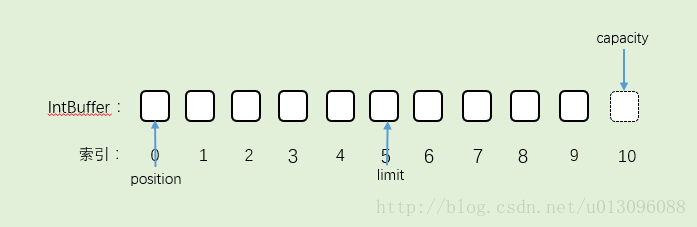

# 《netty权威指南》

## 基础篇

### javaIO的演进之路

#### I/O基础

##### Linux网络I/O模型简介：

> Linux的内核将所有外部设备都看做一个文件来操作，对一个文件的读写操作会调用内核提供的系统命令，返回一个file descriptor（fd，文件描述符）。而对一个socket的读写也会有相应的描述符，称为socketfd（socket描述符），描述符就是一个数字，它指向内核中的一个结构体（文件路径，数据区等一些属性）。

##### unix五种I/O模型

1. 阻塞I/O模型：
   > 缺省情形下，所有文件操作都是阻塞的。
   >
2. 非阻塞I/O模型：
   > 一般都对非阻塞I/O模型进行轮询检查这个状态，看内核是不是有数据到来。
   >
3. I/O复用模型：
   > Linux提供select/poll，进程通过将一个或多个fd传递给select或poll系统调用，阻塞在select操作上，这样select/poll可以帮我们侦测多个fd是否处于就绪状态。select/poll是顺序扫描fd是否就绪，而且支持的fd数量有限，因此它的使用受到了一些制约。Linux还提供了一个epoll系统调用，epoll使用基于事件驱动方式代替顺序扫描，因此性能更高。当有fd就绪时，立即回调函数rollback
   >
4. 信号驱动I/O模型：
   > 首先开启套接口信号驱动I/O功能，并通过系统调用sigaction执行一个信号处理函数（此系统调用立即返回，进程继续工作，它是非阻塞的）。当数据准备就绪时，就为该进程生成一个SIGIO信号，通过信号回调通知应用程序调用recvfrom来读取数据，并通知主循环函数处理数据
   >
5. 异步I/O：
   > 告知内核启动某个操作，并让内核在整个操作完成后（包括将数据从内核复制到用户自己的缓冲区）通知我们。这种模型与信号驱动模型的主要区别是：信号驱动I/O由内核通知我们何时可以开始一个I/O操作；异步I/O模型由内核通知我们I/O操作何时已经完成。
   >

##### I/O多路复用技术

> 当需要同时处理多个客户端接入请求时，可以利用多线程或者I/O多路复用技术进行处理。I/O多路复用技术通过把多个I/O的阻塞复用到同一个select的阻塞上，从而使得系统在单线程的情况下可以同时处理多个客户端请求。与传统的多线程/多进程模型比，I/O多路复用的最大优势是系统开销小，系统不需要创建新的额外进程或者线程，也不需要维护这些进程和线程的运行，降低了系统的维护工作量，节省了系统资源.
> Netty的多路复用器默认调用的模型是epoll模型。它除了JDK自带的epoll模型的封装，还额外封装了一套，它们都是epoll模型的封装，只是JDK的epoll模型是水平触发的，而Netty采用JNI重写的是边缘触发。

1. 应用场景：
   > 服务器需要同时处理多个处于监听状态或者多个连接状态的套接字；服务器需要同时处理多种网络协议的套接字。
   >
2. 目前支持I/O多路复用的系统调用有select、pselect、poll、epoll，在Linux网络编程过程中，很长一段时间都使用select做轮询和网络事件通知，然而select的一些固有缺陷导致了它的应用受到了很大的限制，最终Linux不得不在新的内核版本中寻找select的替代方案，最终选择了epoll。epoll与select的原理比较类似，为了克服select的缺点，epoll作了很多重大改进。
3. epoll重大改进
   1. 支持一个进程打开的socket描述符（FD）不受限制（仅受限于操作系统的最大文件句柄数）。

      > select最大的缺陷就是单个进程所打开的FD是有一定限制的，它由FD_SETSIZE设置，默认值是1024。对于那些需要支持上万个TCP连接的大型服务器来说显然太少了。可以选择修改这个宏然后重新编译内核，不过这会带来网络效率的下降。我们也可以通过选择多进程的方案（传统的Apache方案）解决这个问题，不过虽然在Linux上创建进程的代价比较小，但仍旧是不可忽视的，另外，进程间的数据交换非常麻烦，对于Java由于没有共享内存，需要通过Socket通信或者其他方式进行数据同步，这带来了额外的性能损耗，增加了程序复杂度，所以也不是一种完美的解决方案。值得庆幸的是，epoll并没有这个限制，它所支持的FD上限是操作系统的最大文件句柄数，这个数字远远大于1024。例如，在1GB内存的机器上大约是10万个句柄左右，具体的值可以通过cat /proc/sys/fs/file- max察看，通常情况下这个值跟系统的内存关系比较大。
      >
   2. I/O效率不会随着FD数目的增加而线性下降。

      > 传统的select/poll另一个致命弱点就是当你拥有一个很大的socket集合，由于网络延时或者链路空闲，任一时刻只有少部分的socket是“活跃”的，但是select/poll每次调用都会线性扫描全部的集合，导致效率呈现线性下降。epoll不存在这个问题，它只会对“活跃”的socket进行操作-这是因为在内核实现中epoll是根据每个fd上面的callback函数实现的，那么，只有“活跃”的socket才会主动的去调用callback函数，其他idle状态socket则不会。在这点上，epoll实现了一个伪AIO。针对epoll和select性能对比的benchmark测试表明：如果所有的socket都处于活跃态-例如一个高速LAN环境，epoll并不比select/poll效率高太多；相反，如果过多使用epoll_ctl，效率相比还有稍微的下降。但是一旦使用idleconnections模拟WAN环境，epoll的效率就远在select/poll之上了。
      >

      1. 支持一个进程打开的socket描述符（FD）不受限制（仅受限于操作系统的最大文件句柄数）。
         > select最大的缺陷就是单个进程所打开的FD是有一定限制的，它由FD_SETSIZE设置，默认值是1024。对于那些需要支持上万个TCP连接的大型服务器来说显然太少了。可以选择修改这个宏然后重新编译内核，不过这会带来网络效率的下降。我们也可以通过选择多进程的方案（传统的Apache方案）解决这个问题，不过虽然在Linux上创建进程的代价比较小，但仍旧是不可忽视的，另外，进程间的数据交换非常麻烦，对于Java由于没有共享内存，需要通过Socket通信或者其他方式进行数据同步，这带来了额外的性能损耗，增加了程序复杂度，所以也不是一种完美的解决方案。值得庆幸的是，epoll并没有这个限制，它所支持的FD上限是操作系统的最大文件句柄数，这个数字远远大于1024。例如，在1GB内存的机器上大约是10万个句柄左右，具体的值可以通过cat /proc/sys/fs/file- max察看，通常情况下这个值跟系统的内存关系比较大。
         >
      2. I/O效率不会随着FD数目的增加而线性下降。
         > 传统的select/poll另一个致命弱点就是当你拥有一个很大的socket集合，由于网络延时或者链路空闲，任一时刻只有少部分的socket是“活跃”的，但是select/poll每次调用都会线性扫描全部的集合，导致效率呈现线性下降。epoll不存在这个问题，它只会对“活跃”的socket进行操作-这是因为在内核实现中epoll是根据每个fd上面的callback函数实现的，那么，只有“活跃”的socket才会主动的去调用callback函数，其他idle状态socket则不会。在这点上，epoll实现了一个伪AIO。针对epoll和select性能对比的benchmark测试表明：如果所有的socket都处于活跃态-例如一个高速LAN环境，epoll并不比select/poll效率高太多；相反，如果过多使用epoll_ctl，效率相比还有稍微的下降。但是一旦使用idleconnections模拟WAN环境，epoll的效率就远在select/poll之上了
         >
      3. 使用mmap加速内核与用户空间的消息传递。
         > 无论是select，poll还是epoll都需要内核把FD消息通知给用户空间，如何避免不必要的内存复制就显得非常重要，epoll是通过内核和用户空间mmap同一块内存实现。
         >
      4. epoll的API更加简单。
         > 包括创建一个epoll描述符、添加监听事件、阻塞等待所监听的事件发生，关闭epoll描述符等。
         >

#### NIO入门

##### 传统BIO编程

> 采用BIO通信模型的服务端，通常由一个独立的Acceptor线程负责监听客户端的连接，它接收到客户端连接请求之后为每个客户端创建一个新的线程进行链路处理，处理完成之后，通过输出流返回应答给客户端，线程销毁。

##### 伪异步I/O模型

> 当有新的客户端接入的时候，将客户端的Socket封装成一个Task（该任务实现java.lang.Runnable接口）投递到后端的线程池中进行处理，JDK的线程池维护一个消息队列和N个活跃线程对消息队列中的任务进行处理。由于线程池可以设置消息队列的大小和最大线程数，因此，它的资源占用是可控的，无论多少个客户端并发访问，都不会导致资源的耗尽和宕机。

1. 缺点：

   > 当消息的接收方处理缓慢的时候，将不能及时地从TCP缓冲区读取数据，这将会导致发送方的TCP window size不断减小，直到为0，双方处于Keep-Alive状态，消息发送方将不能再向TCP缓冲区写入消息，这时如果采用的是同步阻塞I/O，write操作将会被无限期阻塞，直到TCP window size大于0或者发生I/O异常。
   >

   1. （1）服务端处理缓慢，返回应答消息耗费60s，平时只需要10ms。
   2. （2）采用伪异步I/O的线程正在读取故障服务节点的响应，由于读取输入流是阻塞的，因此，它将会被同步阻塞60s。
   3. （3）假如所有的可用线程都被故障服务器阻塞，那后续所有的I/O消息都将在队列中排队。
   4. （4）由于线程池采用阻塞队列实现，当队列积满之后，后续入队列的操作将被阻塞。
   5. （5）由于前端只有一个Accptor线程接收客户端接入，它被阻塞在线程池的同步阻塞队列之后，新的客户端请求消息将被拒绝，客户端会发生大量的连接超时。
   6. （6）由于几乎所有的连接都超时，调用者会认为系统已经崩溃，无法接收新的请求消息。

##### NIO编程

1. 缓冲区：
   > 在读取数据时，它是直接读到缓冲区中的；在写入数据时，写入到缓冲区中。任何时候访问NIO中的数据，都是通过缓冲区进行操作。
   > 缓冲区实质上是一个数组。通常它是一个字节数组（ByteBuffer），也可以使用其他种类的数组。但是一个缓冲区不仅仅是一个数组，缓冲区提供了对数据的结构化访问以及维护读写位置（limit）等信息。
   >
2. 通道channel：
   > Channel是一个通道，可以通过它读取和写入数据，它就像自来水管一样，网络数据通过Channel读取和写入。通道与流的不同之处在于通道是双向的，流只是在一个方向上移动（一个流必须是InputStream或者OutputStream的子类），而且通道可以用于读、写或者同时用于读写。
   >
3. 多路复用器Selector
   > elector会不断地轮询注册在其上的Channel，如果某个Channel上面有新的TCP连接接入、读和写事件，这个Channel就处于就绪状态，会被Selector轮询出来，然后通过SelectionKey可以获取就绪Channel的集合，进行后续的I/O操作。
   > 一个多路复用器Selector可以同时轮询多个Channel，由于JDK使用了epoll()代替传统的select实现，所以它并没有最大连接句柄1024/2048的限制。这也就意味着只需要一个线程负责Selector的轮询，就可以接入成千上万的客户端
   >
4. nio 服务端通讯序列图
   
5. Buffer是特定基本类型元素的线性有限序列。除内容外，Buffer区的基本属性还包括capacity(容量)、limit(限制)和position(位置)：
   1. capacity（容量）是它所包含的元素的数量。缓冲区的容量不能为负并且不能更改。
   2. limit（限制）是第一个不可读取或写入的元素的索引。缓冲区的限制不能为负，并且不能大于其容量。 缓冲区中的限制代表第一个不应该读取或写入元素的index（索引）。缓冲区的限制（limit）不能为负，并且limit不能大于其capacity。如果position大于新的limit，则将position设置为新的limit。如果mark已定义且大于新的limit，则丢弃该mark。
   3. position（位置）是下一个要读取或写入的元素的索引。缓冲区的位置不能为负，并且不能大于其限制。
   4. mark 标记
   5. 分配内存大小为10的缓存区。索引10的空间是我虚设出来，实际不存在，为了能明显表示capacity。IntBuffer的容量为10，所以capacity为10，在这里指向索引为10的空间。Buffer初始化的时候，limit和capacity指向同一索引。position指向0。
      
   6. 往Buffer里加一个数据。position位置移动，capacity不变，limit不变。
      
   7. Buffer读完之后，往bufer里写了5个数据，position指向索引为5的第6个数据，capacity不变，limit不变。
      
   8. 执行flip()，把position的值赋给limit,所以limit=5，然后position=0。capacity不变。结果就是：
      
   9. Buffer开始往外写数据。每写一个,position就下移一个位置，一直移到limit的位置，结束。
      
   10. ByteBuffer的api


       | 方法                             | 说明                                                                                                                        |
       | ---------------------------------- | ----------------------------------------------------------------------------------------------------------------------------- |
       | abstract Object	array()          | 返回支持此缓冲区的数组 （可选操作） 。                                                                                      |
       | abstract int	arrayOffset()       | 返回该缓冲区的缓冲区的第一个元素的背衬数组中的偏移量 （可选操作） 。                                                        |
       | int	capacity()                   | 返回此缓冲区的容量。                                                                                                        |
       | Buffer	clear()                   | 清除此缓冲区。 还原缓冲区到初始的状态，包含将位置设置为0，将限制设置为容量，并丢弃标记，即“一切为默认”                    |
       | Buffer	flip()                    | 翻转这个缓冲区。 limit变为position，position值归0，mark=-1                                                                  |
       | abstract boolean	hasArray()      | 告诉这个缓冲区是否由可访问的数组支持。  断此缓冲区是否具有可访问的底层实现数组。                                            |
       | boolean	hasRemaining()           | 告诉当前位置和极限之间是否存在任何元素 。                                                                                   |
       | abstract boolean	isDirect()      | 告诉这个缓冲区是否为 direct 。                                                                                              |
       | abstract boolean	isReadOnly()    | 告知这个缓冲区是否是只读的。                                                                                                |
       | int	limit()                      | 返回此缓冲区的限制。                                                                                                        |
       | Buffer	limit(int newLimit)       | 设置此缓冲区的限制。                                                                                                        |
       | Buffer	mark()                    | 将此缓冲区的标记设置在其位置。                                                                                              |
       | int	position()                   | 返回此缓冲区的位置。                                                                                                        |
       | Buffer	position(int newPosition) | 设置这个缓冲区的位置。                                                                                                      |
       | int	remaining()                  | 返回当前位置和限制之间的元素数。剩余空间大小获取                                                                            |
       | Buffer	reset()                   | 将此缓冲区的位置重置为先前标记的位置。                                                                                      |
       | Buffer	rewind()                  | 重绕此缓冲区，将位置设置为0并丢弃标记 “重新写入或获取”的操作之前调用此方法 标记清除，位置position值归0, limit不变 mark=-1 |


       1. rewind()方法的侧重点在“重新”，在重新读取、重新写入时可以使用；
       2. clear()方法的侧重点在“还原一切状态”；
       3. flip()方法的侧重点在substring截取。
   11. ByteBuffer类提供了6类操作:

       1. 1）以绝对位置和相对位置读写单个字节的get()和put()方法。
       2. 2）使用相对批量get(byte[] dst)方法可以将缓冲区中的连续字节传输到byte[] dst目标数组中。
       3. 3）使用相对批量put(byte[] src)方法可以将byte[]数组或其他字节缓冲区中的连续字节存储到此缓冲区中。
       4. 4）使用绝对和相对getType和putType方法可以按照字节顺序在字节序列中读写其他基本数据类型的值，方法getType和putType可以进行数据类型的自动转换。
       5. 5）提供了创建视图缓冲区的方法，这些方法允许将字节缓冲区视为包含其他基本类型值的缓冲区，这些方法有asCharBuffer()、asDoubleBuffer()、asFloatBuffer()、asIntBuffer()、asLongBuffer()和asShortBuffer()。
       6. 6）提供了对字节缓冲区进行压缩（compacting）、复制（duplicating）和截取（slicing）的方法。
       7. 字节缓冲区可以通过allocation()方法创建，此方法为缓冲区的内容分配空间，或者通过wrapping方法将现有的byte[]数组包装到缓冲区中来创建。
   12. 创建堆缓冲区与直接缓冲区

       1. allocateDirect()可以创建直接字节缓冲区,返回的缓冲区进行内存的分配和释放所需的时间成本通常要高于非直接缓冲区。直接缓冲区操作的数据不在JVM堆中，而是在内核空间中，根据这个结构可以分析出，直接缓冲区善于保存那些易受操作系统本机I/O操作影响的大量、长时间保存的数据。
       2. allocate(int capacity) 分配一个新的非直接字节缓冲区。新缓冲区的位置为零，其界限将为其容量，其标记是不确定的。它将具有一个底层实现数组，且其数组偏移量将为零。
   13. 包装wrap数据的处理

       1. wrap(byte[] array)方法的作用：将byte数组包装到缓冲区中。新的缓冲区将由给定的byte数组支持，也就是说，缓冲区修改将导致数组修改，反之亦然。新缓冲区的capacity和limit将为array.length，其位置position将为0，其标记mark是不确定的。其底层实现数组将为给定数组，并且其arrayOffset将为0。
       2. wrap(byte[] array, int offset, int length)方法的作用：将byte数组包装到缓冲区中。新的缓冲区将由给定的byte数组支持，也就是说，缓冲区修改将导致数组修改，反之亦然。新缓冲区的capacity将为array.length，其position将为offset，其limit将为offset + length，其标记是不确定的。其底层实现数组将为给定数组，并且其arrayOffset将为0。
          1. 1）array：缓冲区中关联的字节数组。
          2. 2）offset：设置位置（position）值，该值必须为非负且不大于array.length。
          3. 3）length：将新缓冲区的界限设置为offset + length，该值必须为非负且不大于array. length-offset。

       > 注意：wrap(byte[] array, int offset, int length)方法并不具有subString()方法截取的作用，它的参数offset只是设置缓冲区的position值，而length确定limit值。
       >
   14. Buffer类的每个子类都定义了两种get（读）和put（写）操作，分别对应相对位置操作和绝对位置操作。

       > abstract ByteBuffer put(byte b)方法的作用：使用相对位置的put()操作，将给定的字节写入此缓冲区的“当前位置”，然后该位置递增。
       > abstract byte get()方法的作用：使用相对位置的get()操作，读取此缓冲区“当前位置”的字节，然后该位置递增。
       >
   15. get()

       > 在执行相对位置读或写操作后，位置（position）呈递增的状态，位置自动移动到下一个位置上，也就是位置的值是++position的效果，以便进行下一次读或写操作。
       >
   16. slice()方法的作用：

       > 创建新的字节缓冲区，其内容是此缓冲区内容的共享子序列。新缓冲区的内容将从此缓冲区的当前位置开始。此缓冲区内容的更改在新缓冲区中是可见的，反之亦然；这两个缓冲区的位置、限制和标记值是相互独立的。新缓冲区的位置将为0，其容量和限制将为此缓冲区中所剩余的字节数量，其标记是不确定的。当且仅当此缓冲区为直接缓冲区时，新缓冲区才是直接缓冲区。当且仅当此缓冲区为只读时，新缓冲区才是只读的。
       >
6. FileChannel类
   1. AsynchronousChannel

      > AsynchronousChannel接口的主要作用是使通道支持异步I/O操作。异步I/O操作有以下两种方式进行实现。
      >

      1. Future<V> operation(...)operation代表I/O操作的名称，大多数都是读或写操作。泛型变量V代表经过I/O操作后返回结果的数据类型。使用Future对象可以用于检测I/O操作是否完成，或者等待完成，以及用于接收I/O操作处理后的结果。
      2. 回调 A类型的对象attachment的主要作用是让外部与CompletionHandler对象内部进行通信。使用CompletionHandler回调的方式实现异步I/O操作的优点是CompletionHandler对象可以被复用。当I/O操作成功或失败时，CompletionHandler对象中的指定方法会被调用。
   2. AsynchronousByteChannel

      > 接口的主要作用是使通道支持异步I/O操作，操作单位为字节。若在上一个read()方法未完成之前，再次调用read()方法，就会抛出异常ReadPending Exception。类似的，在上一个write()方法未完成之前再次调用write()方法时，也会抛出异常WritePendingException。其他类型的I/O操作是否可以同时进行read()操作，取决于通道的类型或实现。ByteBuffers类不是线程安全的，尽量保证在对其进行读写操作时，没有其他线程一同进行读写操作。
      >
   3. ReadableByteChannel

      > 接口的主要作用是使通道允许对字节进行读操作。ReadableByteChannel接口只允许有1个读操作在进行。如果1个线程正在1个通道上执行1个read()操作，那么任何试图发起另一个read()操作的线程都会被阻塞，直到第1个read()操作完成。其他类型的I/O操作是否可以与read()操作同时进行，取决于通道的类型。
      >
   4. ScatteringByteChannel

      > 接口的主要作用是可以从通道中读取字节到多个缓冲区中。
      >
   5. WritableByteChanne

      > 接口的主要作用是使通道允许对字节进行写操作。WritableByteChannel接口只允许有1个写操作在进行。如果1个线程正在1个通道上执行1个write()操作，那么任何试图发起另一个write()操作的线程都会被阻塞，直到第1个write()操作完成。其他类型的I/O操作是否可以与write()操作同时进行，取决于通道的类型。
      >
   6. GatheringByteChannel

      > 接口的主要作用是可以将多个缓冲区中的数据写入到通道中。
      >
   7. ByteChannel

      > 接口的主要作用是将ReadableByteChannel（可读字节通道）与WritableByte Channel（可写字节通道）的规范进行了统一，也就是ByteChannel接口的父接口就是ReadableByteChannel和WritableByteChannel。ByteChannel接口没有添加任何的新方法。ByteChannel接口的实现类就具有了读和写的方法，是双向的操作，而单独地实现ReadableByteChannel或WritableByteChannel接口就是单向的操作，因为实现类只能进行读操作，或者只能进行写操作。
      >
   8. SeekableByteChannel

      > 接口的主要作用是在字节通道中维护position（位置），以及允许position发生改变。
      >
   9. NetworkChannel

      > 接口的主要作用是使通道与Socket进行关联，使通道中的数据能在Socket技术上进行传输。该接口中的bind()方法用于将Socket绑定到本地地址，get LocalAddress()方法返回绑定到此Socket的SocketAddress对象，并可以结合setOption()和getOption()方法用于设置和查询Socket相关的选项。
      >
   10. MulticastChannel

       > MulticastChannel接口的主要作用是使通道支持Internet Protocol（IP）多播。IP多播就是将多个主机地址进行打包，形成一个组（group），然后将IP报文向这个组进行发送，也就相当于同时向多个主机传输数据。
       >
   11. InterruptibleChannel

       > 接口的主要作用是使通道能以异步的方式进行关闭与中断。
       >
   12. AbstractInterruptibleChannel:

       > 类的主要作用是提供了一个可以被中断的通道基本实现类。
       > 此类封装了能使通道实现异步关闭和中断所需要的最低级别的机制。在调用有可能无限期阻塞的I/O操作的之前和之后，通道类必须分别调用begin()和end()方法，为了确保始终能够调用end()方法，应该在try ... finally块中使用这些方法.
       >
   13. FileChannel类

       > 主要作用是读取、写入、映射和操作文件的通道。该通道永远是阻塞的操作。
       > 写支持多线程写，线程安全的
       > 读操作 方法是同步的
       >
   14. TCP 三次握手

       1. 客户端 发送SYN Seq自增序列
       2. 服务端 返回SYN ACK自增序列
       3. 客户端 发送ACK
          
   15. TCP 每次发送数据时都会向服务端发送 PSH(具体的数据) 和 ACK
   16. TCP 四次挥手

       1. 客户端 FIN 没有数据要发给你
       2. 服务端 ACK (表示收到,但是还没准备好，请继续你等我的消息,Client端就进入FIN_WAIT")
       3. 服务端 FIN (数据发完了，准备好关闭连接了)
       4. 客户端 ACK 断开连接 Client端进入TIME_WAIT状态，Client端等待了2MSL后依然没有收到回复，则证明Server端已正常关闭，Client端也可以关闭连接了
          
   17. Socket.close 但底层的Socket实际上并不会立即关闭，它会延迟一段时间。在延迟的时间里做什么呢？是将“发送缓冲区”中的剩余数据在延迟的时间内继续发送给对方，然后才会真正地关闭Socket连接。

       > public void setSoLinger(boolean on, int linger)方法的作用是启用/禁用具有指定逗留时间（以秒为单位）的SO_LINGER。最大超时值是特定于平台的。该设置仅影响套接字关闭。参数on的含义为是否逗留，参数linger的含义为逗留时间，单位为秒。
       > on传入true, linger等于0，当调用Socket的close()方法时，将立即中断连接，也就是彻底丢弃在缓冲区中未发送完的数据，并且发送一个RST标记给对方。此知识点是根据TCP中的SO_LINGER特性总结而来的。
       >
   18. Socket.sendUrgentData() 发送紧急信息，发送的信息不会写入缓存区，而是直接发送，服务端setOOBInline(boolean on) 为true才会接收到紧急信息，依赖此方法可实现心跳机制
   19. Socket选项KeepAlive 在创建了服务端与客户端时，使客户端连接上服务端。当设置SO_KEEPALIVE为true时，若对方在某个时间（时间取决于操作系统内核的设置）内没有发送任何数据过来，那么端点都会发送一个ACK探测包到对方，探测双方的TCP/IP连接是否有效（对方可能断电，断网）。如果不设置此选项，那么当客户端宕机时，服务端永远也不知道客户端宕机了，仍然保存这个失效的连接。如果设置了比选项，就会将此连接关闭。
   20. Socket选项TrafficClass
       IP规定了以下4种服务类型，用来定性地描述服务的质量。

       1. 1）IPTOS_LOWCOST（0x02）：发送成本低。
       2. 2）IPTOS_RELIABILITY（0x04）：高可靠性，保证把数据可靠地送到目的地。
       3. 3）IPTOS_THROUGHPUT（0x08）：最高吞吐量，一次可以接收或者发送大批量的数据。
       4. 4）IPTOS_LOWDELAY（0x10）：最小延迟，传输数据的速度快，把数据快速送达目的地。
   21. UDP（User Datagram Protocol，用户数据报协议）是一种面向无连接的传输层协议，提供不可靠的信息传送服务。无连接是指通信时服务端与客户端不需要建立连接，直接把数据包从一端发送到另一端，对方获取数据包再进行数据的处理。UDP是“不可靠的”，是指该协议在网络环境不好的情况下，会丢失数据包，因为没有数据包重传的功能，另外它也不提供对数据包进行分组、组装，以及不能对数据包进行排序，这些都是它和TCP最主要的区别。使用UDP发送报文后，是无法得知其是否安全，以及是否完整地到达目的地的。
   22. UDP 发送超大数据量的包导致数据截断的情况

       > 一个UDP包最大的长度为216- 1（65536 - 1 = 65535），因此，IP包最大的发送长度为65535。但是，在这65535之内包含IP协议头的20个字节，还有UDP协议头的8个字节，即65535 - 20 - 8 = 65507，因此，UDP传输用户数据最大的长度为65507。如果传输的数据大于65507，则在发送端出现异常
       >
   23. MulticastSocket 组播 使用joinGroup
   24. I/O多路复用

       > 线程数会随着通道的多少而动态地增减以进行适配，在内部其实并不永远是一个线程，多路复用的核心目的就是使用最少的线程去操作更多的通道。在JDK的源代码中，创建线程的个数是根据通道的数量来决定的，每注册1023个通道就创建1个新的线程，这些线程执行Windows中的select()方法来监测系统socket的事件，如果发生事件则通知应用层中的main线程终止阻塞，继续向下运行，处理事件。
       > 使用I/O多路复用时，这个线程不是以for循环的方式来判断每个通道是否有数据要进行处理，而是以操作系统底层作为“通知器”，来“通知JVM中的线程”哪个通道中的数据需要进行处理，这点一定要注意。当不使用for循环的方式来进行判断，而是使用通知的方式时，这就大大提高了程序运行的效率，不会出现无限期的for循环迭代空运行了。
       >
7. NIO Server
   
   1. Selector.open()
      1. 根据不同的操作系统创建不同的 SelectorProvider

         ```
         public static SelectorProvider create() {
                 String osname = AccessController
                     .doPrivileged(new GetPropertyAction("os.name"));
                 if (osname.equals("SunOS"))
                     return createProvider("sun.nio.ch.DevPollSelectorProvider");
                 if (osname.equals("Linux"))
                     return createProvider("sun.nio.ch.EPollSelectorProvider");
                 return new sun.nio.ch.PollSelectorProvider();
             }
         ```

##### TCP拆包/粘包问题

1. TCP粘包/拆包

   > TCP是个”流”协议，所谓流，就是没有界限的一串数据。大家可以想想河里的流水，它们是连成一片的，其间并没有分界线。TCP底层并不了解上层业务数据的具体含义，它会根据TCP缓冲区的实际情况进行包的划分，所以在业务上认为，一个完整的包可能会被TCP拆分成多个包进行发送，也有可能把多个小的包封装成一个大的数据包发送，这就是所谓的TCP粘包和拆包问题。
   >
2. TCP粘包/拆包发生的原因

   > 问题产生的原因有三个，如下：
   >

   1. 应用程序write写入的字节大小大于套接口发送缓冲区大小
   2. 进行MSS大小的TCP分段
   3. 以太网帧的payload大于MTU进行IP分片
3. 粘包问题的解决策略

   > 由于底层的TCP无法理解上层的业务数据，所以在底层是无法保证数据包不被拆分和重组的，这个问题只能通过上层的应用协议栈设计来解决，根据业界的主流协议的解决方案，可以归纳如下。
   >

   1. 消息定长，例如每个报文的大小固定长度200字节，如果不够，空位补空格
   2. 在包尾部增加回车换行符进行分割，例如FTP协议
   3. 定长报文
   4. 更复杂的应用层协议
4. LineBasedFrameDecoder和StringDecoder 用换行符解决粘包问题

   > LineBasedFrameDecoder的工作原理是它依次遍历ByteBuf中的可读字节，判断看是否有”\n”或者”\r\n”，如果有，就以此位置为结束位置，从可读索引到结束位置区间的字节就组成了一行。它是以换行符为结束标志的解码器，支持携带结束符或者不携带结束符两种解码方式，同时支持配置单行的最大长度。如果连续读取到最大长度后仍然没有发现换行符，就会抛出异常，同时忽略掉之前读到的异常码流。StringDecoder的功能非常简单，就是将接收到的对象转换成字符串，然后继续调用后面的Handler。LineBasedFrameDecoder+StringDecoder组合就是按行切换的文本解码器，它被设计用来支持TCP的粘包和拆包。
   >
5. 分隔符和定长解码器的应用

   1. TCP以流的方式进行数据传输，上层的应用协议为了对消息进行区分，往往采用如下4种方式。

      1. （1）消息长度固定，累计读取到长度总和为定长LEN的报文后，就认为读取到了一个完整的消息；将计数器置位，重新开始读取下一个数据报；
      2. （2）将回车换行符作为消息结束符，例如FTP协议，这种方式在文本协议中应用比较广泛；
      3. （3）将特殊的分隔符作为消息的结束标志，回车换行符就是一种特殊的结束分隔符；
      4. （4）通过在消息头中定义长度字段来标识消息的总长度。

      > Netty对上面4种应用做了统一的抽象，提供了4种解码器来解决对应的问题
      >
   2. DelimiterBasedFrameDecoder 自动完成以分隔符做结束标志的消息解码
   3. FixedLengthFrameDecoder 是固定长度解码器，它能够按照指定的长度对消息进行自动解码，开发者不需要考虑TCP的粘包/拆包问题。

## 中级篇

### 编解码技术

1. Java序列化的目的主要有两个

   1. 网络传输
   2. 对象持久化
2. java序列号的缺点

   1. 无法跨语言
   2. 序列化后的码流太大
   3. 序列化性能很差

   > JDK序列化机制编码后的二进制数组大小竟然是二进制编码的5.29倍
   >

### 业界主流的编译码框架

1. Google的Protobuf

   > 它将数据结构以.proto文件进行描述，通过代码生成工具可以生成对应数据结构的POJO对象和Protobuf相关的方法和属性。
   > 他的特点：
   >

   1. 结构化数据储存格式（xml，json）等
   2. 高效的编解码性能
   3. 语言无关，平台无关，扩展性好
   4. 官方支持java，c++和python三种语言
2. Facebook的Thrift

   > Thrift适用于静态的数据交换，需要先确定好它的数据结构，当数据结构发生变化时，必须重新编辑IDL文件，生成代码和编译，这一点跟其他IDL工具相比可以视为是Thrift的弱项。Thrift适用于搭建大型数据交换及存储的通用工具，对于大型系统中的内部数据传输，相对于JSON和XML在性能和传输大小上都有明显的优势。
   > Thrift主要由5部分组成
   >

   1. 语言系统以及IDL编译器，负责由用户给定的IDL文件生成相应的语言接口代码
   2. TProtocol:RPC的协议层，可以选择多种不同的对象序列化方式，如json和Binary
   3. TTransport：RPC的传输层，同样可以选择不同的传输层实现，如socket，NIO，MemoryBuffer等
   4. TProcessor：作为协议层和用户提供的服务实现之间的纽带，负责调用服务实现的接口
   5. Tserver 聚合TProtocol,TTransport和TProcessor等对象

   > 与Protobuf比较类似的是，Thrift通过IDL描述接口和数据结构定义，它支持8种Java基本类型、Map、Set和List，支持可选和必选定义，功能非常强大。因为可以定义数据结构中字段的顺序，所以它也可以支持协议的前向兼容。
   > Thrift支持三种比较典型的编解码方式。
   >

   6. 通用的二进制编解码
   7. 压缩二进制编解码
   8. 优化的可选字段压缩编解码
3. JBoss Marshalling

   > 是一个Java对象的序列化API包，修正了JDK自带的序列化包的很多问题，但又保持跟java.io.Serializable接口的兼容。同时，增加了一些可调的参数和附加的特性，并且这些参数和特性可通过工厂类进行配置。
   > 相比较传统的java序列化机制，他的优点如下:
   >

   1. 可插拔的类解析器，提供更加便捷的类加载定制策略，通过一个接口即可实现定制；
   2. 可插拔的对象替换技术，不需要通过继承的方式；
   3. 可插拔的预定义类缓存表，可以减小序列化的字节数组长度，提升常用类型的对象序列化性能；
      1. 无须实现java.io.Serializable接  m 、
      2. 口，即可实现Java序列化；
      3. 】、'
   4. 通过缓存技术提升对象的序列化性能。

   > 相比于前面介绍的两种编解码框架，JBossMarshalling更多是在JBoss内部使用，应用范围有限。
   >

### MessagePack编解码

> MessagePack是一个高效的二进制序列化框架，它像JSON一样支持不同语言间的数据交换，但是它的性能更快，序列化之后的码流也更小。

1. 多语言支持
   > ，官方支持的语言如下：Java、Python、Ruby、Haskell、C＃、OCaml、Lua、Go、C、C++等
   >

## 中级

### 协议

1. HTTP协议特点：

   1. 支持Client/Server模式；
   2. 简单-客户向服务器请求服务时，只需指定服务URL，携带必要的请求参数或者消息体
   3. 灵活-HTTP允许传输任意类型的数据对象，传输的内容由HTTP消息头中的Content-Type加以标记
   4. 无状态-HTTP协议是无状态协议，无状态是指协议对于事务处理没有记忆能力。缺少状态意味着如果后续处理需要之前的信息，则它必须重传，这样可能导致每次连接传送的数据量增大。另一方面，在服务器不需要先前信息时它的应答就较快，负载较轻。
2. HTTP请求组成部分：

   1. 请求头
   2. 消息头
   3. 请求正文

   > 请求行以一个方法符开头，以空格分开，后面跟着请求的URI和协议的版本，格式为：MethodRequestURIHTTPVersionCRLF。其中Method表示请求方法，RequestURI是一个统一资源标识符，HTTPVersion表示请求的HTTP协议版本，CRLF表示回车和换行（除了作为结尾的CRLF外，不允许出现单独的CR或LF字符）。
   >
3. HTTP协议的弊端

   1. HTTP协议为半双工协议。半双工协议指数据可以在客户端和服务端两个方向上传输，但是不能同时传输。它意味着在同一时刻，只有一个方向上的数据传送；
   2. HTTP消息冗长而繁琐。HTTP消息包含消息头、消息体、换行符等，通常情况下采用文本方式传输，相比于其他的二进制通信协议，冗长而繁琐；
   3. 针对服务器推送的黑客攻击。例如长时间轮询。
4. WebSocket

   > 在WebSocketAPI中，浏览器和服务器只需要做一个握手的动作，然后，浏览器和服务器之间就形成了一条快速通道，两者就可以直接互相传送数据了。WebSocket基于TCP双向全双工进行消息传递，在同一时刻，既可以发送消息，也可以接收消息，相比HTTP的半双工协议，性能得到很大提升。
   >

   1. 单一的TCP连接，采用全双工模式通信；
   2. 对代理、防火墙和路由器透明；
   3. 无头部信息、Cookie和身份验证；
   4. 无安全开销；◎通过”ping/pong”帧保持链路激活；
   5. 服务器可以主动传递消息给客户端，不再需要客户端轮询。

### 私有协议开发

1. 可靠性设计
   1. 心跳机制

      1. （1）当网络处于空闲状态持续时间达到T（连续周期T没有读写消息）时，客户端主动发送Ping心跳消息给服务端。
      2. （2）如果在下一个周期T到来时客户端没有收到对方发送的Pong心跳应答消息或者读取到服务端发送的其他业务消息，则心跳失败计数器加1。
      3. （3）每当客户端接收到服务的业务消息或者Pong应答消息时，将心跳失败计数器清零；连续N次没有接收到服务端的Pong消息或者业务消息，则关闭链路，间隔INTERVAL时间后发起重连操作。
      4. （4）服务端网络空闲状态持续时间达到T后，服务端将心跳失败计数器加1；只要接收到客户端发送的Ping消息或者其他业务消息，计数器清零。
      5. （5）服务端连续N次没有接收到客户端的Ping消息或者其他业务消息，则关闭链路，释放资源，等待客户端重连。

      > 通过PingPong双向心跳机制，可以保证无论通信哪一方出现网络故障，都能被及时地检测出来。为了防止由于对方短时间内繁忙没有及时返回应答造成的误判，只有连续N次心跳检测都失败才认定链路已经损害，需要关闭链路并重建链路。当读或者写心跳消息发生I/O异常的时候，说明链路已经中断，此时需要立即关闭链路，如果是客户端，需要重新发起连接。如果是服务端，需要清空缓存的半包信息，等待客户端重连。
      >
   2. 重连机制

      > 如果链路中断，等待INTERVAL时间后，由客户端发起重连操作，如果重连失败，间隔周期INTERVAL后再次发起重连，直到重连成功。为了保证服务端能够有充足的时间释放句柄资源，在首次断连时客户端需要等待INTERVAL时间之后再发起重连，而不是失败后就立即重连。为了保证句柄资源能够及时释放，无论什么场景下的重连失败，客户端都必须保证自身的资源被及时释放，包括但不限于SocketChannel、Socket等。重连失败后，需要打印异常堆栈信息，方便后续的问题定位。
      >
   3. 重复登录保护

      > 当客户端握手成功之后，在链路处于正常状态下，不允许客户端重复登录，以防止客户端在异常状态下反复重连导致句柄资源被耗尽。服务端接收到客户端的握手请求消息之后，首先对IP地址进行合法性检验，如果校验成功，在缓存的地址表中查看客户端是否已经登录，如果已经登录，则拒绝重复登录，返回错误码1，同时关闭TCP链路，并在服务端的日志中打印握手失败的原因。客户端接收到握手失败的应答消息之后，关闭客户端的TCP连接，等待INTERVAL时间之后，再次发起TCP连接，直到认证成功。为了防止由服务端和客户端对链路状态理解不一致导致的客户端无法握手成功的问题，当服务端连续N次心跳超时之后需要主动关闭链路，清空该客户端的地址缓存信息，以保证后续该客户端可以重连成功，防止被重复登录保护机制拒绝掉。
      >
   4. 消息缓存重发

      > 无论客户端还是服务端，当发生链路中断之后，在链路恢复之前，缓存在消息队列中待发送的消息不能丢失，等链路恢复之后，重新发送这些消息，保证链路中断期间消息不丢失。考虑到内存溢出的风险，建议消息缓存队列设置上限，当达到上限之后，应该拒绝继续向该队列添加新的消息。
      >
2. 安全性设计
   > 为了保证整个集群环境的安全，内部长连接采用基于IP地址的安全认证机制，服务端对握手请求消息的IP地址进行合法性校验：如果在白名单之内，则校验通过；否则，拒绝对方连接。如果将Netty协议栈放到公网中使用，需要采用更加严格的安全认证机制，例如基于密钥和AES加密的用户名+密码认证机制，也可以采用SSL/TSL安全传输。作为示例程序，Netty协议栈采用最简单的基于IP地址的白名单安全认证机制。
   >
3. 可扩展性设计
   > Netty协议需要具备一定的扩展能力，业务可以在消息头中自定义业务域字段，例如消息流水号、业务自定义消息头等。通过Netty消息头中的可选附件attachment字段，业务可以方便地进行自定义扩展。Netty协议栈架构需要具备一定的扩展能力，例如统一的消息拦截、接口日志、安全、加解密等可以被方便地添加和删除，不需要修改之前的逻辑代码，类似Servlet的FilterChain和AOP，但考虑到性能因素，不推荐通过AOP来实现功能的扩展。
   >
4. netty时序图
   
   1. 创建ServerBootstap实例，ServerBootstap是netty的启动辅助类。
   2. 设置绑定Reactor线程池，Netty的Reactor线程池是EventLoopGroup，它实际上就是EventLoop数组，EventLoop的职责是处理所有注册到本线程多路复用器Selector上的Channel，Selector的轮训操作由绑定的EventLoop线程run方法驱动，在一个循环体内循环执行。值得说明的是，EventLoop的职责不仅仅是处理网络I/O事件，用户自定义的Task和定时任务Task也统一由EventLoop负责处理，这样线程模型就实现了统一。从调度层面看，也不存在从EventLoop线程中再启动其他类型的线程用于异步执行另外的任务，这样就避免了多线程并发操作和锁竞争，提升了I/O线程的处理和调度性能。
   3. 设置并绑定服务channel，Netty的ServerBootstrap方法提供了channel方法用于指定服务端Channel的类型。Netty通过工厂类，利用反射创建NioServerSocketChannel对象。由于服务端监听端口往往只需要在系统启动时才会调用，因此反射对性能的影响并不大。
   4. 链路建立的时候创建并初始化channelPipeline。channelPipeline并不是NIO服务端必须的。他本质就是一个负责处理网络事件的责任链，负责管理和执行ChannelHandler。网络以事件流的形式在ChannelPipeline中流转，由ChannelPipeline根据ChannelHandler的执行策略调度ChannelHandler的执行，典型的网络事件如下：
      1. 链路注册
      2. 链路激活
      3. 链路断开
      4. 接到请求消息
      5. 请求消息接收并处理完毕
      6. 发送应答消息
      7. 链路发生异常
      8. 发生用户自定义事件
   5. 初始化ChannelPipeline完成之后，添加并设置ChannelHandler。ChannelHandler是netty提供给用户定制和扩展的关键接口。netty提供比较实用的Channelhandler如下
      1. 系统编解码框架-ByteToMessageCodec
      2. 通用基于长度的半包解析器-LengthFieldBasedFrameDecoder
      3. 码流日志打印Handler-LoggingHandler
      4. SSL安全认证Handler-SslHandler
      5. 链路空闲检测Handler-IdleStateHandler
      6. 流量整形Handler-ChannelTrafficShapingHandler
      7. Base64编解码Base64Decoder和Base64Encoder
   6. 绑定并启动监听端口
   7. Selector轮询，由Reactor线程NioEventLoop负责调度和执行Selector轮询操作，选择准备就绪的channel集合
   8. 当轮询到准备就绪的channel之后，就由Reactor线程NioEventLoop执行ChannelPipline的相应方法。最终调度并执行ChannelHandler
   9. 执行netty系统ChannelHandler和用户添加定制的channelHandler。ChannelPipline根据网络事件的类型，调度并执行ChannelHandler
5. Netty主要tcp参数如下(option)
   1. SO_TIMEOUT:控制读取操作将阻塞多少毫秒，如果返回值为0，计时器就被禁止了，该线程将无限期阻塞
   2. SO_SNDBUF:套接字使用的发送缓冲区大小
   3. SO_RCVBUF:套接字使用的接收区缓冲区大小
   4. SO_REUSEADDR:用于决定如果网络上仍然有数据向旧的ServerSocket传输数据，是否允许新的ServerSocket绑定到与旧的ServerSocket同样的端口上。SO_REUSEADDR选项的默认值与操作系统有关，在某些操作系统中，允许重用端口，而在某些操作系统中不允许重用端口；
   5. CONNECT_TIMEOUT_MILLS:客户端连接超时时间，由于NIO原生的客户端并不提供设置连接超时的接口，因此，Netty采用的是自定义连接超时定时器负责检测和超时控制
   6. TCP_NODELAY:激活禁止TCP_NODELAY套接字选项，它决定是否使用Nagle算法，如果是时延敏感型应用，建议关闭

## 高级

### ByteBuf

> ByteBuf通过两个位置指针来协助缓冲区的读写操作，读操作使用readerIndex，写操作使用writerIndex。readerIndex和writerIndex的取值一开始都是0，随着数据的写入writerIndex会增加，读取数据会使readerIndex增加，但是它不会超过writerIndex。在读取之后，0～readerIndex就被视为discard的，调用discardReadBytes方法，可以释放这部分空间，它的作用类似ByteBuffer的compact方法。ReaderIndex和writerIndex之间的数据是可读取的，等价于ByteBufferposition和limit之间的数据。WriterIndex和capacity之间的空间是可写的，等价于ByteBufferlimit和capacity之间的可用空间。由于写操作不修改readerIndex指针，读操作不修改writerIndex指针，因此读写之间不再需要调整位置指针，这极大地简化了缓冲区的读写操作，避免了由于遗漏或者不熟悉flip（）操作导致的功能异常。
> 为了防止ByteBuffer溢出，每进行一次put操作，都需要对可用空间进行校验，这导致了代码冗余，稍有不慎，就可能引入其他问题。为了解决这个问题，ByteBuf对write操作进行了封装，由ByteBuf的write操作负责进行剩余可用空间的校验。如果可用缓冲区不足，ByteBuf会自动进行动态扩展。对于使用者而言，不需要关心底层的校验和扩展细节，只要不超过设置的最大缓冲区容量即可。当可用空间不足时，ByteBuf会帮助我们实现自动扩展，这极大地降低了ByteBuf的学习和使用成本，提升了开发效率。

#### ByteBuf 主要功能

1. 顺序读操作（read）：ByteBuf的read操作类似于ByteBuffer的get操作，主要api如下


| 方法名称                                        | 返回值  | 功能说明                                                                                                                                                                                                                                                                                                                                                                                                                                                                                                                                                                                                            |
| ------------------------------------------------- | --------- | --------------------------------------------------------------------------------------------------------------------------------------------------------------------------------------------------------------------------------------------------------------------------------------------------------------------------------------------------------------------------------------------------------------------------------------------------------------------------------------------------------------------------------------------------------------------------------------------------------------------- |
| readBoolean                                     | boolean | 从readIndex开始获取boolean值，readIndex增加1                                                                                                                                                                                                                                                                                                                                                                                                                                                                                                                                                                        |
| readByte                                        | byte    | 从readIndex开始获取字节值，readIndex增加1                                                                                                                                                                                                                                                                                                                                                                                                                                                                                                                                                                           |
| readUnsignedByte                                | byte    | 从readIndex开始获取无符号字节值，readIndex增加1                                                                                                                                                                                                                                                                                                                                                                                                                                                                                                                                                                     |
| readShort                                       | short   | 从readIndex开始获取短整型值，readIndex增加2                                                                                                                                                                                                                                                                                                                                                                                                                                                                                                                                                                         |
| readUnsignedShort                               | short   | 从readIndex开始获取无符号短整型值，readIndex增加2                                                                                                                                                                                                                                                                                                                                                                                                                                                                                                                                                                   |
| readMedium                                      | int     | 从readIndex开始获取24位整型值，readIndex增加3（该类型并非java的基本类型，大多数场景使用不到）                                                                                                                                                                                                                                                                                                                                                                                                                                                                                                                       |
| readUnsignedMedium                              | int     | 从readIndex开始获取24位无符号整型值，readIndex增加3（该类型并非java的基本类型，大多数场景使用不到）                                                                                                                                                                                                                                                                                                                                                                                                                                                                                                                 |
| readInt                                         | int     | 从readIndex开始获取整型值，readIndex增加4                                                                                                                                                                                                                                                                                                                                                                                                                                                                                                                                                                           |
| readLong                                        | long    | 从readIndex开始获取长整型值，readIndex增加8                                                                                                                                                                                                                                                                                                                                                                                                                                                                                                                                                                         |
| readChar                                        | char    | 从readIndex开始获取字符值，readIndex增加2                                                                                                                                                                                                                                                                                                                                                                                                                                                                                                                                                                           |
| readFloat                                       | float   | 从readIndex开始获取无符号短整型值，readIndex增加4                                                                                                                                                                                                                                                                                                                                                                                                                                                                                                                                                                   |
| readDouble                                      | double  | 从readIndex开始获取双精度浮点值，readIndex增加8                                                                                                                                                                                                                                                                                                                                                                                                                                                                                                                                                                     |
| readBytes(int length)                           | ByteBuf | 将当前ByteBuf中的数据读取到新创建的ByteBuf中，读取的长度为length，操作成功完成之后，返回的ByteBuf的ReaderIndex为0，writerIndex为length，如果读取的长度length大于当前操作的ByteBuffer 的可写字节数，将抛出IndexOutOfBoundsException                                                                                                                                                                                                                                                                                                                                                                                  |
| readSlice(int length)                           | ByteBuf | 返回当前ByteBuf新创建的子区域，子区域于原ByteBuf共享缓冲区，但是独立维护自己的readerIndex和writerIndex，新创建的子区域readerIndex为0，writerIndex为length，如果读取的长度length大于当前操作的ByteBuf的可写字节数，将抛出IndexOutOfBoundsException                                                                                                                                                                                                                                                                                                                                                                   |
| readBytes(ByteBuf dst)                          | ByteBuf | 将当前ByteBuf中的数据读取到目标ByteBuf中，直到目标ByteBuf没有剩余的空间可写，操作成功完成之后，当前ByteBuf的readerIndex+=读取的字节数，如果目标ByteBuf可写的字节数大于当前ByteBuf可读取的字节数，则抛出IndexOutOfBoundsException，操作失败                                                                                                                                                                                                                                                                                                                                                                          |
| readBytes(ByteBuf dst，int length)              | ByteBuf | 将当前ByteBuf中的数据读取到到目标ByteBuf中，读取的长度为length，操作成功完成之后，当前ByteBuf的readerIndex+=length，如果目标ByteBuf可写的字节数length大于当前ByteBuf可读取的字节数，则抛出IndexOutOfBoundsException，操作失败                                                                                                                                                                                                                                                                                                                                                                                       |
| readBytes(ByteBuf dst，int dstIndex,int length) | ByteBuf | 将当前ByteBuf中的数据读取到目标ByteBuf中，读取的字节数长度为length，目标ByteBuf的起始索引为dstIndex，非writerIndex，操作完成之后，当前ByteBuf的readerIndex+=length，如果需要读取的字节数长度大于当前ByteBuf可读字节数，或者dstIndex大于0，或者dstIndex+length大于目标ByteBuf的capacity则抛出IndexOutOfBoundsException异常                                                                                                                                                                                                                                                                                           |
| readBytes(byte[] dst)                           | ByteBuf | 将当前ByteBuf中的数据读取到目标byte中，读取的长度为dst.length，操作成功完成之后，当前ByteBuf的readerIndex+=dst.length，如果目标字节数组的长度大于当前ByteBuf可读字节数，则抛出IndexOutOfBoundsException，操作失败                                                                                                                                                                                                                                                                                                                                                                                                   |
| readBytes(byte[] dst,int dstIndex,int length)   | ByteBuf | 将当前ByteBuf中的数据读取到目标byte中，读取的长度为length，目标字节数组的起始索引为dstIndex，如果dstIndex小于0，或者length大于当前ByteBuf的可读字节数，或者dstIndex+length大约dst。length则抛出IndexOutOfBoundsException，操作失败                                                                                                                                                                                                                                                                                                                                                                                  |
| readBytes(ByteBuffer dst)                       | ByteBuf | 将当前ByteBuf中的数据读取到目标ByteBuffer中，直到位置指针到达ByteBuffer的limit，操作成功完成之后，当前ByteBuf的readerIndex+=dst.remaining()，如果目标ByteBuffer可写的字节数大于当前ByteBuf可读取的字节数，则抛出IndexOutOfBoundsException，操作失败                                                                                                                                                                                                                                                                                                                                                                 |
| readBytes(OutputStream out,int length)          | ByteBuf | 将当前ByteBuf的数据读取到目标输出流中，读取的字节数长度为length，如果操作成功，当前ByteBuf的readerIndex+=length，如果length大于当前ByteBuf可读取的字节数，则抛出IndexOutOfBoundsException，操作失败，如果读取过程中，OutputStream自身发送了I/O异常，则抛出IOException                                                                                                                                                                                                                                                                                                                                               |
| readBytes(GatheringByteChannel out，int length) | int     | 将当前ByteBuf的数据写入目标GatheringByteChannel中，写入的最大字节数长度为length，注意：由于GatheringByteChannel是非阻塞channel，调用它的write操作并不能保证一次能够将所有需要写入的字节数都写入成功，即存在"写半包"问题，因此，它写入的字节数范围为【0，length】，如果操作成功，当前ByteBuf的readerIndex+=实际写入的字节数，如果需要写入的length大于当前ByteBuf的可读字节数，则抛出IndexOutOfBoundsException，如果操作过程中GatheringByteChannel发生了I/O异常，则抛出IOException，无论抛出何种异常，操作都将失败。与其他read方法不同的是，本方法的返回值不是当前的ByteBuf，而是写入GatheringByteChannel的实际字节数 |

3. 顺序写操作（write）：ByteBuf的write操作类似于ByteBuffer的put操作，主要的API功能


| 方法名称                                          | 返回值  | 功能说明                                                                                                                                                                                                                                                                                                                                               |
| --------------------------------------------------- | --------- | -------------------------------------------------------------------------------------------------------------------------------------------------------------------------------------------------------------------------------------------------------------------------------------------------------------------------------------------------------- |
| writeBoolean（boolean value）                     | ByteBuf | 将参数 value 写入到当前的 ByteBuf 中操作成功之后 writerIndex+=1 如果当前 ByteBuf 可写的学节数小于1，则抛出 IndexOutOfBoundsExeption ，操作失败                                                                                                                                                                                                         |
| writeByte(int value)                              | ByteBuf | 将参数value写入到当前的ByteBuf中 操作成功之后writerIndex+=1 如果当前ByteBuf可写的字节数小于1，则抛出 IndexOutOfBoundsException，操作失败                                                                                                                                                                                                               |
| writeShort(int value)                             | ByteBuf | 将参数value写入到当前的ByteBuf中 操作成功之后writerIndex+=2 如果当前ByteBuf可写的字节数小于2，则抛出 IndexOutOfBoundsException，操作失败                                                                                                                                                                                                               |
| writeMedium(int value)                            | ByteBuf | 将参数value写入到当前的ByteBuf中 操作成功之后writerIndex+=3 如果当前ByteBuf可写的字节数小于3，则抛出 IndexOutOfBoundsException，操作失败                                                                                                                                                                                                               |
| writelnt(int value)                               | ByteBuf | 将参数value写入到当前的ByteBuf中 操作成功之后writerIndex+-4 如果当前ByteBuf可写的字节数小于4，则抛出IndexOutOfBoundsException， 操作失败                                                                                                                                                                                                               |
| writeLong(long value)                             | ByteBuf | 将参数value写入到当前的ByteBuf中 操作成功之后writerIndex+=8 如果当前ByteBuf可写的字节数小于8，则抛出 IndexOutOfBoundsException，操作失败                                                                                                                                                                                                               |
| writeChar(int value)                              | ByteBuf | 将参数value写入到当前的ByteBuf中操作成功之后writerIndex+=2  如果当前ByteBuf可写的字节数小于2，则抛出 IndexOutOfBoundsException，操作失败                                                                                                                                                                                                               |
| writeBytes(ByteBuf src)                           | ByteBuf | 将源ByteBuf src中的所有可读字节写入到当前ByteBuf中 操作成功之后当前ByteBuf 的writerIndex+= sre.readableBytes 如果源ByteBuf sre可读的字节数大于当前ByteBuf的可写字 节数，则抛出IndexOutOfBoundsException，操作失败                                                                                                                                      |
| writeBytes(ByteBuf src, int length)               | ByteBuf | 将源ByteBuf sre中的可读字节写入到当前ByteBuf中,写入 的字节数长度为length 操作成功之后当前ByteBuf的writerIndex+= length 如果length大于源ByteBuf的可读字节数或者当前ByteBuf 的可写字节数，则抛出IndexOutOfBoundsException,操作失败                                                                                                                       |
| writeBytes(ByteBuf src, int srcIndex,int length)  | ByteBuf | 将源ByteBuf sre中的可读字节写入到当前ByteBuf中,写入的字节数长度为length，起始索引为srcIndex操作成功之后当前ByteBuf的writerIndex+= length 如果srcIndex小于0，或者srcIndex + length大于源sre的容量;或者写入长度length 大于当前ByteBuf的可写字节数，则抛出IndexOutOfBoundsException，操作失败                                                             |
| writeBytes(byte[] src)                            | ByteBuf | 将源字节数组sre中的所有字节写入到当前ByteBuf中操作成功之后当前ByteBuf的writerIndex+= src.length如果源字节数组src的长度大于当前ByteBuf的可写字节数，则抛出IndexOutOfBoundsException，操作失败                                                                                                                                                           |
| writeBytes(byte[] sre, int srcIndex,int length)   | ByteBuf | 将源字节数组src中的字节写入到当前ByteBuf中，写入的字节数长度为length,起始索引为srcIndex操作成功之后当前ByteBuf的writerIndex+- length如果srcIndex小于0,或者srcIndex + length大于源sre的容量:或者写入长度length大于当前ByteBuf的可写字节数，则抛出IndexOutOfBoundsException，操作失败                                                                    |
| writeBytes(ByteBuffer sre)                        | ByteBuf | 将源ByteBuffersre中所有可读字节写入到当前ByteBuf中,写入的长度为src.remainingO操作成功之后当前ByteBuf的writerIndex += src.remainingO如果源ByteBuffer sre 的可读字节数大于当前ByteBuf的可写字节数，则抛出IndexOutOfBoundsException，操作失败                                                                                                             |
| writeBytes(InputStream in, int length)            | int     | 将源InputStream sre中的内容写入到当前ByteBuf中，写入的最大字节数长度为length实际写入的字节数可能小于length操作成功之后当前ByteBuf的writerIndex+= 实际写入的字节数如果length大于源ByteBuf的可读字节数或者当前ByteBuf的可写字节数，则抛出IndexOutOfBoundsException, 操作失败如果从InputStream 读取的时候发生了I/O 异常，则抛出IOException                |
| writeBytes( ScatteringByteChannel in, int length) | int     | 将源ScatteringByteChannel sre中的内容写入到当前ByteBuf中，写入的最大字节数长度为length实际写入的字节数可能小于length操作成功之后当前ByteBuf的writerIndex+=实际写入的字节数如果length 大于源sre 的可读字节数或者当前ByteBuf的可写字节数，则抛出IndexOutOfBoundsException，操作失败如果从ScatteringByteChannel读取的时候发生了I/O异常，则拋出IOException |
| writeZero(int length)                             | ByteBuf | 将当前的缓冲区内容填充为NUL (0x00)， 起始位置为writerIndex，填充的长度为length填充成功之后writerIndex+= length如果length大于当前ByteBuf的可写字节数则抛出IndexOutOfBoundsException操作失败                                                                                                                                                             |

4. readerIndex和writerIndex

   > netty提供了两个指针变量用于支持顺序读取和写入操作，readerIndex用于标识读取索引，writerIndex用于标识写入索引，两个指针位置将BufferBuf缓冲区分割成三个区域
   > 
   >
5. Discardable bytes

   > 调用discardReadBytes操作来重用这部分空间，以节约内存，防止ByteBuf的动态扩张。这在私有协议栈消息解码的时候非常有用，因为TCP底层可能粘包，几百个整包消息被TCP粘包后作为一个整包发送。这样，通过discardReadBytes操作可以重用之前已经解码过的缓冲区，从而防止接收缓冲区因为容量不足导致的扩张。但是，discardReadBytes操作是把双刃剑
   > 调用discardReadBytes会发生字节数组的内存复制，所以，频繁调用将会导致性能下降，因此在调用它之前要确认你确实需要这样做，例如牺牲性能来换取更多的可用内存。
   >
6. clear 操作

   > 正如JDKByteBuffer的clear操作，它并不会清空缓冲区内容本身，例如填充为NUL（0x00）。它主要用来操作位置指针，例如position、limit和mark。对于ByteBuf，它也是用来操作readerIndex和writerIndex，将它们还原为初始分配值。
   >
7. 查找操作

   > ByteBuf提供了多种查找方法用于满足不同的应用场景
   >

   1. （1）indexOf（intfromIndex，inttoIndex，bytevalue）：从当前ByteBuf中定位出首次出现value的位置。起始索引为fromIndex，终点是toIndex。如果没有查找到则返回1，否则返回第一条满足搜索条件的位置索引。
   2. （2）bytesBefore（bytevalue）：从当前ByteBuf中定位出首次出现value的位置。起始索引为readerIndex，终点是writerIndex。如果没有查找到则返回1，否则返回第一条满足搜索条件的位置索引。该方法不会修改readerIndex和writerIndex。
   3. （3）bytesBefore（intlength，bytevalue）：从当前ByteBuf中定位出首次出现value的位置。起始索引为readerIndex，终点是readerIndex+length。如果没有查找到则返回1，否则返回第一条满足搜索条件的位置索引。如果length大于当前字节缓冲区的可读字节数，则抛出IndexOutOfBoundsException异常。
   4. （4）bytesBefore（intindex，intlength，bytevalue）：从当前ByteBuf中定位出首次出现value的位置。起始索引为index，终点是index+length。如果没有查找到则返回1，否则返回第一条满足搜索条件的位置索引。如果index+length大于当前字节缓冲区的容量，则抛出IndexOutOfBoundsException异常。
   5. （5）forEachByte（ByteBufProcessorprocessor）：遍历当前ByteBuf的可读字节数组，与ByteBufProcessor设置的查找条件进行对比。如果满足条件，则返回位置索引，否则返回1。
   6. （6）forEachByte（intindex，intlength，ByteBufProcessorprocessor）：以index为起始位置，index+length为终止位置进行遍历，与ByteBufProcessor设置的查找条件进行对比。如果满足条件，则返回位置索引，否则返回1。
   7. （7）forEachByteDesc（ByteBufProcessorprocessor）：遍历当前ByteBuf的可读字节数组，与ByteBufProcessor设置的查找条件进行对比。如果满足条件，则返回位置索引，否则返回1。注意对字节数组进行迭代的时候采用逆序的方式，也就是从writerIndex1开始迭代，直到readerIndex。
   8. （8）forEachByteDesc（intindex，intlength，ByteBufProcessorprocessor）：以index为起始位置，index+length为终止位置进行遍历，与ByteBufProcessor设置的查找条件进行对比。如果满足条件，则返回位置索引，否则返回1。采用逆序查找的方式，从index+length1开始，直到index。

   > 对于查找的字节而言，存在一些常用值，例如回车换行符、常用的分隔符等，Netty为了减少业务的重复定义，在ByteBufProcessor接口中对这些常用的查找字节进行了抽象，定义如下。
   > （1）FIND_NUL：NUL（0x00）；
   > （2）FIND_CR：CR（'\r'）；
   > （3）FIND_LF：LF（'\n'）；
   > （4）FIND_CRLF：CR（'\r'）或者LF（'\n'）；
   > （5）FIND_LINEAR_WHITESPACE：''或者'\t'。
   >
8. Derived buffers

   > 类似于数据库的视图，ByteBuf提供了多个接口用于创建某个ByteBuf的视图或者复制ByteBuf，具体方法如下。
   >

   1. （1）duplicate：返回当前ByteBuf的复制对象，复制后返回的ByteBuf与操作的ByteBuf共享缓冲区内容，但是维护自己独立的读写索引。当修改复制后的ByteBuf内容后，之前原ByteBuf的内容也随之改变，双方持有的是同一个内容指针引用。
   2. （2）copy：复制一个新的ByteBuf对象，它的内容和索引都是独立的，复制操作本身并不修改原ByteBuf的读写索引。
   3. （3）copy（intindex，intlength）：从指定的索引开始复制，复制的字节长度为length，复制后的ByteBuf内容和读写索引都与之前的独立。
   4. （4）slice：返回当前ByteBuf的可读子缓冲区，起始位置从readerIndex到writerIndex，返回后的ByteBuf与原ByteBuf共享内容，但是读写索引独立维护。该操作并不修改原ByteBuf的readerIndex和writerIndex。
   5. （5）slice（intindex，intlength）：返回当前ByteBuf的可读子缓冲区，起始位置从index到index+length，返回后的ByteBuf与原ByteBuf共享内容，但是读写索引独立维护。该操作并不修改原ByteBuf的readerIndex和writerIndex。
9. 转换成标准的ByteBuffer

   1. （1）ByteBuffernioBuffer（）：将当前ByteBuf可读的缓冲区转换成ByteBuffer，两者共享同一个缓冲区内容引用，对ByteBuffer的读写操作并不会修改原ByteBuf的读写索引。需要指出的是，返回后的ByteBuffer无法感知原ByteBuf的动态扩展操作。
   2. （2）ByteBuffernioBuffer（intindex，intlength）：将当前ByteBuf从index开始长度为length的缓冲区转换成ByteBuffer，两者共享同一个缓冲区内容引用，对ByteBuffer的读写操作并不会修改原ByteBuf的读写索引。需要指出的是，返回后的ByteBuffer无法感知原ByteBuf的动态扩展操作。
10. ByteBuf源码

    1. 概述

       > 从内存分配的角度看，ByteBuf可以分为两类。
       >

       1. （1）堆内存（HeapByteBuf）字节缓冲区：特点是内存的分配和回收速度快，可以被JVM自动回收；缺点就是如果进行Socket的I/O读写，需要额外做一次内存复制，将堆内存对应的缓冲区复制到内核Channel中，性能会有一定程度的下降。
       2. （2）直接内存（DirectByteBuf）字节缓冲区：非堆内存，它在堆外进行内存分配，相比于堆内存，它的分配和回收速度会慢一些，但是将它写入或者从SocketChannel中读取时，由于少了一次内存复制，速度比堆内存快。

       > 正是因为各有利弊，所以Netty提供了多种ByteBuf供开发者使用，经验表明，ByteBuf的最佳实践是在I/O通信线程的读写缓冲区使用DirectByteBuf，后端业务消息的编解码模块使用HeapByteBuf，这样组合可以达到性能最优。
       > 从内存回收角度看，ByteBuf也分为两类：基于对象池的ByteBuf和普通ByteBuf。两者的主要区别就是基于对象池的ByteBuf可以重用ByteBuf对象，它自己维护了一个内存池，可以循环利用创建的ByteBuf，提升内存的使用效率，降低由于高负载导致的频繁GC。测试表明使用内存池后的Netty在高负载、大并发的冲击下内存和GC更加平稳。
       >
    2. AbstractByteBuf

       > AbstractByteBuf继承自ByteBuf，ByteBuf的一些公共属性和功能会在AbstractByteBuf中实现
       >
    3. AbstractReferenceCountedByteBuf

       > 该类主要是对引用进行计数，类似于JVM内存回收的对象引用计数器，用于跟踪对象的分配和销毁，做自动内存回收
       > 第一个字段refCntUpdater，它是AtomicIntegerFieldUpdater类型变量，通过原子的方式对成员变量进行更新等操作，以实现线程安全，消除锁。第二个字段是REFCNT_FIELD_OFFSET，它用于标识refCnt字段在AbstractReferenceCountedByteBuf中的内存地址。该内存地址的获取是JDK实现强相关的，如果使用SUN的JDK，它通过sun.misc.Unsafe的objectFieldOffset接口来获得，ByteBuf的实现子类UnpooledUnsafeDirectByteBuf和PooledUnsafeDirectByteBuf会使用到这个偏移量。最后定义了一个volatile修饰的refCnt字段用于跟踪对象的引用次数，使用volatile是为了解决多线程并发访问的可见性问题
       >
    4. UnpooledHeapByteBuf

       > 基于堆内存进行内存分配的字节缓冲区，它没有基于对象池技术实现，这就意味着每次I/O的读写都会创建一个新的UnpooledHeapByteBuf，频繁进行大块内存的分配和回收对性能会造成一定影响，但是相比于堆外内存的申请和释放，它的成本还是会低一些。
       >
    5. PooledByteBuf内存池

       1. PoolArena
          > Arena本身是指一块区域，在内存管理中，MemoryArena是指内存中的一大块连续的区域，PoolArena就是Netty的内存池实现类。为了集中管理内存的分配和释放，同时提高分配和释放内存时候的性能，很多框架和应用都会通过预先申请一大块内存，然后通过提供相应的分配和释放接口来使用内存。这样一来，对内存的管理就被集中到几个类或者函数中，由于不再频繁使用系统调用来申请和释放内存，应用或者系统的性能也会大大提高。在这种设计思路下，预先申请的那一大块内存就被称为MemoryArena。不同的框架，MemoryArena的实现不同，Netty的PoolArena是由多个Chunk组成的大块内存区域，而每个Chunk则由一个或者多个Page组成，因此，对内存的组织和管理也就主要集中在如何管理和组织Chunk和Page了。
          >
       2. PoolChunk
          > Chunk主要用来组织和管理多个Page的内存分配和释放，在Netty中，Chunk中的Page被构建成一棵二叉树。假设一个Chunk由16个Page组成，那么这些Page将会被按照图1556所示的形式组织起来。Page的大小是4个字节，Chunk的大小是64个字节（4×16）。整棵树有5层，第1层（也就是叶子节点所在的层）用来分配所有Page的内存，第4层用来分配2个Page的内存，依此类推。每个节点都记录了自己在整个MemoryArena中的偏移地址，当一个节点代表的内存区域被分配出去之后，这个节点就会被标记为已分配，自这个节点以下的所有节点在后面的内存分配请求中都会被忽略。举例来说，当我们请求一个16字节的存储区域时，上面这个树中的第3层中的4个节点中的一个就会被标记为已分配，
          > 
          > 对树的遍历采用深度优先的算法，但是在选择哪个子节点继续遍历时则是随机的，并不像通常的深度优先算法中那样总是访问左边的子节点。
          >
       3. PoolSubpage
          > 对于小于一个Page的内存，Netty在Page中完成分配。每个Page会被切分成大小相等的多个存储块，存储块的大小由第一次申请的内存块大小决定。假如一个
          > Page是8个字节，如果第一次申请的块大小是4个字节，那么这个Page就包含2个存储块；如果第一次申请的是8个字节，那么这个Page就被分成1个存储块。一个Page只能用于分配与第一次申请时大小相同的内存，比如，一个4字节的Page，如果第一次分配了1字节的内存，那么后面这个Page只能继续分配1字节的内存，如果有一个申请2字节内存的请求，就需要在一个新的Page中进行分配。Page中存储区域的使用状态通过一个long数组来维护，数组中每个long的每一位表示一个块存储区域的占用情况：0表示未占用，1表示以占用。对于一个4字节的Page来说，如果这个Page用来分配1个字节的存储区域，那么long数组中就只有一个long类型的元素，这个数值的低4位用来指示各个存储区域的占用情况。对于一个128字节的Page来说，如果这个Page也是用来分配1个字节的存储区域，那么long数组中就会包含2个元素，总共128位，每一位代表一个区域的占用情况。
          >
       4. 内存回收策略
          > 无论是Chunk还是Page，都通过状态位来标识内存是否可用，不同之处是Chunk通过在二叉树上对节点进行标识实现，Page是通过维护块的使用状态标识来实现。
          >
    6. PooledDirectByteBuf

       > PooledDirectByteBuf基于内存池实现，与UnPooledDirectByteBuf的唯一不同就是缓冲区的分配是销毁策略不同，其他功能都是等同的，也就是说，两者唯一的不同就是内存分配策略不同。
       >
    7. ByteBuf相关的辅助类功能

       1. ByteBufHolder

          > ByteBufHolder是ByteBuf的容器，在Netty中，它非常有用。例如HTTP协议的请求消息和应答消息都可以携带消息体，这个消息体在NIOByteBuffer中就是个ByteBuffer对象，在Netty中就是ByteBuf对象。由于不同的协议消息体可以包含不同的协议字段和功能，因此，需要对ByteBuf进行包装和抽象，不同的子类可以有不同的实现。
          > 为了满足这些定制化的需求，Netty抽象出了ByteBufHolder对象，它包含了一个ByteBuf，另外还提供了一些其他实用的方法，使用者继承ByteBufHolder接口后可以按需封装自己的实现。
          >
       2. ByteBufAllocator  字节缓冲区分配器

          > 两种不同的分配器：基于内存池的字节缓冲区分配器和普通的字节缓冲区分配器。
          >
       3. CompositeByteBuf

          > CompositeByteBuf允许将多个ByteBuf的实例组装到一起，形成一个统一的视图，有点类似于数据库将多个表的字段组装到一起统一用视图展示。CompositeByteBuf在一些场景下非常有用，例如某个协议POJO对象包含两部分：消息头和消息体，它们都是ByteBuf对象。当需要对消息进行编码的时候需要进行整合，如果使用JDK的默认能力，有以下两种方式。
          >

          1. （1）将某个ByteBuffer复制到另一个ByteBuffer中，或者创建一个新的ByteBuffer，将两者复制到新建的ByteBuffer中；
          2. （2）通过List或数组等容器，将消息头和消息体放到容器中进行统一维护和处理。

# 小知识点

## NioEventLoop

1. NioEventLoop有以下5个核心功能
   1. 开启Selector并初始化。
   2. 把ServerSocketChannel注册到Selector上。
   3. 处理各种I/O事件，如OP_ACCEPT、OP_CONNECT、OP_READ、OP_WRITE事件。
   4. 执行定时调度任务。
   5. 解决JDK空轮询bug。
2. 开启Selector
   1. 当初始化NioEventLoop时，通过openSelector()方法开启Selector。在rebuildSelector()方法中也可调用openSelector()方法。
   2. 在NIO中开启Selector（1行代码），只需调用Selector.open()或SelectorProvider的openSelector()方法即可。Netty为Selector设置了优化开关，如果开启优化开关，则通过反射加载sun.nio.ch.SelectorImpl对象，并通过已经优化过的SelectedSelectionKeySet替换sun.nio.ch.SelectorImpl对象中的selectedKeys和publicSelectedKeys两个HashSet集合。其中，selectedKeys为就绪Key的集合，拥有所有操作事件准备就绪的选择Key；publicSelectedKeys为外部访问就绪Key的集合代理，由selectedKeys集合包装成不可修改的集合。
   3. SelectedSelectionKeySet具体做了什么优化呢？主要是数据结构改变了，用数组替代了HashSet，重写了add()和iterator()方法，使数组的遍历效率更高。开启优化开关，需要将系统属性io.netty.noKeySetOptimization设置为true
3. run方法
   1. run()方法主要分三部分
      > select(boolean oldWakenUp)，用来轮询就绪的Channel；process SelectedKeys，用来处理轮询到的SelectionKey；runAllTasks，用来执行队列任务。
      >

## channel

> 是Netty抽象出来的对网络I/O进行读/写的相关接口，与NIO中的Channel接口相似。Channel的主要功能有网络I/O的读/写、客户端发起连接、主动关闭连接、关闭链路、获取通信双方的网络地址等。

1. AbstractChannel

   > Channel接口下有一个重要的抽象类——AbstractChannel，一些公共的基础方法都在这个抽象类中实现，一些特定功能可以通过各个不同的实现类去实现。最大限度地实现了功能和接口的重用。AbstractChannel融合了Netty的线程模型、事件驱动模型，但由于网络I/O模型及协议种类比较多，除了TCP协议，Netty还支持很多其他连接协议，并且每种协议都有传统阻塞I/O和NIO（非阻塞I/O）版本的区别。不同协议、不同阻塞类型的连接有不同的Channel类型与之对应，因此AbstractChannel并没有与网络I/O直接相关的操作。每种阻塞与非阻塞Channel在AbstractChannel上都会继续抽象一层，如AbstractNioChannel，既是Netty重新封装的Epoll SocketChannel实现，其他非阻塞I/O Channel的抽象层，
   >

   1. 重要属性
      1. EventLoop：每个Channel对应一条EventLoop线程。
      2. DefaultChannelPipeline：一个Handler的容器，也可以将其理解为一个Handler链。Handler主要处理数据的编/解码和业务逻辑。
      3. Unsafe：实现具体的连接与读/写数据，如网络的读/写、链路关闭、发起连接等。命名为Unsafe表示不对外提供使用，并非不安全。
         
2. AbstractNioChannel

   > 它在AbstractChannel的基础上增加了一些属性和方法，AbstractChannel没有涉及NIO的任何属性和具体方法，包括AbstractUnsafe
   >

   ` private final SelectableChannel ch ; //真正用到的NIO Channel protected final int readInterestOp;  //监听感兴趣的时间 volatile SelectionKey selectionKey;  // 注册到Selector后获取的key`
3. AbstractNioByteChannel

   > AbstractNioChannel拥有NIO的Channel，具备NIO的注册、连接等功能。但I/O的读/写交给了其子类，Netty对I/O的读/写分为POJO对象与ByteBuf和FileRegion，因此在AbstractNioChannel的基础上继续抽象了一层，分为AbstractNioMessageChannel与AbstractNioByteChannel
   >

## Netty内存泄漏检测机制

> Netty在默认情况下采用的是池化的PooledByteBuf，以提高程序性能。但是PooledByteBuf在使用完毕后需要手动释放，否则会因PooledByteBuf申请的内存空间没有归还导致内存泄漏，最终使内存溢出。一旦泄漏发生，在复杂的应用程序中找到未释放的ByteBuf并不是一个简单的事，在没有工具辅助的情况下只能检查所有源码，效率很低。为了解决这个问题，Netty运用JDK的弱引用和引用队列设计了一套专门的内存泄漏检测机制，用于实现对需要手动释放的ByteBuf对象的监控。
> 

1. Netty的内存泄漏检测机制主要是检测ByteBuf的内存是否正常释放。想要实现这种机制，就需要完成以下3步。
   1. （1）采集ByteBuf对象。
      > 采集入口在内存分配器PooledByteBufAllocator的newDirectBuffer与newHeapBuffer方法中，对返回的ByteBuf对象做一层包装，包装类分两种：SimpleLeakAwareByteBuf与AdvancedLeakAwareByteBuf。
      > AdvancedLeakAwareByteBuf是SimpleLeakAwareByteBuf的子类，它们的主要作用都是记录ByteBuf的调用轨迹。区别在于，AdvancedLeakAwareByteBuf记录ByteBuf的所有操作；SimpleLeakAwareByteBuf只在ByteBuf被销毁时告诉内存泄漏检测工具把正常销毁的对象从检测缓存中移除，方便判断ByteBuf是否泄漏，不记录ByteBuf的操作。
      >
   2. （2）记录ByteBuf的最新调用轨迹信息，方便溯源。
      > 每个ByteBuf的最新调用栈信息记录在其弱引用中，这个弱引用对象与ByteBuf都包装在SimpleLeakAwareByteBuf类中。弱引用对象除了记录ByteBuf的调用轨迹，还要有关闭检测的功能，因为当ByteBuf被销毁时需要关闭资源跟踪，并清除对资源对象的引用，防止误报。
      >
   3. （3）检查是否有泄漏，并进行日志输出。
      > 在创建弱引用时，需要引用队列的配合。当检测是否有资源泄漏时，需要遍历引用队列，找到已回收的ByteBuf的引用，通过这些引用判断是否调用了ByteBuf的销毁接口，检测是否有泄漏。
      >

## serverBootStrap

1. 启动流程
   
   1. （1）创建两个线程组，并调用父类MultithreadEventExecutorGroup的构造方法实例化每个线程组的子线程数组，Boss线程组只设置一条线程，Worker线程组默认线程数为Netty Runtime.availableProcessors()*2。在NioEventLoop线程创建的同时多路复用器Selector被开启（每条NioEventLoop线程都会开启一个多路复用器）。
   2. （2）在AbstractBootstrap的initAndRegister中，通过RefectiveChannelFactory.newChannel()来反射创建NioServerSocketChannel对象。由于Netty不仅仅只提供TCP NIO服务，因此此处使用了反射开启ServerSocketChannel通道，并赋值给SelectableChannel的ch属性。
   3. （3）初始化NioServerSocketChannel、设置属性attr和参数option，并把Handler预添加到NioServerSocketChannel的Pipeline管道中。其中，attr是绑定在每个Channel上的上下文；option一般用来设置一些Channel的参数；NioServerSocketChannel上的Handler除了包括用户自定义的，还会加上ServerBootstrapAcceptor。
