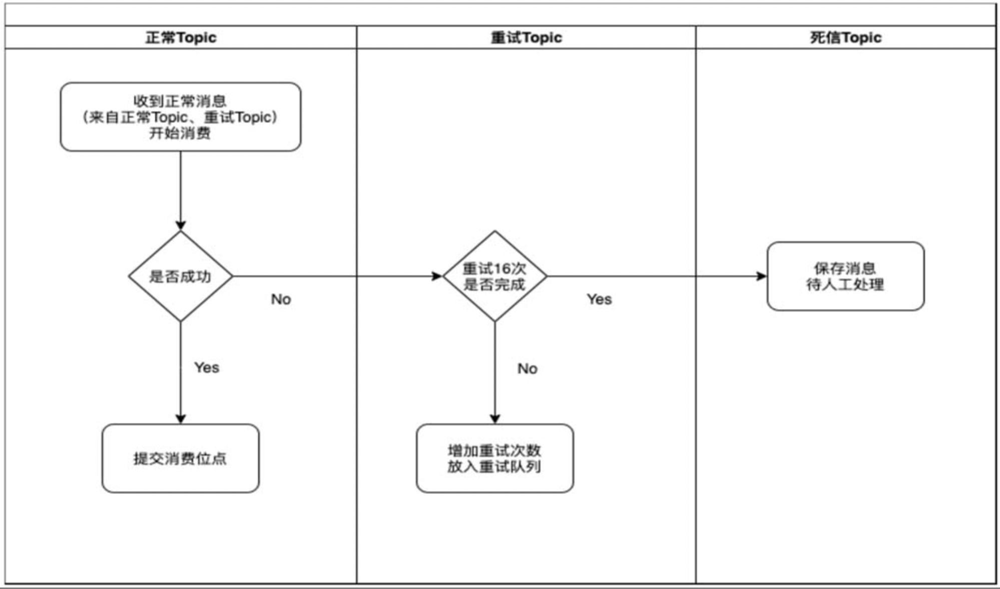
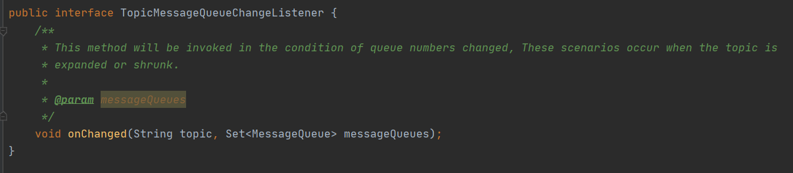

# Rocketmq简介

## 为什么要用消息队列

1. 削峰填谷
2. 程序间解耦
3. 异步处理
4. 数据的最终一致性

## 常见消息队列

| 消息队列的名称 | Apache ActiveMQ                                                | Apache Kafka                                 | Apache RocketMq                                                  | Apache Pulsar                     |
| ---------------- | ---------------------------------------------------------------- | ---------------------------------------------- | ------------------------------------------------------------------ | ----------------------------------- |
| 产生时间       | 2007                                                           | 2012                                         | 2017                                                             | 2018                              |
| 贡献公司       | Apache                                                         | LinkedIn                                     | 阿里巴巴                                                         | 雅虎                              |
| 当时流行MQ     | JMS                                                            | ActiveMq                                     | kafka,ActiveMq                                                   | RocketMq,kafka                    |
| 特性           | 1.支持协议众多：AMQP,STOMP,MQTT,JSM</br>  2.消息是持久化的JDBC | 1.超高的写入速率</br> 2.end-to-end耗时毫秒级 | 1.亿万级消息支持</br> 2.万级Topic数量支持 3.end-to-end耗时毫秒级 | 1.储存计算分离</br> 2.支持sql查询 |
| 管理后台       | 自带                                                           | 独立部署                                     | 独立部署                                                         | 无                                |
| 多语言客户端   | 支持                                                           | 支持                                         | java，c++，Python，GO,C#                                         | JAVA,c++,Python,GO                |
| 数据流支持     | 不支持                                                         | 支持                                         | 支持                                                             | 支持                              |
| 消息丢失       | 理论上不会丢失                                                 | 理论上不会丢失                               | 理论上不会丢失                                                   | 理论上不会丢失                    |
| 文档完备性     | 好                                                             | 极好                                         | 极好                                                             | 社区在不断完善中                  |
| 商业公司实践   | 国内部分企业                                                   | LinkedIn                                     | 阿里巴巴                                                         | 雅虎，腾讯，智联招聘              |
| 容错           | 无重试机制                                                     | 无重试机制                                   | 支持重试，死信消息                                               | 支持重试，死信消息                |
| 顺序消息       | 支持                                                           | 支持                                         | 支持                                                             | 支持                              |
| 定时消息       | 不支持                                                         | 不支持                                       | 支持                                                             | 支持                              |
| 事务消息       | 不支持                                                         | 支持                                         | 支持                                                             | 支持                              |
| 消息轨迹       | 不支持                                                         | 不支持                                       | 支持                                                             | 自己实现简单                      |
| 消息查询       | 数据库中查询                                                   | 不支持                                       | 支持                                                             | 支持sql                           |
| 重放消息       | 不清楚                                                         | 暂停重放                                     | 实时重放                                                         | 支持                              |
| 宕机           | 自动切换                                                       | 自动选主                                     | 手动重启                                                         | 自动切换                          |

# rocketMq

## 生产者原理

### 生产者概述

#### 生产组

> 一个逻辑概念，在使用生产者实例的时候需要指定一个组名。一个生产者组可以生产多个Topic的消息。

#### 生产者实例

> 一个生产者组部署了多个进程，每个进程都可以称为一个生产者实例。

#### Topic

> 主题名字，一个Topic由若干Queue组成。
> RocketMQ 客户端中的生产者有两个独立实现类：</br>
> org.apache.rocketmq.client.producer.DefaultMQProducer 用于生产普通消息、顺序消息、单向消息、批量消息、延迟消息 </br>
> org.apache.rocketmq.client.producer.TransactionMQProducer。 用于生产事务消息 </br>

### 消息结构和消息类型

#### 消息类结构

```

package org.apache.rocketmq.common.message;

import java.io.Serializable;
import java.util.Arrays;
import java.util.Collection;
import java.util.HashMap;
import java.util.Map;

public class Message implements Serializable {
    private static final long serialVersionUID = 8445773977080406428L;

    /**
     * 主体名称
     */
    private String topic;
    /**
     *
     */
    private int flag;
    /**
     * 消息扩展信息，Tag,keys,延迟级别都保存在这里
     */
    private Map<String, String> properties;
    /**
     * 消息体，字节数组。需要注意生产者使用什么编码，消费者也必须使用相同编码解码，否则会产生乱码。
     */
    private byte[] body;
    private String transactionId;

    /**
     * 设置消息的key，多个key可以用MessageConst.KEY_SEPARATOR（空格）分隔或者直接用另一个重载方法。
     * 如果 Broker 中 messageIndexEnable=true 则会根据 key创建消息的Hash索引，帮助用户进行快速查询。
     * @param keys
     */
    public void setKeys(Collection<String> keys) {
        StringBuilder sb = new StringBuilder();
        for (String k : keys) {
            sb.append(k);
            sb.append(MessageConst.KEY_SEPARATOR);
        }

        this.setKeys(sb.toString().trim());
    }


    /**
     * 设置延迟级别，延迟多久消费者可以消费。
     * @param level
     */
    public void setDelayTimeLevel(int level) {
        this.putProperty(MessageConst.PROPERTY_DELAY_TIME_LEVEL, String.valueOf(level));
    }


    /**
     * 如果还有其他扩展信息，可以存放在这里。内部是一个Map，重复调用会覆盖旧值。
     * @param name
     * @param value
     */
    public void putUserProperty(final String name, final String value) {
        if (MessageConst.STRING_HASH_SET.contains(name)) {
            throw new RuntimeException(String.format(
                    "The Property<%s> is used by system, input another please", name));
        }

        if (value == null || value.trim().isEmpty()
                || name == null || name.trim().isEmpty()) {
            throw new IllegalArgumentException(
                    "The name or value of property can not be null or blank string!"
            );
        }

        this.putProperty(name, value);
    }

    /**
     * 消息过滤的标记，用户可以订阅某个Topic的某些Tag，这样Broker只会把订阅了topic-tag的消息发送给消费者。
     * @param tags
     */
    public void setTags(String tags) {
        this.putProperty(MessageConst.PROPERTY_TAGS, tags);
    }
}

```

#### RocketMQ消息类型。

1. 普通消息:

   > 普通消息也称为并发消息，和传统的队列相比，并发消息没有顺序，但是生产消费都是并行进行的，单机性能可达十万级别的TPS。
2. 分区有序消息

   > 与Kafka中的分区类似，把一个Topic消息分为多个分区“保存”和消费，在一个分区内的消息就是传统的队列，遵循FIFO（先进先出）原则。
3. 全局有序消息

   > 如果把一个 Topic 的分区数设置为 1，那么该 Topic 中的消息就是单分区，所有消息都遵循FIFO（先进先出）的原则。
4. 延迟消息

   > 消息发送后，消费者要在一定时间后，或者指定某个时间点才可以消费。在没有延迟消息时，基本的做法是基于定时计划任务调度，定时发送消息。在RocketMQ中只需要在发送消息时设置延迟级别即可实现。
5. 事务消息

   > 主要涉及分布式事务，即需要保证在多个操作同时成功或者同时失败时，消费者才能消费消息。RocketMQ通过发送Half消息、处理本地事务、提交（Commit）消息或者回滚（Rollback）消息优雅地实现分布式事务

### 生产者高可用

#### 客户端保证

1. 第一种保证机制-客户端保证
   > 重试机制。RocketMQ 支持同步、异步发送，不管哪种方式都可以在配置失败后重试，</br>
   > 如果单个 Broker 发生故障，重试会选择其他 Broker 保证消息正常发送。</br>
   > 配置项 retryTimesWhenSendFailed表示同步重试次数，</br>
   > 默认为2次，加上正常发送1次，总共3次机会。</br>
    1. 同步发送
       > 同步发送的重试代码可以参考org.apache.rocketmq.client.impl.producer.DefaultMQProducerImpl.sendDefaultImpl（），</br>
       > 每次发送失败后，除非发送被打断否则都会执行重试代码。</br>
    2. 异步发送
       > 异步发送重试代码可以参考org.apache.rocketmq.client.impl.MQClientAPIImpl.sendMessageAsync（)</br>
       > 重试是在通信层异步发送完成的，当operationComplete（）方法返回的response值为null时，会重新执行重试代码。</br>
       > 返回值 response 为 null 通常是因为客户端收到 TCP请求解包失败，或者没有找到匹配的request。</br>
       > 生产者配置项 retryTimesWhenSendAsyncFailed 表示异步重试的次数，默认为 2次，加上正常发送的1次，总共有3次发送机会。</br>
2. 第二种保证机制-客户端容错
   > RocketMQ Client会维护一个“Broker-发送延迟”关系，根据这个关系选择一个发送延迟级别较低的 Broker 来发送消息，</br>
   > 这样能最大限度地利用 Broker 的能力，剔除已经宕机、不可用或者发送延迟级别较高的Broker，尽量保证消息的正常发送。</br>
   > 这种机制主要体现在发送消息时如何选择 Queue，源代码在 sendDefaultImpl（）方法调用的selectOneMessageQueue（）方法中。</br>
   > sendLatencyFaultEnable：发送延迟容错开关，默认为关闭，如果开关打开了，会触发发送延迟容错机制来选择发送Queue。
    1. 发送Queue时如何选择呢
        1. 第一步
           > 获取一个在延迟上可以接受，并且和上次发送相同的Broker。首先获取一个自增序号 index，通过取模获取Queue的位置下标 Pos。</br>
           > 如果 Pos对应的Broker的延迟时间是可以接受的，并且是第一次发送，或者和上次发送的Broker相同，则将Queue返回。
        2. 第二步

           > 如果第一步没有选中一个Broker，则选择一个延迟较低的Broker。
        3. 第三步
           > 如果第一、二步都没有选中一个Broker，则随机选择一个Broker。</br>
           tpInfo.selectOneMessageQueue（lastBrokerName），该方法的功能就是随机选择一个Broker
3. 发送源码

```
private SendResult sendDefaultImpl(Message msg,final CommunicationMode communicationMode,final SendCallback sendCallback,final long timeout) throws MQClientException, RemotingException, MQBrokerException, InterruptedException {
        this.makeSureStateOK();// 判断服务是否正常
        Validators.checkMessage(msg, this.defaultMQProducer);//消息信息检查
        final long invokeID = random.nextLong();
        long beginTimestampFirst = System.currentTimeMillis();
        long beginTimestampPrev = beginTimestampFirst;
        long endTimestamp = beginTimestampFirst;
        TopicPublishInfo topicPublishInfo = this.tryToFindTopicPublishInfo(msg.getTopic());// 获取TopicPublishInfo信息
        if (topicPublishInfo != null && topicPublishInfo.ok()) {
            boolean callTimeout = false;
            MessageQueue mq = null;
            Exception exception = null;
            SendResult sendResult = null;
            //重试计数器
            int timesTotal = communicationMode == CommunicationMode.SYNC ? 1 + this.defaultMQProducer.getRetryTimesWhenSendFailed() : 1;
            int times = 0;
            String[] brokersSent = new String[timesTotal];
            for (; times < timesTotal; times++) {
                String lastBrokerName = null == mq ? null : mq.getBrokerName();
                // Broker-发送延迟”关系
                MessageQueue mqSelected = this.selectOneMessageQueue(topicPublishInfo, lastBrokerName);
                if (mqSelected != null) {
                    mq = mqSelected;
                    brokersSent[times] = mq.getBrokerName();
                    try {
                        beginTimestampPrev = System.currentTimeMillis();
                        if (times > 0) {
                            //Reset topic with namespace during resend.
                            msg.setTopic(this.defaultMQProducer.withNamespace(msg.getTopic()));
                        }
                        long costTime = beginTimestampPrev - beginTimestampFirst;
                        if (timeout < costTime) {
                            callTimeout = true;
                            break;
                        }

                        sendResult = this.sendKernelImpl(msg, mq, communicationMode, sendCallback, topicPublishInfo, timeout - costTime);
                        endTimestamp = System.currentTimeMillis();
                        this.updateFaultItem(mq.getBrokerName(), endTimestamp - beginTimestampPrev, false);
                        switch (communicationMode) {
                            case ASYNC:
                                return null;
                            case ONEWAY:
                                return null;
                            case SYNC:
                                if (sendResult.getSendStatus() != SendStatus.SEND_OK) {
                                    if (this.defaultMQProducer.isRetryAnotherBrokerWhenNotStoreOK()) {
                                        continue;
                                    }
                                }

                                return sendResult;
                            default:
                                break;
                        }
                    } catch (RemotingException e) {
                        endTimestamp = System.currentTimeMillis();
                        this.updateFaultItem(mq.getBrokerName(), endTimestamp - beginTimestampPrev, true);
                        log.warn(String.format("sendKernelImpl exception, resend at once, InvokeID: %s, RT: %sms, Broker: %s", invokeID, endTimestamp - beginTimestampPrev, mq), e);
                        log.warn(msg.toString());
                        exception = e;
                        continue;
                    } catch (MQClientException e) {
                        endTimestamp = System.currentTimeMillis();
                        this.updateFaultItem(mq.getBrokerName(), endTimestamp - beginTimestampPrev, true);
                        log.warn(String.format("sendKernelImpl exception, resend at once, InvokeID: %s, RT: %sms, Broker: %s", invokeID, endTimestamp - beginTimestampPrev, mq), e);
                        log.warn(msg.toString());
                        exception = e;
                        continue;
                    } catch (MQBrokerException e) {
                        endTimestamp = System.currentTimeMillis();
                        this.updateFaultItem(mq.getBrokerName(), endTimestamp - beginTimestampPrev, true);
                        log.warn(String.format("sendKernelImpl exception, resend at once, InvokeID: %s, RT: %sms, Broker: %s", invokeID, endTimestamp - beginTimestampPrev, mq), e);
                        log.warn(msg.toString());
                        exception = e;
                        if (this.defaultMQProducer.getRetryResponseCodes().contains(e.getResponseCode())) {
                            continue;
                        } else {
                            if (sendResult != null) {
                                return sendResult;
                            }

                            throw e;
                        }
                    } catch (InterruptedException e) {
                        endTimestamp = System.currentTimeMillis();
                        this.updateFaultItem(mq.getBrokerName(), endTimestamp - beginTimestampPrev, false);
                        log.warn(String.format("sendKernelImpl exception, throw exception, InvokeID: %s, RT: %sms, Broker: %s", invokeID, endTimestamp - beginTimestampPrev, mq), e);
                        log.warn(msg.toString());

                        log.warn("sendKernelImpl exception", e);
                        log.warn(msg.toString());
                        throw e;
                    }
                } else {
                    break;
                }
            }

            if (sendResult != null) {
                return sendResult;
            }

            String info = String.format("Send [%d] times, still failed, cost [%d]ms, Topic: %s, BrokersSent: %s",
                times,
                System.currentTimeMillis() - beginTimestampFirst,
                msg.getTopic(),
                Arrays.toString(brokersSent));

            info += FAQUrl.suggestTodo(FAQUrl.SEND_MSG_FAILED);

            MQClientException mqClientException = new MQClientException(info, exception);
            if (callTimeout) {
                throw new RemotingTooMuchRequestException("sendDefaultImpl call timeout");
            }

            if (exception instanceof MQBrokerException) {
                mqClientException.setResponseCode(((MQBrokerException) exception).getResponseCode());
            } else if (exception instanceof RemotingConnectException) {
                mqClientException.setResponseCode(ClientErrorCode.CONNECT_BROKER_EXCEPTION);
            } else if (exception instanceof RemotingTimeoutException) {
                mqClientException.setResponseCode(ClientErrorCode.ACCESS_BROKER_TIMEOUT);
            } else if (exception instanceof MQClientException) {
                mqClientException.setResponseCode(ClientErrorCode.BROKER_NOT_EXIST_EXCEPTION);
            }

            throw mqClientException;
        }

        validateNameServerSetting();

        throw new MQClientException("No route info of this topic: " + msg.getTopic() + FAQUrl.suggestTodo(FAQUrl.NO_TOPIC_ROUTE_INFO),
            null).setResponseCode(ClientErrorCode.NOT_FOUND_TOPIC_EXCEPTION);
    }
 
    
```

4. Broker保证源码 - org.apache.rocketmq.client.latency.MQFaultStrategy

```
public MessageQueue selectOneMessageQueue(final TopicPublishInfo tpInfo, final String lastBrokerName) {
        if (this.sendLatencyFaultEnable) {// 发送延迟容错开关，默认为关闭，如果开关打开了，会触发发送延迟容错机制来选择发送Queue。
            try {
                // 获取一个在延迟上可以接受，并且和上次发送相同的Broker。首先获取一个自增序号 index，通过取模获取Queue的位置下标 Pos。
                // 如果 Pos对应的Broker的延迟时间是可以接受的，并且是第一次发送，或者和上次发送的Broker相同，则将Queue返回。
                int index = tpInfo.getSendWhichQueue().incrementAndGet();
                for (int i = 0; i < tpInfo.getMessageQueueList().size(); i++) {
                    int pos = Math.abs(index++) % tpInfo.getMessageQueueList().size();
                    if (pos < 0)
                        pos = 0;
                    MessageQueue mq = tpInfo.getMessageQueueList().get(pos);
                    if (latencyFaultTolerance.isAvailable(mq.getBrokerName()))
                        return mq;
                }
                // 如果没有选中一个Broker，则选择一个延迟较低的Broker。
                final String notBestBroker = latencyFaultTolerance.pickOneAtLeast();
                int writeQueueNums = tpInfo.getQueueIdByBroker(notBestBroker);
                if (writeQueueNums > 0) {
                    final MessageQueue mq = tpInfo.selectOneMessageQueue();
                    if (notBestBroker != null) {
                        mq.setBrokerName(notBestBroker);
                        mq.setQueueId(tpInfo.getSendWhichQueue().incrementAndGet() % writeQueueNums);
                    }
                    return mq;
                } else {
                    latencyFaultTolerance.remove(notBestBroker);
                }
            } catch (Exception e) {
                log.error("Error occurred when selecting message queue", e);
            }
            
            return tpInfo.selectOneMessageQueue();
        }
        // 如果第一、二步都没有选中一个Broker，则随机选择一个Broker。
        return tpInfo.selectOneMessageQueue(lastBrokerName);
    }
```

#### Broker端保证

> 同步复制和异步复制。</br>
> 同步复制是指消息发送到Master Broker后，同步到SlaveBroker才算发送成功；</br>
> 异步复制是指消息发送到Master Broker，即为发送成功。在生产环境中，建议至少部署2个Master和2个Slave，</br> 下面分为几种情况详细描

1. （1）1个Slave掉电。Broker同步复制时，生产第一次发送失败，重试到另一组Broker后成功；Broker异步复制时，生产正常不受影响。
2. （2）2个 Slave掉电。Broker同步复制时，生产失败；Broker异步复制时，生产正常不受影响。
3. （3）1 个 Master 掉电。Broker 同步复制时，生产第一次失败，重试到另一组Broker后成功；Broker异步复制时的做法与同步复制相同。
4. （4）2个Master掉电。全部生产失败。
5. （5）同一组Master和Slave掉电。Broker同步复制时，生产第一次发送失败，重试到另一组Broker后成功；Broker异步复制时，生产正常不受影响。
6. （6）2组机器都掉电：全部生产失败。

> 综上所述，想要做到绝对的高可靠，将 Broker 配置的主从同步进行复制即可，只要生产者收到消息保存成功的反馈，消息就肯定不会丢失。一般适用于金融领域的特殊场景。绝大部分场景都可以配置Broker主从异步复制，这样效率极高。

### 生产者启动流程

> DefaultMQProducer是RocketMQ中默认的生产者实现，DefaultMQProducer的类之间的继承关系如图所示，可以看到这个生产者在实现时包含生产者的操作和配置属性，这是典型的类对象设计。


1. DefaultMQProducer核心属性如下：
    1. ClientConfig.namesrvAddr

       > 继承自 ClientConfig，表示 RocketMQ 集群的 Namesrv 地址，如果是多个则用分号分开。比如：127.0.0.1：9876；127.0.0.2：9876。
    2. ClientConfig.clientIP

       > 使用的客户端程序所在机器的 IP地址。支持 IPv4和 IPv6，IPv4 排除了本地的环回地址（127.0.xxx.xxx）和私有内网地址（192.168.xxx.xxx）。这里需要注意的是，如果 Client 运行在
       Docker 容器中，获取的 IP 地址是容器所在的 IP地址，而非宿主机的IP地址。
    3. ClientConfig.instanceName

       > 实例名，每个实例都需要取唯一的名字，因为有时我们会在同一个机器上部署多个程序进程，如果名字有重复就会导致启动失败。
    4. ClientConfig.vipChannelEnabled

       > 这是一个 boolean 值，表示是否开启 VIP 通道。VIP 通道和非VIP通道的区别是：在通信过程中使用的端口号不同。
    5. ClientConfig.clientCallbackExecutorThreads

       > 客户端回调线程数。该参数表示 Netty 通信层回调线程的个数，默认值Runtime.getRuntime（）.availableProcessors（）表示当前CPU的有效个数。
    6. ClientConfig.pollNameServerInterval

       > 获取 Topic 路由信息的间隔时长，单位为 ms，默认为30000ms。
    7. ClientConfig.heartbeatBrokerInterval

       > 与Broker心跳间隔的时长，单位为ms，默认为30000ms。
    8. defaultMQProducerImpl

       > 默认生产者的实现类，其中封装了Broker的各种API（启动及关闭生产者的接口）。如果你想自己实现一个生产者，可以添加一个新的实现，保持DefaultMQProducer对外接口不变，用户完全没有感知。
    9. producerGroup

       > 生产者组名，这是一个必须传递的参数。RocketMQ-way表示同一个生产者组中的生产者实例行为需要一致。
    10. sendMsgTimeout

        > 发送超时时间，单位为ms，默认 3000
    11. compressMsgBodyOverHowmuch
        > 消息体的容量上限，超过该上限时消息体会通过ZIP进行压缩，该值默认为4MB。</br>
        > 在 DefaultMQProducerImpl.sendKernelImpl.tryToCompressMessage校验的。
    12. retryTimesWhenSendFailed

        > 同步发送失败后重试的次数。默认为2次，也就是说，一共有3次发送机会。
    13. retryTimesWhenSendAsyncFailed
        > 异步发送失败后重试的次数。默认为 2次。异步重试是有条件的重试，并不是每次发送失败后都重试。
        > 源代码可以查看org.apache.rocketmq.client.impl.MQClientAPIImpl.sendMessageAsync（）方法。
        > 每次发送失败抛出异常后，通过执行onExceptionImpl（）方法来决定什么场景进行重试。
2. DefaultMQProducer核心方法如下：
    1. start（）

       > 这是启动整个生产者实例的入口，主要负责校验生产者的配置参数是否正确，并启动通信通道、各种定时计划任务、Pull服务、Rebalance服务、注册生产者到Broker等操作。
    2. shutdown（）

       > 关闭本地已注册的生产者，关闭已注册到Broker的客户端。
    3. fetchPublishMessageQueues（Topic）

       > 获取一个Topic有哪些Queue。在发送消息、Pull消息时都需要调用。
    4. send（Message msg）

       > 同步发送普通消息。
    5. send（Message msg，long timeout）

       > 同步发送普通消息（超时设置）。
    6. send（Message msg，SendCallback sendCallback）

       > 异步发送普通消息。
    7. send（Message msg，SendCallback sendCallback，long timeout）

       > 异步发送普通消息（超时设置）。
    8. sendOneway（Message msg）：

       > 发送单向消息。只负责发送消息，不管发送结果。
    9. send（Message msg，MessageQueue mq）：

       > 同步向指定队列发送消息。
    10. send（Message msg，MessageQueue mq，long timeout）：

        >
        同步向指定队列发送消息（超时设置）,同步向指定队列发送消息时，如果只有一个发送线程，在发送到某个指定队列中时，这个指定队列中的消息是有顺序的，那么就按照发送时间排序；如果某个Topic的队列都是这种情况，那么我们称该Topic的全部消息是分区有序的。
    11. send（Message msg，MessageQueue mq，SendCallback sendCallback）：

        > 异步发送消息到指定队列。
    12. send（Message msg，MessageQueue mq，SendCallback sendCallback，long timeout）：

        > 异步发送消息到指定队列（超时设置）。
    13. send（Message msg，MessageQueueSelector selector，Object arg，SendCallback sendCallback）：

        > 自定义消息发送到指定队列。通过实现MessageQueueSelector接口来选择将消息发送到哪个队列。
    14. send（Collection＜Message＞msgs）：

        > 批量发送消息。
3. DefaultMQProducer核心管理接口
    1. createTopic（String key，String newTopic，int queueNum）：

       > 创建Topic。
    2. viewMessage（String offsetMsgId）：

       > 根据消息id查询消息内容。
4. 生产者启动流程图
   
   >
   生产者启动的流程比消费者启动的流程更加简单，一般用户使用DefaultMQProducer的构造函数构造一个生产者实例，并设置各种参数。比如Namesrv地址、生产者组名等，调用start（）方法启动生产者实例，start（）方法调用了生产者默认实现类的start（）方法启动
    1. DefaultMQProducerImpl 具体过程：
        1. 通过 switch-case 判断当前生产者的服务状态，创建时默认状态是CREATE_JUST。设置默认启动状态为启动失败。
        2. 执行checkConfig（）方法。校验生产者实例设置的各种参数。比如生产者组名是否为空、是否满足命名规则、长度是否满足等。
        3. 执行changeInstanceNameToPID（）方法。校验instance name，如果是默认名字则将其修改为进程id。
        4. 执行getAndCreateMQClientInstance（）方法。根据生产者组名获取或者初始化一个MQClientInstance。
           > MQClientInstance实例与clientId是一一对应的，而clientId是由clientIP、instanceName 及 unitName 构成的。一般来讲，为了减少客户端的使用资源，如果将所有的
           instanceName和 unitName设置为同样的值，就会只创建一个 MQClientInstance实例
    2. MQClientInstance 实例的功能是管理本实例中全部生产者与消费者的生产和消费行为，下面MQClientInstance核心属性
        1. producerTable：当前client实例的全部生产者的内部实例。
        2. consumerTable：当前client实例的全部消费者的内部实例。
        3. adminExtTable：当前client实例的全部管理实例。
        4. mQClientAPIImpl：其实每个client也是一个Netty Server，也会支持Broker访问，这里实现了全部client支持的接口。
        5. mQAdminImpl：管理接口的本地实现类。
        6. topicRouteTable：当前生产者、消费者中全部Topic的本地缓存路由信息。
        7. scheduledExecutorService：本地定时任务，比如定期获取当前
           Namesrv地址、定期同步Namesrv信息、定期更新Topic路由信息、定期发送心跳信息给Broker、定期清理已下线的Broker、定期持久化消费位点、定期调整消费线程数（这部分源代码被官方删除了）。
        8. clientRemotingProcessor：请求的处理器，从处理方法processRequest（）中我们可以知道目前支持哪些功能接口。
        9. pullMessageService：Pull服务。
        10. rebalanceService：重新平衡服务。定期执行重新平衡方法this.mqClientFactory.doRebalance（）。这里的 mqClientFactory
            就是MQClientInstance实例，通过依次调用MQClientInstance中保存的消费者实例的doRebalance（）方法，来感知订阅关系的变化、集群变化等，以达到重新平衡。
        11. consumerStatsManager：消费监控。比如拉取RT（Response Time，响应时间）、拉取TPS（Transactions Per Second，每秒处理消息数）、消费RT等都可以统计。
    3. MQClientInstance的核心方法
        1. updateTopicRouteInfoFromNameServer：从多个Namesrv中获取最新Topic路由信息，更新本地缓存。
        2. cleanOfflineBroker：清理已经下线的Broker。checkClientInBroker：检查Client是否在Broker中有效。
        3. sendHeartbeatToAllBrokerWithLock：发送客户端的心跳信息给所有的Broker。
        4. registerConsumer：在本地注册一个消费者。
        5. unregisterConsumer：取消本地注册的消费者。
        6. registerProducer：在本地注册一个生产者。
        7. unregisterProducer：取消本地注册的生产者。
        8. registerAdminExt：注册一个管理实例。
        9. rebalanceImmediately：立即执行一次 Rebalance。该操作是通过 RocketMQ 的一个CountDownLatch2锁来实现的。
        10. doRebalance：对于所有已经注册的消费者实例，执行一次Rebalance。
        11. findBrokerAddressInAdmin：在本地缓存中查找Master或者Slave Broker信息。
        12. findBrokerAddressInSubscribe：在本地缓存中查找Slave Broker信息。
        13. findBrokerAddressInPublish：在本地缓存中查找Master Broker地址。
        14. findConsumerIdList：查找消费者id列表。
        15. findBrokerAddrByTopic：通过Topic名字查找Broker地址。
        16. resetOffset：重置消费位点。
        17. getConsumerStatus：获取一个订阅关系中每个队列的消费进度。
        18. getTopicRouteTable：获取本地缓存Topic路由。
        19.
       consumeMessageDirectly：直接将消息发送给指定的消费者消费，和正常投递不同的是，指定了已经订阅的消费者组中的一个，而不是全部已经订阅的消费者。一般适用于在消费消息后，某一个消费者组想再消费一次的场景。
        20. consumerRunningInfo：获取消费者的消费统计信息。包含消费RT、消费TPS等。

### 消息发送流程

> RocketMQ客户端的消息发送通常分为以下3层：</br>
> 业务层：通常指直接调用RocketMQ Client发送API的业务代码。</br>
> 消息处理层：指RocketMQ Client获取业务发送的消息对象后，一系列的参数检查、消息发送准备、参数包装等操作。</br>
> 通信层：指RocketMQ基于Netty封装的一个RPC通信服务，RocketMQ的各个组件之间的通信全部使用该通信层。

#### 消息发送流程具体分为3步

1. 第一步：调用defaultMQProducerImpl.send（）方法发送消息。
2. 第二步：通过设置的发送超时时间，调用defaultMQProducerImpl.send（）方法发送消息。设置的超时时间可以通过sendMsgTimeout进行变更，其默认值为3s
3. 第三步：执行defaultMQProducerImpl.sendDefaultImpl（）方法。这是一个公共发送方法，我们先看看入参：

#### 消息发送流程图


> communicationMode：通信模式，同步、异步还是单向。sendCallback：对于异步模式，需要设置发送完成后的回调。

#### 发送消息的核心方法，执行过程分为5步：

1.

第一步，两个检查：生产者状态、消息及消息内容。没有运行的生产者不能发送消息。消息检查主要检查消息是否为空，消息的Topic的名字是否为空或者是否符合规范；消息体大小是否符合要求，最大值为4MB，可以通过maxMessageSize进行设置。

2. 第二步，执行tryToFindTopicPublishInfo（）方法：获取Topic路由信息，如果不存在则发出异常提醒用户。如果本地缓存没有路由信息，就通过Namesrv获取路由信息，更新到本地，再返回。
3. 第三步，计算消息发送的重试次数，同步重试和异步重试的执行方式是不同的。
4. 第四步，执行队列选择方法selectOneMessageQueue（）。根据队列对象中保存的上次发送消息的Broker的名字和Topic路由，选择（轮询）一个Queue将消息发送到Broker。我们可以通过
   sendLatencyFaultEnable 来设置是否总是发送到延迟级别较低的 Broker，默认值为False。
    5.

第五步，执行sendKernelImpl（）方法。该方法是发送消息的核心方法，主要用于准备通信层的入参（比如Broker地址、请求体等），将请求传递给通信层，内部实现是基于Netty的，在封装为通信层request对象RemotingCommand前，会设置RequestCode表示当前请求是发送单个消息还是批量消息。

#### netty 异步转同步代码

> Netty 本身是一个异步的网络通信框架，怎么实现同步的调用呢？org.apache.rocketmq.remoting.netty.NettyRemotingAbstract.invokeSyncImpl

```
   public RemotingCommand invokeSyncImpl(Channel channel, RemotingCommand request, long timeoutMillis) throws InterruptedException, RemotingSendRequestException, RemotingTimeoutException {
   final int opaque = request.getOpaque();

        RemotingCommand var9;
        try {
            final ResponseFuture responseFuture = new ResponseFuture(channel, opaque, timeoutMillis, (InvokeCallback)null, (SemaphoreReleaseOnlyOnce)null);
            this.responseTable.put(opaque, responseFuture);
            final SocketAddress addr = channel.remoteAddress();
            channel.writeAndFlush(request).addListener(new ChannelFutureListener() {
                public void operationComplete(ChannelFuture f) throws Exception {
                    if (f.isSuccess()) {
                        responseFuture.setSendRequestOK(true);
                    } else {
                        responseFuture.setSendRequestOK(false);
                        NettyRemotingAbstract.this.responseTable.remove(opaque);
                        responseFuture.setCause(f.cause());
                        responseFuture.putResponse((RemotingCommand)null);
                        NettyRemotingAbstract.log.warn("send a request command to channel <" + addr + "> failed.");
                    }
                }
            });
            RemotingCommand responseCommand = responseFuture.waitResponse(timeoutMillis);
            if (null == responseCommand) {
                if (responseFuture.isSendRequestOK()) {
                    throw new RemotingTimeoutException(RemotingHelper.parseSocketAddressAddr(addr), timeoutMillis, responseFuture.getCause());
                }

                throw new RemotingSendRequestException(RemotingHelper.parseSocketAddressAddr(addr), responseFuture.getCause());
            }

            var9 = responseCommand;
        } finally {
            this.responseTable.remove(opaque);
        }

        return var9;
   }
```

1. 在每次发送同步请求后，程序会执行 waitResponse（）方法，直到 Netty接收Broker的返回结果，相关代码如下：

```
public RemotingCommand waitResponse(long timeoutMillis) throws InterruptedException {
   this.countDownLatch.await(timeoutMillis, TimeUnit.MILLISECONDS);
   return this.responseCommand;
}
```

> 然后，通过putResponse（）方法释放锁，让请求线程同步返回。异步发送时有很多request，每个response返回后怎么与request进行对应呢？</br>
> 这里面有一个关键参数——opaque，RocketMQ每次发送同步请求前都会为一个request分配一个opaque，这是一个原子自增的id，</br>
> 一个response会以opaque作为key保存在responseTable中，这样用opaque就将request和response连接起来了。无论请求发送成功与否，</br>
> 都执行 updateFaultItem（）方法，这就是在第三步中讲的总是发送到延迟级别较低的Broker的逻辑。

### 发送消息实践

#### 发送普通消息

> 普通消息，也叫并发消息，是发送效率最高、使用场景最多的一类消息。

```
import org.apache.rocketmq.client.impl.producer.DefaultMQProducerImpl;
import org.apache.rocketmq.client.producer.DefaultMQProducer;
import org.apache.rocketmq.client.producer.SendResult;
import org.apache.rocketmq.common.message.Message;

import java.nio.charset.StandardCharsets;

public class ProducerTest {
    public static void main(String[] args) throws Exception{
        DefaultMQProducer defaultMQProducer = new DefaultMQProducer("DefaultMQProducer");
        defaultMQProducer.setNamespace("xxxxx:10911");
        defaultMQProducer.setRetryTimesWhenSendAsyncFailed(2);
        defaultMQProducer.start();
        Message message = new Message("test_topic","tagA","orderId","hello world".getBytes(StandardCharsets.UTF_8));
        SendResult sendResult =  defaultMQProducer.send(message);

        System.out.printf("%s%n",sendResult);

        defaultMQProducer.shutdown();
    }
}
```

#### 发送顺序消息

> 同步发送消息时，根据HashKey将消息发送到指定的分区中，每个分区中的消息都是按照发送顺序保存的，即分区有序。如果 Topic 的分区被设置为 1，这个
> Topic的消息就是全局有序的。注意，顺序消息的发送必须是单线程，多线程将不再有序。顺序消息的消费和普通消息的消费方式不同

```
public void sendMsgOrderly() throws Exception {
        DefaultMQProducer defaultMQProducer = new DefaultMQProducer("DefaultMQProducer");
        defaultMQProducer.setNamespace("xxxxx:10911");
        defaultMQProducer.setRetryTimesWhenSendAsyncFailed(2);
        defaultMQProducer.start();
        Message message = new Message("test_topic", "tagA", "orderId", "hello world".getBytes(StandardCharsets.UTF_8));
        int hashKey = 123;
        SendResult sendResult = defaultMQProducer.send(message,
                (List<MessageQueue> mqs, Message msg, Object o) -> {
                    int id = (int) o;
                    int index = id % mqs.size();
                    return mqs.get(index);
                },
                hashKey);

        System.out.printf("%s%n", sendResult);

        defaultMQProducer.shutdown();
    }

```

#### 发送延迟消息

> 生产者发送消息后，消费者在指定时间才能消费消息，这类消息被称为延迟消息或定时消息。</br>
> 生产者发送延迟消息前需要设置延迟级别，目前开源版本支持18个延迟级别：Broker在接收用户发送的消息后，</br>
> 首先将消息保存到名为SCHEDULE_TOPIC_XXXX的Topic中。此时，消费者无法消费该延迟消息。</br>
> 然后，由Broker端的定时投递任务定时投递给消费者。</br>
> 1s 5s 10s 30s 1m 2m 3m 4m 5m 6m 7m 8m 9m 10m 20m 30m 1h 2h
> 保存延迟消息的实现逻辑见org.apache.rocketmq.store.schedule.ScheduleMessageService 类。
> 按照配置的延迟级别初始化多个任务，每秒执行一次。如果消息投递满足时间条件，
> 那么将消息投递到原始的Topic中。消费者此时可以消费该延迟消息。生产者代码中怎么设置延迟级别呢？相关代码如下

```
Message message = new Message("test_topic", "tagA", "orderId", "hello world".getBytes(StandardCharsets.UTF_8));
message.setDelayTimeLevel(4);
```

#### 发送事务消息

> 事务消息的发送、消费流程和延迟消息类似，都是先发送到对消费者不可见的Topic中。当事务消息被生产者提交后，会被二次投递到原始Topic中，此时消费者正常消费。事务消息的发送具体分为以下两个步骤。</br>
> 第一步：用户发送一个Half消息到 Broker，Broker设置 queueOffset=0，即对消费者不可见。</br>
> 第二步：用户本地事务处理成功，发送一个 Commit 消息到 Broker，Broker 修改queueOffset为正常值，达到重新投递的目的，此时消费者可以正常消费；</br>
> 如果本地事务处理失败，那么将发送一个Rollback消息给Broker，Broker将删除Half消息。


```
public void sendTransaction() throws MQClientException {
    // 初始化事务消费生产者
    TransactionMQProducer transactionMQProducer = new TransactionMQProducer("TransactionMQProducer");
    transactionMQProducer.setCheckThreadPoolMaxSize(2);
    transactionMQProducer.setCheckThreadPoolMinSize(1);
    transactionMQProducer.setCheckRequestHoldMax(2000);
    transactionMQProducer.setTransactionListener(new TransactionListener() {
        @Override
        public LocalTransactionState executeLocalTransaction(Message msg, Object arg) {
            // 本地事务处理
            return LocalTransactionState.COMMIT_MESSAGE;
        }

        @Override
        public LocalTransactionState checkLocalTransaction(MessageExt msg) {
            // 回查事务
            return LocalTransactionState.COMMIT_MESSAGE;
        }
    });

    Message message = new Message("test_topic", "tagA", "orderId", "hello world".getBytes(StandardCharsets.UTF_8));
    transactionMQProducer.sendMessageInTransaction(message,null);
    transactionMQProducer.start();
}
```

#### 发送单向消息

> 单向消息的生产者只管发送过程，不管发送结果。单项消息主要用于日志传输等消息允许丢失的场景，常用的发送代码如下：

```
public void sendOneWay()throws Exception{
        DefaultMQProducer defaultMQProducer = new DefaultMQProducer("DefaultMQProducer");
        defaultMQProducer.setNamespace("xxxxx:10911");
        defaultMQProducer.setRetryTimesWhenSendAsyncFailed(2);
        defaultMQProducer.start();
        Message message = new Message("test_topic", "tagA", "orderId", "hello world".getBytes(StandardCharsets.UTF_8));
        defaultMQProducer.sendOneway(message);

        defaultMQProducer.shutdown();
    }
```

#### 批量消息发送

> 批量消息发送能提高发送效率，提升系统吞吐量。批量消息发送有以下3点注意事项：</br>
> （1）消息最好小于1MB。</br>
> （2）同一批批量消息的Topic、waitStoreMsgOK属性必须一致。</br>
> （3）批量消息不支持延迟消息。</br>

```
public void sendList()throws Exception{
    DefaultMQProducer defaultMQProducer = new DefaultMQProducer("DefaultMQProducer");
    defaultMQProducer.setNamespace("xxxxx:10911");
    defaultMQProducer.setRetryTimesWhenSendAsyncFailed(2);
    defaultMQProducer.start();
    List<Message> list = new ArrayList();
    Message message = new Message("test_topic", "tagA", "orderId", "hello world".getBytes(StandardCharsets.UTF_8));
    list.add(message);
    message = new Message("test_topic", "tagA", "orderId", "hello world2".getBytes(StandardCharsets.UTF_8));
    list.add(message);
    message = new Message("test_topic", "tagA", "orderId", "hello world3".getBytes(StandardCharsets.UTF_8));
    list.add(message);
    defaultMQProducer.sendOneway(message);

    defaultMQProducer.shutdown();
}
```

### 生产者实践

#### 常用消息类型

| 消息类型       | 优点                          | 缺点                                                    | 备注                   |
|------------|-----------------------------|-------------------------------------------------------|----------------------|
| 普通消息（并发消息） | 性能最好，单机TPS的级别为10w           | 消息的生产和消息都是无序的                                         | 大部分场景适用              |
| 分区有序消息     | 单个分区中消息有序，单机发送TPS万级别        | 单点问题，如果broker宕机，会导致发送失败                               | 大部分有序消息适用            |
| 全局有序消息     | 类似传统的Queue，全部消息有序，单机发送TPS千级别 | 单点问题，如果broker宕机，会导致发送失败                               | 极少场景适用               |
| 延迟消息       | 自身支持，不需要额外的组件               | 不能根据任意时间延迟，适用范围受限，Broker随着延迟级别增大支持越多，CPU的压力越大，延迟时间不准确 | 非精准，延迟级别不多的场景，非常方便使用 |
| 事务消息       |   自身支持，不需要额外的组件                          | 只是生产者事务，只有生产者参与，如果消费者失败则事务失败                          | 简单事务处理               |

## 消费流程及实践

### 消费者概述

#### 消费者流程

> RocketMQ消费者支持订阅发布模式和Queue模式

> 消费者组：一个逻辑概念，在使用消费者时需要指定一个组名。一个消费者组可以订阅多个Topic。</br>
> 消费者实例：一个消费者组程序部署了多个进程，每个进程都可以称为一个消费者实例。</br>
> 订阅关系：一个消费者组订阅一个 Topic 的某一个
>
Tag，这种记录被称为订阅关系。RocketMQ规定消费订阅关系（消费者组名-Topic-Tag）必须一致——在此，笔者想提醒读者，一定要重视这个问题，一个消费者组中的实例订阅的Topic和Tag必须完全一致，否则就是订阅关系不一致。订阅关系不一致会导致消费消息紊乱。</br>

#### 消费模式

> RocketMQ目前支持集群消费模式和广播消费模式，其中集群消费模式使用最为广泛。

1. 集群消费模式
   > 在同一个消费者组中的消费者实例，是负载均衡（策略可以配置）地消费Topic中的消息，假如有一个生产者（Producer）发送了 120 条消息，其所属的 Topic 有3
   个消费者（Consumer）组，每个消费者组设置为集群消费，分别有2个消费者实例</br>
   
   > 目前大部分场景都适合集群消费模式，RocketMQ
   的消费模式默认是集群消费。比如异步通信、削峰等对消息没有顺序要求的场景都适合集群消费。因为集群模式的消费进度是保存在Broker端的，所以即使应用崩溃，消费进度也不会出错。</br>
2. 广播消费模式
   > 广播消费，顾名思义全部的消息都是广播分发，即消费者组中的全部消费者实例将消费整个 Topic 的全部消息。比如，有一个生产者生产了 120 条消息，其所属的Topic 有
   3个消费者组，每个消费者组设置为广播消费，分别有两个消费者实例，</br>
   
   > Consumer Group
   1中的消费者127.0.0.1和消费者127.0.0.2分别消费120条消息。整个消费者组收到消息120×2=240条。由此我们可以得出广播消费时，每个消费者实例的消费消息数=生产者生产的消息数，整个消费者组中所有实例消费消息数=每个消费者实例消费消息数×消费者实例数，本例中是240=120×2。</br>
   > 广播消费比较适合各个消费者实例都需要通知的场景，比如刷新应用服务器中的缓存

#### 可靠消费

1. 重试-死信队列
   > RocketMQ的消费过程分为 3个阶段：正常消费、重试消费和死信。在引进了正常Topic、重试队列、死信队列后，消费过程的可靠性提高了。RocketMQ的消费流程如图
   
    1. 正常Topic

       > 正常消费者订阅的Topic名字。
    2. 重试 Topic：

       > 如果由于各种意外导致消息消费失败，那么该消息会自动被保存到重试Topic中，格式为“%RETRY%消费者组”，在订阅的时候会自动订阅这个重试Topic。
    3. 死信Topic:
       >
       死信Topic名字格式为“%DLQ%消费者组名”。如果正常消费1次失败，重试16次失败，那么消息会被保存到死信Topic中，进入死信Topic的消息不能被再次消费。RocketMQ认为，如果17次机会都失败了，说明生产者发送消息的格式发生了变化，或者消费服务出现了问题，需要人工介入处理。
2. Rebalance（重平衡）机制

   > 用于在发生Broker掉线、Topic扩容和缩容、消费者扩容和缩容等变化时，自动感知并调整自身消费，以尽量减少甚至避免消息没有被消费

### 消费者启动机制

#### 主动拉取

##### DefaultMQPullConsumer

> DefaultMQPullConsumer的类图继承关系


###### DefaultMQPullConsumer

1. 核心属性：
    1. namesrvAddr

       > 继承自 ClientConfig，表示 RocketMQ 集群的 Namesrv 地址，如果是多个，则用分号分开。比如：127.0.0.1：9876；127.0.0.2：9876。
    2. clientIP
       > 使用客户端的程序所在机器的IP地址，目前支持IPV4和IPV6，同时排除了本地环回地址（127.0.xxx.xxx）和私有内网地址（192.168.xxx.xxx）。如果在Docker
       中运行，获取的IP地址是容器所在的IP地址，而非宿主主机的IP地址。
    3. instanceName

       > 实例名，顾名思义每个实例都需要取不一样的名字。假如要在同一个机器上部署多个程序进程，那么每个进程的实例名都必须不相同，否则程序会启动失败。
    4. vipChannelEnabled

       > 这是一个 boolean 值，表示是否开启 VIP 通道。VIP 通道和非VIP通道的区别是使用不同的端口号进行通信。
    5. clientCallbackExecutorThreads

       > 客户端回调线程数。该线程数等于 Netty 通信层回调线程的个数，默认值为Runtime.getRuntime().availableProcessors()，表示当前有效的CPU个数。
    6. pollNameServerInterval

       > 获取Topic路由信息间隔，单位为ms，默认为30000ms。
    7. heartbeatBrokerInterval

       > 客户端和Broker心跳间隔，单位为ms，默认为30000ms。
    8. persistConsumerOffsetInterval

       > 持久化消费位点时间间隔，单位为 ms，默认为5000ms。
    9. defaultMQPullConsumerImpl

       > 默认Pull消费者的具体实现。
    10. consumerGroup

        > 消费者组名字
    11. brokerSuspendMaxTimeMillis

        > 在长轮询模式下，Broker的最大挂起请求时间，建议不要修改此值。
    12. consumerTimeoutMillisWhenSuspend

        > 在长轮询模式下，消费者的最大请求超时时间，必须比brokerSuspendMaxTimeMillis大，不建议修改
    13. consumerPullTimeoutMillis

        > 消费者Pull消息时Socket的超时时间。
    14. messageModel

        > 消费模式，现在支持集群模式消费和广播模式消费。
    15. messageQueueListener

        > 消息路由信息变化时回调处理监听器，一般在重新平衡时会被调用。
    16. offsetStore

        > 位点存储模块。集群模式位点会持久化到Broker中，广播模式持久化到本地文件中，位点存储模块有两个实现类：RemoteBrokerOffsetStore 和LocalFileOffsetStore。
    17. allocateMessageQueueStrategy

        > 消费Queue分配策略管理器。
    18. maxReconsumeTimes

        > 最大重试次数，可以配置。
2. 核心方法
    1. registerMessageQueueListener（）
   > 注册队列变化监听器，当队列发生变化时会被监听到。
    2. pull（）
   > 从Broker中Pull消息，如果有PullCallback参数，则表示异步拉取。
    3. pullBlockIfNotFound（）
   > 长轮询方式拉取。如果没有拉取到消息，那么Broker会将请求Hold住一段时间。
    4. updateConsumeOffset（final MessageQueue mq，final long offset）：
   > 更新某一个Queue的消费位点。
    5. fetchConsumeOffset（final MessageQueue mq，final booleanfromStore）：
   > 查找某个Queue的消费位点。
    6. sendMessageBack（MessageExt msg，int delayLevel，StringbrokerName，String consumerGroup）：
   > 如果消费发送失败，则可以将消息重新发回给 Broker，这个消费者组延迟一段时间后可以再消费（也就是重试）。
    7. fetchSubscribeMessageQueues（final String topic）：
   > 获取一个Topic的全部Queue信息。

###### defaultMQPullConsumerImpl.start（）方法中的启动过程

> 业务代码通常使用构造函数初始化一个DefaultMQPullConsumer实例，设置各种参数，比如Namesrv地址、消费者组名等。然后调用start（）方法启动defaultMQPullConsumerImpl实例。


1. 第一步：最初创建defaultMQPullConsumerImpl时的状态为ServiceState.CREATE_JUST，然后设置消费者的默认启动状态为失败。
2. 第二步：检查消费者的配置比，如消费者组名、消费类型、Queue分配策略等参数是否符合规范；将订阅关系数据发给Rebalance服务对象。
3. 第三步：校验消费者实例名，如果是默认的名字，则更改为当前的程序进程id。
4. 第四步：获取一个 MQClientInstance，如果 MQClientInstance 已经初始化，则直接返回已初始化的实例。这是核心对象，每个clientId缓存一个实例。
5. 第五步：设置Rebalance对象消费者组、消费类型、Queue分配策略、MQClientInstance等参数。
6. 第六步：对 Broker API 的封装类 pullAPIWrapper进行初始化，同时注册消息，过滤filter。
7. 第七步：初始化位点管理器，并加载位点信息。位点管理器分为本地管理和远程管理两种，集群消费时消费位点保存在 Broker 中，由远程管理器管理；广播消费时位点存储在本地，由本地管理器管理。
8. 第八步：本地注册消费者实例，如果注册成功，则表示消费者启动成功。
9. 第九步：启动MQClientInstance实例。

###### DefaultMQPullConsumer过时，引用DefaultLitePullConsumer

> RocketMQ4.6.0 版本中引入了 PULL 模式的另外一个实现类 DefaultLitePullConsumer，即从 4.6.0 版本后，DefaultMQPullConsumer 已经被标记为废弃

##### DefaultLitePullConsumer 核心参数与实战

在《消息消费 API 与版本变更》中也提到 DefaultMQPullConsumer（PULL 模式）的 API 太底层，使用起来及其不方便，RocketMQ 官方设计者也注意到这个问题，为此在 RocketMQ 4.6.0 版本中引入了
PULL 模式的另外一个实现类 DefaultLitePullConsumer，即从 4.6.0 版本后，DefaultMQPullConsumer 已经被标记为废弃，故接下来将重点介绍
DefaultLitePullConsumer，并探究如何在实际中运用它解决相关问题。

###### DefaultLitePullConsumer 类图

DefaultLitePullConsumer 的类图结构，如下图所示：


###### **核心方法详解**

1. 核心方法说明如下。
    1. void start() 启动消费者。
    2. void shutdown() 关闭消费者。
    3. void subscribe(String topic, String subExpression) 按照主题与消息过滤表达式进行订阅。
    4. void subscribe(String topic, MessageSelector selector)
       > 按照主题与过滤表达式订阅消息，过滤表达式可通过 MessageSelector 的 bySql、byTag 来创建，这个与 PUSH 模式类似，故不重复展开。
       > 通过 subscribe 方式订阅 Topic，具备消息消费队列的重平衡，即如果消费消费者数量、主题的队列数发生变化时，各个消费者订阅的队列信息会动态变化。
    5. void unsubscribe(String topic) 取消订阅。
    6. void assign(Collection<MessageQueue> messageQueues)

       > 收到指定该消费者消费的队列，这种消费模式不具备消息消费队列的自动重平衡。
    7. List<MessageExt> poll() 消息拉取 API，默认超时时间为 5s。
    8. List<MessageExt> poll(long timeout) 消息拉取 API，可指定消息拉取超时时间。
    9. 对比一下 DefaultMQPullConsumer 的 pull 方法。
       
       > 可以看出 LIte Pull Consumer 的拉取风格发生了变化，不需要用户手动指定队列拉取，而是通过订阅或指定队列，然后自动根据位点进行消息拉取，显得更加方便， DefaultLitePullConsumer 相关的
       API 有点类似 Kafka 的工作模式了。
    10. void seek(MessageQueue messageQueue, long offset)

        > 改变下一次消息拉取的偏移量，即改变 poll() 方法下一次运行的拉取消息偏移量，类似于回溯或跳过消息，注意：如果设置的 offset 大于当前消费队列的消费偏移量，就会造成部分消息直接跳过没有消费，使用时请慎重。
    11. void seekToBegin(MessageQueue messageQueue)

        > 改变下一次消息拉取的偏移量到消息队列最小偏移量。其效果相当于重新来过一次。
    12. void seekToEnd(MessageQueue messageQueue)

        > 该变下一次消息拉取偏移量到队列的最大偏移量，即跳过当前所有的消息，从最新的偏移量开始消费。
    13. void pause(Collection< MessageQueue > messageQueues)

        > 暂停消费，支持将某些消息消费队列挂起，即 poll() 方法在下一次拉取消息时会暂时忽略这部分消息消费队列，可用于消费端的限流。
    14. void resume(Collection< MessageQueue > messageQueues)

        > 恢复消费。
    15. boolean isAutoCommit()

        > 是否自动提交消费位点，Lite Pull 模式下可设置是否自动提交位点。
    16. void setAutoCommit(boolean autoCommit)

        > 设置是否自动提交位点。
    17. Collection<MessageQueue> fetchMessageQueues(String topic)

        > 获取 Topic 的路由信息。
    18. Long offsetForTimestamp(MessageQueue messageQueue, Long timestamp)

        > 根据时间戳查找最接近该时间戳的消息偏移量。
    19. void commitSync()

        > 手动提交消息消费位点，在集群消费模式下，调用该方法只是将消息偏移量提交到 OffsetStore 在内存中，并不是实时向 Broker 提交位点，位点的提交还是按照定时任务定时向 Broker 汇报。
    20. Long committed(MessageQueue messageQueue)

        > 获取该消息消费队列已提交的消费位点（从 OffsetStore 中获取，即集群模式下会向 Broker 中的消息消费进度文件中获取。
    21. void registerTopicMessageQueueChangeListener(String topic,TopicMessageQueueChangeListener listener)
        > 注册主题队列变化事件监听器，客户端会每 30s 查询一下 订阅的 Topic 的路由信息（队列信息）的变化情况，如果发生变化，会调用注册的事件监听器。关于 TopicMessageQueueChangeListener
        事件监听器说明如下：
        
        1. 事件监听参数说明如下。
            1. String topic 主题名称。
            2. Set<MessageQueue> messageQueues 当前该 Topic 所有的队列信息。
            3. void updateNameServerAddress(String nameServerAddress)更新 NameServer 的地址。

###### **核心属性介绍**

1. String consumerGroup

   > 消息消费组。
2. long brokerSuspendMaxTimeMillis
   > 长轮询模式，如果开启长轮询模式，当 Broker 收到客户端的消息拉取请求时如果当时并没有新的消息，可以在 Broker 端挂起当前请求，一旦新消息到达则唤醒线程，从 Broker 端拉取消息后返回给客户端，该值设置在
   Broker 等待的最大超时时间，默认为 20s，建议保持默认值即可。
3. long consumerTimeoutMillisWhenSuspend

   > 消息消费者拉取消息最大的超时时间，该值必须大于 brokerSuspendMaxTimeMillis，默认值为 30s，同样不建议修改该值。
4. long consumerPullTimeoutMillis

   > 客户端与 Broker 建立网络连接的最大超时时间，默认为 10s。
5. MessageModel messageModel

> 消息组消费模型，可选值：集群模式、广播模式。

6. MessageQueueListener messageQueueListener

> 消息消费负载队列变更事件。

7. OffsetStore offsetStore

> 消息消费进度存储器，与 PUSH 模式机制一样。

8. AllocateMessageQueueStrategy allocateMessageQueueStrategy

> 消息消费队列负载策略，与 PUSH 模式机制一样。

9. boolean autoCommit

> 设置是否提交消息消费进度，默认为 true。

10. int pullThreadNums

> 消息拉取线程数量，默认为 20 个，注意这个是每一个消费者默认 20 个线程往 Broker 拉取消息。**这个应该是 Lite PULL 模式对比 PUSH 模式一个非常大的优势。**

11. long autoCommitIntervalMillis

> 自动汇报消息位点的间隔时间，默认为 5s。

12. int pullBatchSize

> 一次消息拉取最多返回的消息条数，默认为 10。

13. int pullThresholdForQueue

> 对于单个队列挤压的消息条数触发限流的阔值，默认为 1000，即如果某一个队列在本地挤压超过 1000 条消息，则停止消息拉取。

14. int pullThresholdSizeForQueue

> 对于单个队列挤压的消息总大小触发限流的阔值，默认为 100M。

15. int consumeMaxSpan

> 单个消息处理队列中最大消息偏移量与最小偏移量的差值触发限流的阔值，默认为 2000。

16. long pullThresholdForAll

> 针对所有队列的消息消费请求数触发限流的阔值，默认为 10000。

17. long pollTimeoutMillis

> 一次消息拉取默认的超时时间为 5s。

18. long topicMetadataCheckIntervalMillis

> topic 路由信息更新频率，默认 30s 更新一次。

19. ConsumeFromWhere consumeFromWhere

> 初次启动时从什么位置开始消费，同 PUSH 模式。

20. String consumeTimestamp

> 如果初次启动时 consumeFromWhere 策略选择为基于时间戳，通过该属性设置定位的时间，同 PUSH 模式。

###### DefaultLitePullConsumer 简单使用示例

> 介绍了 DefaultLitePullConsumer 的方法与核心属性后，我们先来运用其 API 完成 Demo 程序的调试，在下一篇文章中将会结合应用场景再进一步学习使用
> DefaultLitePullConsumer，示例代码如下：

```
ublic class LitePullConsumerSubscribe02 {
    public static volatile boolean running = true;
    public static void main(String[] args) throws Exception {
        DefaultLitePullConsumer litePullConsumer = new 
        DefaultLitePullConsumer("dw_lite_pull_consumer_test");
        litePullConsumer.setNamesrvAddr("xxxxxx:9876");
        litePullConsumer.setConsumeFromWhere(ConsumeFromWhere.CONSUME_FROM_FIRST_OFFSET);
        litePullConsumer.subscribe("TopicTest", "*");
        litePullConsumer.setAutoCommit(true); //该值默认为 true
        litePullConsumer.start();
        try {
            while (running) {
                List<MessageExt> messageExts = litePullConsumer.poll();
                doConsumeSomething(messageExts);
            }
        } finally {
            litePullConsumer.shutdown();
        }
    }
    private static void doConsumeSomething(List<MessageExt> messageExts) {
        // 真正的业务处理
        System.out.printf("%s%n", messageExts);
    }
}
```

上面的示例是基于自动提交消息消费进度的，如果采取手动提交，需要应用程序手动调用 consumer 的 commitSync() 方法，乍一看，大家是不是觉得 Lite Pull 模式并且采用自动提交消费位点与 PUSH
模式差别不大，那果真如此吗？接下来我们来对比一下 Lite Pull 与 PUSH 模式的异同。

##### DefaultMQPushConsumer

###### 核心属性和方法

1. defaultMQPushConsumerImpl

   > 默认的Push消费者具体实现类。
2. consumeFromWhere
   > 一个枚举，表示从什么位点开始消费。</br>
   > （1）CONSUME_FROM_LAST_OFFSET：从上次消费的位点开始消费，相当于断点继续。</br>
   > （2）CONSUME_FROM_LAST_OFFSET_AND_FROM_MIN_WHEN_BOOT_FIRST：RoketMQ 4.2.0不支持，处理同CONSUME_FROM_LAST_OFFSET。</br>
   > （3）CONSUME_FROM_MIN_OFFSET：RoketMQ 4.2.0 不支持，处理同CONSUME_FROM_LAST_OFFSET。</br>
   > （4）CONSUME_FROM_MAX_OFFSET：RoketMQ 4.2.0 不支持，处理同CONSUME_FROM_LAST_OFFSET。</br>
   > （5）CONSUME_FROM_FIRST_OFFSET：从ConsumeQueue的最小位点开始消费。</br>
   > （6）CONSUME_FROM_TIMESTAMP：从指定时间开始消费。</br>
3. consumeTimestamp

   > 表示从哪一时刻开始消费，格式为 yyyyMMDDHHmmss，默认为半小时前。当 consumeFromWhere=CONSUME_FROM_TIMESTAMP时，consumeTimestamp设置的值才生效。
4. allocateMessageQueueStrategy：

   > 消费者订阅topic-queue策略。
5. subscription：

   > 订阅关系，表示当前消费者订阅了哪些Topic的哪些Tag。
6. messageListener：

   > 消息Push回调监听器。
7. consumeThreadMin：

   > 最小消费线程数，必须小于consumeThreadMax。
8. consumeThreadMax：

   > 最大线程数，必须大于consumeThreadMin。
9. adjustThreadPoolNumsThreshold：

   > 动态调整消费线程池的线程数大小，开源版本不支持该功能。
10. consumeConcurrentlyMaxSpan：

    > 并发消息的最大位点差。如果 Pull消息的位点差超过该值，拉取变慢。
11. pullThresholdForQueue：

    > 一个 Queue 能缓存的最大消息数。超过该值则采取拉取流控措施。
12. pullThresholdSizeForQueue：

    > 一个Queue最大能缓存的消息字节数，单位是MB。
13. pullThresholdForTopic：
    > 一个Topic最大能缓存的消息数。超过该值则采取拉取流控措施。该字段默认值是-1，该值根据 pullThresholdForQueue
    的配置决定是否生效，pullThresholdForTopic的优先级低于pullThresholdForQueue。
14. pullThresholdSizeForTopic：

    > 一个Topic最大能缓存的消息字节数，单位是MB。默认为-1，结合 pullThresholdSizeForQueue 配置项生效，该配置项的优先级低于pullThresholdSizeForQueue。
15. pullInterval：

    > 拉取间隔，单位为ms。
16. consumeMessageBatchMaxSize：

    > 消费者每次批量消费时，最多消费多少条消息。
17. pullBatchSize：

    > 一次最多拉取多少条消息。
18. postSubscriptionWhenPull：

    > 每次拉取消息时是否更新订阅关系，该方法的返回值默认为False。
19. maxReconsumeTimes：

    > 最大重试次数，该函数返回值默认为-1，表示默认最大重试次数为16。
20. suspendCurrentQueueTimeMillis：

    > 为短轮询场景设置的挂起时间，比如顺序消息场景。
21. consumeTimeout：

    > 消费超时时间，单位为min，默认值为15min。

###### 启动过程

> DefaultMQPushConsumer的启动过程与DefaultMQPullConsumer的启动过程类似，用户也是通过构造函数初始化，依次调用 DefaultMQPushConsumer
> 的start方法和其内部实现类DefaultMQPushConsumerImpl的start（）方法，开启整个启动过程的。DefaultMQPushConsumer 的启动过程分为11个步骤

1. 第一步：最初创建defaultMQPullConsumerImpl时的状态为ServiceState.CREATE_JUST，然后设置消费者的默认启动状态为失败。
2. 第二步：检查消费者的配置比，如消费者组名、消费类型、Queue分配策略等参数是否符合规范；将订阅关系数据发给Rebalance服务对象。
3. 第三步：校验消费者实例名，如果是默认的名字，则更改为当前的程序进程id。
4. 第四步：获取一个 MQClientInstance，如果 MQClientInstance 已经初始化，则直接返回已初始化的实例。这是核心对象，每个clientId缓存一个实例。
5. 第五步：设置Rebalance对象消费者组、消费类型、Queue分配策略、MQClientInstance等参数。
6. 第六步：对 Broker API 的封装类 pullAPIWrapper进行初始化，同时注册消息，过滤filter。
7. 第七步：初始化位点管理器，并加载位点信息。位点管理器分为本地管理和远程管理两种，集群消费时消费位点保存在 Broker 中，由远程管理器管理；广播消费时位点存储在本地，由本地管理器管理。
8. 第八步：
   > 初始化消费服务并启动。之所以用户“感觉”消息是 Broker 主动推送给自己的，是因为DefaultMQPushConsumer通过Pull服务将消息拉取到本地，再通过Callback的形</br>
   式，将本地消息Push给用户的消费代码。DefaultMQPushConsumer与DefaultMQPullConsumer获取消息的方式一样，本质上都是拉取。</br>
   
   > 消费服务分为两种，即并行消费服务和顺序消费服务，对应的实现类分别是</br>
   >
   org.apache.rocketmq.client.impl.consumer.ConsumeMessageConcurrentlyService和org.apache.rocketmq.client.impl.consumer.ConsumeMessageOrderlyService。</br>
   > DefaultMQPushConsumer根据用户监听器继承的不同接口初始化不同的消费服务程序</br>
9. 第九步：启动MQClientInstance实例。
10. 第十步：更新本地订阅关系和路由信息；通过 Broker 检查是否支持消费者的过滤类型；向集群中的所有Broker发送消费者组的心跳信息。
11. 第十一步：立即执行一次Rebalance

##### Lite Pull 与 PUSH 模式之对比

从上面的示例可以看出 Lite PULL 相关的 API 比 4.6.0 之前的 DefaultMQPullConsumer 的使用上要简便不少，从编程风格上已非常接近了 PUSH 模式，
其底层的实现原理是否也一致呢？显然不是的，Lite PULL 模式下只是通过 poll() 方法拉取一批消息，
然后提交给应用程序处理，
**采取自动提交模式下位点的提交与消费结果并没有直接挂钩，即消息如果处理失败，
其消费位点还是继续向前继续推进，缺乏消息的重试机制。**为了论证笔者的观点，这里给出 DefaultLitePullConsumer 的 poll() 方法执行流程图，请大家重点关注位点提交所处的位置。


**Lite Pull 模式的自动提交位点，一个非常重要的特征是 poll() 方法一返回，这批消息就默认是消费成功了**，一旦没有处理好，就会造成消息丢失，那有没有方法解决上述这个问题呢，**seek 方法就闪亮登场了**
，在业务方法处理过程中，如果处理失败，可以通过 seek 方法重置消费位点，即在捕获到消息业务处理后，需要根据返回的第一条消息中（MessageExt）信息构建一个 MessageQueue 对象以及需要重置的位点。
Lite Pull 模式的消费者相比 PUSH 模式的另外一个不同点事 Lite Pull 模式没有消息消费重试机制，PUSH 模式在并发消费模式下默认提供了 16 次重试，并且每一次重试的间隔不一致，极大的简化了编程模型。在这方面
Lite Pull 模型还是会稍显复杂。
Lite Pull 模式针对 PUSH 模式一个非常大亮点是消息拉取线程是以消息消费组为维度的，而且一个消费者默认会创建 20 个拉取任务，在消息拉取效率方面比 PUSH
模型具有无可比拟的优势，特别适合大数据领域的批处理任务，即每隔多久运行一次的拉取任务。

##### 长轮询实现原理

PULL模式通常适合大数据领域的批处理操作，对消息的实时性要求不高，更加看重的是消息的拉取效率，即一次消息需要拉取尽可能多的消息，这样方便一次性对大量数据进行处理，提高数据的处理效率，特别是希望一次消息拉取再不济也要拉取点消息，不要出现太多无效的拉取请求（没有返回消息的拉取请求）。
首先大家来看一下如下这个场景：

即 Broker 端没有新消息时，Broker 端采取何种措施呢？我想基本有如下两种策略进行选择：

* Broker 端没有新消息，立即返回，拉取结果中不包含任何消息。
* 当前拉取请求在 Broker 端挂起，在 Broker 端挂起，并且轮询 Broker 端是否有新消息，即轮询机制。
  上面说的第二种方式，有一个“高大上”的名字——**轮询**，根据轮询的方式又可以分为**长轮询、短轮询**。
* **短轮询**：第一次未拉取到消息后等待一个时间间隔后再试，默认为 1s，可以在 Broker 的配置文件中设置 shortPollingTimeMills 改变默认值，即轮询一次，**注意：只轮询一次**。
* **长轮询**：可以由 PULL 客户端设置在 Broker 端挂起的超时时间，默认为 20s，然后在 Broker 端没有拉取到消息后默认每隔 5s 一次轮询，并且在 Broker
  端获取到新消息后，会唤醒拉取线程，结束轮询，尝试一次消息拉取，然后返回一批消息到客户端，长轮询的时序图如下所示：


从这里可以看出，长轮询比短轮询，轮询等待的时间长，短轮询只轮询一次，并且默认等待时间为 1s，而长轮询默认一次阻塞 5s，但支持被唤醒。
在 broker 端与长轮询相关的参数如下：

* longPollingEnable：是否开启长轮询，默认为 true。
* shortPollingTimeMills：短轮询等待的时间，默认为 1000，表示 1s。

### 消费者的Rebalance机制

客户端是通过Rebalance服务做到高可靠的。当发生Broker掉线、消费者实例掉线、Topic 扩容等各种突发情况时，消费者组中的消费者实例是怎么重平衡
RebalancePullImpl 和 RebalancePushImpl 两个重平衡实现类，分别被DefaultMQPullConsumer 和 DefaultMQPushConsumer 使用


#### Rebalancelmpl的核心属性

1. ConcurrentMap＜MessageQueue，ProcessQueue＞ processQueueTable：

   > 记 录MessageQueue和 ProcessQueue的关系。MessageQueue可以简单地理解为 ConsumeQueue的客户端实现；ProcessQueue是保存Pull消息的本地容器。
2. ConcurrentMap＜String，Set＜MessageQueue＞＞topicSubscribeInfoTable：

   > Topic路由信息。保存Topic和MessageQueue的关系。
3. ConcurrentMap＜String/*topic*/，SubscriptionData＞subscriptionInner：

   > 真正的订阅关系，保存当前消费者组订阅了哪些Topic的哪些Tag。
4. AllocateMessageQueueStrategy allocateMessageQueueStrategy：

   > MessageQueue 消费分配策略的实现。
5. MQClientInstance mQClientFactory：

   > client实例对象。

#### Rebalancelmpl核心方法

1. boolean lock（final MessageQueue mq）：

   > 为MessageQueue加锁。
2. void doRebalance（final boolean isOrder）：

   > 执行Rebalance操作。
3. void messageQueueChanged（final String topic，final Set＜MessageQueue＞mqAll，final Set＜MessageQueue＞mqDivided）：

   > 通知Message发生变化，这个方法在Push和Pull两个类中被重写。
4. boolean removeUnnecessaryMessageQueue（final MessageQueue mq，final ProcessQueuepq）：

   > 去掉不再需要的MessageQueue。
5. void dispatchPullRequest（final List＜PullRequest＞pullRequestList）：

   > 执行消息拉取请求。
6. boolean updateProcessQueueTableInRebalance（final String topic，finalSet＜MessageQueue＞mqSet，final boolean isOrder）：

   > 在Rebalance中更新processQueue。

>
Rebalancelmpl、RebalancePushImpl、RebalancePullImpl是Rebalance的核心实现，主要逻辑都在Rebalancelmpl中，因为Pull消费者和Push消费者对Rebalance的需求不同，在各自的实现中重写了部分方法，以满足自身需求。

#### 如果有一个消费者实例下线了，Broker和其他消费者是怎么做Rebalance的呢


#### 消费者实例在收到Broker通知后是怎么执行Rebalance的。这个操作是通过调用MQClientInstance.rebalanceImmediately（）来实现的

```
public void rebalanceImmediately() {
    this.rebalanceService.wakeup();
}
```

> 这种设计是 RocketMQ 中典型的锁方式，执行 wakeup 命令后，this.waitForRunning
> （waitInterval）就会暂停，再执行this.mqClientFactory.doRebalance（），具体代码如下：

```
RebalanceService
public void run() {
    log.info(this.getServiceName() + " service started");

    while (!this.isStopped()) {
        this.waitForRunning(waitInterval);
        this.mqClientFactory.doRebalance();
    }

    log.info(this.getServiceName() + " service end");
}
```

> doRebalance（）方法的实现逻辑，主要有以下几个步骤。

1. 第一步：查找当前 clientId 对应的全部的消费者组，全部执行一次 Rebalance。虽然消费者实现分为
   Pull消费和Push消费两种默认实现，调用的是不同实现类中的Rebalance方法，但是实现逻辑都差不多，Push消费者为例。
2. 第二步：判断 Rebalance 开关，如果没有被暂停，则调用RebalancePushImpl.rebalance（）方法。
3. 第三步：在RebalancePushImpl.rebalance（）方法中，获取当前消费者全部订阅关系中的Topic，循环对每个Topic进行Rebalance。待全部的Rebalance都执行完后，将不属于当前消费者的队列删除。
4. 第四步：Topic队列重新分配。这里也就是客户端Rebalance的核心逻辑之处。根据是集群消费还是广播消费分别执行 MessageQueue 重新分配的逻辑。
   > 集群消费为例
    1. 获取当前Topic的全部MessageQueue（代码中是mqSet）和该Topic的所有消费者的clientId（代码中是cidAll）。只有当两者都不为空时，才执行Rebalance。具体实现代码如下：

    ``` 
    private void rebalanceByTopic(final String topic, final boolean isOrder) {
        switch (messageModel) {
            case BROADCASTING: { // 广播
                Set<MessageQueue> mqSet = this.topicSubscribeInfoTable.get(topic);
                if (mqSet != null) {
                    boolean changed = this.updateProcessQueueTableInRebalance(topic, mqSet, isOrder);
                    if (changed) {
                        this.messageQueueChanged(topic, mqSet, mqSet);
                        log.info("messageQueueChanged {} {} {} {}",
                            consumerGroup,
                            topic,
                            mqSet,
                            mqSet);
                    }
                } else {
                    log.warn("doRebalance, {}, but the topic[{}] not exist.", consumerGroup, topic);
                }
                break;
            }
            case CLUSTERING: { // 集群消息
                Set<MessageQueue> mqSet = this.topicSubscribeInfoTable.get(topic); // 当前Topic的全部MessageQueue
                List<String> cidAll = this.mQClientFactory.findConsumerIdList(topic, consumerGroup);// 该Topic的所有消费者的clientId,调用远程获取
                if (null == mqSet) {
                    if (!topic.startsWith(MixAll.RETRY_GROUP_TOPIC_PREFIX)) {
                        log.warn("doRebalance, {}, but the topic[{}] not exist.", consumerGroup, topic);
                    }
                }
    
                if (null == cidAll) {
                    log.warn("doRebalance, {} {}, get consumer id list failed", consumerGroup, topic);
                }
    
                if (mqSet != null && cidAll != null) {
                    List<MessageQueue> mqAll = new ArrayList<MessageQueue>();
                    mqAll.addAll(mqSet);
                    // 将全部的MessageQueue（代码中是mqAll）和消费者客户端（cidAll）进行排序。
                    // 由于不是所有消费者的客户端都能彼此通信，所以将mqAll和cidAll排序的目的在于，保证所有消费者客户端在做 Rebalance 的时候，
                    // 看到的 MessageQueue列表和消费者客户端都是一样的视图，做Rebalance时才不会分配错。
                    Collections.sort(mqAll);
                    Collections.sort(cidAll);
    
                    AllocateMessageQueueStrategy strategy = this.allocateMessageQueueStrategy;
    
                    List<MessageQueue> allocateResult = null;
                    try {
                        allocateResult = strategy.allocate(
                            this.consumerGroup,
                            this.mQClientFactory.getClientId(),
                            mqAll,
                            cidAll);
                    } catch (Throwable e) {
                        log.error("AllocateMessageQueueStrategy.allocate Exception. allocateMessageQueueStrategyName={}", strategy.getName(),
                            e);
                        return;
                    }
    
                    Set<MessageQueue> allocateResultSet = new HashSet<MessageQueue>();
                    if (allocateResult != null) {
                        allocateResultSet.addAll(allocateResult);
                    }
    
                    boolean changed = this.updateProcessQueueTableInRebalance(topic, allocateResultSet, isOrder);
                    if (changed) {
                        log.info(
                            "rebalanced result changed. allocateMessageQueueStrategyName={}, group={}, topic={}, clientId={}, mqAllSize={}, cidAllSize={}, rebalanceResultSize={}, rebalanceResultSet={}",
                            strategy.getName(), consumerGroup, topic, this.mQClientFactory.getClientId(), mqSet.size(), cidAll.size(),
                            allocateResultSet.size(), allocateResultSet);
                        this.messageQueueChanged(topic, mqSet, allocateResultSet);
                    }
                }
                break;
            }
            default:
                break;
        }
    }       
           
           
    ```

    2. 将全部的MessageQueue（代码中是mqAll）和消费者客户端（cidAll）进行排序。由于不是所有消费者的客户端都能彼此通信，所以将mqAll和cidAll排序的目的在于，保证所有消费者客户端在做 Rebalance
       的时候，看到的 MessageQueue列表和消费者客户端都是一样的视图，做Rebalance时才不会分配错。
    3. 按照当前设置的队列分配策略执行 Queue 分配。队列分配策略接口org.apache.rocketmq.client.consumer.AllocateMessageQueueStrategy
        1. 有两个方法allocate（）和getName（），
            1. allocate（）：执行队列分配操作，该方法必须满足全部队列都能被分配到消费者。
            2. getName（）：获取当前分配算法的名字
        2. 队列分配策略有以下5种实现方法：
            1. AllocateMessageQueueAveragely：平均分配，也是默认使用的策略（强烈推荐）。
            2. AllocateMessageQueueAveragelyByCircle：环形分配策略。
            3. AllocateMessageQueueByConfig：手动配置。
            4. AllocateMessageQueueConsistentHash：一致性Hash分配。
            5. AllocateMessageQueueByMachineRoom：机房分配策略。
             4.
                动态更新ProcessQueue。在队列重新分配后，当前消费者消费的队列可能不会发生变化，也可能发生变化，不管是增加了新的队列需要消费，还是减少了队列，都需要执行updateProcessQueueTableInRebalance（）方法来更新ProcessQueue。如果有MessageQueue不再分配给当前的消费者消费，则设置ProcessQueue.setDropped（true），表示放弃当前MessageQueue
                的 Pull 消息。updateProcessQueueTableInRebalance（）
    5. 执行messageQueueChanged（）方法。如果有MessageQueue订阅发生变化，则更新本地订阅关系版本，修改本地消费者限流的一些参数，然后发送心跳，通知所有Broker，当前订阅关系发生了改变。

### 消费进度保存机制

> RocketMQ
>
设计了远程位点管理和本地位点管理两种位点管理方式。集群消费时，位点由客户端提交给Broker保存，具体实现代码在RemoteBrokerOffsetStore.java文件中；广播消费时，位点保存在消费者本地磁盘上，实现代码在LocalFileOffsetStore.java文件中。

#### OffsetStore接口的核心方法

1. void load（）：加载位点信息。
2. void updateOffset（final MessageQueue mq，final long offset，finalboolean increaseOnly）：更新缓存位点信息。
3. long readOffset（final MessageQueue mq，final ReadOffsetType type）：读取本地位点信息。
4. void persistAll（final Set＜MessageQueue＞mqs）：持久化全部队列的位点信息。
5. void persist（final MessageQueue mq）：持久化某一个队列的位点信息。
6. void removeOffset（MessageQueue mq）：删除某一个队列的位点信息。
7. Map＜MessageQueue，Long＞cloneOffsetTable（String topic）：复制一份缓存位点信息。
8. void updateConsumeOffsetToBroker（MessageQueue mq，long offset，booleanisOneway）：将本地消费位点持久化到Broker中。

#### 消费进度持久化

> 客户端消费进度保存也叫消费进度持久化，开源RocketMQ 4.2.0支持定时持久化和不定时持久化两种方式。

1. 定时持久化位点实现方法是org.apache.rocketmq.client.impl.factory.MQClientInstance.startScheduledTask

```
this.scheduledExecutorService.scheduleAtFixedRate(new Runnable() {

    @Override
    public void run() {
        try {
            MQClientInstance.this.persistAllConsumerOffset();
        } catch (Exception e) {
            log.error("ScheduledTask persistAllConsumerOffset exception", e);
        }
    }
}, 1000 * 10, this.clientConfig.getPersistConsumerOffsetInterval(), TimeUnit.MILLISECONDS);

```

2. 不定时持久化也叫 Pull-And-Commit，
   > 也就是在执行 Pull方法的同时，把队列最新消费位点信息发给
   Broker，具体实现代码在org.apache.rocketmq.client.impl.consumer.DefaultMQPushConsumerImpl.pullMessage（）方法中。
    1. 第一处，DefaultMQPushConsumerImpl.pullMessage 308行

       > 在拉取完成后，如果拉取位点非法，则此时客户端会主动提交一次最新的消费位点信息给Broker，以便下次能使用正确的位点拉取消息，该处更新位点信息的代码如下：

          ```
          PullCallback pullCallback = new PullCallback() {
                  @Override
                  public void onSuccess(PullResult pullResult) {
                      if (pullResult != null) {
                          pullResult = DefaultMQPushConsumerImpl.this.pullAPIWrapper.processPullResult(pullRequest.getMessageQueue(), pullResult,
                              subscriptionData);
              
                          switch (pullResult.getPullStatus()) {
                              case FOUND:
                                  long prevRequestOffset = pullRequest.getNextOffset();
                                  pullRequest.setNextOffset(pullResult.getNextBeginOffset());
                                  long pullRT = System.currentTimeMillis() - beginTimestamp;
                                  DefaultMQPushConsumerImpl.this.getConsumerStatsManager().incPullRT(pullRequest.getConsumerGroup(),
                                      pullRequest.getMessageQueue().getTopic(), pullRT);
              
                                  long firstMsgOffset = Long.MAX_VALUE;
                                  if (pullResult.getMsgFoundList() == null || pullResult.getMsgFoundList().isEmpty()) {
                                      DefaultMQPushConsumerImpl.this.executePullRequestImmediately(pullRequest);
                                  } else {
                                      firstMsgOffset = pullResult.getMsgFoundList().get(0).getQueueOffset();
              
                                      DefaultMQPushConsumerImpl.this.getConsumerStatsManager().incPullTPS(pullRequest.getConsumerGroup(),
                                          pullRequest.getMessageQueue().getTopic(), pullResult.getMsgFoundList().size());
              
                                      boolean dispatchToConsume = processQueue.putMessage(pullResult.getMsgFoundList());
                                      DefaultMQPushConsumerImpl.this.consumeMessageService.submitConsumeRequest(
                                          pullResult.getMsgFoundList(),
                                          processQueue,
                                          pullRequest.getMessageQueue(),
                                          dispatchToConsume);
              
                                      if (DefaultMQPushConsumerImpl.this.defaultMQPushConsumer.getPullInterval() > 0) {
                                          DefaultMQPushConsumerImpl.this.executePullRequestLater(pullRequest,
                                              DefaultMQPushConsumerImpl.this.defaultMQPushConsumer.getPullInterval());
                                      } else {
                                          DefaultMQPushConsumerImpl.this.executePullRequestImmediately(pullRequest);
                                      }
                                  }
              
                                  if (pullResult.getNextBeginOffset() < prevRequestOffset
                                      || firstMsgOffset < prevRequestOffset) {
                                      log.warn(
                                          "[BUG] pull message result maybe data wrong, nextBeginOffset: {} firstMsgOffset: {} prevRequestOffset: {}",
                                          pullResult.getNextBeginOffset(),
                                          firstMsgOffset,
                                          prevRequestOffset);
                                  }
              
                                  break;
                              case NO_NEW_MSG:
                              case NO_MATCHED_MSG:
                                  pullRequest.setNextOffset(pullResult.getNextBeginOffset());
              
                                  DefaultMQPushConsumerImpl.this.correctTagsOffset(pullRequest);
              
                                  DefaultMQPushConsumerImpl.this.executePullRequestImmediately(pullRequest);
                                  break;
                              case OFFSET_ILLEGAL: // 更新消费位点信息给Broker
                                  log.warn("the pull request offset illegal, {} {}",
                                      pullRequest.toString(), pullResult.toString());
                                  pullRequest.setNextOffset(pullResult.getNextBeginOffset());
              
                                  pullRequest.getProcessQueue().setDropped(true);
                                  DefaultMQPushConsumerImpl.this.executeTaskLater(new Runnable() {
              
                                      @Override
                                      public void run() {
                                          try {
                                              DefaultMQPushConsumerImpl.this.offsetStore.updateOffset(pullRequest.getMessageQueue(),
                                                  pullRequest.getNextOffset(), false);
              
                                              DefaultMQPushConsumerImpl.this.offsetStore.persist(pullRequest.getMessageQueue());
              
                                              DefaultMQPushConsumerImpl.this.rebalanceImpl.removeProcessQueue(pullRequest.getMessageQueue());
              
                                              log.warn("fix the pull request offset, {}", pullRequest);
                                          } catch (Throwable e) {
                                              log.error("executeTaskLater Exception", e);
                                          }
                                      }
                                  }, 10000);
                                  break;
                              default:
                                  break;
                          }
                      }
                  }
              
                  @Override
                  public void onException(Throwable e) {
                      if (!pullRequest.getMessageQueue().getTopic().startsWith(MixAll.RETRY_GROUP_TOPIC_PREFIX)) {
                          log.warn("execute the pull request exception", e);
                      }
              
                      DefaultMQPushConsumerImpl.this.executePullRequestLater(pullRequest, pullTimeDelayMillsWhenException);
                  }
              };
          ```

    2. 第二处：DefaultMQPushConsumerImpl.pullMessage 406行

       > 在执行消息拉取动作时，如果是集群消费，并且本地位点值大于0，那么把最新的位点上传给Broker

        ```
        boolean commitOffsetEnable = false;
                long commitOffsetValue = 0L;
                if (MessageModel.CLUSTERING == this.defaultMQPushConsumer.getMessageModel()) {
                    commitOffsetValue = this.offsetStore.readOffset(pullRequest.getMessageQueue(), ReadOffsetType.READ_FROM_MEMORY);
                    if (commitOffsetValue > 0) {
                        commitOffsetEnable = true;
                    }
                }
        String subExpression = null;
        boolean classFilter = false;
        SubscriptionData sd = this.rebalanceImpl.getSubscriptionInner().get(pullRequest.getMessageQueue().getTopic());
        if (sd != null) {
            if (this.defaultMQPushConsumer.isPostSubscriptionWhenPull() && !sd.isClassFilterMode()) {
                subExpression = sd.getSubString();
            }
        
            classFilter = sd.isClassFilterMode();
        }
        
        int sysFlag = PullSysFlag.buildSysFlag(
            commitOffsetEnable, // commitOffset
            true, // suspend
            subExpression != null, // subscription
            classFilter // class filter
        );
        try {
            this.pullAPIWrapper.pullKernelImpl(
                pullRequest.getMessageQueue(),
                subExpression,
                subscriptionData.getExpressionType(),
                subscriptionData.getSubVersion(),
                pullRequest.getNextOffset(),
                this.defaultMQPushConsumer.getPullBatchSize(),
                sysFlag,
                commitOffsetValue,
                BROKER_SUSPEND_MAX_TIME_MILLIS,
                CONSUMER_TIMEOUT_MILLIS_WHEN_SUSPEND,
                CommunicationMode.ASYNC,
                pullCallback
            );
        } catch (Exception e) {
            log.error("pullKernelImpl exception", e);
            this.executePullRequestLater(pullRequest, pullTimeDelayMillsWhenException);
        }
           
        ```

       > 代码中通过 commitOffsetEnable、sysFlag
       两个字段表示是否可以上报消费位点给Broker。在执行Pull请求时，将sysFlag作为网络请求的消息头传递给Broker，Broker中处理该字段的逻辑在org.apache.rocketmq.broker.processor.PullMessageProcessor.processRequest（）方法中

        1. Broker处理代码中有3个核心变量：

            1. hasCommitOffsetFlag：Pull请求中的sysFlag参数，是决定Broker是否执行持久化消费位点的一个因素。
            2. brokerAllowSuspend：Broker 是否能挂起。如果 Broker 是挂起状态，将不能持久化位点。
            3. storeOffsetEnable：True表示Broker需要持久化消费位点，False则不用持久化位点。

        2. 为什么关闭前需要上报位点呢？在消费者关闭前，肯定需要保存各种状态，以便在启动后恢复数据，

           > Push 消费者程序关闭为例进行讲解。Push
           消费者关闭逻辑可以参考DefaultMQPushConsumerImpl.shutdown（）方法。该方法的实现过程是从Rebalance服务中获取全部消费的队列信息，再调用persistAll（final
           Set＜MessageQueue＞ mqs）方法持久化全部队列的位点信息

           ```
           public synchronized void shutdown(long awaitTerminateMillis) {
                   switch (this.serviceState) {
                       case CREATE_JUST:
                           break;
                       case RUNNING:
                           this.consumeMessageService.shutdown(awaitTerminateMillis);
                           this.persistConsumerOffset();// 持久化点位
                           this.mQClientFactory.unregisterConsumer(this.defaultMQPushConsumer.getConsumerGroup());
                           this.mQClientFactory.shutdown();
                           log.info("the consumer [{}] shutdown OK", this.defaultMQPushConsumer.getConsumerGroup());
                           this.rebalanceImpl.destroy();
                           this.serviceState = ServiceState.SHUTDOWN_ALREADY;
                           break;
                       case SHUTDOWN_ALREADY:
                           break;
                       default:
                           break;
                   }
               }
           ```

           > 理论上位点信息越是及时上报
           Broker，越能减少消息重复的可能性。RocketMQ在设计时并不完全支持Exactly-Once的语义，因为实现该语义的代价颇大，并且使用场景极少，再加上用户侧实现幂等的代价更小，故而RocketMQ在设计时将幂等操作交与用户处理。

### 消费方式

> RocketMQ的消费方式包含Pull和Push两种。

#### Pull方式

> 用户主动Pull消息，自主管理位点，可以灵活地掌控消费进度和消费速度，适合流计算、消费特别耗时等特殊的消费场景。缺点也显而易见，需要从代码层面精准地控制消费，对开发人员有一定要求。在 RocketMQ
> 中org.apache.rocketmq.client.consumer.DefaultMQPullConsumer是默认的Pull消费者实现类。
> 新版本使用 DefaultLitePullConsumer

#### Push 方式

> 代码接入非常简单，适合大部分业务场景。缺点是灵活度差，在了解其消费原理后，排查消费问题方可简单快捷。在 RocketMQ
> 中org.apache.rocketmq.client.consumer.DefaultMQPushConsumer是默认的Push消费者实现类。</br>
>

#### push 消费流程


1. Push消费过程主要分为如下几个步骤
    1. 第一步：

       > 初始化 Push消费者实例。业务代码初始化
       DefaultMQPushConsumer实例，启动Pull服务PullMessageService。该服务是一个线程服务，不断执行run（）方法拉取已经订阅Topic的全部队列的消息，将消息保存在本地的缓存队列中。
    2. 第二步：

       > 消费消息。由消费服务 ConsumeMessageConcurrentlyService 或者ConsumeMessageOrderlyService
       将本地缓存队列中的消息不断放入消费线程池，异步回调业务消费代码，此时业务代码可以消费消息。
    3. 第三步：
       >
       保存消费进度。业务代码消费后，将消费结果返回给消费服务，再由消费服务将消费进度保存在本地，由消费进度管理服务定时和不定时地持久化到本地（LocalFileOffsetStore支持）或者远程Broker（RemoteBrokerOffsetStore支持）中。对于消费失败的消息，RocketMQ客户端处理后发回给Broker，并告知消费失败。

>

2. Push消费者如何拉取消息消费
   
    1. 第一步：

       > PullMessageService 不断拉取消息。如下源代码是PullMessageService.run（）方法，pullRequestQueue 中保存着待拉取的 Topic和 Queue
       信息，程序不断从pullRequestQueue中获取PullRequest并执行拉取消息方法。
    2. 第二步：
       > 消费者拉取消息并消费。第一步会执行到org.apache.rocketmq.client.impl.consumer.DefaultMQPushConsumerImpl.pullMessage（）方法
        1. 基本校验。校验ProcessQueue是否dropped；校验消费者服务状态是否正常；校验消费者是否被挂起。

           > org.apache.rocketmq.client.impl.consumer.Rebalancelmpl.updateProcessQueueTableInRebalance（）方法在运行时设置
           ProcessQueue.setDropped（true）的逻辑，设置成功后，在执行拉取消息时，将不再拉取dropped为true 的ProcessQueue

        2. 拉取条数、字节数限制检查。

           > 如果本地缓存消息数量大于配置的最大拉取条数（默认为1000，可以调整），则延迟一段时间再拉取；如果本地缓存消息字节数大于配置的最大缓存字节数，则延迟一段时间再拉取。这两种校验方式都相当于本地流控。

           ```
                   long cachedMessageCount = processQueue.getMsgCount().get();
                   long cachedMessageSizeInMiB = processQueue.getMsgSize().get() / (1024 * 1024);
           
                   if (cachedMessageCount > this.defaultMQPushConsumer.getPullThresholdForQueue()) {
                       this.executePullRequestLater(pullRequest, PULL_TIME_DELAY_MILLS_WHEN_FLOW_CONTROL);
                       if ((queueFlowControlTimes++ % 1000) == 0) {
                           log.warn(
                               "the cached message count exceeds the threshold {}, so do flow control, minOffset={}, maxOffset={}, count={}, size={} MiB, pullRequest={}, flowControlTimes={}",
                               this.defaultMQPushConsumer.getPullThresholdForQueue(), processQueue.getMsgTreeMap().firstKey(), processQueue.getMsgTreeMap().lastKey(), cachedMessageCount, cachedMessageSizeInMiB, pullRequest, queueFlowControlTimes);
                       }
                       return;
                   }
           
                   if (cachedMessageSizeInMiB > this.defaultMQPushConsumer.getPullThresholdSizeForQueue()) {
                       this.executePullRequestLater(pullRequest, PULL_TIME_DELAY_MILLS_WHEN_FLOW_CONTROL);
                       if ((queueFlowControlTimes++ % 1000) == 0) {
                           log.warn(
                               "the cached message size exceeds the threshold {} MiB, so do flow control, minOffset={}, maxOffset={}, count={}, size={} MiB, pullRequest={}, flowControlTimes={}",
                               this.defaultMQPushConsumer.getPullThresholdSizeForQueue(), processQueue.getMsgTreeMap().firstKey(), processQueue.getMsgTreeMap().lastKey(), cachedMessageCount, cachedMessageSizeInMiB, pullRequest, queueFlowControlTimes);
                       }
                       return;
                   }
           ```

        3. 并发消费和顺序消费校验
           > 在并发消费时，processQueue.getMaxSpan（）方法是用于计算本地缓存队列中第一个消息和最后一个消息的offset差值</br>
           >  
           > 本地缓存队列的Span如果大于配置的最大差值（默认为2000，可以调整)，则认为本地消费过慢，需要执行本地流控</br>

           ```
                    if (!this.consumeOrderly) {
                       if (processQueue.getMaxSpan() > this.defaultMQPushConsumer.getConsumeConcurrentlyMaxSpan()) {
                           this.executePullRequestLater(pullRequest, PULL_TIME_DELAY_MILLS_WHEN_FLOW_CONTROL);
                           if ((queueMaxSpanFlowControlTimes++ % 1000) == 0) {
                               log.warn(
                                   "the queue's messages, span too long, so do flow control, minOffset={}, maxOffset={}, maxSpan={}, pullRequest={}, flowControlTimes={}",
                                   processQueue.getMsgTreeMap().firstKey(), processQueue.getMsgTreeMap().lastKey(), processQueue.getMaxSpan(),
                                   pullRequest, queueMaxSpanFlowControlTimes);
                           }
                           return;
                       }
                   }
           ```
           > 顺序消费时，如果当前拉取的队列在 Broker 端没有被锁定，说明已经有拉取正在执行，当前拉取请求晚点执行；如果不是第一次拉取，需要先计算最新的拉取位点并修正本地最新的待拉取位点信息，再执行拉取</br>
            1. 订阅关系校验。如果待拉取的Topic在本地缓存中订阅关系为空，则本地拉取不执行，待下一个正常心跳或者Rebalance后订阅关系恢复正常，方可正常拉取。
            2. 封装拉取请求和拉取后的回调对象 PullCallback。这里主要将消息拉取请求和拉取结果处理封装成 PullCallback，并通过调用
               PullAPIWrapper.pullKernelImpl（）方法将拉取请求发出去。
            3. PullCallback pullCallback = new PullCallback中的fund分支
                1. 如果拉取到消息，那么将消息保存到对应的本地缓存队列ProcessQueue中，然后将这些消息提交给 ConsumeMessageService服务

#### ConsumeMessageService的核心基本结构和核心方法。

> ConsumeMessageService 是一个通用消费服务接口，</br>
> 它包含两个实现类：</br>
> org.apache.rocketmq.client.impl.consumer.ConsumeMessageConcurrentlyService </br>
> 和org.apache.rocketmq.client.impl.consumer.ConsumeMessageOrderlyService，</br>
> 这两个实现类分别用于集群消费和顺序消费。</br>

1. start（）方法和shutdown（）方法分别在启动和关闭服务时使用。
2. updateCorePoolSize（）：更新消费线程池的核心线程数。
3. incCorePoolSize（）：增加一个消费线程池的核心线程数。
4. decCorePoolSize （）：减少一个消费线程池的核心线程数。
5. getCorePoolSize（）：获取消费线程池的核心线程数。
6. consumeMessageDirectly（）：如果一个消息已经被消费过了，但是还想再消费一次，就需要实现这个方法。
7. submitConsumeRequest（）：将消息封装成线程池任务，提交给消费服务，消费服务再将消息传递给业务消费进行处理。
    1. （1）ConsumeMessageService 消息消费分发。

       > ConsumeMessageService 服务通过
       DefaultMQPushConsumerImpl.this.consumeMessageService.submitConsumeRequest接口接收消息消费任务后，将消息按照固定条数封装成多个
       ConsumeRequest
       任务对象，并发送到消费线程池，等待分发给业务消费；ConsumeMessageOrderlyService先将Pull的全部消息放在另一个本地队列中，然后提交一个ConsumeRequest到消费线程池。

    2. （2）消费消息。消费的主要逻辑在ConsumeMessageService接口的两个实现类中。
       > 并发消费实现类org.apache.rocketmq.client.impl.consumer.ConsumeMessageConcurrentlyService消费过程，消费代码如下：

       ```
       ConsumeRequest
             public void run() {
             if (this.processQueue.isDropped()) {
                 log.info("the message queue not be able to consume, because it's dropped. group={} {}", ConsumeMessageConcurrentlyService.this.consumerGroup, this.messageQueue);
                 return;
             }
       
             MessageListenerConcurrently listener = ConsumeMessageConcurrentlyService.this.messageListener;
             ConsumeConcurrentlyContext context = new ConsumeConcurrentlyContext(messageQueue);
             ConsumeConcurrentlyStatus status = null;
             // 设置重试消费
             defaultMQPushConsumerImpl.resetRetryAndNamespace(msgs, defaultMQPushConsumer.getConsumerGroup());
       
             ConsumeMessageContext consumeMessageContext = null;
             if (ConsumeMessageConcurrentlyService.this.defaultMQPushConsumerImpl.hasHook()) {//消费前
                 consumeMessageContext = new ConsumeMessageContext();
                 consumeMessageContext.setNamespace(defaultMQPushConsumer.getNamespace());
                 consumeMessageContext.setConsumerGroup(defaultMQPushConsumer.getConsumerGroup());
                 consumeMessageContext.setProps(new HashMap<String, String>());
                 consumeMessageContext.setMq(messageQueue);
                 consumeMessageContext.setMsgList(msgs);
                 consumeMessageContext.setSuccess(false);
                 ConsumeMessageConcurrentlyService.this.defaultMQPushConsumerImpl.executeHookBefore(consumeMessageContext);
             }
       
             long beginTimestamp = System.currentTimeMillis();
             boolean hasException = false;
             ConsumeReturnType returnType = ConsumeReturnType.SUCCESS;
             try {
                 // 设置消费开始时间
                 if (msgs != null && !msgs.isEmpty()) {
                     for (MessageExt msg : msgs) {
                         MessageAccessor.setConsumeStartTimeStamp(msg, String.valueOf(System.currentTimeMillis()));
                     }
                 }
                 // 消费回调
                 status = listener.consumeMessage(Collections.unmodifiableList(msgs), context);
             } catch (Throwable e) {
                 log.warn(String.format("consumeMessage exception: %s Group: %s Msgs: %s MQ: %s",
                     RemotingHelper.exceptionSimpleDesc(e),
                     ConsumeMessageConcurrentlyService.this.consumerGroup,
                     msgs,
                     messageQueue), e);
                 hasException = true;
             }
             long consumeRT = System.currentTimeMillis() - beginTimestamp;
             if (null == status) {
                 if (hasException) {
                     returnType = ConsumeReturnType.EXCEPTION;
                 } else {
                     returnType = ConsumeReturnType.RETURNNULL;
                 }
             } else if (consumeRT >= defaultMQPushConsumer.getConsumeTimeout() * 60 * 1000) {
                 returnType = ConsumeReturnType.TIME_OUT;
             } else if (ConsumeConcurrentlyStatus.RECONSUME_LATER == status) {
                 returnType = ConsumeReturnType.FAILED;
             } else if (ConsumeConcurrentlyStatus.CONSUME_SUCCESS == status) {
                 returnType = ConsumeReturnType.SUCCESS;
             }
             
             if (ConsumeMessageConcurrentlyService.this.defaultMQPushConsumerImpl.hasHook()) {
                 consumeMessageContext.getProps().put(MixAll.CONSUME_CONTEXT_TYPE, returnType.name());
             }
       
             if (null == status) {
                 log.warn("consumeMessage return null, Group: {} Msgs: {} MQ: {}",
                     ConsumeMessageConcurrentlyService.this.consumerGroup,
                     msgs,
                     messageQueue);
                 status = ConsumeConcurrentlyStatus.RECONSUME_LATER;
             }
             // 消费执行后
             if (ConsumeMessageConcurrentlyService.this.defaultMQPushConsumerImpl.hasHook()) {
                 consumeMessageContext.setStatus(status.toString());
                 consumeMessageContext.setSuccess(ConsumeConcurrentlyStatus.CONSUME_SUCCESS == status);
                 ConsumeMessageConcurrentlyService.this.defaultMQPushConsumerImpl.executeHookAfter(consumeMessageContext);
             }
             // 处理消费结果
             ConsumeMessageConcurrentlyService.this.getConsumerStatsManager()
                 .incConsumeRT(ConsumeMessageConcurrentlyService.this.consumerGroup, messageQueue.getTopic(), consumeRT);
       
             if (!processQueue.isDropped()) {
                 ConsumeMessageConcurrentlyService.this.processConsumeResult(status, context, this);
             } else {
                 log.warn("processQueue is dropped without process consume result. messageQueue={}, msgs={}", messageQueue, msgs);
             }
         }
       ```
       > 消费消息主要分为消费前预处理、消费回调、消费结果统计、消费结果处理4个步骤。
        1. 第一步：消费执行前进行预处理。执行消费前的 hook
           和重试消息预处理。消费前的hook可以理解为消费前的消息预处理（比如消息格式校验）。如果拉取的消息来自重试队列，则将Topic名重置为原来的Topic名，而不用重试Topic名。
            2.
           第二步：消费回调。首先设置消息开始消费时间为当前时间，再将消息列表转为不可修改的List，然后通过listener.consumeMessage（Collections.unmodifiableList（msgs），context）方法将消息传递给用户编写的业务消费代码进行处理。
        3. 第三步：消费结果统计和执行消费后的hook。客户端原生支持基本消费指标统计，比如消费耗时；消费后的 hook和消费前的 hook要一一对应，用户可以用消费后的hook统计与自身业务相关的指标。
        4. 第四步：消费结果处理。包含消费指标统计、消费重试处理和消费位点处理。消费指标主要是对消费成功和失败的TPS的统计；消费重试处理主要将消费重试次数加1；消费位点处理主要根据消费结果更新消费位点记录。

#### RocketMQ是一个消息队列，FIFO（First InFirstOut，先进先出）规则如何在消费失败时保证消息的顺序呢？

> 顺序消费的消费请求对象实现类为org.apache.rocketmq.client.impl.consumer.ConsumeMessageOrderlyService.ConsumeRequest
> 由上面代码可知，顺序消息的 ConsumeRequest 中并没有保存需要消费的消息，
> 在顺序消费时通过调用ProcessQueue.takeMessags（）方法获取需要消费的消息，而且消费也是同步进行的。
> 下面我们看看ProcessQueue中对于顺序消费有什么特殊的数据结构设计，又是怎么实现takeMessags（）方法的。

1. msgTreeMap：是一个TreeMap＜Long，MessageExt＞类型，key是消息物理位点值，value是消息对象，该容器是ProcessQueue用来缓存本地顺序消息的，保存的数据是按照key（就是物理位点值）顺序排列的。

2. consumingMsgOrderlyTreeMap：是一个TreeMap＜Long，MessageExt＞类型，key是消息物理位点值，Value 是消息对象，保存当前正在处理的顺序消息集合，是
   msgTreeMap的一个子集。保存的数据是按照key（就是物理位点值）顺序排列的。

3. batchSize：一次从本地缓存中获取多少条消息回调给用户消费。顺序消息是如何通过ProcessQueue.takeMessags（）获取消息给业务代码消费的呢？实现代码如下：

   ```
     public List<MessageExt> takeMessages(final int batchSize) {
        List<MessageExt> result = new ArrayList<MessageExt>(batchSize);
        final long now = System.currentTimeMillis();
        try {
            this.treeMapLock.writeLock().lockInterruptibly();
            this.lastConsumeTimestamp = now;
            try {
                if (!this.msgTreeMap.isEmpty()) {
                    for (int i = 0; i < batchSize; i++) {
                        Map.Entry<Long, MessageExt> entry = this.msgTreeMap.pollFirstEntry();
                        if (entry != null) {
                            result.add(entry.getValue());
                            consumingMsgOrderlyTreeMap.put(entry.getKey(), entry.getValue());
                        } else {
                            break;
                        }
                    }
                }

                if (result.isEmpty()) {
                    consuming = false;
                }
            } finally {
                this.treeMapLock.writeLock().unlock();
            }
        } catch (InterruptedException e) {
            log.error("take Messages exception", e);
        }

        return result;
    }
   ```

   > 这段代码从 msgTreeMap 中获取 batchSize 数量的消息放入consumingMsgOrderlyTreeMap中，并返回给用户消费。
   > 由于当前的MessageQueue 是被 synchronized 锁住的，并且获取的消费消息也是按照消费位点顺序排列的，
   > 所以消费时用户能按照物理位点顺序消费消息。如果消费失败，又是怎么保证顺序的呢？

4. 消费失败后的处理方法ConsumeMessageOrderlyService.processConsumeResult（）的实现代码如下：

   ```
   public boolean processConsumeResult(
           final List<MessageExt> msgs, // 当前处理的一批消息
           final ConsumeOrderlyStatus status, // 消费结果的状态
           final ConsumeOrderlyContext context,
           final ConsumeRequest consumeRequest
       ) {
           boolean continueConsume = true;
           long commitOffset = -1L;
           if (context.isAutoCommit()) { // 自动提交
               switch (status) {
                   case COMMIT:
                   case ROLLBACK:
                       log.warn("the message queue consume result is illegal, we think you want to ack these message {}",
                           consumeRequest.getMessageQueue());
                   case SUCCESS: 
                       commitOffset = consumeRequest.getProcessQueue().commit();
                       // 提交tps
                       this.getConsumerStatsManager().incConsumeOKTPS(consumerGroup, consumeRequest.getMessageQueue().getTopic(), msgs.size());
                       break;
                   case SUSPEND_CURRENT_QUEUE_A_MOMENT:
                       this.getConsumerStatsManager().incConsumeFailedTPS(consumerGroup, consumeRequest.getMessageQueue().getTopic(), msgs.size());
                       if (checkReconsumeTimes(msgs)) {
                           consumeRequest.getProcessQueue().makeMessageToConsumeAgain(msgs);// 方法删除消费失败的消息，通过定时任务将消费失败的消息在延迟一定时间后，重新提交到消费线程池。
                           this.submitConsumeRequestLater(
                               consumeRequest.getProcessQueue(),
                               consumeRequest.getMessageQueue(),
                               context.getSuspendCurrentQueueTimeMillis());
                           continueConsume = false;
                       } else {
                           commitOffset = consumeRequest.getProcessQueue().commit();
                       }
                       break;
                   default:
                       break;
               }
           } else {
               switch (status) {
                   case SUCCESS:
                       this.getConsumerStatsManager().incConsumeOKTPS(consumerGroup, consumeRequest.getMessageQueue().getTopic(), msgs.size());
                       break;
                   case COMMIT:
                       commitOffset = consumeRequest.getProcessQueue().commit();
                       break;
                   case ROLLBACK:
                       consumeRequest.getProcessQueue().rollback();
                       this.submitConsumeRequestLater(
                           consumeRequest.getProcessQueue(),
                           consumeRequest.getMessageQueue(),
                           context.getSuspendCurrentQueueTimeMillis());
                       continueConsume = false;
                       break;
                   case SUSPEND_CURRENT_QUEUE_A_MOMENT:
                       this.getConsumerStatsManager().incConsumeFailedTPS(consumerGroup, consumeRequest.getMessageQueue().getTopic(), msgs.size());
                       if (checkReconsumeTimes(msgs)) {
                           consumeRequest.getProcessQueue().makeMessageToConsumeAgain(msgs);
                           this.submitConsumeRequestLater(
                               consumeRequest.getProcessQueue(),
                               consumeRequest.getMessageQueue(),
                               context.getSuspendCurrentQueueTimeMillis());
                           continueConsume = false;
                       }
                       break;
                   default:
                       break;
               }
           }
   
           if (commitOffset >= 0 && !consumeRequest.getProcessQueue().isDropped()) {
               this.defaultMQPushConsumerImpl.getOffsetStore().updateOffset(consumeRequest.getMessageQueue(), commitOffset, false);
           }
   
           return continueConsume;
       }
   ```


### 消费过滤

> RocketMQ 4.2.0支持Tag过滤、SQL92过滤、Filter Server过滤。

#### tag过滤


1. 第一步：用户发送一个带Ta g的消息。
2. 第二步：用户订阅一个Topic的Tag，RocketMQ Broker会保存订阅关系。
3. 第三步：在 Broker端做Tag过滤。消费者在 Pull 消息时，
   > RocketMQ Broker 会根据Tag的Hashcode进行对比。如果不满足条件，消息不会返回给消费者，以节约宽带。</br>
   > 为什么不直接用字符串进行对比和过滤呢？原因是 Hashcode 对比存在Hash碰撞而导致过滤失败。字符串比较的速度相较Hashcode慢。Hashcode对比是数字比较，
   > Java底层可以直接通过位运算进行对比，而字符串对比需要按照字符顺序比较，相比位运算更加耗时。由于Hashcode对比有Hash碰撞的危险，
4. 客户端Tag过滤。

   > 不同的Tag计算出来的 Hash 值可能是一样的，在这种情况下过滤后的消息是错误的，所以RocketMQ设计了客户端字符串对比功能，用来做第二次Tag过滤。

#### SQL92过滤

> 在使用SQL过滤前，需要在启动Broker时配置如下几个参数：
>
> ```
> # 是否启用 ConsumeQueue 拓展属性
> enableConsumeQueueExt=true
> # 是在重试的时候，是否支持filter；
> filterSupportRetry=true
> # 是否支持过滤消息的属性
> enablePropertyFilter=true
> # 是否开启比特位映射，这个属性不太明白
> enableCalcFilterBitMap=true
> ```
>
> 

1. 第一步：消费者订阅Topic，上传过滤SQL语句，RocketMQ Broker编译SQL保存。
2. 第二步：消费者Pull消息。
    1. 第一次过滤：使用Bloom过滤器的isHit（）方法做第一次过滤。Bloom过滤器效率高，但是也存在缺陷，即只能判断不需要的消息，过滤后的消息也不保证都是需要消费的。
    2. 第二次过滤：执行编译后的SQL方法evaluate（）即可过滤出最终的结果。

#### Filter Server过滤
> 在使用Filter Server过滤前，需要在启动Broker时配置如下几个参数：
>
> ```
> # broker服务器过滤服务器数量
> filterServerNums=5
> ```
> 
1. 第一步：用户消费者从Namesrv获取Topic路由信息，同时上传自定义的过滤器实现类源代码到Filter Server中，Filter Server编译并实例化过滤器类。
2. 第二步：用户发送拉取消息请求到Filter Server，Filter Server通过pull consumer从Broker拉取消息，执行过滤类中的过滤方法，返回过滤后的消息。

##  namesrv

> Namesrv在RocketMQ体系中主要用于保存元数据、提高Broker的可用性。</br>
>
> Namesrv的主要功能是临时保存、管理Topic路由信息，各个Namesrv节点是无状态的，即每两个Namesrv节点之间不通信，互相不知道彼此的存在。在Broker、生产者、消费者启动时，轮询全部配置的 Namesrv 节点，拉取路由信息。具体路由信息详见org.apache.rocketmq.namesrv.routeinfo下各个HashMap保存的数据。

### Namesrv核心数据结构和API

> Namesrv中保存的数据被称为Topic路由信息，Topic路由决定了Topic消息发送到哪些Broker，消费者从哪些Broker消费消息。那么路由信息都包含哪些数据呢？路由数据结构的实现代码都在org.apache.rocketmq.namesrv.routeinfo.RouteInfoManager类中

1. 数据结构

   1. BROKER_CHANNEL_EXPIRED_TIME：

      >  Broker存活的时间周期，默认为120s。

   2. topicQueueTable：

      > 保存Topic和队列的信息，也叫真正的路由信息。一个Topic全部的Queue可能分布在不同的Broker中，也可能分布在同一个Broker中。

   3. brokerAddrTable：

      >  存储了Broker 名字和Broker信息的对应信息。
      
   4. clusterAddrTable：
      
      > 集群和Broker的对应关系。
      
   6. brokerLiveTable：

      >  当前在线的Broker地址和Broker信息的对应关系。filterServerTable：过滤服务器信息。

2. Namesrv支持的全部API在org.apache.rocketmq.namesrv.processor.DefaultRequestProcessor类中

   1. 部分核心API

      1. RequestCode.REGISTER_BROKER：

         > Broker注册自身信息到Namesrv。

      2. RequestCode.UNREGISTER_BROKER：

         > Broker取消注册自身信息到Namesrv。

      3. RequestCode.GET_ROUTEINTO_BY_TOPIC：

         > 获取Topic路由信息。

      4. RequestCode.WIPE_WRITE_PERM_OF_BROKER：

         >  删除Broker的写权限。

      5. RequestCode.GET_ALL_TOPIC_LIST_FROM_NAMESERVER：

         >  获取全部Topic名字。

      6. RequestCode.DELETE_TOPIC_IN_NAMESRV：

         > 删除Topic信息。

      7. RequestCode.UPDATE_NAMESRV_CONFIG：

         >  更新Namesrv配置，当前配置是实时生效的。

      8. RequestCode.GET_NAMESRV_CONFIG：

         > 获取Namesrv配置。

3. Namesrv和Zookeeper

   1. Namesrv和Zookeeper从功能和设计上做一个简单的比较

      | 功能点       | Zookeeper                                | Namesrv                                                | 新版本Namesrv                            |
      | ------------ | ---------------------------------------- | ------------------------------------------------------ | ---------------------------------------- |
      | 角色         | 协调者                                   | 协调者                                                 |                                          |
      | 配置保存     | 持久化到磁盘                             | 保存内存                                               |                                          |
      | 是否支持选举 | 是                                       | 弱一致性，各节点无状态，互不通讯，依靠心跳保持数据一致 |                                          |
      | 数据一致性   | 强一致性                                 |                                                        |                                          |
      | 是否高可用   | 是                                       | 是                                                     |                                          |
      | 设计逻辑     | 支持Raft选举，逻辑复杂难懂，排查问题较难 | CRUD                                                   | dledger基于 raft 协议的 commitlog 存储库 |


###  Namesrv架构


#### 各个组件如何和大脑一起工作

1. Broker：

   > Broker在启动时，将自己的元数据信息（包括Broker本身的元数据和该Broker中的Topic信息）上报Namesrv，这部分信息也叫作Topic路由。

2. 生产者：

   > 主要关注 Topic 路由。所谓 Topic 路由，表示这个 Topic 的消息可以通过路由知道消息流传到了哪些Broker中。如果有Broker宕机，Namesrv会感知并告诉生产者，对生产者而言Broker是高可用的。

3. 消费者：

   > 主要关注 Topic 路由。消费者从 Namesrv 获取路由后才能知道存储已订阅Topic消息的Broker地址，也才能到Broker拉取消息消费。

#### Namesrv包含 4个功能模块

> Topic路由管理模块、Remoting通信模块、定时任务模块、KV管理模块


1. Topic路由管理模块：

   > Topic路由决定Topic的分区数据会保存在哪些Broker上。这是Namesrv最核心的模块，Broker启动时将自身信息注册到Namesrv中，方便生产者和消费者获取。生产者、消费者启动和间隔的心跳时间会获取Topic最新的路由信息，以此发送或者接收消息。

2. Remoting通信模块：

   > 是基于Netty的一个网络通信封装，整个RocketMQ的公共模块在RocketMQ各个组件之间担任通信任务。该组件以Request/Response的方式通信，比如你想知道你使用的 RocketMQ 支持哪些功能，可以查看org.apache.rocketmq.common.protocol.RequestCode.java，一个RequestCode代表一种功能或者一个接口。

3. 定时任务模块：

   > 其实在 Namesrv 中定时任务并没有独立成一个模块，而是由org.apache.rocketmq.namesrv.NamesrvController.initialize（）中调用的几个定时任务组成的，其中包括定时扫描宕机的Broker、定时打印KV配置、定时扫描超时请求。

4. KV管理模块：

   > Namesrv维护一个全局的KV配置模块，方便全局配置，从4.2.0的源代码看，没有发现被使用。

### Namesrv启动流程


1. 第一步：脚本和启动参数配置。

   > 启动命令：nohup ./bin/mqnamesrv -c ./conf/namesrv.conf＞/dev/null 2＞&1&。通过脚本配置启动基本参数，比如配置文件路径、JVM参数。调用NamesrvStartup.main（）方法，解析命令行的参数，将处理好的参数转化为Java实例，传递给NamesrvController实例。

2. 第二步：

   > new 一个 NamesrvController，加载命令行传递的配置参数，调用controller.initialize（）方法初始化 NamesrvController。Namesrv 启动的主要初始化过程也在这个方法中

   ```
   public boolean initialize() {
   
       this.kvConfigManager.load(); // 加载KV配置。主要是从本地文件中加载KV配置到内存中。
           // 初始化Netty通信层实例。RocketMQ基于Netty实现了一个RPC服务端，即NettyRemotingServer。通过参数nettyServerConfig，会启动9876端口监听。
       this.remotingServer = new NettyRemotingServer(this.nettyServerConfig, this.brokerHousekeepingService);
   		
       this.remotingExecutor =
           Executors.newFixedThreadPool(nettyServerConfig.getServerWorkerThreads(), new ThreadFactoryImpl("RemotingExecutorThread_"));
   
       this.registerProcessor();
   
       this.scheduledExecutorService.scheduleAtFixedRate(new Runnable() {
   
           @Override
           public void run() {
           // Namesrv 主动检测 Broker 是否可用，如果不可用就剔除。生产者、消费者也能通过心跳发现被踢出的路由，从而感知Broker下线。
               NamesrvController.this.routeInfoManager.scanNotActiveBroker();
           }
       }, 5, 10, TimeUnit.SECONDS);
   
       this.scheduledExecutorService.scheduleAtFixedRate(new Runnable() {
   
           @Override
           public void run() {
                   // Namesrv定时打印配置信息到日志中。
               NamesrvController.this.kvConfigManager.printAllPeriodically();
           }
       }, 1, 10, TimeUnit.MINUTES);
   
       if (TlsSystemConfig.tlsMode != TlsMode.DISABLED) {
           // Register a listener to reload SslContext
           try {
               fileWatchService = new FileWatchService(
                   new String[] {
                       TlsSystemConfig.tlsServerCertPath,
                       TlsSystemConfig.tlsServerKeyPath,
                       TlsSystemConfig.tlsServerTrustCertPath
                   },
                   new FileWatchService.Listener() {
                       boolean certChanged, keyChanged = false;
                       @Override
                       public void onChanged(String path) {
                           if (path.equals(TlsSystemConfig.tlsServerTrustCertPath)) {
                               log.info("The trust certificate changed, reload the ssl context");
                               reloadServerSslContext();
                           }
                           if (path.equals(TlsSystemConfig.tlsServerCertPath)) {
                               certChanged = true;
                           }
                           if (path.equals(TlsSystemConfig.tlsServerKeyPath)) {
                               keyChanged = true;
                           }
                           if (certChanged && keyChanged) {
                               log.info("The certificate and private key changed, reload the ssl context");
                               certChanged = keyChanged = false;
                               reloadServerSslContext();
                           }
                       }
                       private void reloadServerSslContext() {
                           ((NettyRemotingServer) remotingServer).loadSslContext();
                       }
                   });
           } catch (Exception e) {
               log.warn("FileWatchService created error, can't load the certificate dynamically");
           }
       }
   
       return true;
   }
   ```

3. 第三步：

   > NamesrvController在初始化后添加JVM Hook。Hook中会调用NamesrvController.shutdown（）方法来关闭整个Namesrv服务。

4. 第四步：

   > 调用NamesrvController.start（）方法，启动整个Namesrv。其实start（）方法只启动了Namesrv接口处理线程池。

### Namesrv停止流程
> 为什么需要了解停止流程呢？RocketMQ 在设计之初已经考虑了很多异常情况，
> 比如Namesrv异常退出、突然断电、内存被打满，等等。只有了解了正常的停止过程，才能对异常退出导致的问题进行精确的分析和排障。
> 通常Namesrv的停止是通过关闭命令./mqshutdown namesrv来实现的。这个命令通过调用kill命令将关闭进程通知发给JVM，
> JVM调用关机Hook执行停止逻辑。具体实现代码如下：
>
> ```
> Runtime.getRuntime().addShutdownHook(new ShutdownHookThread(log, new Callable<Void>() {
>     @Override
>     public Void call() throws Exception {
>         controller.shutdown();
>         return null;
>     }
> }));
> 
> 
> public void shutdown() {
>         this.remotingServer.shutdown();// 关闭Netty服务端，主要是关闭Netty事件处理器、时间监听器等全部已经初始化的组件。
>         this.remotingExecutor.shutdown();// 关闭Namesrv接口处理线程池。
>         this.scheduledExecutorService.shutdown();// 关闭全部已经启动的定时任务。
> 
>         if (this.fileWatchService != null) {
>             this.fileWatchService.shutdown();
>         }
>     }
> ```


### RocketMQ的路由原理

#### 路由注册

> Namesrv获取的 Topic路由信息来自 Broker定时心跳，心跳时 Brocker将 Topic信息和其他信息发送到Namesrv。Namesrv通过RequestCode.REGISTER_BROKER接口将心跳中的Broker信息和Topic信息存储在Namesrv中。
>
> ```
> case RequestCode.REGISTER_BROKER:
>     Version brokerVersion = MQVersion.value2Version(request.getVersion());
>     if (brokerVersion.ordinal() >= MQVersion.Version.V3_0_11.ordinal()) {
>         return this.registerBrokerWithFilterServer(ctx, request);
>     } else {
>         return this.registerBroker(ctx, request);
>     }
> ```

> 主要看这个方法中的this.namesrvController.getRouteInfoManager.registerBroker（）方法，该方法的主要功能是将request解码为路由对象，保存在Namesrv内存中，在路由信息注册完成后，Broker 会每隔 30s 发送一个注册请求给集群中全部的Namesrv，俗称心跳信，会把最新的 Topic 路由信息注册到 Namesrv 中

#### 路由剔除

> 如果Broker长久没有心跳或者宕机，那么Namesrv会将这些不提供服务的Broker剔除。同时生产者和消费者在与 Namesrv 心跳后也会感知被踢掉的 Broker，如此Broker 扩容或者宕机对生产、消费无感知的情况就处理完了。

1. Namesrv有两种剔除Broker的方式：

   1. 第一种：

      > Broker 主动关闭时，会调用 Namesrv 的取消注册 Broker 的接口RequestCode=RequestCode.UNREGISTER_BROKER，将自身从集群中删除。路由注册的过程相反。

   2. 第二种：

      > Namesrv 通过定时扫描已经下线的 Broker，将其主动剔除，实现过程在org.apache.rocketmq.namesrv.NamesrvController.initialize（）方法中。
      >
      > 该方法会扫描全部已经注册的 Broker，依次将每一个 Broker 心跳的最后更新时间和当前时间做对比，如果 Broker 心跳的最后更新时间超过BROKER_CHANNEL_EXPIRED_TIME （1000×60×2=120s），则将Broker剔除。从此没有心跳的Broker从路由中被剔除，而客户端无任何感知。


## Broker

> Broker是RocketMQ体系中的核心组件之一，存储是Broker的核心功能之一，决定整个RocketMQ体系的吞吐性能、可靠性和可用性。

### Broker概述

#### 什么是Broker

> Broker是RocketMQ中核心的模块之一，主要负责处理各种TCP请求（计算）和存储消息（存储）
>
> Broker分为Master和Slave。Master主要提供服务，Slave在Master宕机后提供消费服务。

#### Broker存储目录结构


1. Commitlog：

   > 这是一个目录，其中包含具体的commitlog文件。文件名长度为20个字符，文件名由该文件保存消息的最大物理offset值在高位补0组成。每个文件大小一般是1GB，可以通过mapedFileSizeCommitLog进行配置。

2. consumequeue：

   > 这是一个目录，包含该 Broker 上所有的 Topic 对应的消费队列文件信息。消费队列文件的格式为“./consumequeue/Topic名字/queue id/具体消费队列文件”。每个消费队列其实是commitlog的一个索引，提供给消费者做拉取消息、更新位点使用。

3. Index：

   > 这是一个目录，全部的文件都是按照消息key创建的Hash索引。文件名是用创建时的时间戳命名的。

4. Config：

   > 这是一个目录，保存了当前Broker中全部的Topic、订阅关系和消费进度。这些数据Broker会定时从内存持久化到磁盘，以便宕机后恢复。

5. abort：

   > Broker 是否异常关闭的标志。正常关闭时该文件会被删除，异常关闭时则不会。当Broker重新启动时，根据是否异常宕机决定是否需要重新构建Index索引等操作。

6. checkpoint：

   > Broker最近一次正常运行时的状态，比如最后一次正常刷盘的时间、最后一次正确索引的时间等。

#### Broker启动和停止流程

> 启动命令分为两个脚本：./bin/mqbroker 和./bin/runbroker.sh。mqbroker 准备了RocketMQ 启动本身的环境数据，比如 ROCKETMQ_HOME 环境变量。runbroker.sh 主要设置了JVM启动参数，比如JAVA_HOME、Xms、Xmx。
>
> RocketMQ开发人员修改了一些Linux系统参数，以保证Broker可以运行在最适合、最高效的环境中，所有的系统参数配置都在./bin/os.sh脚本中。在该脚本中找到 su-admin-c ′ulimit-n′，将 admin 修改为RocketMQ启动账号，在启动RocketMQ之前执行该脚本即可。


1. 第一步：初始化启动环境。

   > 这是由./bin/mqbroker 和./bin/runbroker.sh 两个脚本来完成的。/bin/mqbroker脚本主要用于设置 RocketMQ 根目录环境变量，调用./bin/runbroker.sh 进入RocketMQ 的启动入口
   ```
   if [ -z "$ROCKETMQ_HOME" ] ; then
     ## resolve links - $0 may be a link to maven's home
     PRG="$0"
   
     # need this for relative symlinks
     while [ -h "$PRG" ] ; do
       ls=`ls -ld "$PRG"`
       link=`expr "$ls" : '.*-> \(.*\)$'`
       if expr "$link" : '/.*' > /dev/null; then
         PRG="$link"
       else
         PRG="`dirname "$PRG"`/$link"
       fi
     done
   
     saveddir=`pwd`
   
     ROCKETMQ_HOME=`dirname "$PRG"`/..
   
     # make it fully qualified
     ROCKETMQ_HOME=`cd "$ROCKETMQ_HOME" && pwd`
   
     cd "$saveddir"
   fi
   
   export ROCKETMQ_HOME
   
   sh ${ROCKETMQ_HOME}/bin/runbroker.sh org.apache.rocketmq.broker.BrokerStartup $@
   ```
   
   2. ./bin/runbroker.sh 脚本的主要功能是检测 JDK 的环境配置和 JVM 的参数配置
   
2. 第二步：初始化BrokerController。

   1. 配置文件在createBrokerController（）方法中被解析的代码

      ```
      if (commandLine.hasOption('c')) {
          String file = commandLine.getOptionValue('c');
          if (file != null) {
              configFile = file;
              InputStream in = new BufferedInputStream(new FileInputStream(file));
              properties = new Properties();
              properties.load(in);
      
              properties2SystemEnv(properties);
              MixAll.properties2Object(properties, brokerConfig);//Broker配置初始化
              MixAll.properties2Object(properties, nettyServerConfig);// 通信层服务端配置对象初始化
              MixAll.properties2Object(properties, nettyClientConfig);// 通信层客户端对象初始化
              MixAll.properties2Object(properties, messageStoreConfig);// 储存层对象初始化
      
              BrokerPathConfigHelper.setBrokerConfigPath(file);
              in.close();
          }
      }
      ```


3. 第三步：启动RocketMQ的各个组件。

   > 组件启动代码在 org.apache.rocketmq.broker.BrokerController.start（）方法中

   1. this.messageStore：

      > 存储层服务，比如CommitLog、ConsumeQueue存储管理。

   2. this.remotingServer：

      > 普通通道请求处理服务。一般的请求都是在这里被处理的。

   3. this.fastRemotingServer：

      > VIP 通道请求处理服务。如果普通通道比较忙，那么可以使用VIP通道，一般作为客户端降级使用。

   4. this.brokerOuterAPI：

      > Broker访问对外接口的封装对象。

   5. this.pullRequestHoldService：

      > Pull长轮询服务。

   6. this.clientHousekeepingService：

      > 清理心跳超时的生产者、消费者、过滤服务

   7. this.filterServerManager：

      > 过滤服务器管理。

   8. Broker信息注册到Namesrv，并处理Master与Slave的关系

      ```
      this.scheduledExecutorService.scheduleAtFixedRate(new Runnable() {
      
          @Override
          public void run() {
              try {
                  BrokerController.this.registerBrokerAll(true, false, brokerConfig.isForceRegister());
              } catch (Throwable e) {
                  log.error("registerBrokerAll Exception", e);
              }
          }
      }, 1000 * 10, Math.max(10000, Math.min(brokerConfig.getRegisterNameServerPeriod(), 60000)), TimeUnit.MILLISECONDS);
      ```

   9. this.brokerStatsManager：

      > Broker监控数据统计管理。this.brokerFastFailure：Broker快速失败处理。

### Broker储存机制

#### CommitLog

> 消息主体以及元数据的存储主体，存储Producer端写入的消息主体内容,消息内容不是定长的。单个文件大小默认1G ，文件名长度为20位，左边补零，剩余为起始偏移量，比如00000000000000000000代表了第一个文件，起始偏移量为0，文件大小为1G=1073741824；当第一个文件写满了，第二个文件为00000000001073741824，起始偏移量为1073741824，以此类推。消息主要是顺序写入日志文件，当文件满了，写入下一个文件。
>
> org.apache.rocketmq.store.CommitLog类负责处理全部消息的存储逻辑——普通消息、定时消息、顺序消息、未消费的消息和已消费的消息。消息的保存结构如表

| 写入顺序 | 字段                     | 说明                                   | 数据类型 | 字节数   |
| -------- | ------------------------ | -------------------------------------- | -------- | -------- |
| 1        | MsgLen                   | 消息总长度                             | Int      | 4        |
| 2        | MagicCode                | 魔法数                                 | Int      | 4        |
| 3        | BodyCRC                  | 消息内容CRC当broker重启recover时会校验 | Int      | 4        |
| 4        | Queueld                  | 消息所在分区id                         | Int      | 4        |
| 5        | FLAG                     |                      | Int     | 4        |
| 6        | QueueOffset              | 消息所在分区的位置                     | Long     | 8        |
| 7        | PhysicalOffset           | 消息所在Commitlog文件的位置            | Long     | 8        |
| 8        | SysFlag                  | 系统标志                               | Int      | 4        |
| 9        | BornTimestamp            | 发送消息时间戳                         | Long     | 8        |
| 10       | BornHost                 | 发送消息主机ipv4和ipv6长度有区别                           | Long     | 8或者20        |
| 11       | StoreTimestamp           | 存储消息时间戳                         | Long     | 8        |
| 12       | STOREHOSTADDRESS         | 存储消息主机                           | Long     | 8        |
| 13       | ReconsumeTimes           | 重试消息重试第几次                     | Int      | 4        |
| 14       | PreparedTransationOffset | 事务消息位点                           | Long     | 8        |
| 15       | BodyLength               | 消息体内容长度                         | Int      | 4        |
| 16       | Body                     | 消息体                                 | byte[]   | 数组长度 |
| 17       | TopicLength              | Topic长度                              | byte     | 1        |
| 18       | Topic                    | Topic 名字                             | byte[]   | 数组长度 |
| 19       | PropertiesLength         | 扩展信息长度                           | short    | 2        |
| 20       | Properties               | 扩展信息                               | byte[]   | 数组长度 |

> CommitLog目录下有多个CommitLog文件。其实CommitLog只有一个文件，为了方便保存和读写被切分为多个子文件，所有的子文件通过其保存的第一个和最后一个消息的物理位点进行连接


> Broker按照时间和物理的offset顺序写CommitLog文件，每次写的时候需要加锁，文件代码如下：

```
public CompletableFuture<PutMessageResult> asyncPutMessage(final MessageExtBrokerInner msg) {
		。。。。。
 		putMessageLock.lock(); //spin or ReentrantLock ,depending on store config
 		try {
 				......
 			} finally {
            beginTimeInLock = 0;
            putMessageLock.unlock();
        }
  }
```


#### 为什么写文件这么快

##### Page Cache

> 现代操作系统内核被设计为按照Page读取文件，每个Page默认为4KB。因为程序一般符合局部性原理，所以操作系统在读取一段文件内容时，会将该段内容和附件的文件内容都读取到内核Page中（预读），下次读取的内容如果命中Page Cache就可以直接返回内容，不用再次读取磁盘


> Page Cache机制也不是完全无缺点的，当遇到操作系统进行脏页回写、内存回收、内存交换等情况时，就会引起较大的消息读写延迟。对于这些情况，RocketMQ 采用了多种优化技术，比如内存预分配、文件预热、mlock系统调用等，以保证在最大限度地发挥Page Cache 机制的优点的同时，尽可能地减少消息读写延迟。所以在生产环境部署 RocketMq的时候，尽量采用SSD独享磁盘，这样可以最大限度地保证读写性能。

##### Virtual Memory（虚拟内存）

> 为了保证每个程序有足够的运行空间和编程空间，可以将一些暂时不用的内存数据保存到交换区（其实是磁盘）中，这样就可以运行更多的程序，这种“内存”被称为虚拟内存（因为不是真的内存）。
>
> 操作系统的可分配内存大小=虚拟内存大小+物理内存大小。

##### 零拷贝和 Java 文件映射

> 从文件读取流程可以看到，读取到内核态的数据会经历两次拷贝，第一次从内核态内存拷贝到用户态内存，第二次从用户态内存拷贝到Java 进程的某个变量地址，这样Java变量才能读取数据，


> java.nio.MappedByteBuffer.java文件中实现了零拷贝技术，即Java进程映射到内核态内存，原来内核态内存与用户态内存的互相拷贝过程就消失了。在消息系统中，用户关心的往往都是最新的数据，理论上，基本的操作都在PageCacge中，Page Cache的操作速度和内存基本持平，所以速度非常快。当然，也存在读取历史消息而历史消息不在Page Cache中的情况，比如在流处理和批处理中，经常将消费重置到历史消息位点，以重新计算全部结果。这种情况只是在第一次拉取消息时会读取磁盘，以后可以利用磁盘预读，几乎可以做到不再直接读取磁盘，其性能与利用Page Cache相比，只在第一次有差异。

#### Broker消息存储机制

> RocketMQ首先将消息数据写入操作系统Page Cache，然后定时将数据刷入磁盘。

##### Broker消息存储的流程 

1. Broker接收客户端发送消息的请求并做预处理。

   > SendMessageProcessor.processRequest（）方法会自动被调用接收、解析客户端请求为消息实例。该方法执行分为四个过程：解析请求参数、执行发送处理前的Hook、调用保存方法存储消息、执行发送处理后的Hook。

2. Broker存储前预处理消息。

   > 预处理的方法 SendMessageProcessor.asyncSendMessage()

   ```mermaid
   sequenceDiagram
   
   	   SendMessageProcessor ->> SendMessageProcessor :  processRequest <br> 1. 保存前调用Hook。<br> 2.解析请求参数。<br> 3.死信重试消息处理。<br> 4.保存后执行Hook。5.返回结果
   	   SendMessageProcessor ->> DefaultMessageStore :  asyncPutMessage 保存前检查，<br>1. 储存服务关闭或者不可写，不能写。<br>2. Slave Broker 不能写。<br>3. Topic，扩展信息太大不能写。<br>4. Page Cache忙不能写
        DefaultMessageStore ->> CommitLog :  asyncPutMessage<br>1. 延迟消息处理。<br>2. 锁connitlog，顺序写消息。<br>3.添加统计消息，处理HA。
        CommitLog ->> MappedFile :  appendMessage消息对象
        MappedFile ->> MappedFile :  appendMessagesInner查找下一个物理offset，将消息顺序写入
        MappedFile ->> MappedFile :  doAppend，序列化消息保存到Page Cache
   
   
   
   ```

3. 执行DefaultMessageStore.asyncPutMessage（）方法进行消息校验和存储模块检查。

   > 在真正保存消息前，会对消息数据做基本检查、对存储服务做可用性检查、对Broker做是否Slave的检查等，总结如下：
   >
   > ● 校验存储模块是否已经关闭。
   >
   > ● 校验Broker是否是Slave。
   >
   > ● 校验存储模块运行标记。
   >
   > ● 校验Topic长度。
   >
   > ● 校验扩展信息的长度。
   >
   > ● 校验操作系统Page Cache是否繁忙。
   >
   > ```
   > DefaultMessageStore.
   > public boolean isOSPageCacheBusy() {
   >         long begin = this.getCommitLog().getBeginTimeInLock();// CommitLog加锁开始时间，写CommitLog成功后，该值为0。
   >         long diff = this.systemClock.now() - begin;//当前时间和CommitLog持有锁时间的差值。
   > 
   >         return diff < 10000000
   >             && diff > this.messageStoreConfig.getOsPageCacheBusyTimeOutMills();
   >     }
   >     
   > ```
   
4. 执行 org.apache.rocketmq.store.CommitLog.asyncPutMessage（）方法，将消息写入CommitLog。

   1. ● 设置消息保存时间为当前时间戳，设置消息完整性校验码CRC（循环冗余码）。

   2. ● 延迟消息处理。

      > 如果发送的消息是延迟消息，这里会单独设置延迟消息的数据字段，修改Topic为延迟消息特有的Topic——SCHEDULE_TOPIC_XXXX，并且备份原来的Topic和queueId，以便延迟消息在投递后被消费者消费。

   3. ● 开启 自旋锁或者互斥锁， 获取最后一个 CommitLog 文件实例 MappedFile。

   4. ● 校验最后一个 MappedFile，如果结果为空或已写满，则新创建一个MappedFile返回。

   5. ● 调用 MappedFile.appendMessage（），将消息写入MappedFile。

      > 根据消息是单个消息还是批量消息来调用 AppendMessageCallback.doAppend

      1. （1）查找即将写入的消息物理Offset。

      2. （2）事务消息单独处理。这里主要处理Prepared类型和Rollback类型的消息，设置消息queueOffset为0。

      3. （3）序列化消息，

         > 并将序列化结果保存到ByteBuffer中（文件内存映射的PageCache或 Direct Memory，简称 DM）。特别地，如果将刷盘设置为异步刷盘，那么当ransientStorePoolEnable=true时，会先写入DM，DM中的数据再异步写入文件内存映射的Page Cache中。因为消费者始终是从Page Cache中读取消息消费的，所以这个机制也称为“读写分离”。

      4. （4）更新消息所在Queue的位点

         ```
         CommitLog.this.topicQueueTable.put(key, ++queueOffset);
         ```

      				5.  CommitLog.submitFlushRequest磁盘刷新
      				5.  CommitLog.submitReplicaRequest主从刷新

5. 快速失败机制

   1. 在 BrokerController 启动 BrokerFastFailure 服务时，会启动一个定时任务处理快速失败的异

      > BrokerFastFailure.start()#cleanExpiredReques
      >
      > public void start() {
      >     this.scheduledExecutorService.scheduleAtFixedRate(new Runnable() {
      >         @Override
      >         public void run() {
      >             if (brokerController.getBrokerConfig().isBrokerFastFailureEnable()) {
      >                 cleanExpiredRequest();
      >             }
      >         }
      >     }, 1000, 10, TimeUnit.MILLISECONDS);
      > }
      >
      > 每间隔10ms会执行一次cleanExpiredRequest（）方法，清理一些非法、过期的请求

      1. 系统繁忙时发送消息请求快速失败处理
      2. 发送请求超时处理
      3. 拉取消息请求超时处理

##### 内存映射机制与高效写磁盘 

1. org.apache.rocketmq.store.CommitLog：

   > RocketMQ 对存储消息的物理文件的抽象实现，也就是物理CommitLog文件的具体实现。

2. org.apache.rocketmq.store.MappedFile：

   > CommitLog文件在内存中的映射文件，映射文件同时具有内存的写入速度和与磁盘一样可靠的持久化方式。

3. org.apache.rocketmq.store.MappedFileQueue：

   > 映射文件队列中有全部的CommitLog映射文件，第一个映射文件为最先过期的文件，最后一个文件是最后过期的文件，最新的消息总是写入最后一个映射文件。

##### 文件刷盘机制

> RocketMQ支持两种刷盘方式，在Broker启动时配置
>
> flushDiskType=SYNC_FLUSH表示同步刷盘，
>
> flushDiskType=ASYNC_FLUSH表示异步刷盘。


1.  org.apache.rocketmq.store.CommitLog.GroupCommitService——同步刷盘服务。在Broker存储消息到Page Cache后，同步将Page Cache刷到磁盘，再返回客户端消息并写入结果

   

2. org.apache.rocketmq.store.CommitLog.FlushRealTimeService——异步刷盘服务。在Broker存储消息到Page Cache后，立即返回客户端写入结果，然后异步刷盘服务将Page Cache异步刷到磁盘

   

3. org.apache.rocketmq.store.CommitLog.CommitRealTimeService——异步转存服务。Broker通过配置读写分离将消息写入直接内存（Direct Memory，简称DM），然后通过异步转存服务，将 DM 中的数据再次存储到 Page Cache中，以供异步刷盘服务将Page Cache刷到磁盘中

	

4. 同步、异步刷盘优劣

   |            | 异步实时刷盘 | 异步定时刷盘 | 同步刷盘 |
   | ---------- | ------------ | ------------ | -------- |
   | 数据一致性 | 中           | 低           | 高       |
   | 数据可靠性 | 低           | 低           | 高       |
   | 数据可用性 | 中           | 低           | 高       |
   | 系统吞吐量 | 高           | 高           | 低       |

#### Broker读写分离机制

> Broker Master-Slave读写分离：写消息到Master Broker，从Slave Broker读取消息。Broker 配置为 slaveReadEnable=True （默认 False），消息占用内存百分比配置为accessMessageInMemoryMaxRatio=40（默认）。

> Broker Direct Memory-Page Cache读写分离：写消息到Direct Memory（直接内存，简称 DM），从操作系统的 Page Cache 中读取消息。Master Broker 配置读写分离开关为transientStorePoolEnable=True（默认False），写入DM存储数量，配置transientStorePoolSize至少大于 0（默认为 5，建议不修改），刷盘类型配置为 flushDiskType=FlushDiskType.ASYNC_FLUSH，即异步刷盘。

1. Master-Slave 读写分离机制。通常，都是 Master 提供读写处理，如果Master负载较高，就从Slave读取

   


	```
	DefaultMessageStore.getMessage
	nextBeginOffset = offset + (i / ConsumeQueue.CQ_STORE_UNIT_SIZE);
	//如果剩余的偏移差  大于 设置的内存百分比的大小 则建议从 salve节点拉取
	long diff = maxOffsetPy - maxPhyOffsetPulling;
	long memory = (long) (StoreUtil.TOTAL_PHYSICAL_MEMORY_SIZE
		* (this.messageStoreConfig.getAccessMessageInMemoryMaxRatio() / 100.0));
	getResult.setSuggestPullingFromSlave(diff > memory);//计算下次是否从 Slave 拉取消息
	```
	
	> maxOffsetPy：表示当前Master Broker存储的所有消息的最大物理位点。
	>
	> maxPhyOffsetPulling：表示拉取的最大消息位点。
	>
	> diff：是上面两者的差值，表示还有多少消息没有拉取。
	>
	> StoreUtil.TOTAL_PHYSICAL_MEMORY_SIZE：表示当前 Master Broker 全部的物理内存大小。
	>
	> memory：Broker 认为可使用的最大内存，该值可以通过accessMessageInMemory MaxRatio 配置项决定，默认accessMessageInMemoryMaxRatio=40，如果物理内存为100MB，那么memory=40MB。
	>
	> diff＞memory表示没有拉取的消息比分配的内存大，如果diff＞memory的值为True，则说明此时Master Broker内存繁忙，应选择从Slave拉取消息。

2. 第二步：

   > 通知客户端下次从哪个 Broker 拉取消息。在消费者Pull消息返回结果时，根据第一步设置的suggestPullingFromSlave值返回给消费者，该过程通过org.apache.rocketmq.broker.processor.PullMessageProcessor.processRequest（）255行 方法实现
   >
   > 要想从Slave读取消息，需要设置slaveReadEnable=True，此时会根据第一步返回的 suggestPullingFromSlave 值告诉客户端下次可以从哪个 Broker拉取消息。suggestPullingFromSlave=1表示从Slave拉取，suggestPullingFromSlave=0表示从Master拉取。

### Broker CommitLog索引机制


#### 索引的数据结构	

> Broker中有两种索引：ConsumerQueue和Index File。

##### Consumer Queue：消费队列，

> 主要用于消费拉取消息、更新消费位点等所用的索引。源代码可以参考文件org.apache.rocketmq.store.ConsumeQueue，
>
> 文件内保存了消息的物理位点、消息体大小、消息Tag的Hash值。


1. 物理位点：

   > 消息在CommitLog中的位点值。

2. 消息体大小：

   > 包含消息Topic值大小、CRC值大小、消息体大小等全部数据的总大小，单位是字节。

3. Tag的Hash值：

   > 由org.apache.rocketmq.store.MessageExtBrokerInner.tagsString2tagsCode（）方法计算得来。如果消息有Tag值，那么该值可以通过String的Hashcode获得。

##### Index File：是一个RocketMQ实现的Hash索引

> 主要在用户用消息key查询时使用，该索引是通过org.apache.rocketmq.store.index.IndexFile类实现的。在RocketMQ中同时存在多个Index File文件，这些文件按照消息产生的时间顺序排列


> 每个Index File文件包含文件头、Hash槽位、索引数据。每个文件的Hash槽位个数、索引数据个数都是固定的。Hash 槽位可以通过 Broker 启动参数maxHashSlotNum进行配置，默认值为500万；索引数据可以通过Broker启动参数maxIndexNum进行配置，默认值为500万×4=2000万，一个Index File约为400MB。


> Index File的索引设计在一定程度上参考了Java中的HashMap设计，只是当IndexFile遇到Hash碰撞时只会用链表，而Java 8中在一定情况下链表会转化为红黑树。具体Index File的Hash槽和索引数据之间是如何处理Hash碰撞的呢？在Hash碰撞时，Hash槽位中保存的总是最新消息的指针，这是因为在消息队列中，用户最关心的总是最新的数据。

#### 索引的构建过程

##### 创建Consume Queue和Index File

> Consume Queue和Index File两个索引都是由org.apache.rocketmq.store.ReputMessageService类创建的
>
> ReputMessageService 是一个后台线程服务，启动和初始化都是在存储模块类org.apache.rocketmq.store.DefaultMessageStore的构造函数中完成的。
>
> doReput（）方法用于创建索引的入口，通常通过以下几个步骤来创建索引：

1. 第一步：

   > 从CommitLog中查找未创建索引的消息，将消息组装成DispatchRequest对象，该逻辑主要在org.apache.rocketmq.store.CommitLog.checkMessageAndReturnSize（）方法中实现。

2. 第二步：

   > 调用 doDispatch（）方法，该方法会循环多个索引处理器
   >
   > （这里初始化了CommitLogDispatcherBuildConsumeQueue 和CommitLogDispatcherBuildIndex 两个索引处理器）
   >
   > 并调用索引处理器的dispatch（）方法来处理DispatchRequest。
   >
   > CommitLogDispatcherBuildConsumeQueue 索引处理器用于构建 ConsumeQueue，
   >
   > CommitLogDispatcherBuildIndex用于构建Index file。
   >
   > Consume Queue 是必须创建的，
   >
   > Index File 是否需要创建则是通过设置messageIndexEnable为True或False来实现的，默认为True。
   >
   > Consume Queue的索引信息被保存到Page Cache后，其持久化的过程和CommitLog异步刷盘的过程类似，执行DefaultMessageStore.FlushConsumeQueueService服务，具体过程不再赘述。

##### 索引创建失败怎么办

> 如果消息写入CommitLog后Broker宕机了，那么Consume Queue和Index File索引肯定就创建失败了。此时ReputMessageService如何保证创建索引的可靠性呢？Consume Queue和Index File每次刷盘时都会做Checkpoint操作，Broker每次重启的时候可以根据Checkpoint信息得知哪些消息还未创建索引。

#### 索引如何使用

##### 按照位点查消息

> RocketMQ支持Pull和Push两种消费模式，Push模式是基于Pull模式的，两种模式都是通过拉取消息进行消费和提交位点的。这里我们主要讲 Broker 在处理客户端拉取消息请求时是怎么查询消息的，
>
> ```
> DefaultMessageStore.getMessage(final String group, final String topic, final int queueId, final long offset,
>     final int maxMsgNums,
>     final MessageFilter messageFilter)
> ```


##### 按照时间段查消息

> 输入 Topic、起始时间、结束时间可以查到这段时间内的消息。这是一个根据Consume Queue索引查询消息的扩展查询，

1. 第一步：

   > 查找这个Topic 的所有Queue。

2. 第二步：

   > 在每一个队列中查找起始时间、结束时间对应的起始 offset 和最后消息的offset。如何根据时间查找物理位点呢？主要在于构建Consume Queue，这个文件是按照时间顺序写的，，每条消息的索引数据结构大小是固定20字节。可以根据时间做二分折半搜索，找到与时间最接近的一个位点。具体实现逻辑在org.apache.rocketmq.store.ConsumeQueue.getOffsetInQueueByTime（finallong timestamp）方法中。

3. 第三步：

   > 根据起始位点、最后消息位点和 Topic，循环拉取所有 Queue就可以拉取到消息。

##### 按照key查询消息

> 如果通过设置messageIndexEnable=True（默认是True）来开启Index索引服务，那么在写入消息时会根据 key自动构建 Index File索引。用户可以通过Topic和key查询消息，查询方法为org.apache.rocketmq.store.ConsumeQueue.queryMessage（String Topic，String key，int maxNum，long begin，long end）。

### 过期文件删除机制

> org.apache.rocketmq.store.DefaultMessageStore.start（）方法启动的周期性执行方法DefaultMessageStore.this.cleanFilesPeriodically（）来实现的。

#### CommitLog文件的删除过程

> CommitLog文件由org.apache.rocketmq.store.DefaultMessageStore.CleanCommitLogService类提供的一个线程服务周期执行删除操作

```
public void run() {
    try {
        this.deleteExpiredFiles();
        // 删除上面因为被引用而未删除的文件
        this.redeleteHangedFile();
    } catch (Throwable e) {
        DefaultMessageStore.log.warn(this.getServiceName() + " service has exception. ", e);
    }
}
```

1. this.deleteExpiredFiles（）

   > 功能是删除过期文件，当满足三个条件时执行删除操作。
   >
   > 第一，当前时间等于已经配置的删除时间。
   >
   > 第二，磁盘使用空间超过85%。
   >
   > 第三，手动执行删除

2. DefaultMessageStore.this.commitLog.deleteExpiredFile（）

   > 方法直接调用了this.mappedFileQueue.deleteExpiredFileByTime（）方法
   >
   > deleteExpiredFileByTime（）方法的实现分为如下两步：

   1. 第一步：

      > 克隆全部的 CommitLog 文件。CommitLog 文件可能随时有数据写入，为了不影响正常写入，所以克隆一份来操作。

   2. 第二步：

      > 检查每一个CommitLog文件是否过期，如果已过期则立即通过调用destroy（）方法进行删除。在删除前会做一系列检查：检查文件被引用的次数、清理映射的所有内存数据对象、释放内存。清理完成后，删除物理文件。

3. this.redeleteHangedFile（）方法表示再次删除被挂起的过期文件，为什么会有被挂起的文件呢？

   > 第一次删除有可能失败，比如有线程引用该过期文件，内存映射清理失败等，都可能导致删除失败。如果文件已经关闭，删除前检查没有通过，则可以通过第二次删除来处理

#### Consume Queue、Index File文件的删除过程

> CleanConsumeQueueService.deleteExpiredFiles（）方法来删除索引文件

```
private void deleteExpiredFiles() {
    int deleteLogicsFilesInterval = DefaultMessageStore.this.getMessageStoreConfig().getDeleteConsumeQueueFilesInterval();

    long minOffset = DefaultMessageStore.this.commitLog.getMinOffset();// CommitLog全部文件中的最小物理位点。
    if (minOffset > this.lastPhysicalMinOffset) {
        this.lastPhysicalMinOffset = minOffset; // 上次检查到的最小物理位点。

        ConcurrentMap<String, ConcurrentMap<Integer, ConsumeQueue>> tables = DefaultMessageStore.this.consumeQueueTable;

        for (ConcurrentMap<Integer, ConsumeQueue> maps : tables.values()) {
            for (ConsumeQueue logic : maps.values()) {
                int deleteCount = logic.deleteExpiredFile(minOffset);

                if (deleteCount > 0 && deleteLogicsFilesInterval > 0) {
                    try {
                        Thread.sleep(deleteLogicsFilesInterval);
                    } catch (InterruptedException ignored) {
                    }
                }
            }
        }

        DefaultMessageStore.this.indexService.deleteExpiredFile(minOffset);
    }
}
```

### Broker主从同步机制

#### 主从同步概述

1. Broker有两种角色Master和Slave。Master主要用于处理生产者、消费者的请求和存储数据。Slave从Master同步所有数据到本地，具体作用体现在以下两方面。

   1. 第一，Broker服务高可用。一般生产环境不会部署两个主Broker节点和两个从Broker节点（也叫 2m2s），一个 Master宕机后，另一个 Master可以接管工作；如果两个 Master都宕机，消费者可以通过连接Slave继续消费。这样可以保证服务的高可用。
   2. 第二，提高服务性能。如果消费者从Master Broker拉取消息时，发现拉取消息的offset和CommitLog的物理offset相差太多，会转向Slave拉取消息，这样可以减轻Master的压力，从而提高性能。

2. Broker同步数据的方式有两种：同步复制、异步复制。

   1. 同步复制

      > 是指客户端发送消息到Master，Master将消息同步复制到Slave的过程，可以通过设置参数 brokerRole=BrokerRole.SYNC_MASTER 来实现。这种消息配置的可靠性很强，但是效率比较低，适用于金融、在线教育等对消息有强可靠需求的场景。

   2. 异步复制

      > 是指客户端发送消息到 Master，再由异步线程 HAService 异步同步到Slave的过程，可以通过设置参数 brokerRole=BrokerRole.ASYNC_MASTER 来实现。这种消息配置的效率非常高，可靠性比同步复制差，适用于大部分业务场景。

3. Broker主从同步数据有两种：

   > 配置数据和消息数据。配置数据主要包含Topic配置、消费者位点信息、延迟消息位点信息、订阅关系配置等。
   >
   > Broker 主从同步的逻辑是通过org.apache.rocketmq.broker.slave.SlaveSynchronize.syncAll（）方法实现的。该方法在org.apache.rocketmq.broker.BrokerController.initialize（）方法中被初始化，每60s同步一次，并且同步周期不能修改。
   >
   > 消息数据是生产者发送的消息，保存在 CommitLog 中，由 HAService 服务实时同步到Slave Broker中。所有实现类都在org.apache.rocketmq.store.ha 包下。

#### 主从同步流程

#### 名词解释

| 服务名                           | 功 能                                                        |
| -------------------------------- | ------------------------------------------------------------ |
| SlaveSynchronize                 | Slave从Master同步配置数据的服务                              |
| HAService                        | Slave 从 Master 同步 CommitLog 数据                          |
| HAConnection                     | Slave连接信息                                                |
| HAConncction. WriteSocketService | Master：将CommitLog写入网络，发送给Salve Slave：上报本地offset的请求 |
| HAConnection .ReadSocketService  | Master：读取Slave发送的offset请求 Slave：读取Master发送过来的CommitLog数据 |
| HAClient                         | Slave处理与Master通信的客户端封装                            |
| GroupTransferService             | 同步复制时，提供新数据通知服务                               |
| AcceptSocketService              | Master接受Slave发送的上报offset请求的服务                    |

#### 配置数据同步流程

> 配置数据包含 4 种类型：Topic 配置、消费者位点、延迟位点、订阅关系配置。每种配置数据由一个继承自ConfigManager的类来管理

1. Slave如何从Master同步这些配置

   1. 第一步：

      > Master Broker在启动时，初始化一个BrokerOuterAPI，这个服务的功能包含Broker注册到Namesrv、Broker从Namesrv解绑、获取Topic配置信息、获取消费者位点信息、获取延迟位点信息及订阅关系等。

   2. 第二步：

      > Slave Broker在初始化Controller的定时任务时，会初始化SlaveSynchronize服务，每60s调用一次SlaveSynchronize.syncAll（）方法。

      
   
   3. 第三步：
   
      > syncAll（）方法依次调用4种配置数据（Topic配置、消费者位点、延迟位点、订阅关系配置）的同步方法同步全量数据。
   
   4. 第四步：
   
      > syncAll（）中执行的4个方法都通过Remoting模块同步调用BrokerOuterAPI，并从Master Broker获取数据，保存到Slave中。
   
   5. 第五步：
   
      > Topic 配置和订阅关系配置随着保存内存信息的同时持久化到磁盘上；消费者位点通过 BrokerController 初始化定时任务持久化到磁盘上；延迟位点信息通过ScheduleMessageService定时将内存持久化到磁盘上，
   
      
      
#### CommitLog数据同步流程

> CommitLog 的数据同步分为同步复制和异步复制两种。同步复制是生产者生产消息后，等待Master Broker将数据同步到Slave Broker后，再返回生产者数据存储状态；异步复制是生产者在生产消息后，不用等待Slave同步，直接返回Master存储结果

1. 异步复制

   > Master Broker启动时会启动HAService.AcceptSocketService服务，当监听到来自 Slave 的注册请求时会创建一个 HAConnection，同时HAConnection 会创建ReadSocketService和WriteSocketService两个服务并启动，开始主从数据同步。ReadSocketService接收Slave同步数据请求，并将这些信息保存在HAConnection中。
   >
   > WriteSocketService根据HAConnection中保存的Slave同步请求，从CommitLog中查询数据，并发送给Slave。
   >
   > ReadSocketService和 WriteSocketService是两个独立工作的线程服务，它们通过HAConnection中的公共变量将CommitLog同步给Slave

   
   
2. 同步复制

   > 在 CommitLog 将消息存储到 Page Cache 后，会调用CommitLog.submitReplicaRequest（）方法处理同步复制

   ```
   public CompletableFuture<PutMessageStatus> submitReplicaRequest(AppendMessageResult result, MessageExt messageExt) {
       //如果设置的主从之间是同步更新
       if (BrokerRole.SYNC_MASTER == this.defaultMessageStore.getMessageStoreConfig().getBrokerRole()) {
           HAService service = this.defaultMessageStore.getHaService();
           if (messageExt.isWaitStoreMsgOK()) { // 检查slave同步的位置是否小于 最大容忍的同步落后偏移量，如果是的则进行刷盘
               if (service.isSlaveOK(result.getWroteBytes() + result.getWroteOffset())) {
                   GroupCommitRequest request = new GroupCommitRequest(result.getWroteOffset() + result.getWroteBytes(),
                           this.defaultMessageStore.getMessageStoreConfig().getSlaveTimeout());
                   service.putRequest(request);
                   service.getWaitNotifyObject().wakeupAll();
                   return request.future();// 同步等待刷新
               }
               else {
                   //设置从服务不可用的状态
                   return CompletableFuture.completedFuture(PutMessageStatus.SLAVE_NOT_AVAILABLE);
               }
           }
       }
       return CompletableFuture.completedFuture(PutMessageStatus.PUT_OK);
   }
   ```

## RocketMQ特性——事务消息与延迟消息机制

### 事务消息概述

> 事务消息的实现方案目前主要分为两种：两阶段提交方案和三阶段提交方案。RocketMQ 采取了两阶段提交的方案进行实现	

1. ACID四个特性
   1. A，Atomicity，原子性。操作是一个不可分割的整体，要么都执行成功，要么都执行失败。
   2. C，Consistency，一致性。事务操作前后，数据必须是一致的。
   3. I，Isolation，隔离性。多个事务同时执行时，不能互相干扰。
   4. D，Durability，持久性。一旦事务被提交，数据改变就是永久的，即使数据库宕机等都不会改变。

### 事务消息机制

#### 生产者发送事务消息和执行本地事务

> 发送过程的实现类org.apache.rocketmq.client.producer.TransactionMQProducer。该类继承于DefaultMQProducer，不仅能发送事务消息，还能发送其他消息

> 

1. transactionListener：

   > 事务监听器，主要功能是执行本地事务和执行事务回查。事务监 听 器 包 含 executeLocalTransaction（）和checkLocalTransaction（）两个方法。executeLocalTransaction（）方法执行本地事务，checkLocalTransaction（）方法是当生产者由于各种问题导致未发送Commit或Rollback消息给Broker时，Broker回调生产者查询本地事务状态的处理方法。

2. executorService：
   
   > Broker回查请求处理的线程池。
   
3. start（）：
   
   > 事务消息生产者启动方法，与普通启动方法不同，增加了this.defaultMQProducerImpl.initTransactionEnv（）的调用，即增加了初始化事务消息的环境信息   
   
4. shutdown（）：
   
   > 关闭生产者，回收生产者资源。该方法是启动方法的逆过程，功能是关闭生产者、销毁事务环境。销毁事务环境是指销毁事务回查线程池，清除回查任务队列。

5. 生产者发送事务消息主要分为如下两个阶段：
	
   1. 第一阶段：发送Half消息的过程。
   
      1. 第一步：
   
         >  数据校验。判断transactionListener的值是否为null、消息Topic为空检查、消息体为空检查等。
   
      2. 第二步：
   
         > 消息预处理。预处理的主要功能是在消息扩展字段中设置消息类型。MessageConst.PROPERTY_TRANSACTION_PREPARED 表示当前消息是事务Half 消息。MessageConst.PROPERTY_PRODUCER_GROUP用于设置发送消息的生产者组名
   
      3. 第三步：
   
         > 发送事务消息。调用同步发送消息的方法将事务消息发送出去
   
   2. 第二阶段：发送Commit或Rollback消息。
   
      > 在本地事务处理完成后，根据本地事务的执行结果调用DefaultMQProducerImpl.endTransaction（）方法，通知Broker进行Commit或Rollback
   
      1. brokerAddr：存储当前Half消息的Broker服务器的socket地址。
      2. localTransactionState：本地事务执行结果。
      3. transactionId：事务消息的事务id。
      4. endTransactionOneway（）：以发送oneway消息的方式发送该RPC请求给Broker。
      5. 当前Half消息发送完成后，会返回生产者消息发送到哪个Broker、消息位点是多少，再根据本地事务的执行结果封装 EndTransactionRequestHeader 对象，最后调用MQClientAPIImpl.endTransactionOneway（）方法通知Broker进行Commit或Rollback。
   
   
   
#### Broker存储事务消息

> 在 Broker 中，事务消息的初始化是通过 BrokerController.initialTransaction（）方法执行的
>
> ```
> private void initialTransaction() {
>     this.transactionalMessageService = ServiceProvider.loadClass(ServiceProvider.TRANSACTION_SERVICE_ID, TransactionalMessageService.class);
>     if (null == this.transactionalMessageService) {
>         this.transactionalMessageService = new TransactionalMessageServiceImpl(new TransactionalMessageBridge(this, this.getMessageStore()));
>         log.warn("Load default transaction message hook service: {}", TransactionalMessageServiceImpl.class.getSimpleName());
>     }
>     this.transactionalMessageCheckListener = ServiceProvider.loadClass(ServiceProvider.TRANSACTION_LISTENER_ID, AbstractTransactionalMessageCheckListener.class);
>     if (null == this.transactionalMessageCheckListener) {
>         this.transactionalMessageCheckListener = new DefaultTransactionalMessageCheckListener();
>         log.warn("Load default discard message hook service: {}", DefaultTransactionalMessageCheckListener.class.getSimpleName());
>     }
>     this.transactionalMessageCheckListener.setBrokerController(this);
>     this.transactionalMessageCheckService = new TransactionalMessageCheckService(this);
> }
> ```

1. 3个核心的初始化变量。
   
   1. TransactionalMessageService事务消息主要用于处理服务，
   
         > 默认实现类是TransactionalMessageServiceImpl。如果想自定义事务消息处理实现类，需要实现 TransactionalMessageService 接口，然后通过ServiceProvider.loadClass（）方法进行加载。
   
      1. prepareMessage（）：
   
            > 用于保存Half事务消息，用户可以对其进行Commit或Rollback。
   
      2. deletePrepareMessage（）：
   
            > 用于删除事务消息，一般用于Broker回查失败的Half消息。
   
      3. commitMessage（）：
   
            > 用于提交事务消息，使消费者可以正常地消费事务消息。
   
      4. rollbackMessage（）：
   
            > 用于回滚事务消息，回滚后消费者将不能够消费该消息。通常用于生产者主动进行Rollback时，以及Broker回查的生产者本地事务失败时。
   
      5. open（）：
   
            > 用于打开事务服务。
   
      6. close（）：
   
            > 用于关闭事务服务。
   
   2. transactionalMessageCheckListener
   
         > 事务消息回查监听器，默认实现类是DefaultTransactionalMessageCheckListener。如果想自定义回查监听处理，需要继承AbstractTransactionalMessageCheckListener接口，然后通过ServiceProvider.loadClass（）方法被加载。
   
   3. transactionalMessageCheckService
   
         > 事务消息回查服务是一个线程服务，定时调用transactionalMessageService.check（）方法，检查超时的Half消息是否需要回查。

2. Broker 存储事务消息和普通消息都是通过org.apache.rocketmq.broker.processor.SendMessageProcessor类进行处理的，只是在存储消息时有两处事务消息需要单独处理。

   1. 第一个单独处理：

      > 判断是否是事务消息，处理方法SendMessageProcessor.asyncSendMessage（）
      >
      > 这里获取消息中的扩展字段MessageConst.PROPERTY_TRANSACTION_PREPARED的值，如果该值为 True则当前消息是事务消息；再判断当前 Broker的配置是否支持事务消息，如果不支持就返回生产者不支持事务消息的信息；如果支持，则调用 Transactional MessageService.asyncPrepareMessage（）方法保存Half消息。

   2. 第二个单独处理：

      > 存储前事务消息预处理，处理方法是org.apache.rocketmq.broker.transaction.queue.TransactionalMessageBridge.parseHalfMessageInner（）
      >
      > 以上代码的功能是将原消息的 Topic、queueId、sysFlg 存储在消息的扩展字段中，并且修改Topic的值为RMQ_SYS_TRANS_HALF_TOPIC，修改queueId的值为0。然后，与其他消息一样，调用DefaultMessageStore.asyncPutMessage（）方法保存到CommitLog中。
      >
      > CommitLog 存储成功后，通过org.apache.rocketmq.store.CommitLog.DefaultAppend MessageCallback.doAppend（）方法单独对事务消息进行处理
      >
      > Prepared 消息其实就是 Half 消息，其实现逻辑是，设置当前 Half 消息的queueOffset值为0，而不是其真实的位点值。这样，该位点就不会建立Consume Queue索引，自然也不能被消费者消费。

#### Broker回查事务消息     

> TransactionalMessageCheckService是一个线程服务，它在后台一直执行run（）方法，run（）方法一直调用waitForRunning（）方法。关于waitForRunning（）方法
>
> ```
> protected void onWaitEnd() {
>     long timeout = brokerController.getBrokerConfig().getTransactionTimeOut();
>     int checkMax = brokerController.getBrokerConfig().getTransactionCheckMax();
>     long begin = System.currentTimeMillis();
>     log.info("Begin to check prepare message, begin time:{}", begin);
>     this.brokerController.getTransactionalMessageService().check(timeout, checkMax, this.brokerController.getTransactionalMessageCheckListener());
>     log.info("End to check prepare message, consumed time:{}", System.currentTimeMillis() - begin);
> }
> ```

1. timeout：

   > 事务消息超时时间，如果消息在这个时间内没有进行Commit或Rollback，则执行第一次回查。默认值为3000ms。

2. checkMax：

   > 最大回查次数。如果回查超过这个次数，事务消息将被忽略。

3. RMQ_SYS_TRANS_HALF_TOPIC：

   > 保存事务消息的Topic，它存储用户发送的Half消息，有的消息已经进行了 Commit，有的消息已经进行了 Rollback，有的消息状态是未知的。

4. RMQ_SYS_TRANS_OP_HALF_TOPIC：

   > 也叫 OP 主题，当事务消息被 Commit 或Rollback后，会将原始事务消息的offset保存在该OP主题中。

> 首先，取出RMQ_SYS_TRANS_HALF_TOPIC中达到回查条件但没有回查过的消息，到RMQ_SYS_TRANS_OP_HALF_TOPIC主题中确认是否已经回查，如果没有回查过则发起回查操作。然后，我们具体分析回查方法 TransactionalMessageServiceImpl.check（）的实现过程：获取RMQ_SYS_TRANS_HALF_TOPIC主题的全部队列，依次循环每一个队列中的全部未消费的消息，确认是否需要回查。

1. 回查的步骤

   1. 第一步：

      > 回查前校验。如果当前回查执行的时间超过了最大允许的执行回查时间，则跳出当前回查过程；如果当前回查的消息已经执行了Commit/Rollback，则忽略当前消息，直接回查下一条消息
      >
      > MAX_PROCESS_TIME_LIMIT：回查时间限制，默认是60s且不能配置。
      >
      > removeMap：该变量用于存储已经执行Commit/Rollback的Half消息位点。
      >
      > i：当前回查的Half消息的位点值。如果当前 Half 消息在回查时，既在允许的回查时间内，又没有被生产者进行Commit/Rollback，那么就执行回查代码。

   2. 第二步：

      > 检查是否有消息需要回查。如果从RMQ_SYS_TRANS_HALF_TOPIC主题中获取 Half 消息为空的次数超过允许的最大次数或者没有消息，那么表示目前没有需要再回查的消息了，可以结束本次回查过程。当然如果传入的位点是非法的，则继续下一个回查的位点。

   3. 第三步：

      > 回查次数检验，消息是否过期检验。如果 Half 消息回查次数已经超过了允许的最大回查次数，则不再回查，实现该校验的方法是TransactionalMessageServiceImpl.needDiscard（）；如果 Half 消息对应的CommitLog 已经过期，那么也不回查，该校验实现的方法是TransactionalMessageServiceImpl.needSkip（）

   4. 第四步：

      > 新发送的 Half消息不用回查，对于不是新发送的 Half消息，如果在免疫回查时间（免疫期）内，也不用回查。免疫期是指生产者在发送Half消息后、执行Commit/Rollback前，Half消息都不需要回查，这段时间就是这个Half消息的回查免疫期。

   5. 第五步：

      > 最终判断是否需要回查生产者本地事务执行结果。

   6. 第六步：

      > 执行回查。在当前批次的 Half 消息回查完毕后，更新 Half 主题和 OP 主题的消费位点，推进回查进度。Broker将回查消息通过回查线程池异步地发送给生产者，执行事务结果回查。

#### Broker提交或回滚事务消息​      

> 当生产者本地事务处理完成并且 Broker 回查事务消息后，不管执行 Commit 还是Rollback，都会根据用户本地事务的执行结果发送一个 End_Transaction 的 RPC 请求给Broker，Broker 端处理该请求的类是org.apache.rocketmq.broker.processor.EndTransactionProcessor，其核心处理步骤如下：

1. 第一步：End_Transaction请求校验。主要检查项如下。
   1. ● Broker角色检查。Slave Broker不处理事务消息。
   2. ● 事务消息类型检查。EndTransactionProcessor 只处理 Commit 或 Rollback 类型的事务消息，其余消息都不处理。
2. 第二步：进行 Commit 或 Rollback。根据生产者请求头中的参数判断，是Commit 请求还是 Rollback 请求，然后分别进行处理。

### 延迟消息概述
> RocketMQ延迟消息是通过org.apache.rocketmq.store.schedule.ScheduleMessageService类实现的

1. 核心属性。
   1. SCHEDULE_TOPIC：一个系统内置的Topic，用来保存所有定时消息。RocketMQ全部未执行的延迟消息保存在这个内部Topic中。
   2. FIRST_DELAY_TIME：第一次执行定时任务的延迟时间，默认为1000ms。
   3. DELAY_FOR_A_WHILE：第二次及以后的定时任务检查间隔时间，默认为100ms。
   4. DELAY_FOR_A_PERIOD：如果延迟消息到时间投递时却失败了，会在DELAY_FOR_A_PERIOD ms后重新尝试投递，默认为10 000ms。
   5. delayLevelTable：保存延迟级别和延迟时间的映射关系。
   6. offsetTable：保存延迟级别及相应的消费位点。
   7. timer：用于执行定时任务，线程名叫ScheduleMessageTimerThread。
2. 两个核心方法。
   1. queueId2DelayLevel（）：将queue id转化为延迟级别。
   2. delayLevel2QueueId（）：将延迟级别转化为queue id。
   3. 一个延迟级别保存在一个Queue中，延迟级别和Queue之间的转化关系为queueId=delayLevel-1
3. 核心方法。
   1. updateOffset（）：更新延迟消息的Topic的消费位点。
   2. computeDeliverTimestamp（）：根据延迟级别和消息的存储时间计算该延迟消息的投递时间。
   3. start（）：启动延迟消息服务。启动第一次延迟消息投递的检查定时任务和持久化消费位点的定时任务。
   4. shutdown（）：关闭start（）方法中启动的timer任务。
   5. load（）：加载延迟消息的消费位点信息和全部延迟级别信息，延迟级别可以通过messageDelayLevel字段进行设置，默认值为1s、5s、10s、30s、1m、2m、3m、4m、5m、6m、7m、8m、9m、10m、20m、30m、1h、2h。
   6. parseDelayLevel（）：格式化所有延迟级别信息，并保存到内存中。
   7. DeliverDelayedMessageTimerTask 内部类用于检查延迟消息是否可以投递，
   8. DeliverDelayedMessageTimerTask 是TimerTask的一个扩展实现。

### 延迟消息机制

#### 延迟消息存储机制

> 在延迟消息的发送流程中，消息体中会设置一个delayTimeLevel，其他发送流程也是如此。Broker在接收延迟消息时会有几个地方单独处理再存储，其余过程和普通消息存储一致
> 调用CommitLog.asyncPutMessage（）方法存储延迟消息的实现代码
>
> ```
> if (msg.getDelayTimeLevel() > 0) {
>     //延迟级别不能超过最大的延迟级别，超过也设置为最大的延迟级别
>     if (msg.getDelayTimeLevel() > this.defaultMessageStore.getScheduleMessageService().getMaxDelayLevel()) {
>         msg.setDelayTimeLevel(this.defaultMessageStore.getScheduleMessageService().getMaxDelayLevel());
>     }
>     //设置延迟消息的topic
>     topic = TopicValidator.RMQ_SYS_SCHEDULE_TOPIC;
>     //延迟消息的queueId= 延迟级别-1
>     int queueId = ScheduleMessageService.delayLevel2QueueId(msg.getDelayTimeLevel());
> 
>     // Backup real topic, queueId   备份真正的topic和queueId
>     MessageAccessor.putProperty(msg, MessageConst.PROPERTY_REAL_TOPIC, msg.getTopic());
>     MessageAccessor.putProperty(msg, MessageConst.PROPERTY_REAL_QUEUE_ID, String.valueOf(msg.getQueueId()));
>     msg.setPropertiesString(MessageDecoder.messageProperties2String(msg.getProperties()));
> 
>     msg.setTopic(topic);
>     msg.setQueueId(queueId);
> }
> ```

> 经过处理后，该消息会被正常保存到CommitLog中，然后创建Consume Queue和Index File两个索引。在创建 Consume Queue时，从 CommitLog中获取的消息内容会单独进行处理，单独处理的逻辑方法是CommitLog.checkMessageAndReturnSize（）

```
{
    String t = propertiesMap.get(MessageConst.PROPERTY_DELAY_TIME_LEVEL);
    if (TopicValidator.RMQ_SYS_SCHEDULE_TOPIC.equals(topic) && t != null) {
        int delayLevel = Integer.parseInt(t);

        if (delayLevel > this.defaultMessageStore.getScheduleMessageService().getMaxDelayLevel()) {
            delayLevel = this.defaultMessageStore.getScheduleMessageService().getMaxDelayLevel();
        }

        if (delayLevel > 0) {
            tagsCode = this.defaultMessageStore.getScheduleMessageService().computeDeliverTimestamp(delayLevel,
                storeTimestamp);
        }
    }
}
```

> 在 CommitLog 中查询出消息后，调用computeDeliverTimestamp（）方法计算消息具体的投递时间，再将该时间保存在 Consume Queue的tagCode中
>
> 这样设计的好处是，不需要检查 CommitLog 大文件，在定时任务检查消息是否需要投递时，只需检查Consume Queue中的tagCode（不再是消息Tag的Hash值，而是消息可以投递的时间，单位是ms），如果满足条件再通过查询CommitLog将消息投递出去即可。如果每次都查询CommitLog，那么可想而知，效率会很低。    

#### 延迟消息投递机制​      

> RocketMQ 在存储延迟消息时，将其保存在一个系统的 Topic 中，在创建Consume Queue时，tagCode字段中保存着延迟消息需要被投递的时间，通过这个存储实现的思路，我们总结一下延迟消息的投递过程：通过定时服务定时扫描Consume Queue，满足投递时间条件的消息再通过查询CommitLog将消息重新投递到原始的Topic中，消费者就可以接收消息了。


> 在存储模块初始化时，初始化延迟消息处理类org.apache.rocketmq.store.schedule.ScheduleMessageService，通过依次调用start（）方法来启动延迟消息定时扫描任务

```
public void start() {
    if (started.compareAndSet(false, true)) {
        super.load();
        this.deliverExecutorService = new ScheduledThreadPoolExecutor(this.maxDelayLevel, new ThreadFactoryImpl("ScheduleMessageTimerThread_"));
        if (this.enableAsyncDeliver) {
            this.handleExecutorService = new ScheduledThreadPoolExecutor(this.maxDelayLevel, new ThreadFactoryImpl("ScheduleMessageExecutorHandleThread_"));
        }
        for (Map.Entry<Integer, Long> entry : this.delayLevelTable.entrySet()) {
            Integer level = entry.getKey();
            Long timeDelay = entry.getValue();
            Long offset = this.offsetTable.get(level);
            if (null == offset) {
                offset = 0L;
            }

            if (timeDelay != null) {
                if (this.enableAsyncDeliver) {
                    this.handleExecutorService.schedule(new HandlePutResultTask(level), FIRST_DELAY_TIME, TimeUnit.MILLISECONDS);
                }
                this.deliverExecutorService.schedule(new DeliverDelayedMessageTimerTask(level, offset), FIRST_DELAY_TIME, TimeUnit.MILLISECONDS);
            }
        }

        this.deliverExecutorService.scheduleAtFixedRate(new Runnable() {

            @Override
            public void run() {
                try {
                    if (started.get()) {
                        ScheduleMessageService.this.persist();
                    }
                } catch (Throwable e) {
                    log.error("scheduleAtFixedRate flush exception", e);
                }
            }
        }, 10000, this.defaultMessageStore.getMessageStoreConfig().getFlushDelayOffsetInterval(), TimeUnit.MILLISECONDS);
    }
}
```

​      

   

   


## NameServer配置属性

| 参数名                | 参数类型    | 描述                                                                 | 默认参数（时间为单位ms,数据单位为byte）    |
|:-------------------|---------|--------------------------------------------------------------------|-----|
| rocketmqHome       | String  | RockerMQ主目录，默认用户主目录                                                | |
| namesrvAddr        | String  | NameServer地址                                                       | |
| kvConfigPath       | String  | kv配置文件路径，包含顺序消息主题的配置信息                                             | |
| configStorePath    | String  | NameServer配置文件路径，建议使用-c指定NameServer配置文件路径                          | |
| clusterTest        | boolean | 是否开启集群测试 ，默认为false                                                 ||
| orderMessageEnable | boolean | 是否支持顺序消息 ，默认为false                                                 | |

## NameServer ,Broker ,filter网络配置属性

| 参数名                                 | 参数类型 | 描述                                                         | 默认参数（时间为单位ms,数据单位为byte）       |
| :------------------------------------- | -------- | ------------------------------------------------------------ | --------------------------------------------- |
| accessMessageInMemoryMaxRatio          | int      | 访问消息在内存中比率,默认为40                                | 40                                            |
| adminBrokerThreadPoolNums              | int      | 服务端处理控制台管理命令线程池线程数量                       | 16                                            |
| autoCreateSubscriptionGroup            | boolean  | 是否自动创建消费组                                           | true                                          |
| autoCreateTopicEnable                  | boolean  | 是否自动创建主题                                             | true                                          |
| bitMapLengthConsumeQueueExt            | int      | ConsumeQueue扩展过滤bitmap大小                               | 112                                           |
| brokerClusterName                      | String   | Broker集群名称                                               | TestCluster                                   |
| brokerFastFailureEnable                | boolean  | 是否支持broker快速失败,如果为true表示会立即清除发送消息线程池，消息拉取线程池中排队任务 ，直接返回系统错误 | true                                          |
| brokerId                               | int      | brokerID0表示主节点 大于0表示从节点                          | 0                                             |
| brokerIP1                              | String   | Broker服务地址                                               |                                               |
| brokerIP2                              | String   | BrokerHAIP地址，供slave同步消息的地址                        |                                               |
| brokerName                             | String   | Broker服务器名称morning服务器hostname                        | broker-a                                      |
| brokerPermission                       | int      | Broker权限默认为6表示可读可写                                | 6                                             |
| brokerRole                             | enum     | broker角色,分为 ASYNC_MASTER SYNC_MASTER, SLAVE	ASYNC_MASTER |                                               |
| brokerTopicEnable                      | boolean  | broker名称是否可以用做主体使用                               | true                                          |
| channelNotActiveInterval               | long     | 60000                                                        |                                               |
| checkCRCOnRecover                      | boolean  | 文件恢复时是否校验CRC                                        | true                                          |
| cleanFileForciblyEnable                | boolean  | 是否支持强行删除过期文件                                     | true                                          |
| cleanResourceInterval                  | int      | 清除过期文件线程调度频率                                     | 10000                                         |
| clientAsyncSemaphoreValue              | int      | 65535                                                        |                                               |
| clientCallbackExecutorThreads          | int      | 8                                                            |                                               |
| clientChannelMaxIdleTimeSeconds        | int      | 120                                                          |                                               |
| clientCloseSocketIfTimeout             | boolean  | false                                                        |                                               |
| clientManagerThreadPoolQueueCapacity   | int      | 客户端管理线程池任务队列初始大小                             | 1000000                                       |
| clientManageThreadPoolNums             | int      | 服务端处理客户端管理（心跳 注册 取消注册线程数量）           | 32                                            |
| clientOnewaySemaphoreValue             | int      | 65535                                                        |                                               |
| clientPooledByteBufAllocatorEnable     | boolean  | false                                                        |                                               |
| clientSocketRcvBufSize                 | long     | 客户端socket接收缓冲区大小                                   | 131072                                        |
| clientSocketSndBufSize                 | long     | 客户端socket发送缓冲区大小                                   | 131072                                        |
| clientWorkerThreads                    | int      | 4                                                            |                                               |
| clusterTopicEnable                     | boolean  | 集群名称是否可用在主题使用                                   | true                                          |
| commercialBaseCount                    | int      | 1                                                            |                                               |
| commercialBigCount                     | int      | 1                                                            |                                               |
| commercialEnable                       | boolean  | true                                                         |                                               |
| commercialTimerCount                   | int      | 1                                                            |                                               |
| commercialTransCount                   | int      | 1                                                            |                                               |
| commitCommitLogLeastPages              | int      | 一次提交至少需要脏页的数量,默认4页,针对 commitlog文件        | 4                                             |
| commitCommitLogThoroughInterval        | int      | Commitlog两次提交的最大间隔,如果超过该间隔,将忽略commitCommitLogLeastPages直接提交 | 200                                           |
| commitIntervalCommitLog                | int      | commitlog提交频率                                            | 200                                           |
| compressedRegister                     | boolean  | false                                                        |                                               |
| connectTimeoutMillis                   | long     | 链接超时时间                                                 | 3000                                          |
| consumerFallbehindThreshold            | long     | 消息消费堆积阈值默认16GB在disableConsumeifConsumeIfConsumerReadSlowly为true时生效 | 17179869184                                   |
| consumerManagerThreadPoolQueueCapacity | int      | 消费管理线程池任务队列大小                                   | 1000000                                       |
| consumerManageThreadPoolNums           | int      | 服务端处理消费管理获取消费者列表 更新消费者进度查询消费进度等 | 32                                            |
| debugLockEnable                        | boolean  | 是否支持PutMessage Lock锁打印信息                            | false                                         |
| defaultQueryMaxNum                     | int      | 查询消息默认返回条数,默认为32                                | 32                                            |
| defaultTopicQueueNums                  | int      | 主体在一个broker上创建队列数量                               | 8                                             |
| deleteCommitLogFilesInterval           | int      | 删除commitlog文件的时间间隔，删除一个文件后等一下再删除一个文件 | 100                                           |
| deleteConsumeQueueFilesInterval        | int      | 删除consumequeue文件时间间隔                                 | 100                                           |
| deleteWhen                             | String   | 磁盘文件空间充足情况下，默认每天什么时候执行删除过期文件，默认04表示凌晨4点 | 04                                            |
| destroyMapedFileIntervalForcibly       | int      | 销毁MappedFile被拒绝的最大存活时间，默认120s。清除过期文件线程在初次销毁mappedfile时，如果该文件被其他线程引用，引用次数大于0.则设置MappedFile的可用状态为false，并设置第一次删除时间，下一次清理任务到达时，如果系统时间大于初次删除时间加上本参数，则将ref次数一次减1000，知道引用次数小于0，则释放物理资源 | 120000                                        |
| disableConsumeIfConsumerReadSlowly     | boolean  | 如果消费组消息消费堆积是否禁用该消费组继续消费消息           | false                                         |
| diskFallRecorded                       | boolean  | 是否统计磁盘的使用情况,默认为true                            | true                                          |
| diskMaxUsedSpaceRatio                  | int      | commitlog目录所在分区的最大使用比例，如果commitlog目录所在的分区使用比例大于该值，则触发过期文件删除 | 75                                            |
| duplicationEnable                      | boolean  | 是否允许重复复制,默认为 false                                | false                                         |
| enableCalcFilterBitMap                 | boolean  | 是否开启比特位映射，这个属性不太明白                         | false                                         |
| enableConsumeQueueExt                  | boolean  | 是否启用ConsumeQueue扩展属性                                 | false                                         |
| enablePropertyFilter                   | boolean  | 是否支持根据属性过滤如果使用基于标准的sql92模式过滤消息则改参数必须设置为true | false                                         |
| endTransactionPoolQueueCapacity        | int      | 处理提交和回滚消息线程池线程队列大小                         | 100000                                        |
| endTransactionThreadPoolNums           | int      | 处理提交和回滚消息线程池                                     | 24                                            |
| expectConsumerNumUseFilter             | boolean  | 布隆过滤器参数                                               | 32                                            |
| fastFailIfNoBufferInStorePool          | boolean  | 从transientStorepool中获取 ByteBuffer是否支持快速失败        | false                                         |
| fetchNamesrvAddrByAddressServer        | boolean  | 是否支持从服务器获取nameServer                               | false                                         |
| fileReservedTime                       | String   | 文件保留时间，默认72小时，表示非当前写文件最后一次更新时间加上filereservedtime小与当前时间，该文件将被清理 | 120                                           |
| filterDataCleanTimeSpan                | long     | 清除过滤数据的时间间隔                                       | 86400000                                      |
| filterServerNums                       | int      | broker服务器过滤服务器数量                                   | 0                                             |
| filterSupportRetry                     | boolean  | 消息过滤是否支持重试                                         | false                                         |
| flushCommitLogLeastPages               | int      | 一次刷盘至少需要脏页的数量，针对commitlog文件                | 4                                             |
| flushCommitLogThoroughInterval         | int      | commitlog两次刷盘的最大间隔,如果超过该间隔,将fushCommitLogLeastPages要求直接执行刷盘操作 | 10000                                         |
| flushCommitLogTimed                    | boolean  | 表示await方法等待FlushIntervalCommitlog,如果为true表示使用Thread.sleep方法等待 | false                                         |
| flushConsumeQueueLeastPages            | int      | 一次刷盘至少需要脏页的数量,默认2页,针对 Consume文件          | 2                                             |
| flushConsumeQueueThoroughInterval      | int      | Consume两次刷盘的最大间隔,如果超过该间隔,将忽略              | 60000                                         |
| flushConsumerOffsetHistoryInterval     | int      | fushConsumeQueueLeastPages直接刷盘                           | 60000                                         |
| flushConsumerOffsetInterval            | int      | 持久化消息消费进度consumerOffse.json文件的频率ms             | 5000                                          |
| flushDelayOffsetInterval               | long     | 延迟队列拉取进度刷盘间隔 。默认10s                           | 10000                                         |
| flushDiskType                          | enum     | 刷盘方式,默认为 ASYNC_FLUSH(异步刷盘),可选值SYNC_FLUSH(同步刷盘) | ASYNC_FLUSH                                   |
| flushIntervalCommitLog                 | int      | commitlog刷盘频率                                            | 500                                           |
| flushIntervalConsumeQueue              | int      | consumuQueue文件刷盘频率                                     | 1000                                          |
| flushLeastPagesWhenWarmMapedFile       | int      | 用字节0填充整个文件的,每多少页刷盘一次。默认4096页,异步刷盘模式生效 | 4096                                          |
| forceRegister                          | boolean  | 是否强制注册                                                 | true                                          |
| haHousekeepingInterval                 | int      | Master与save长连接空闲时间,超过该时间将关闭连接              | 20000                                         |
| haListenPort                           | int      | Master监听端口,从服务器连接该端口,默认为10912                | 10912                                         |
| haMasterAddress                        | String   | Master服务器IP地址与端口号                                   |                                               |
| haSendHeartbeatInterval                | int      | Master与Slave心跳包发送间隔                                  | 5000                                          |
| haSlaveFallbehindMax                   | int      | 允许从服务器落户的最大偏移字节数,默认为256M。超过该值则表示该Slave不可用 | 268435456                                     |
| haTransferBatchSize                    | int      | 一次HA主从同步传输的最大字节长度,默认为32K                   | 32768                                         |
| heartbeatThreadPoolNums                | int      | 心跳线程池线程数                                             | 8                                             |
| heartbeatThreadPoolQueueCapacity       | int      | 心跳线程队列数量                                             | 50000                                         |
| highSpeedMode                          | boolean  | 当前版本未使用                                               | false                                         |
| listenPort                             | int      | 服务端监听端口                                               | 10911                                         |
| longPollingEnable                      | boolean  | 是否开启长轮训                                               | true                                          |
| mapedFileSizeCommitLog                 | int      | 单个conmmitlog文件大小默认1GB                                | 1073741824                                    |
| mapedFileSizeConsumeQueue              | int      | 单个consumequeue文件大小默认30W*20表示单个Consumequeue文件中存储30W个ConsumeQueue条目 | 6000000                                       |
| mappedFileSizeConsumeQueueExt          | int      | ConsumeQueue扩展文件大小默认48MB                             | 50331648                                      |
| maxDelayTime                           | int      | 当前版本未使用                                               | 40                                            |
| maxErrorRateOfBloomFilter              | int      | 布隆过滤器参数                                               | 20                                            |
| maxHashSlotNum                         | int      | 单个索引文件hash槽的个数,默认为五百万                        | 5000000                                       |
| maxIndexNum                            | int      | 单个索引文件索引条目的个数,默认为两千万                      | 20000000                                      |
| maxMessageSize                         | int      | 默认允许的最大消息体默认4M                                   | 4194304                                       |
| maxMsgsNumBatch                        | int      | 一次查询消息最大返回消息条数,默认64条                        | 64                                            |
| maxTransferBytesOnMessageInDisk        | int      | 一次服务消息端消息拉取, 消息在磁盘中传输允许的最大字节       | 65536                                         |
| maxTransferBytesOnMessageInMemory      | int      | 一次服务端消息拉取,消息在内存中传输允许的最大传输字节数默认256kb | 262144                                        |
| maxTransferCountOnMessageInDisk        | int      | 一次消息服务端消息拉取,消息在磁盘中传输允许的最大条数,默认为8条 | 8                                             |
| maxTransferCountOnMessageInMemory      | int      | 一次服务消息拉取,消息在内存中传输运行的最大消息条数,默认为32条 | 32                                            |
| messageDelayLevel                      | String   | 延迟队列等级（s=秒，m=分，h=小时） 1s 5s 10s 30s 1m 2m 3m 4m 5m 6m 7m 8m 9m 10m 20m 30m 1h 2h |                                               |
| messageIndexEnable                     | boolean  | 是否支持消息索引文件                                         | true                                          |
| messageIndexSafe                       | boolean  | 消息索引是否安全,默认为 false,文件恢复时选择文件检测点（commitlog.consumeque）的最小的与文件最后更新对比，如果为true，文件恢复时选择文件检测点保存的索引更新时间作为对比 | false                                         |
| messageStorePlugIn                     | String   | 消息存储插件地址默认为空字符串                               |                                               |
| namesrvAddr                            | String   | nameServer地址                                               |                                               |
| notifyConsumerIdsChangedEnable         | boolean  | 消费者数量变化后是否立即通知RebalenceService线程，以便马上进行重新负载 | true                                          |
| offsetCheckInSlave                     | boolean  | 从服务器是否坚持offset检测                                   | false                                         |
| osPageCacheBusyTimeOutMills            | long     | putMessage锁占用超过该时间,表示 PageCache忙                  | 1000                                          |
| pullMessageThreadPoolNums              | int      | 服务端处理消息拉取线程池线程数量默认为16加上当前操作系统CPU核数的两倍 | 32                                            |
| pullThreadPoolQueueCapacity            | int      | 消息拉去线程池任务队列初始大小                               | 100000                                        |
| putMsgIndexHightWater                  | int      | 当前版本未使用                                               | 600000                                        |
| queryMessageThreadPoolNums             | int      | 服务端处理查询消息线程池数量默认为8加上当前操作系统CPU核数的两倍 | 16                                            |
| queryThreadPoolQueueCapacity           | int      | 查询消息线程池任务队列初始大小                               | 20000                                         |
| redeleteHangedFileInterval             | int      | 重试删除文件间隔，配合destorymapedfileintervalforcibly       | 120000                                        |
| regionId                               | String   | 消息区域                                                     | DefaultRegion                                 |
| registerBrokerTimeoutMills             | int      | 注册broker超时时间                                           | 6000                                          |
| registerNameServerPeriod               | int      | broker注册频率大于1分钟为1分钟小于10秒为10秒                 | 30000                                         |
| rejectTransactionMessage               | boolean  | 是否拒绝事物消息                                             | false                                         |
| rocketmqHome                           | String   | RocketMQ主目录                                               | /home/rocketmq/rocketmq-all-4.3.2-bin-release |
| sendMessageThreadPoolNums              | int      | 服务端处理消息发送线程池数量                                 | 1                                             |
| sendThreadPoolQueueCapacity            | int      | 消息发送线程池任务队列初始大小                               | 10000                                         |
| serverAsyncSemaphoreValue              | int      | 异步消息发送最大并发度                                       | 64                                            |
| serverCallbackExecutorThreads          | int      | nettypublic任务线程池个数，netty网络设计没根据业务类型会创建不同线程池毛笔如处理发送消息，消息消费心跳检测等。如果业务类型（RequestCode）未注册线程池，则由public线程池执行 | 0                                             |
| serverChannelMaxIdleTimeSeconds        | int      | 网络连接最大空闲时间。如果链接空闲时间超过此参数设置的值，连接将被关闭 | 120                                           |
| serverOnewaySemaphoreValue             | int      | sendoneway消息请求并发度                                     | 256                                           |
| serverPooledByteBufAllocatorEnable     | boolean  | ByteBuffer是否开启缓存                                       | true                                          |
| serverSelectorThreads                  | int      | IO线程池线程个数，主要是NameServer.broker端解析请求，返回相应的线程个数，这类县城主要是处理网络请求的，解析请求包。然后转发到各个业务线程池完成具体的业务无操作，然后将结果在返回调用方 | 3                                             |
| serverSocketRcvBufSize                 | int      | netty网络socket接收缓存区大小16MB                            | 131072                                        |
| serverSocketSndBufSize                 | int      | netty网络socket发送缓存区大小16MB                            | 131072                                        |
| serverWorkerThreads                    | int      | netty业务线程池个数                                          | 8                                             |
| shortPollingTimeMills                  | long     | 短轮训等待时间                                               | 1000                                          |
| slaveReadEnable                        | boolean  | 从节点是否可读                                               | false                                         |
| startAcceptSendRequestTimeStamp        | int      |                                                              | 0                                             |
| storePathCommitLog                     | String   | Commitlog存储目录默认为${storePathRootDir}/commitlog         | /home/rocketmq/store/commitlog                |
| storePathRootDir                       | String   | broker存储目录默认为用户的主目录/store                       | /home/rocketmq/store                          |
| syncFlushTimeout                       | long     | 同步刷盘超时时间                                             | 5000                                          |
| traceOn                                | boolean  |                                                              | true                                          |
| transactionCheckInterval               | long     | 事物回查周期                                                 | 60000                                         |
| transactionCheckMax                    | int      | 事物回查次数                                                 | 15                                            |
| transactionTimeOut                     | long     | 事物回查超时时间                                             | 6000                                          |
| transferMsgByHeap                      | boolean  | 消息传输是否使用堆内存                                       | true                                          |
| transientStorePoolEnable               | boolean  | Commitlog是否开启transientStorePool机制,默认为 false         | false                                         |
| transientStorePoolSize                 | int      | transientStorePool中缓存ByteBuffer个数,默认5个               | 5                                             |
| useEpollNativeSelector                 | boolean  | 是否启用EpollIO模型。Linux环境建议开启                       | false                                         |
| useReentrantLockWhenPutMessage         | boolean  | 消息存储到commitlog文件时获取锁类型，如果为true使用ReentrantLock否则使用自旋锁 | false                                         |
| useTLS                                 | boolean  | 是否使用安全传输层协议                                       | false                                         |
| waitTimeMillsInHeartbeatQueue          | long     | 清理broker心跳线程等待时间                                   | 31000                                         |
| waitTimeMillsInPullQueue               | long     | 清除消息拉取线程池任务队列的等待时间。如果系统时间减去任务放入队列中的时间小于waitTimeMillsInPullQueue，本次请求任务暂时不移除该任务 | 5000                                          |
| waitTimeMillsInSendQueue               | long     | 清除发送线程池任务队列的等待时间。如果系统时间减去任务放入队列中的时间小于waitTimeMillsInSendQueue，本次请求任务暂时不移除该任务 | 200                                           |
| waitTimeMillsInTransactionQueue        | long     | 清理提交和回滚消息线程队列等待时间                           | 3000                                          |
| warmMapedFileEnable                    | boolean  | 是否温和地使用MappedFile如果为true,将不强制将内存映射文件锁定在内存中 | false                                         |
| connectWhichBroker                     | String   | FilterServer连接的Broker地址                                 |                                               |
| filterServerIP                         | String   | FilterServerIP地址,默认为本地服务器IP                        |                                               |
| compressMsgBodyOverHowmuch             | int      | 如果消息Body超过该值则启用                                   |                                               |
| zipCompresslevel                       | int      | Zip压缩方式,默认为5,详细定义请参考java.util.Deflate中的定义  |                                               |
| clientUploadFilterClassEnable          | boolean  | 是否支持客户端上传FilterClass代码                            |                                               |
| filterClassRepertoryUrl                | String   | filterClass服务地址,如果 clientUploadFilterClassEnable为false,则需要提供一个地址从该服务器获取过滤类的代码 |                                               |
| fsServerAsyncSemaphorevalue            | int      | FilterServer异步请求并发度,默认为2048                        |                                               |
| fsServerCallbackExecutorThreads        | int      | 处理回调任务的线程池数量,默认为64                            |                                               |
| fsServerWorkerThreads                  | int      | 远程服务调用线程池数量,默认为64                              |                                               |

